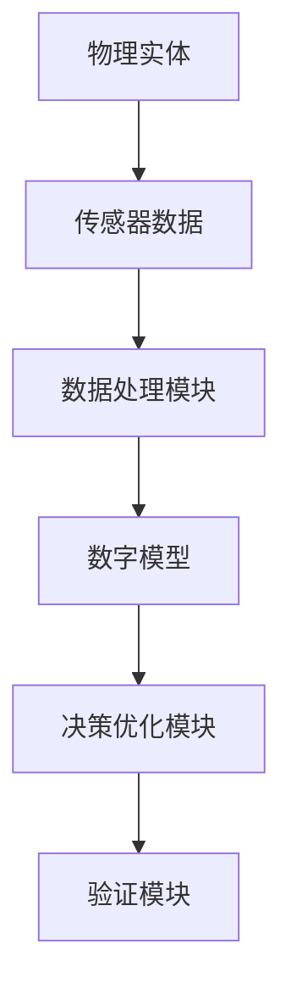
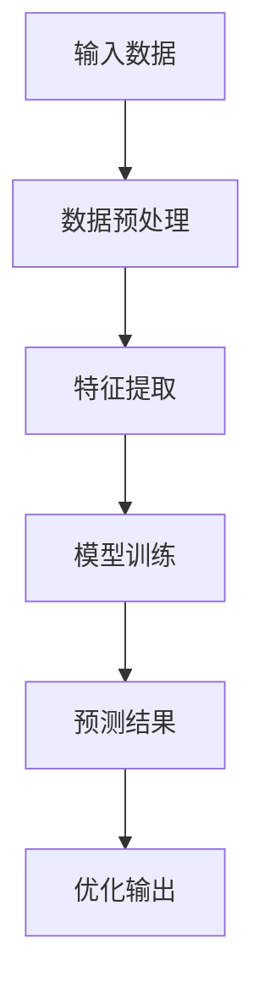

                 

# AI驱动的企业数字孪生技术：虚拟环境中的决策优化与验证

## 关键词：数字孪生、AI驱动、决策优化、虚拟环境、企业数字化

## 摘要：  
数字孪生技术通过在虚拟环境中构建现实世界的数字模型，帮助企业实现更高效、更智能的决策优化。本文将从数字孪生的核心概念、算法原理、系统架构以及实际应用等多个方面进行详细探讨，揭示AI如何在数字孪生技术中发挥关键作用，为企业数字化转型提供新的思路和解决方案。

---

# 第1章: AI驱动的企业数字孪生技术概述

## 1.1 数字孪生技术的背景与概念

### 1.1.1 数字孪生的定义与核心要素  
数字孪生（Digital Twin）是一种通过数字化技术在虚拟环境中构建现实世界对象的数字模型，并实时同步数据的技术。其核心要素包括：  
1. **物理实体**：实际存在的物体或系统，如生产线、建筑物等。  
2. **虚拟模型**：基于物理实体构建的数字模型，能够实时反映物理实体的状态。  
3. **数据流**：连接物理实体与虚拟模型的数据传输通道，确保两者的实时同步。  
4. **优化算法**：用于在虚拟环境中优化决策的算法，如遗传算法、模拟退火等。  

### 1.1.2 数字孪生的发展历程  
数字孪生技术起源于20世纪90年代，最初主要用于航空航天领域的设备模拟。随着信息技术和人工智能技术的快速发展，数字孪生技术逐渐扩展到制造业、能源、交通等领域。  

### 1.1.3 AI驱动数字孪生的必要性  
AI技术的引入使得数字孪生能够实现更智能的优化和决策。通过AI算法，数字孪生可以在虚拟环境中快速迭代和优化，帮助企业实现高效决策。  

---

## 1.2 AI驱动数字孪生的优势  

### 1.2.1 提高决策效率  
AI驱动的数字孪生技术可以通过实时数据分析和预测，帮助企业快速做出最优决策，显著提高决策效率。  

### 1.2.2 实现精准预测  
通过机器学习算法，数字孪生可以对物理实体的未来状态进行精准预测，为企业提供可靠的参考依据。  

### 1.2.3 降低试错成本  
在虚拟环境中进行优化和验证，可以显著降低企业在实际操作中的试错成本，提高资源利用效率。  

---

# 第2章: 数字孪生技术的核心概念与联系

## 2.1 数字孪生的核心原理  

### 2.1.1 数据采集与处理  
数字孪生的第一步是通过传感器等设备采集物理实体的数据，并对数据进行清洗和预处理。  

### 2.1.2 模型构建与仿真  
基于处理后的数据，构建虚拟模型，并通过仿真技术模拟物理实体的行为和状态。  

### 2.1.3 数据驱动的优化与验证  
通过AI算法对虚拟模型进行优化，并在虚拟环境中验证优化结果，确保其在实际场景中的可行性。  

## 2.2 数字孪生的关键特征  

### 2.2.1 实时性  
数字孪生能够实时同步物理实体和虚拟模型的数据，确保优化结果的及时性。  

### 2.2.2 可视化  
通过可视化技术，数字孪生可以将复杂的物理系统以直观的方式呈现，便于用户理解和操作。  

### 2.2.3 可交互性  
数字孪生支持用户与虚拟模型的交互操作，用户可以在虚拟环境中进行模拟实验和优化操作。  

### 2.2.4 可扩展性  
数字孪生技术可以根据实际需求进行扩展，适用于不同规模和复杂度的系统。  

## 2.3 数字孪生的实体关系图  

---

# 第3章: AI驱动数字孪生的算法原理  

## 3.1 数字孪生中的优化算法  

### 3.1.1 遗传算法  
遗传算法是一种基于自然选择和遗传机制的优化算法，常用于解决复杂的组合优化问题。  

### 3.1.2 模拟退火算法  
模拟退火算法是一种全局优化算法，能够在较大的搜索空间中找到最优解。  

### 3.1.3 群智能算法  
群智能算法（如粒子群优化算法）模拟生物群体的行为，适用于多目标优化问题。  

## 3.2 基于AI的预测与优化  

### 3.2.1 神经网络模型  
神经网络模型通过学习数据中的特征，可以对物理实体的状态进行精准预测。  

### 3.2.2 支持向量机  
支持向量机是一种监督学习算法，适用于分类和回归问题，在数字孪生中常用于模式识别。  

### 3.2.3 集成学习方法  
集成学习方法通过将多个模型的结果进行集成，可以显著提高预测的准确性和稳定性。  

## 3.3 算法流程图  

---

# 第4章: 数字孪生系统的数学模型与公式  

## 4.1 数字孪生的数学模型  

### 4.1.1 基于物理模型的数学表达  
物理模型通常通过微分方程或差分方程描述，例如：  
$$ \frac{dx}{dt} = f(x, t) $$  

### 4.1.2 数据驱动的数学模型  
数据驱动模型通常采用回归或分类方法，例如：  
$$ y = \beta_0 + \beta_1x + \epsilon $$  

### 4.1.3 混合模型的构建方法  
混合模型结合了物理模型和数据驱动模型的优势，例如：  
$$ y = f(x) + g(x) $$  

## 4.2 优化算法的数学公式  

### 4.2.1 目标函数  
目标函数通常表示为：  
$$ f(x) = \min \sum_{i=1}^{n} (y_i - \hat{y}_i)^2 $$  

### 4.2.2 约束条件  
约束条件可以是：  
$$ x_i \geq 0 \quad \text{对所有} i $$  

---

# 总结  

AI驱动的数字孪生技术正在成为企业数字化转型的重要工具。通过构建虚拟模型和实时数据分析，数字孪生技术能够帮助企业实现更高效的决策优化。未来，随着AI技术的进一步发展，数字孪生将在更多领域展现出其强大的潜力。

---

**作者**：AI天才研究院/AI Genius Institute & 禅与计算机程序设计艺术 /Zen And The Art of Computer Programming

