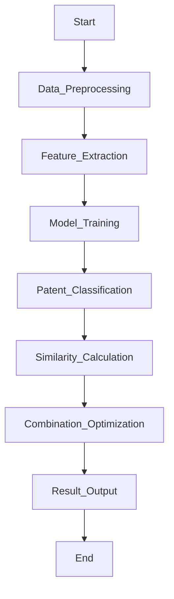
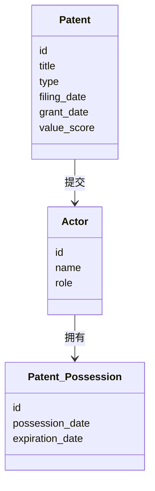

                 


# AI驱动的企业知识产权战略：专利组合分析与布局优化

## 关键词：人工智能，知识产权，专利组合，布局优化，企业战略

## 摘要：  
随着人工智能技术的快速发展，企业知识产权管理迎来了新的变革。本文探讨了AI驱动的企业知识产权战略，重点分析了专利组合分析与布局优化的核心概念、算法原理、系统架构以及实际应用。通过结合技术背景、核心概念与AI算法，本文为企业提供了优化知识产权管理的实用策略和工具。

---

# 第一部分: AI驱动的企业知识产权战略概述

## 第1章: 知识产权与企业战略概述

### 1.1 知识产权的重要性

#### 1.1.1 知识产权的定义与范围  
知识产权（Intellectual Property，IP）是指创造性智力成果的法律保护，主要包括专利、商标、版权、商业秘密等。在企业竞争中，知识产权不仅是核心竞争力的体现，也是企业长期发展的关键资产。

#### 1.1.2 知识产权在企业中的作用  
知识产权是企业技术创新的成果，能够为企业带来市场竞争优势、经济收益以及品牌价值。通过知识产权布局，企业可以保护创新成果，防止技术被他人模仿或侵权。

#### 1.1.3 知识产权管理的挑战与机遇  
随着技术的快速迭代，知识产权管理的复杂性也在增加。传统的人工管理模式效率低下，容易遗漏关键专利或错失布局机会。而AI技术的应用为企业提供了高效、智能的解决方案。

---

### 1.2 企业知识产权战略的核心要素

#### 1.2.1 专利、商标、版权的比较  
- **专利**：保护技术方案，具有技术性和独占性。  
- **商标**：保护品牌标识，具有识别性和市场价值。  
- **版权**：保护文学、艺术作品，具有创作性和时间性。  

#### 1.2.2 专利组合的概念与特点  
专利组合（Patent Portfolio）是指一组相互关联的专利，覆盖企业的核心技术和相关领域。其特点包括：  
1. **互补性**：专利之间相互支持，形成完整的技术保护网。  
2. **防御性**：通过覆盖潜在竞争对手的技术领域，降低被诉风险。  
3. **进攻性**：通过核心专利对竞争对手形成压力。  

#### 1.2.3 知识产权布局的策略选择  
- ** offensive strategy**：主动进攻，通过核心专利控制市场。  
- ** defensive strategy**：被动防御，通过广泛布局降低风险。  
- **混合策略**：结合 offense 和 defense，灵活应对市场竞争。  

---

### 1.3 AI技术对企业知识产权管理的影响

#### 1.3.1 AI在专利分析中的应用  
AI技术可以通过自然语言处理（NLP）和机器学习算法，快速分析大量专利数据，提取关键信息，识别技术趋势和竞争对手动态。

#### 1.3.2 AI驱动的知识产权战略优化  
AI可以通过数据建模和优化算法，帮助企业制定更科学的专利布局策略，提升知识产权管理效率和效果。

#### 1.3.3 未来趋势与发展方向  
随着AI技术的不断进步，知识产权管理将更加智能化和数据化，企业需要结合AI工具优化知识产权战略，提升核心竞争力。

---

## 第2章: 专利组合分析的核心概念

### 2.1 专利组合分析的原理

#### 2.1.1 专利组合的定义与分类  
专利组合是指一组具有战略价值的专利，通常分为防御性组合、进攻性组合和混合型组合。

#### 2.1.2 专利组合的生命周期  
专利组合的生命周期包括：专利获取、专利维护、专利运用和专利终止。

#### 2.1.3 专利组合分析的步骤与方法  
1. 数据收集与整理  
2. 专利分类与聚类  
3. 专利价值评估  
4. 专利组合优化  

---

### 2.2 专利组合分析的数学模型

#### 2.2.1 专利价值评估模型  
专利价值评估模型可以通过多因素分析，包括技术重要性、法律稳定性、市场覆盖度等指标，量化评估每项专利的价值。

#### 2.2.2 专利组合的风险评估  
专利组合的风险评估可以通过概率分布模型，预测专利组合在不同市场环境下的表现。

#### 2.2.3 专利组合的优化算法  
1. 基于遗传算法的组合优化  
2. 基于动态规划的组合优化  
3. 基于协同过滤的组合优化  

---

### 2.3 专利组合分析的ER实体关系图

```mermaid
erDiagram
    Patent {
        id
        patent_title
        patent_type
        filing_date
        grant_date
        value_score
    }
    Actor {
        id
        name
        role
    }
    Patent_Possession {
        id
        possession_date
        expiration_date
    }
    Actor o- Patent_Possession : 拥有
    Actor o- Patent : 提交
```

---

## 第3章: AI驱动的专利组合分析算法

### 3.1 算法原理概述

#### 3.1.1 基于机器学习的专利分类  
使用支持向量机（SVM）或随机森林（Random Forest）算法，对专利进行分类，识别技术领域的分布。

#### 3.1.2 基于自然语言处理的专利相似度计算  
通过TF-IDF或BERT模型，计算专利文本的相似度，识别技术相关性。

#### 3.1.3 基于图论的专利组合优化  
构建专利组合的图模型，通过节点和边的权重优化，找到最优组合。

---

### 3.2 算法流程图



---

### 3.3 Python实现代码

```python
import numpy as np
from sklearn.metrics.pairwise import cosine_similarity

# 示例专利文本表示
patents = [
    "专利1：文本表示方法",
    "专利2：图像处理算法",
    "专利3：自然语言处理模型"
]

# 特征提取（简化）
def get_features(text):
    return np.random.rand(100)

# 计算相似度矩阵
similarity_matrix = cosine_similarity([get_features(text) for text in patents])

print(similarity_matrix)
```

---

## 第4章: 系统分析与架构设计方案

### 4.1 问题场景介绍  
企业需要通过AI系统优化专利组合分析，提高管理效率和决策精度。

### 4.2 系统功能设计

#### 4.2.1 领域模型


#### 4.2.2 系统架构  


---

## 第5章: 项目实战

### 5.1 环境安装  
安装Python、TensorFlow、Scikit-learn等工具。

### 5.2 核心实现代码

```python
import numpy as np
from sklearn.metrics.pairwise import cosine_similarity

# 示例专利文本表示
patents = [
    "专利1：文本表示方法",
    "专利2：图像处理算法",
    "专利3：自然语言处理模型"
]

# 特征提取（简化）
def get_features(text):
    return np.random.rand(100)

# 计算相似度矩阵
similarity_matrix = cosine_similarity([get_features(text) for text in patents])

print(similarity_matrix)
```

---

## 第6章: 最佳实践与小结

### 6.1 最佳实践 Tips  
1. 定期更新专利组合，适应技术发展。  
2. 结合AI工具，提高管理效率。  
3. 建立多部门协作机制，确保知识产权战略的有效实施。  

### 6.2 小结  
AI技术为企业知识产权管理提供了新的可能性，通过专利组合分析与布局优化，企业可以更高效地保护创新成果，提升核心竞争力。

---

## 作者：AI天才研究院/AI Genius Institute & 禅与计算机程序设计艺术 /Zen And The Art of Computer Programming

