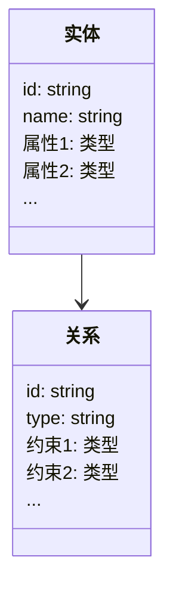

                 


# 第三部分: 系统分析与架构设计

## 第7章: 系统分析与架构设计

### 7.1 系统分析与需求定义

#### 7.1.1 系统分析
- 企业知识图谱的动态更新与智能推理系统需要处理实时数据流，支持复杂查询和推理。
- 系统需要具备高可扩展性，以适应企业数据的快速增长和变化。

#### 7.1.2 需求定义
- **功能性需求**：支持实时数据的动态更新，提供高效的智能推理服务。
- **性能需求**：系统需要在大规模数据下保持低延迟和高吞吐量。
- **可扩展性需求**：支持分布式部署，能够弹性扩展。

### 7.2 系统架构设计

#### 7.2.1 领域模型设计
- **实体与关系**：定义企业中的实体（如员工、部门、项目等）及其关系。
- **属性与约束**：每个实体都有若干属性，并有相应的约束条件。



#### 7.2.2 系统架构
- **分层架构**：将系统划分为数据层、逻辑层和应用层。
- **分布式架构**：采用分布式系统，利用微服务架构提高系统的可扩展性和灵活性。


#### 7.2.3 接口设计
- **REST API**：提供标准的HTTP接口，用于数据的更新和查询。
- **GraphQL API**：支持复杂查询，提高系统的灵活性。

### 7.3 系统实现

#### 7.3.1 数据存储
- 使用图数据库（如Neo4j）存储知识图谱，支持高效的图查询。
- 数据库设计：实体和关系存储在不同的节点和边上，支持高效的动态更新。

#### 7.3.2 系统实现细节
- **动态更新模块**：负责接收数据变更请求，更新知识图谱。
- **智能推理模块**：基于当前的知识图谱，提供推理服务。
- **接口服务模块**：提供REST和GraphQL接口，供其他系统调用。

### 7.4 系统交互流程

#### 7.4.1 动态更新流程
1. 接收数据变更请求。
2. 解析请求，生成更新操作。
3. 执行更新操作，更新知识图谱。
4. 返回确认信息。

#### 7.4.2 智能推理流程
1. 接收推理请求。
2. 分析请求，生成推理路径。
3. 执行推理，获取结果。
4. 返回推理结果。

### 7.5 性能优化

#### 7.5.1 数据索引优化
- 在图数据库中建立索引，提高查询效率。

#### 7.5.2 并行处理
- 利用多线程或多进程，提高系统的处理能力。

---

# 第四部分: 项目实战

## 第8章: 项目实战

### 8.1 环境安装

#### 8.1.1 安装Python
```bash
python --version
```

#### 8.1.2 安装依赖
```bash
pip install neo4j requests
```

### 8.2 核心功能实现

#### 8.2.1 动态更新模块实现
```python
from neo4j import GraphDatabase
from neo4j.exceptions import Neo4jError

class KnowledgeGraph:
    def __init__(self, uri, user, password):
        self.driver = GraphDatabase.driver(uri, auth=(user, password))
    
    def update_knowledge(self, entity, relation, value):
        try:
            with self.driver.session() as session:
                session.run(
                    "MATCH (e {name: $entity}) "
                    "CREATE (e)-[r:$relation]->(v {name: $value})",
                    entity=entity, relation=relation, value=value
                )
            return True
        except Neo4jError as e:
            print(f"Error updating knowledge: {e}")
            return False
```

#### 8.2.2 智能推理模块实现
```python
class Reasoner:
    def __init__(self, uri, user, password):
        self.graph = KnowledgeGraph(uri, user, password)
    
    def infer(self, query):
        try:
            with self.graph.driver.session() as session:
                result = session.run(
                    "MATCH p = shortestPath((a)-[:*]->(b)) "
                    "WHERE a.name = $start AND b.name = $end "
                    "RETURN p",
                    start=query['start'], end=query['end']
                )
                return list(result)
        except Neo4jError as e:
            print(f"Error infering: {e}")
            return []
```

### 8.3 实际案例分析

#### 8.3.1 案例背景
某企业需要构建知识图谱，记录员工之间的关系和项目信息。

#### 8.3.2 数据建模
- 实体：员工、项目
- 关系：参与、领导

#### 8.3.3 数据更新
- 更新员工信息：员工A参与项目X。
- 更新项目信息：项目X由部门Y领导。

#### 8.3.4 智能推理
- 查询：哪些员工参与了由部门Y领导的项目？
- 推理过程：
  1. 查询部门Y领导的所有项目。
  2. 查询参与这些项目的员工。

### 8.4 代码实现与解读

#### 8.4.1 数据更新
```python
kg = KnowledgeGraph("bolt://localhost:7687", "neo4j", "password")
kg.update_knowledge("部门Y", "领导", "项目X")
kg.update_knowledge("员工A", "参与", "项目X")
```

#### 8.4.2 智能推理
```python
reasoner = Reasoner("bolt://localhost:7687", "neo4j", "password")
query = {'start': '员工A', 'end': '项目X'}
result = reasoner.infer(query)
```

### 8.5 项目小结

#### 8.5.1 实战经验总结
- 知识图谱的动态更新需要高效的数据库支持。
- 智能推理的实现依赖于合理的算法设计和高效的查询优化。

#### 8.5.2 可能遇到的问题
- 数据一致性问题：动态更新时，如何保证数据的一致性？
- 推理效率问题：在大规模数据下，如何提高推理效率？

---

# 第五部分: 最佳实践与小结

## 第9章: 最佳实践与小结

### 9.1 最佳实践

#### 9.1.1 数据建模
- 确保数据模型能够适应企业的动态变化。
- 定期审查和优化数据模型。

#### 9.1.2 系统优化
- 使用高效的图数据库，优化查询性能。
- 并行处理和分布式架构可以提高系统的扩展性。

#### 9.1.3 代码管理
- 采用版本控制工具（如Git）管理代码。
- 定期进行代码审查和测试。

### 9.2 小结

#### 9.2.1 核心内容总结
- 企业知识图谱的动态更新与智能推理是构建智能企业的重要基础。
- 动态更新和智能推理需要结合先进的算法和高效的系统架构。

#### 9.2.2 展望
- 随着AI技术的发展，知识图谱将更加智能化和动态化。
- 未来的挑战在于如何在大规模数据下保持推理的效率和准确性。

### 9.3 注意事项

#### 9.3.1 开发注意事项
- 注意数据的一致性和完整性。
- 确保系统的安全性和稳定性。

#### 9.3.2 部署注意事项
- 在生产环境中，确保系统的高可用性和可扩展性。
- 定期备份和恢复数据，防止数据丢失。

### 9.4 拓展阅读

#### 9.4.1 推荐书籍
- 《知识图谱：从概念到应用》
- 《图数据库实战：Neo4j深度探索》

#### 9.4.2 推荐博客与资源
- [Neo4j 官方文档](https://neo4j.com/docs/)
- [图数据库与知识图谱](https://zhuanlan.zhihu.com/p/...)

---

# 作者

作者：AI天才研究院/AI Genius Institute & 禅与计算机程序设计艺术/Zen And The Art of Computer Programming

---

这篇文章系统地介绍了AI驱动的企业知识图谱的动态更新与智能推理机制，从背景介绍到系统实现，再到项目实战，涵盖了知识图谱的构建、动态更新、智能推理、系统架构设计和实际应用等多个方面。通过详细的分析和具体的案例，帮助读者全面理解知识图谱的动态更新与智能推理的实现和应用。

