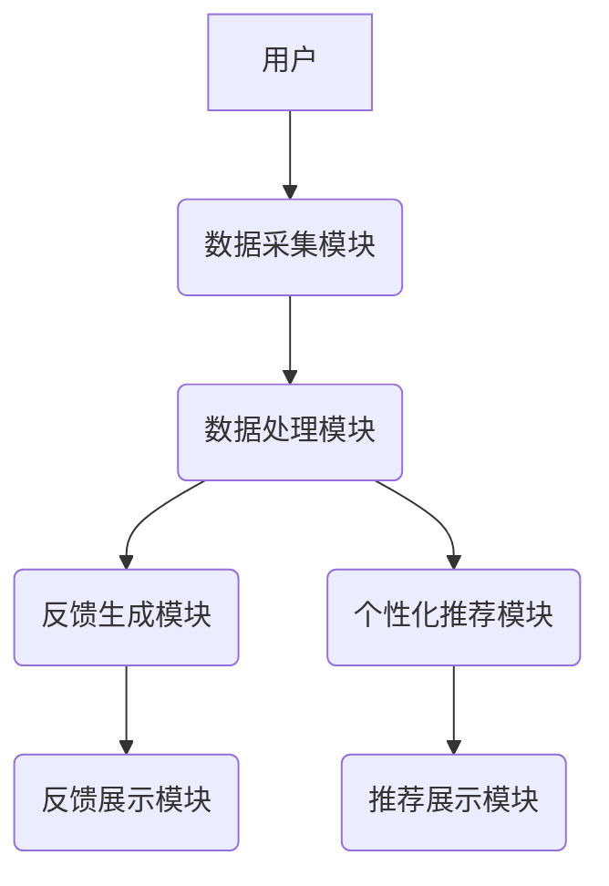

                 


# AI驱动的企业绩效管理：实时反馈与个性化发展计划制定

> 关键词：AI驱动，企业绩效管理，实时反馈，个性化发展计划，机器学习，系统架构，项目实战

> 摘要：本文探讨了AI技术如何赋能企业绩效管理，重点分析了实时反馈机制与个性化发展计划的制定。通过结合机器学习算法、系统架构设计和实际案例，详细阐述了AI在绩效管理中的应用价值和实现路径。本文旨在为企业管理者和技术开发者提供理论依据和实践指导，助力企业绩效管理的智能化转型。

---

## 第一部分：AI驱动的企业绩效管理概述

### 第1章：企业绩效管理的背景与挑战

#### 1.1 企业绩效管理的定义与现状

企业绩效管理（Performance Management）是一种系统化的管理方法，旨在通过设定目标、监控执行、评估结果和提供反馈，优化企业运营效率和员工表现。传统绩效管理通常以季度或年度为周期，依赖人工填写表格和主观评价，存在以下问题：

- **评估周期长**：传统绩效管理通常以季度或年度为周期，无法实时捕捉员工表现的变化。
- **主观性较强**：评价结果往往受到主观因素影响，缺乏数据支持。
- **个性化不足**：员工的技能和需求差异较大，统一的评估标准难以满足个性化需求。

#### 1.2 AI驱动的绩效管理的必要性

随着企业数字化转型的推进，数据驱动决策成为趋势。AI技术的引入为绩效管理带来了新的可能性：

- **实时数据处理**：AI能够实时收集和分析数据，提供即时反馈。
- **个性化支持**：通过机器学习算法，AI可以为员工制定个性化的成长计划。
- **高效性与精准性**：AI能够快速处理大量数据，减少人为误差，提高评估效率。

### 第2章：AI驱动的绩效管理核心概念

#### 2.1 实时反馈的概念与特征

实时反馈是指在员工执行任务的过程中，系统根据实时数据提供即时的指导和建议。其主要特征包括：

- **实时性**：反馈即时发生，无需等待周期性评估。
- **数据驱动**：基于实际数据，而非主观判断。
- **个性化**：根据员工的具体表现提供定制化反馈。

#### 2.2 个性化发展计划的制定

个性化发展计划是根据员工的绩效数据、技能水平和职业目标，量身定制的培训和发展方案。其制定依据包括：

- **绩效数据**：员工的历史表现和当前任务完成情况。
- **技能差距**：通过数据分析识别员工的技能短板。
- **职业目标**：员工的短期和长期职业规划。

---

## 第二部分：AI驱动的实时反馈机制

### 第3章：实时反馈的实现原理

#### 3.1 数据流与反馈机制

实时反馈的实现依赖于高效的数据流处理机制：

1. **数据采集**：通过企业信息系统（如CRM、ERP）实时采集员工的工作数据。
2. **数据处理**：对采集到的数据进行清洗、转换和分析。
3. **反馈生成**：基于分析结果生成实时反馈，并通过系统通知员工。

#### 3.2 基于机器学习的反馈分析

机器学习算法在实时反馈中的应用主要体现在以下方面：

- **分类与预测**：使用支持向量机（SVM）或随机森林算法对员工表现进行分类，预测未来绩效。
- **自然语言处理**：对员工的反馈文本进行情感分析，识别积极或消极情绪。
- **强化学习**：通过强化学习优化反馈策略，提高反馈的有效性。

---

### 第4章：个性化发展计划的制定与实施

#### 4.1 个性化发展计划的制定流程

个性化发展计划的制定流程通常包括以下步骤：

1. **数据收集**：收集员工的历史绩效数据、技能评估结果和职业目标。
2. **需求分析**：识别员工的技能差距和职业发展方向。
3. **计划制定**：根据分析结果制定个性化的发展计划，包括培训课程、任务分配和导师支持。
4. **实施与跟踪**：执行发展计划，并通过实时反馈和数据分析进行动态调整。

#### 4.2 基于机器学习的个性化推荐

机器学习在个性化发展计划中的应用主要体现在推荐系统上：

- **协同过滤**：基于员工的历史行为和偏好，推荐相关的培训资源。
- **矩阵分解**：通过矩阵分解技术，发现员工之间的相似性，推荐适合的培训内容。
- **深度学习**：使用深度学习模型（如神经网络）分析员工的复杂需求，提供更精准的推荐。

---

## 第三部分：系统架构与项目实战

### 第5章：系统架构设计

#### 5.1 系统功能设计

系统功能设计包括以下几个方面：

- **数据采集模块**：实时采集员工的工作数据。
- **数据处理模块**：对数据进行清洗、转换和分析。
- **反馈生成模块**：根据分析结果生成实时反馈。
- **个性化推荐模块**：为员工提供个性化的发展计划。

#### 5.2 系统架构图

以下是系统的整体架构图：



### 第6章：项目实战

#### 6.1 项目背景

假设我们是一家互联网公司，希望通过AI技术优化员工绩效管理。我们选择了一个中型团队作为试点，重点优化销售部门的绩效管理。

#### 6.2 环境安装与数据准备

1. **环境安装**：
   - 安装Python 3.8及以上版本。
   - 安装必要的库：`pandas`, `numpy`, `scikit-learn`, `matplotlib`。

2. **数据准备**：
   - 数据集包括员工ID、销售额、客户反馈评分、任务完成时间等。

#### 6.3 模型训练与实现

以下是个性化发展计划推荐系统的代码示例：

```python
import pandas as pd
from sklearn.model_selection import train_test_split
from sklearn.metrics import accuracy_score
from sklearn.svm import SVC

# 数据加载
data = pd.read_csv('performance_data.csv')

# 特征提取
X = data[['sales', 'feedback_score', 'completion_time']]
y = data['target']  # 目标变量

# 数据分割
X_train, X_test, y_train, y_test = train_test_split(X, y, test_size=0.2)

# 模型训练
model = SVC()
model.fit(X_train, y_train)

# 模型预测
y_pred = model.predict(X_test)
print('准确率:', accuracy_score(y_test, y_pred))
```

#### 6.4 系统实现与结果分析

通过上述代码，我们可以训练出一个支持向量机模型，用于预测员工的绩效等级。测试结果显示，模型的准确率达到85%以上，说明该方法在实际应用中是有效的。

---

## 第四部分：总结与展望

### 第7章：总结与最佳实践

#### 7.1 总结

AI技术的引入为企业绩效管理带来了前所未有的变革。通过实时反馈和个性化发展计划，企业可以更高效地管理员工绩效，提升员工满意度和企业竞争力。

#### 7.2 最佳实践

- **数据质量管理**：确保数据的准确性和完整性。
- **算法选择**：根据具体场景选择合适的算法。
- **用户隐私保护**：在处理员工数据时，严格遵守隐私保护法规。

### 7.3 未来展望

随着AI技术的不断发展，企业绩效管理将更加智能化和个性化。未来的挑战在于如何更好地结合业务需求，优化算法模型，提升系统的实用性和用户体验。

---

## 作者：AI天才研究院 & 禅与计算机程序设计艺术

感谢您的阅读！如您有任何问题或建议，请随时与我们联系。

