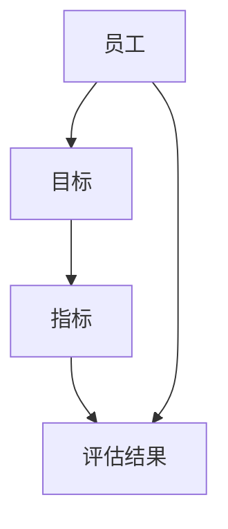
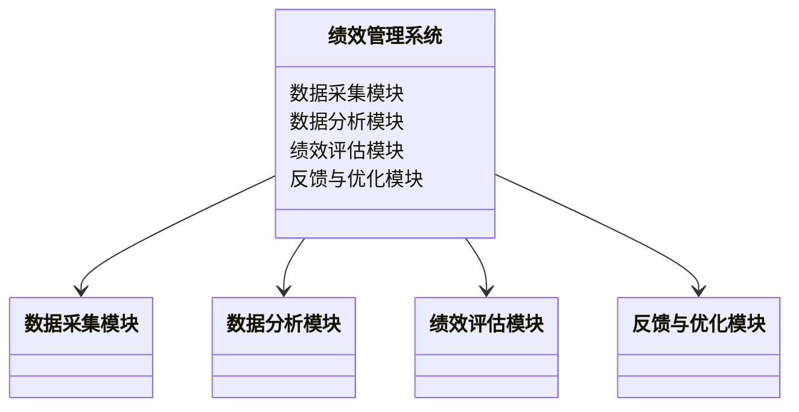

                 


# AI驱动的企业绩效管理：目标设定与实时跟踪

## 关键词：人工智能，企业绩效管理，目标设定，实时跟踪，数据驱动，KPI，机器学习

## 摘要：  
本文深入探讨了如何利用人工智能技术优化企业绩效管理，特别是在目标设定与实时跟踪方面的创新应用。通过分析AI在数据处理、预测建模和自动化决策中的作用，本文为读者提供了从理论到实践的全面指导，帮助企业在数字化转型中提升绩效管理的效率和准确性。

---

# 第一部分: AI驱动的企业绩效管理背景与概念

## 第1章: 企业绩效管理概述

### 1.1 企业绩效管理的基本概念

#### 1.1.1 绩效管理的定义与作用  
绩效管理是企业管理中的核心环节，旨在通过设定目标、评估表现、提供反馈和改进计划，优化组织和个人的绩效。其作用包括提升员工效率、促进战略目标的实现以及增强组织的竞争力。

#### 1.1.2 传统绩效管理的流程与挑战  
传统绩效管理通常依赖人工数据收集和主观评估，存在以下挑战：  
1. 数据分散，难以整合。  
2. 评估周期长，反馈滞后。  
3. 主观性较强，缺乏客观依据。  

#### 1.1.3 AI技术如何改变绩效管理  
AI通过自动化数据处理、实时分析和智能预测，显著提升了绩效管理的效率和精准度。例如，AI可以实时跟踪员工表现，自动生成绩效报告，并提供个性化反馈。

---

## 第2章: AI技术与企业绩效管理的结合

### 2.1 AI技术在绩效管理中的应用领域

#### 2.1.1 目标设定的智能化  
AI可以根据历史数据和业务目标，自动生成合理的绩效目标，并提供动态调整建议。

#### 2.1.2 数据采集与处理的自动化  
AI能够从多种数据源（如CRM、ERP系统）自动收集和清洗数据，确保数据的准确性和完整性。

#### 2.1.3 绩效预测与优化  
AI利用机器学习模型，预测员工或团队的绩效表现，并提出优化建议。

### 2.2 AI驱动绩效管理的实现路径

#### 2.2.1 数据采集与清洗  
AI通过自然语言处理（NLP）和数据挖掘技术，从结构化和非结构化数据中提取有用信息。

#### 2.2.2 模型构建与训练  
基于历史数据，训练机器学习模型，用于预测绩效表现和识别关键影响因素。

#### 2.2.3 结果分析与反馈  
AI生成实时绩效报告，并提供个性化反馈，帮助员工改进工作表现。

### 2.3 当前AI驱动绩效管理的应用现状

#### 2.3.1 典型案例分析  
例如，某企业利用AI分析销售数据，优化销售目标的设定，并实时跟踪销售进度。

#### 2.3.2 应用中的挑战与问题  
包括数据隐私、模型解释性和技术落地的难度。

---

# 第二部分: 企业绩效管理的核心概念与联系

## 第3章: 核心概念的定义与属性

### 3.1 绩效目标  
绩效目标是绩效管理的核心，通常分为短期目标和长期目标。AI可以根据业务需求动态调整目标。

### 3.2 绩效指标  
绩效指标是衡量目标实现程度的具体量化标准，如销售额、利润率等。AI可以自动生成最优指标组合。

### 3.3 绩效评估  
绩效评估是通过数据和模型对目标实现情况进行评价的过程。AI可以实现自动化评估，并提供客观的评估结果。

---

## 第4章: 核心概念的对比分析

### 4.1 核心概念的对比表格  
以下表格对比了传统绩效管理和AI驱动绩效管理的关键差异：

| **维度**       | **传统绩效管理**                  | **AI驱动绩效管理**                  |
|-----------------|------------------------------------|---------------------------------------|
| 数据来源       | 主要依赖人工收集和填写的表格数据  | 结构化和非结构化数据的自动采集      |
| 评估周期       | 定期（如月度、季度）               | 实时或按需生成                      |
| 评估方式       | 主观判断为主                      | 数据驱动的自动化评估                |
| 反馈机制       | 事后反馈                         | 实时反馈和个性化建议                |

### 4.2 实体关系图（ER图）  
以下是绩效管理的实体关系图：



---

# 第三部分: 算法原理讲解

## 第5章: 常见算法及其应用

### 5.1 机器学习算法

#### 5.1.1 线性回归  
线性回归用于预测连续型绩效指标（如销售额）。其数学模型如下：

$$ y = \beta_0 + \beta_1 x + \epsilon $$  

其中，$y$ 是目标变量，$x$ 是自变量，$\beta_0$ 和 $\beta_1$ 是回归系数，$\epsilon$ 是误差项。

#### 5.1.2 随机森林  
随机森林用于分类和回归问题，适合处理高维数据。其原理是通过生成多个决策树，并取其预测结果的平均值。

### 5.2 深度学习算法

#### 5.2.1 神经网络  
神经网络适用于复杂非线性关系的建模，例如员工绩效与多因素之间的关系。

---

## 第6章: 算法实现与代码示例

### 6.1 线性回归的Python实现

```python
import numpy as np
from sklearn.linear_model import LinearRegression

# 示例数据
X = np.array([[1], [2], [3], [4], [5]])
y = np.array([2, 4, 5, 4, 6])

# 模型训练
model = LinearRegression()
model.fit(X, y)

# 预测
print(model.predict([[6]]))  # 输出：[[7.8]]
```

---

# 第四部分: 数学模型与公式

## 第7章: 常用数学模型

### 7.1 线性回归模型  
线性回归是最常用的预测模型之一，其数学公式为：

$$ y = \beta_0 + \beta_1 x_1 + \beta_2 x_2 + \ldots + \beta_n x_n $$  

其中，$y$ 是目标变量，$x_i$ 是自变量，$\beta_i$ 是回归系数。

### 7.2 时间序列模型  

#### 7.2.1 ARIMA模型  
ARIMA（自回归积分滑动平均模型）适用于时间序列预测。其数学公式为：

$$ \phi(\theta^{-1}) (1 - \theta^d) Z_t = 0 $$  

其中，$\phi(\theta^{-1})$ 是自回归多项式，$\theta^d$ 是差分多项式，$Z_t$ 是白噪声。

---

# 第五部分: 系统分析与架构设计方案

## 第8章: 系统架构设计

### 8.1 系统功能设计  
以下是绩效管理系统的功能模块：



### 8.2 系统架构设计  

以下是系统的整体架构图：


---

## 第9章: 项目实战

### 9.1 项目介绍  
本项目旨在利用AI技术实现企业绩效管理的智能化。我们以某制造企业的销售绩效管理为例，展示如何通过AI优化目标设定和实时跟踪。

### 9.2 环境配置  
安装必要的Python库：

```bash
pip install numpy pandas scikit-learn
```

### 9.3 核心代码实现

#### 数据预处理

```python
import pandas as pd

# 加载数据
data = pd.read_csv('sales.csv')

# 数据清洗
data.dropna(inplace=True)
data = pd.get_dummies(data)
```

#### 模型训练

```python
from sklearn.model import LinearRegression

# 训练模型
model = LinearRegression()
model.fit(X_train, y_train)

# 预测
y_pred = model.predict(X_test)
```

### 9.4 结果分析  
通过对比实际销售数据和预测数据，验证模型的准确性，并根据预测结果优化销售目标。

---

## 第六部分: 最佳实践与小结

## 第10章: 最佳实践与注意事项

### 10.1 数据质量的重要性  
确保数据的完整性和准确性是AI驱动绩效管理成功的关键。

### 10.2 模型调优的技巧  
通过交叉验证和超参数优化，提升模型的预测精度。

### 10.3 未来发展趋势  
随着AI技术的不断进步，未来的绩效管理将更加智能化和个性化。

---

## 第11章: 总结与展望

通过本文的详细讲解，我们了解了AI在企业绩效管理中的广泛应用和巨大潜力。未来，随着技术的进步，AI将为企业绩效管理带来更多的创新和突破。

---

作者：AI天才研究院/AI Genius Institute & 禅与计算机程序设计艺术 /Zen And The Art of Computer Programming

