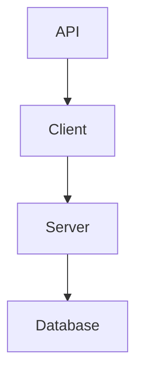
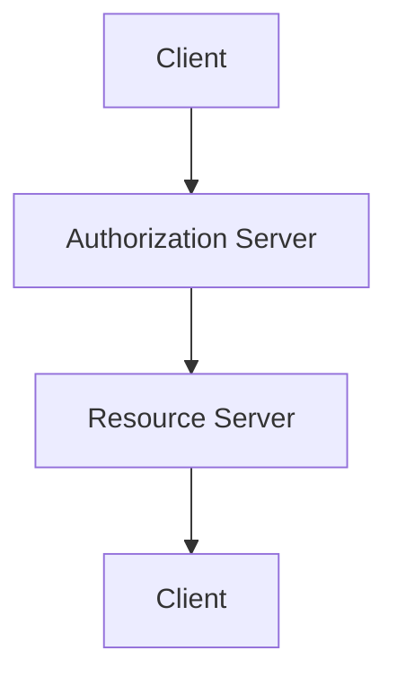
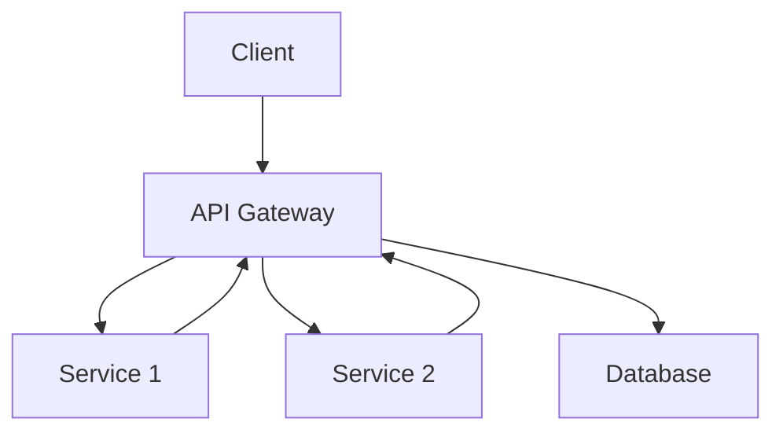
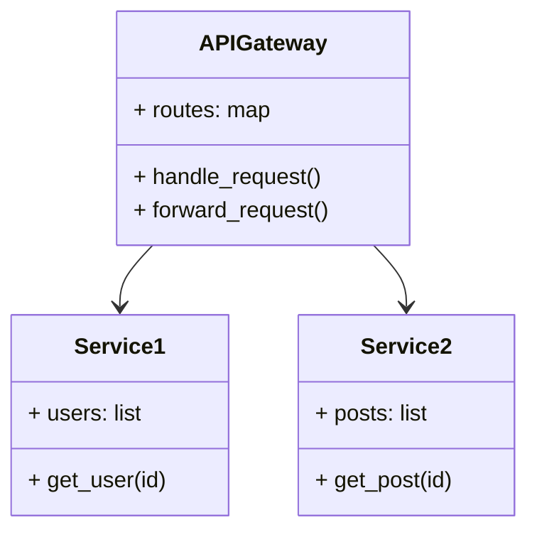
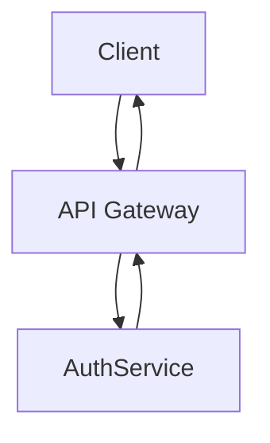

                 


# API设计：为AI Agent提供友好的接口

> 关键词：API设计，AI Agent，RESTful，JSON，OAuth 2.0

> 摘要：本文将详细探讨如何为AI Agent设计友好的API接口，涵盖API设计的核心原则、版本控制、核心概念、算法原理、系统架构、项目实战以及最佳实践，帮助开发者更好地理解和实现AI Agent的API设计。

---

## 第一部分：API设计基础与AI Agent概述

### 第1章：API设计的核心概念

#### 1.1 API的基本概念与作用

- **1.1.1 什么是API**
  API（Application Programming Interface）是应用程序之间的接口，用于不同系统或模块之间的通信。API定义了请求和响应的格式、数据结构和操作方式，使得开发者可以轻松调用其他系统的功能。

- **1.1.2 API的作用与重要性**
  API是现代软件架构中的核心组件，它通过模块化设计，将复杂系统分解为可管理的部分，支持跨平台通信和功能复用。良好的API设计能够提高开发效率，降低维护成本。

- **1.1.3 API的设计原则**
  - **简洁性原则**：API接口和文档应简洁明了，避免冗余功能。
  - **可扩展性原则**：设计应考虑未来的扩展需求，避免“死胡同”。
  - **可维护性原则**：确保API易于维护和升级。

#### 1.2 AI Agent的定义与发展

- **1.2.1 AI Agent的基本概念**
  AI Agent是智能体，能够感知环境、自主决策并执行任务。AI Agent需要与多种系统和服务交互，API设计是其实现通信的关键。

- **1.2.2 AI Agent的发展历程**
  从早期的简单脚本到现代的复杂AI系统，AI Agent的功能和应用范围不断扩大，对API的需求也日益增加。

- **1.2.3 AI Agent与API的关系**
  AI Agent通过API与其他系统交互，获取数据、调用服务、执行任务，API设计直接影响AI Agent的性能和用户体验。

---

### 第2章：API设计的核心要素

#### 2.1 API的设计原则

- **2.1.1 简洁性原则**
  API应尽可能简洁，避免复杂的操作和数据结构。例如，使用简单的HTTP方法（如GET、POST）来处理 CRUD 操作。

- **2.1.2 可扩展性原则**
  设计API时应考虑未来的扩展需求，例如通过版本控制和模块化设计，确保新功能可以轻松添加而不影响现有接口。

- **2.1.3 可维护性原则**
  API应易于维护和升级，例如通过清晰的错误处理和文档化的接口设计。

#### 2.2 API的版本控制

- **2.2.1 版本控制的重要性**
  API版本控制是确保系统兼容性和稳定性的关键。通过版本控制，可以避免不同版本之间的冲突，逐步淘汰旧版本。

- **2.2.2 常见的版本控制策略**
  - **兼容性设计**：新版本保持旧功能，逐步弃用旧接口。
  - **微版本号**：通过URL参数或请求头指定具体版本号。

- **2.2.3 API版本控制的实现方法**
  例如，通过在URL中添加版本号参数：
  ```
  /api/v1/users
  ```

---

## 第二部分：API设计的核心概念与联系

### 第3章：API设计的核心概念

#### 3.1 核心概念原理

- **3.1.1 请求与响应模型**
  API通常采用请求-响应模式，例如使用HTTP协议：
  ```http
  GET /users HTTP/1.1
  Accept: application/json
  ```

- **3.1.2 资源与操作模型**
  使用RESTful风格设计资源和操作，例如：
  ```
  /users - 获取用户列表
  /users/{id} - 获取单个用户
  ```

- **3.1.3 权限与身份认证**
  使用OAuth 2.0进行身份验证，确保只有授权用户可以访问特定资源。

#### 3.2 概念属性特征对比表格

| 概念     | 属性       | 特征                                   |
|----------|------------|--------------------------------------|
| 请求     | 方法       | GET, POST, PUT, DELETE               |
| 响应     | 状态码     | 200, 404, 500                         |
| 资源     | 路径       | /users, /posts                       |

#### 3.3 ER实体关系图架构



---

## 第三部分：API设计的算法原理

### 第4章：API设计的算法原理

#### 4.1 OAuth 2.0授权流程



#### 4.2 RESTful API设计

```python
def get_users():
    return {"users": [{"id": 1, "name": "Alice"}, {"id": 2, "name": "Bob"}]}
```

#### 4.3 API网关实现



### 第5章：数学模型与公式

#### 5.1 哈希函数

$$hash(x) = x \mod 10^9+7$$

#### 5.2 JWT签名

$$signature = HMAC-SHA256(jwt_header + jwt_payload)$$

---

## 第四部分：系统分析与架构设计

### 第6章：系统分析与架构设计

#### 6.1 问题场景介绍

AI Agent需要与多个外部系统交互，例如传感器、数据库、第三方服务等。API设计是其实现通信的关键，必须满足实时性、可靠性和可扩展性的要求。

#### 6.2 系统功能设计

使用类图展示系统核心模块的关系：



#### 6.3 系统架构设计

使用架构图展示整体架构：


#### 6.4 系统接口设计

设计RESTful接口：

```http
GET /api/users
POST /api/users
PUT /api/users/{id}
DELETE /api/users/{id}
```

#### 6.5 系统交互设计

使用序列图展示用户认证流程：



---

## 第五部分：项目实战

### 第7章：项目实战

#### 7.1 环境安装

安装必要的工具和库：

```
pip install requests
pip install flask
```

#### 7.2 系统核心实现

实现一个简单的AI Agent API：

```python
from flask import Flask
app = Flask(__name__)

@app.route('/api/users', methods=['GET'])
def get_users():
    return {"users": [{"id": 1, "name": "Alice"}, {"id": 2, "name": "Bob"}]}
```

#### 7.3 代码应用解读与分析

通过代码示例分析接口实现：

```python
@app.route('/api/users', methods=['GET'])
def get_users():
    return {"users": [{"id": 1, "name": "Alice"}, {"id": 2, "name": "Bob"}]}
```

#### 7.4 实际案例分析

分析一个实际案例，例如一个AI Agent查询用户数据的过程：

1. AI Agent向API Gateway发送请求。
2. API Gateway转发请求到Service 1。
3. Service 1处理请求并返回数据。
4. API Gateway返回数据给AI Agent。

#### 7.5 项目小结

通过项目实战，我们了解了API设计的实现过程，包括接口设计、代码实现和系统交互。

---

## 第六部分：最佳实践与小结

### 第8章：最佳实践

#### 8.1 小结

- API设计是AI Agent实现的重要部分。
- 需要遵循简洁性、可扩展性和可维护性的原则。
- 注意版本控制和权限管理。

#### 8.2 注意事项

- 确保API的安全性，防止未授权访问。
- 提供详细的文档，方便开发者使用。
- 定期维护和更新API，确保兼容性和性能。

#### 8.3 拓展阅读

- RESTful API设计指南
- OAuth 2.0协议详细文档
- API网关实现与优化

---

## 作者：AI天才研究院/AI Genius Institute & 禅与计算机程序设计艺术 /Zen And The Art of Computer Programming

