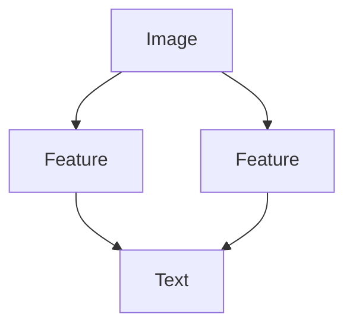
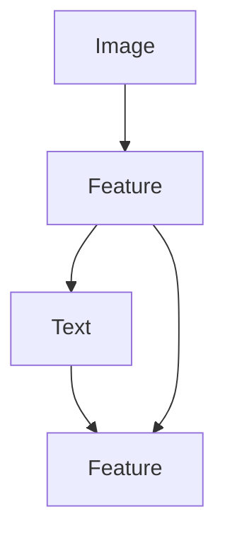
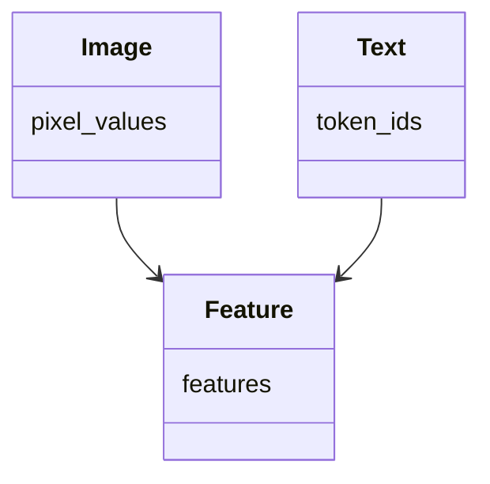

                 


# CLIP模型：实现AI Agent的跨模态理解

## 关键词：CLIP模型，跨模态理解，AI Agent，图像-文本模型，对比学习

## 摘要：CLIP模型是一种基于对比学习的图像-文本模型，通过连接图像和文本特征空间，实现跨模态理解和生成。本文将深入分析CLIP模型的核心概念、算法原理、系统架构，并通过项目实战展示其在AI Agent中的应用。文章还探讨了CLIP模型的最佳实践、注意事项及未来发展方向。

---

# 第一部分: CLIP模型的背景与核心概念

## 第1章: CLIP模型的起源与应用背景

### 1.1 跨模态理解的背景与重要性

#### 1.1.1 跨模态理解的定义与特点
跨模态理解是指在不同数据模态（如图像、文本、语音等）之间建立关联并进行信息整合的能力。其核心在于通过多模态数据的协同作用，提升AI系统的感知和认知能力。

#### 1.1.2 跨模态理解在AI Agent中的作用
AI Agent需要能够处理多种数据类型（图像、文本、语音等），以便更全面地感知环境并做出决策。跨模态理解是实现这一目标的关键技术。

#### 1.1.3 CLIP模型的起源与技术优势
CLIP模型由OpenAI于2021年提出，基于对比学习的思想，通过连接图像和文本的特征空间，实现了跨模态理解和生成。

---

## 第2章: CLIP模型的核心概念与联系

### 2.1 CLIP模型的核心原理

#### 2.1.1 图像编码器与文本编码器的结构
CLIP模型由两个编码器组成：
- 图像编码器：将图像转换为特征向量。
- 文本编码器：将文本转换为特征向量。

两者共享相同的特征空间，使得图像和文本可以在同一语义空间中进行对比学习。

#### 2.1.2 对比学习机制的数学模型
对比学习的目标是最大化正样本对的相似性，同时最小化负样本对的相似性。CLIP模型的损失函数可以表示为：
$$ \mathcal{L} = -\frac{1}{N}\sum_{i=1}^{N}[\log(\frac{e^{sim(x_i,y_i)}}{e^{sim(x_i,y_j)} + e^{sim(x_j,y_i)}})] $$
其中，$sim(x,y)$ 表示图像 $x$ 和文本 $y$ 的相似性分数。

#### 2.1.3 损失函数的计算公式
CLIP模型的损失函数通过对比学习来优化图像和文本的特征表示，从而实现跨模态对齐。

---

### 2.2 CLIP模型的核心概念对比

#### 2.2.1 图像与文本的特征表示对比
| 特征维度 | 图像编码器 | 文本编码器 |
|----------|------------|------------|
| 输入 | 图像 | 文本 |
| 输出 | 图像特征向量 | 文本特征向量 |

#### 2.2.2 对比学习与传统监督学习的对比
| 对比学习 | 传统监督学习 |
|----------|--------------|
| 数据需求 | 需要大量无标签数据 | 需要大量有标签数据 |
| 模型泛化能力 | 强 | 弱 |

#### 2.2.3 CLIP模型与其他跨模态模型的对比
| 模型 | 输入 | 输出 | 核心技术 |
|------|------|------|----------|
| CLIP | 图像 + 文本 | 跨模态特征向量 | 对比学习 |
| ViLBERT | 图像 + 文本 | 跨模态特征向量 | 任务驱动 |

---

### 2.3 CLIP模型的ER实体关系图



---

## 第3章: CLIP模型的算法原理

### 3.1 CLIP模型的训练过程

#### 3.1.1 图像编码器的训练
图像编码器通过预训练任务（如图像分类）进行初始化，然后通过对比学习进一步优化。

#### 3.1.2 文本编码器的训练
文本编码器通过预训练任务（如文本分类）进行初始化，然后通过对比学习进一步优化。

#### 3.1.3 对比学习的数学模型
CLIP模型的损失函数可以表示为：
$$ \mathcal{L} = -\frac{1}{N}\sum_{i=1}^{N}[\log(\frac{e^{sim(x_i,y_i)}}{e^{sim(x_i,y_j)} + e^{sim(x_j,y_i)}})] $$

---

### 3.2 CLIP模型的系统架构设计

#### 3.2.1 系统功能模块
- 图像编码模块
- 文本编码模块
- 对比学习模块

#### 3.2.2 系统架构图



---

## 第4章: CLIP模型的系统分析与架构设计

### 4.1 系统功能设计

#### 4.1.1 领域模型



---

### 4.2 系统架构设计

#### 4.2.1 系统架构图


---

## 第5章: CLIP模型的项目实战

### 5.1 环境安装

```bash
pip install torch
pip install transformers
```

---

### 5.2 核心代码实现

```python
import torch
from transformers import CLIPModel, CLIPTokenizer

model = CLIPModel.from_pretrained("openai/clip-v1")
tokenizer = CLIPTokenizer.from_pretrained("openai/clip-v1")

# 编码图像
image = ...  # 加载图像
with torch.no_grad():
    image_features = model.vision_model(image)[0]

# 编码文本
text = "这是一个图像的描述。"
text_input = tokenizer(text, return_tensors="pt")
text_features = model.text_model(**text_input)[0]

# 计算相似性
similarity = torch.mm(image_features, text_features.T)
print(similarity)
```

---

### 5.3 案例分析

#### 5.3.1 图像分类
给定一张图像，使用CLIP模型生成图像的文本描述，然后进行图像分类。

---

## 第6章: 总结与展望

### 6.1 总结

CLIP模型通过对比学习实现了图像和文本的跨模态对齐，为AI Agent的多模态交互提供了强大的技术支持。

---

### 6.2 展望

未来，CLIP模型将在更多跨模态任务中得到应用，如图像生成、文本摘要等。

---

## 作者：AI天才研究院 & 禅与计算机程序设计艺术

---

以上是《CLIP模型：实现AI Agent的跨模态理解》的目录和部分内容。希望这篇文章能帮助读者深入理解CLIP模型的核心原理和应用场景。

