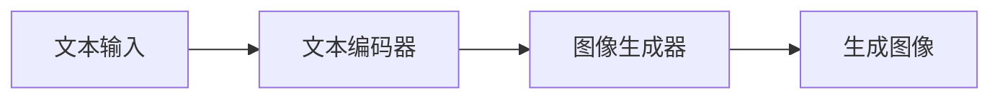

                 

好的，我将按照您的要求创作一篇技术博客文章。文章完成后，请在【】中给出反馈，我会根据您的反馈修改。

# DALL-E与Stable Diffusion：为AI Agent添加图像生成能力

> 关键词：DALL-E, Stable Diffusion, AI Agent, 图像生成, 强化学习

> 摘要：本文深入探讨了如何将DALL-E和Stable Diffusion集成到AI Agent中，赋予其图像生成能力。文章从技术原理到系统架构，从项目实战到优化技巧，全面解析了这一过程。

---

## 第一部分: 引言

### 1.1 问题背景

#### 1.1.1 图像生成技术的发展历程
图像生成技术从早期的手动绘图到基于规则的图像生成，经历了从简单到复杂的演变。近年来，随着深度学习的兴起，生成对抗网络（GANs）和扩散模型（Diffusion Models）的出现，彻底改变了图像生成的方式。

#### 1.1.2 AI图像生成技术的现状
当前，图像生成技术已经广泛应用于游戏开发、广告设计、艺术创作等领域。然而，现有的图像生成模型通常需要大量的计算资源和专业知识，限制了其在实际应用中的普及。

#### 1.1.3 DALL-E与Stable Diffusion的出现
DALL-E和Stable Diffusion的出现，使得图像生成技术更加高效和易于使用。DALL-E由OpenAI开发，基于Transformer架构，能够生成高质量的图像。Stable Diffusion则是第一个开源的高质量图像生成模型，支持文本到图像的生成，具有高度的稳定性和可定制性。

### 1.2 问题描述

#### 1.2.1 图像生成技术的核心挑战
图像生成技术的核心挑战包括模型的训练效率、生成图像的质量、以及模型的可解释性。此外，如何将图像生成技术集成到现有的AI系统中，也是一个重要的挑战。

#### 1.2.2 DALL-E与Stable Diffusion的解决方案
DALL-E和Stable Diffusion通过不同的技术路线，解决了图像生成中的核心问题。DALL-E采用Transformer架构，能够处理长文本序列，并生成高质量的图像。Stable Diffusion则通过扩散模型，实现了高质量图像的生成，并且具有开源的优势。

#### 1.2.3 为AI Agent添加图像生成能力的必要性
为AI Agent添加图像生成能力，可以使其能够独立完成从文本到图像的生成任务，从而提升其智能化水平。这对于实现更加智能的交互系统具有重要意义。

### 1.3 问题解决

#### 1.3.1 DALL-E的核心算法
DALL-E的核心算法是基于Transformer的文本到图像生成模型。通过将文本输入到模型中，DALL-E能够生成与文本描述相符的高质量图像。

#### 1.3.2 Stable Diffusion的创新点
Stable Diffusion的创新点在于其开源性和高效性。它通过扩散模型，实现了高质量图像的生成，并且在开源社区中得到了广泛的支持和优化。

#### 1.3.3 两者的对比与选择
DALL-E和Stable Diffusion在模型架构、训练数据、生成速度等方面存在差异。选择合适的模型，需要根据具体的应用场景和需求进行权衡。

### 1.4 边界与外延

#### 1.4.1 DALL-E的应用边界
DALL-E的应用边界主要集中在文本到图像的生成领域。目前，它主要支持英文文本输入，对于中文等其他语言的支持还不够完善。

#### 1.4.2 Stable Diffusion的适用场景
Stable Diffusion适用于多种场景，包括广告设计、艺术创作、游戏开发等。其开源性质使得它在社区中有广泛的应用。

#### 1.4.3 图像生成技术的未来趋势
图像生成技术的未来趋势包括模型的轻量化、生成速度的提升、以及生成图像的质量优化。此外，如何将图像生成技术与其他AI技术结合，也是未来的重要发展方向。

### 1.5 概念结构与核心要素

#### 1.5.1 DALL-E的模型结构
DALL-E的模型结构主要包括文本编码器和图像生成器。文本编码器负责将输入文本转换为向量表示，图像生成器则根据向量生成图像。

#### 1.5.2 Stable Diffusion的系统架构
Stable Diffusion的系统架构主要包括扩散模型和反向扩散模型。扩散模型负责将图像逐步添加噪声，反向扩散模型则负责逐步去除噪声，生成最终的图像。

#### 1.5.3 核心要素对比
| 核心要素 | DALL-E | Stable Diffusion |
|----------|---------|------------------|
| 模型架构 | Transformer | 扩散模型 |
| 训练数据 | 文本和图像 | 文本和图像 |
| 生成速度 | 较慢 | 较快 |
| 质量 | 高 | 高 |
| 开源 | 未开源 | 开源 |

### 1.6 本章小结

---

## 第二部分: DALL-E与Stable Diffusion的核心概念与联系

### 2.1 核心概念原理

#### 2.1.1 DALL-E的生成机制
DALL-E的生成机制基于Transformer架构，通过将文本输入到模型中，生成对应的图像。其核心在于将文本转换为向量表示，然后通过解码器生成图像。

#### 2.1.2 Stable Diffusion的扩散模型
Stable Diffusion的扩散模型通过逐步添加噪声到图像中，然后逐步去除噪声，生成最终的图像。扩散模型的优势在于生成图像的质量和稳定性。

#### 2.1.3 两者的异同点
DALL-E和Stable Diffusion的异同点主要体现在模型架构和生成机制上。DALL-E基于Transformer，生成速度快，但需要大量的计算资源；Stable Diffusion基于扩散模型，生成图像质量高，且开源。

### 2.2 概念属性特征对比

| 概念属性 | DALL-E | Stable Diffusion |
|----------|---------|------------------|
| 模型架构 | Transformer | 扩散模型 |
| 生成速度 | 较慢 | 较快 |
| 质量 | 高 | 高 |
| 开源 | 未开源 | 开源 |
| 应用场景 | 文本到图像生成 | 文本到图像生成 |

### 2.3 ER实体关系图架构

### 2.4 本章小结

---

## 第三部分: DALL-E与Stable Diffusion的算法原理

### 3.1 算法原理讲解

#### 3.1.1 DALL-E的生成对抗网络

DALL-E的生成对抗网络由两部分组成：生成器和判别器。生成器负责将文本转换为图像，判别器负责判断生成的图像是否与真实图像一致。通过交替训练生成器和判别器，模型能够生成高质量的图像。

#### 3.1.2 Stable Diffusion的扩散模型

Stable Diffusion的扩散模型通过逐步添加噪声到图像中，然后逐步去除噪声，生成最终的图像。扩散模型的优势在于生成图像的质量和稳定性。

#### 3.1.3 生成对抗网络的数学模型

生成器的损失函数：
$$ L_{\text{GAN}} = \mathbb{E}_{x,y}[\log D(x,y)] + \mathbb{E}_{z}[ \log(1 - D(G(z),y))] $$
其中，\( D(x,y) \) 是判别器对输入\( x \)和真实标签\( y \)的判别结果，\( G(z) \) 是生成器生成的图像。

扩散模型的数学模型：
$$ q(x_t|x_{t-1}) = \mathcal{N}(x_t; \sqrt{1-\beta_t}x_{t-1}, \beta_t\mathbf{I}) $$
其中，\( \beta_t \) 是扩散过程中的噪声比例。

---

以上是文章的目录大纲和部分章节内容。如果您需要完整的文章内容，请告诉我！

