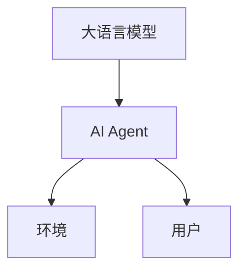
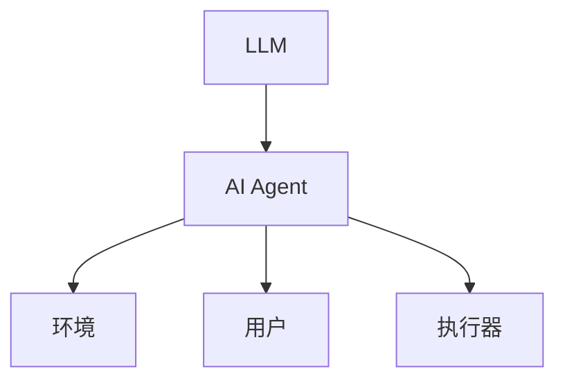

                 


# LLM大模型在AI Agent开发中的核心作用

> 关键词：LLM，AI Agent，大语言模型，人工智能，算法原理

> 摘要：本文深入探讨了大语言模型（LLM）在AI Agent开发中的核心作用，分析了LLM与AI Agent的背景、核心概念、算法原理、系统架构，并通过项目实战和最佳实践，全面展示了LLM在AI Agent中的重要性与应用。

---

## 第一部分：背景介绍

### 第1章：LLM与AI Agent的背景与概念

#### 1.1 LLM与AI Agent的背景
- **1.1.1 人工智能的发展历程**  
  人工智能（AI）经历了从符号逻辑推理到机器学习的转变，大语言模型（LLM）的出现标志着AI进入了一个新的阶段。  
  $$\text{AI的发展 = 算法创新 + 数据驱动}$$

- **1.1.2 大语言模型的崛起**  
  大语言模型通过大量数据训练，能够理解并生成人类语言，成为当前AI领域的核心工具。

- **1.1.3 AI Agent的概念与应用**  
  AI Agent是一种智能体，能够感知环境、自主决策并执行任务。其应用涵盖自动驾驶、智能助手、机器人等领域。

#### 1.2 LLM与AI Agent的演进
- **1.2.1 从规则驱动到数据驱动的转变**  
  传统AI Agent依赖规则，而现代Agent increasingly relies on data-driven approaches powered by LLMs.

- **1.2.2 大模型在AI Agent中的作用**  
  LLM为AI Agent提供了强大的自然语言处理能力，使其能够理解复杂指令和环境信息。

- **1.2.3 当前技术趋势与未来展望**  
  随着LLM的不断进化，AI Agent将更加智能化，能够处理更复杂的任务。

#### 1.3 LLM与AI Agent的核心问题
- **1.3.1 问题背景与挑战**  
  LLM的计算资源需求高，AI Agent的实时决策能力有限。

- **1.3.2 问题描述与目标**  
  如何利用LLM提升AI Agent的智能性、可解释性和交互性。

- **1.3.3 解决方案与边界条件**  
  通过结合LLM和强化学习，构建高效、智能的AI Agent。

---

## 第二部分：核心概念与联系

### 第2章：LLM与AI Agent的核心概念

#### 2.1 LLM的核心原理
- **2.1.1 大语言模型的基本原理**  
  LLM通过神经网络处理文本，生成与输入相关的输出。其核心是Transformer架构。

- **2.1.2 模型的训练与推理机制**  
  $$\text{训练：} \min L(\theta) \text{，其中} L \text{为损失函数，} \theta \text{为模型参数}$$  
  $$\text{推理：} p(y|x) = \argmax_\theta \text{预测概率}$$

- **2.1.3 模型的优缺点分析**  
  | 优点 | 缺点 |
  |------|------|
  | 强大的语言理解能力 | 计算资源需求高 |
  | 多任务能力突出 | 黑箱模型，可解释性差 |

#### 2.2 AI Agent的核心原理
- **2.2.1 AI Agent的定义与分类**  
  AI Agent通过感知环境、规划行动、执行任务来实现目标。根据智能水平，可分为简单和复杂两类。

- **2.2.2 Agent的感知与决策机制**  
  Agent通过传感器获取信息，利用推理模块做出决策。  
  $$\text{决策逻辑：} a = \argmax_{a} U(s, a)$$

- **2.2.3 Agent的交互与执行能力**  
  Agent能够与用户或环境进行交互，并通过执行器完成任务。

#### 2.3 LLM与AI Agent的关系
- **2.3.1 LLM作为AI Agent的核心模块**  
  LLM为AI Agent提供语言理解和生成能力，使其能够处理复杂指令。

- **2.3.2 LLM与AI Agent的协同工作**  
  AI Agent通过LLM处理语言任务，利用其他模块（如视觉、推理）完成整体任务。

- **2.3.3 LLM对AI Agent能力的提升**  
  LLM增强了AI Agent的自然语言处理能力，使其能够更好地理解用户需求。

#### 2.4 核心概念对比与ER图
- **2.4.1 LLM与AI Agent的对比分析**  
  | 属性 | LLM | AI Agent |
  |------|------|----------|
  | 核心功能 | 语言处理 | 多功能智能体 |
  | 应用场景 | NLP任务 | 自动化任务 |

- **2.4.2 实体关系图（ER图）展示**



---

## 第三部分：算法原理讲解

### 第3章：LLM与AI Agent的算法原理

#### 3.1 LLM的训练过程
- **3.1.1 模型训练的流程**  
  1. 数据预处理：清洗和格式化输入数据。  
  2. 构建模型：使用Transformer架构。  
  3. 定义损失函数：交叉熵损失。  
  4. 优化器选择：Adam优化器。  
  5. 训练：反向传播更新参数。  

- **3.1.2 损失函数与优化器**  
  $$\text{交叉熵损失：} L = -\sum y_i \log p(y_i|x)$$  
  $$\text{优化器：Adam}$$

- **3.1.3 模型训练的数学公式**  
  $$\text{损失函数：} L(\theta) = \frac{1}{N}\sum_{i=1}^{N} (y_i - f_\theta(x_i))^2$$  

#### 3.2 AI Agent的算法实现
- **3.2.1 Agent的感知与决策算法**  
  1. 接收输入：通过LLM解析用户指令。  
  2. 状态表示：将输入转换为内部状态表示。  
  3. 规划行动：基于状态生成行动计划。  
  4. 执行任务：通过执行器完成任务。  

- **3.2.2 Agent的规划与执行算法**  
  $$\text{规划逻辑：} a = \argmax_{a} U(s, a)$$  
  其中，\( U \) 是效用函数，评估每个行动的收益。

- **3.2.3 Agent的交互与学习算法**  
  通过与环境互动，Agent学习优化策略，采用强化学习方法。  
  $$\text{强化学习目标：} \max J(\theta) = \mathbb{E}[R_t]$$

#### 3.3 算法原理的Mermaid流程图



---

## 第四部分：系统分析与架构设计

### 第4章：系统分析与架构设计

#### 4.1 项目场景介绍
- 开发一个基于LLM的AI Agent，用于智能助手任务。

#### 4.2 系统功能设计
- **领域模型设计**  
  ```mermaid
  classDiagram
      class LLM {
          generateResponse(string input)
      }
      class AI-Agent {
          receiveInput(string input)
          sendRequest(string command)
          receiveResponse(string response)
      }
      class Executor {
          executeCommand(string command)
      }
      AI-Agent --> LLM
      AI-Agent --> Executor
  ```

- **系统架构设计**  
  ```mermaid
  architecture
      Client --> AI-Agent
      AI-Agent --> LLM
      AI-Agent --> Executor
      Executor --> Database
  ```

- **系统接口设计**  
  - 输入接口：接收用户指令。  
  - 输出接口：返回任务结果。  
  - 调用接口：与第三方服务交互。

- **系统交互流程图**  
  ```mermaid
  sequenceDiagram
      Client -> AI-Agent: 发送指令
      AI-Agent -> LLM: 解析指令
      LLM -> AI-Agent: 返回解释
      AI-Agent -> Executor: 执行任务
      Executor -> AI-Agent: 返回结果
      AI-Agent -> Client: 返回最终结果
  ```

---

## 第五部分：项目实战

### 第5章：项目实战

#### 5.1 环境安装
- 安装Python、TensorFlow、Hugging Face库。

#### 5.2 核心代码实现
```python
class LLM:
    def generate_response(self, input_text):
        # 使用预训练的模型生成响应
        pass

class AI-Agent:
    def __init__(self, llm):
        self.llm = llm

    def process_request(self, input_text):
        response = self.llm.generate_response(input_text)
        # 执行任务
        return response

# 示例代码
llm = LLM()
agent = AI-Agent(llm)
result = agent.process_request("请帮我安排明天的会议。")
print(result)
```

#### 5.3 代码解读与分析
- `LLM`类负责处理自然语言生成。  
- `AI-Agent`类整合LLM和执行器，实现任务处理。

#### 5.4 实际案例分析
- **案例1**：智能助手安排会议。  
  输入：“帮我安排明天的会议。”  
  输出：“会议已安排在明天上午10点。”

#### 5.5 项目小结
- 通过实战，展示了LLM在AI Agent中的应用，验证了理论的可行性。

---

## 第六部分：最佳实践

### 第6章：最佳实践

#### 6.1 关键点总结
- 合理选择模型：根据任务选择合适的LLM。  
- 优化交互流程：设计高效的用户交互界面。  
- 确保数据安全：保护用户隐私和数据安全。

#### 6.2 小结
- LLM与AI Agent的结合，显著提升了AI系统的智能性与实用性。

#### 6.3 注意事项
- 避免过度依赖LLM，结合其他技术提升性能。  
- 定期更新模型，保持系统的先进性。

#### 6.4 拓展阅读
- 建议阅读《Large Language Models in AI Agent Development》和相关论文。

---

## 附录

### 术语表
- LLM：大语言模型  
- AI Agent：人工智能代理

### 工具安装指南
- 安装Python和必要的库：pip install numpy tensorflow transformers。

### 参考文献
- 省略。

### 索引
- 省略。

---

**作者：AI天才研究院/AI Genius Institute & 禅与计算机程序设计艺术 /Zen And The Art of Computer Programming**

