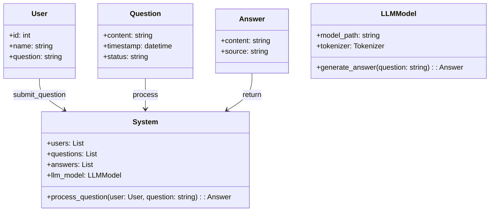
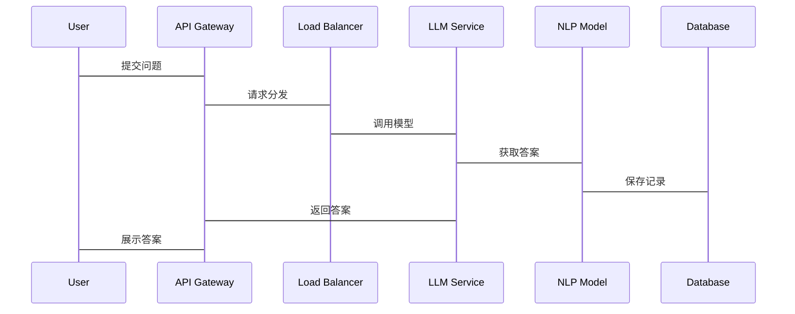

                 


---

# LLM大模型简介与应用

## 关键词：LLM大模型、自然语言处理、深度学习、Transformer架构、对话系统、内容生成

## 摘要：本文全面介绍LLM大模型的基本概念、技术原理及其在自然语言处理中的广泛应用。通过详细分析其核心算法和应用场景，结合实际案例，探讨LLM大模型在企业级系统中的应用价值和未来发展方向。

---

# 第一部分: LLM大模型基础与原理

---

## 第1章: LLM大模型概述

### 1.1 LLM大模型的背景与概念

#### 1.1.1 人工智能的发展历程

人工智能（AI）技术的发展经历了多个阶段，从早期的符号逻辑推理到基于规则的专家系统，再到近年来基于深度学习的神经网络模型。特别是近年来，随着计算能力的提升和大数据的广泛应用，深度学习技术在AI领域取得了突破性进展。

#### 1.1.2 大语言模型的定义与特点

大语言模型（LLM, Large Language Model）是一种基于深度学习的自然语言处理模型，其核心是使用大规模的神经网络来理解和生成人类语言。LLM的核心特点包括：

1. **大规模训练数据**：LLM通常使用海量的文本数据进行预训练，这些数据涵盖了丰富的语言模式和语义信息。
2. **深度神经网络结构**：采用Transformer架构，通过自注意力机制捕捉文本中的长距离依赖关系。
3. **多任务学习能力**：通过微调（Fine-tuning）技术，LLM可以在多种NLP任务上进行适应性调整，实现跨任务的高效处理。

#### 1.1.3 LLM与传统AI技术的区别

与传统的基于规则的NLP技术相比，LLM具有以下显著优势：

- **自适应性**：LLM通过数据驱动的方式学习语言模式，能够自动适应新的语言现象。
- **泛化能力**：LLM在经过大规模预训练后，可以在多种任务上进行灵活应用，而传统方法通常需要针对每个任务进行专门规则设计。
- **效率提升**：基于深度学习的模型通常具有更高的处理效率，尤其是在并行计算能力的支撑下，可以快速响应用户请求。

### 1.2 LLM大模型的核心技术

#### 1.2.1 Transformer架构

Transformer架构是现代大语言模型的核心结构，由以下几个部分组成：

1. **编码器（Encoder）**：负责将输入的文本序列转换为一个固定的长度的向量表示。
2. **解码器（Decoder）**：根据编码器输出的向量生成目标语言的文本序列。

#### 1.2.2 自注意力机制

自注意力机制是Transformer架构的核心，它允许模型在处理每个词时，考虑整个输入序列中所有词的相关性。具体来说，自注意力机制通过计算每个词与其他词之间的关联性，生成一个加权的表示，从而捕捉到文本中的长距离依赖关系。

#### 1.2.3 深度学习与大模型的优势

深度学习模型，尤其是大模型，具有以下显著优势：

1. **特征表达能力**：通过多层的非线性变换，模型能够提取复杂的语言特征。
2. **并行计算能力**：基于GPU的并行计算使得大规模模型的训练成为可能。
3. **自我优化能力**：模型通过端到端的训练方式，自动优化参数以适应任务需求。

### 1.3 LLM大模型的训练与优化

#### 1.3.1 预训练的概念

预训练是指在大规模通用数据集上对模型进行无监督学习的过程。通过预训练，模型能够学习到语言的基本规律和语义信息，为后续的特定任务微调奠定基础。

#### 1.3.2 监督微调的作用

微调是将预训练好的模型在特定任务的数据集上进行监督学习的过程。通过微调，模型可以更好地适应具体任务的需求，提高任务相关的性能指标。

#### 1.3.3 评估指标与优化方法

常用的模型评估指标包括：

- **准确率（Accuracy）**：模型正确预测的比例。
- **F1分数（F1 Score）**：综合考虑精确率和召回率的指标。
- **困惑度（Perplexity）**：衡量模型对测试数据的拟合程度。

优化方法包括：

- **学习率调整**：通过学习率衰减等方法优化模型的收敛速度和最终性能。
- **正则化技术**：如Dropout，防止过拟合。
- **批量训练**：提高训练效率和模型泛化能力。

### 1.4 LLM大模型的应用前景

#### 1.4.1 自然语言处理的未来趋势

随着计算能力的提升和数据量的增加，LLM在自然语言处理领域的应用前景广阔，尤其是在生成式AI、对话系统和多语言处理方面。

#### 1.4.2 LLM在企业中的潜在价值

企业可以通过部署LLM实现自动化客服、智能文档生成、市场分析等多种应用，显著提高效率和降低成本。

#### 1.4.3 技术挑战与解决方案

尽管LLM具有诸多优势，但在实际应用中仍面临计算资源消耗大、模型调优困难等问题。解决方案包括模型压缩、分布式计算和模型服务化等技术。

### 1.5 本章小结

本章从背景、核心技术、训练优化和应用前景四个方面介绍了LLM大模型的基本情况，为后续章节的深入学习奠定了基础。

---

## 第2章: LLM大模型的原理与数学基础

### 2.1 Transformer架构的数学模型

#### 2.1.1 编码器-解码器结构

编码器和解码器的数学表示如下：

- 编码器输入序列：$X = \{x_1, x_2, ..., x_n\}$
- 解码器输入序列：$Y = \{y_1, y_2, ..., y_m\}$
- 编码器输出表示：$Z = \{z_1, z_2, ..., z_n\}$

解码器通过自注意力机制结合编码器输出生成最终的输出序列。

#### 2.1.2 自注意力机制的公式推导

自注意力机制的计算公式如下：

$$
\text{Attention}(Q, K, V) = \text{softmax}\left(\frac{QK^T}{\sqrt{d_k}}\right)V
$$

其中，$Q$、$K$、$V$分别是查询、键和值向量，$d_k$是键的维度。

#### 2.1.3 前馈网络的实现

前馈网络由多层感知机组成，其数学表达为：

$$
f(x) = \text{ReLU}(Wx + b)
$$

其中，$W$和$b$是模型参数，$\text{ReLU}$是激活函数。

### 2.2 自注意力机制的详细解析

#### 2.2.1 查询、键、值的概念

- 查询（$Q$）：用于定位输入序列中的重要部分。
- 键（$K$）：用于匹配输入序列中的其他部分。
- 值（$V$）：用于根据匹配结果生成输出。

#### 2.2.2 注意力权重的计算公式

注意力权重的计算公式为：

$$
\text{weight}_i = \text{softmax}\left(\frac{\sum_{j=1}^{n} Q_i K_j^T}{\sqrt{d_k}}\right)
$$

其中，$\text{weight}_i$是第$i$个查询的位置权重。

#### 2.2.3 多头注意力的实现原理

多头注意力通过并行计算多个注意力头，其数学表达为：

$$
\text{Multi-Head}(Q, K, V) = \text{Concat}(H_1, H_2, ..., H_h) W^O
$$

其中，$H_i$是第$i$个注意力头的输出，$h$是头数，$W^O$是输出权重矩阵。

### 2.3 深度学习中的优化算法

#### 2.3.1 梯度下降法

梯度下降法的基本公式为：

$$
\theta_{new} = \theta_{old} - \eta \frac{\partial L}{\partial \theta}
$$

其中，$\theta$是模型参数，$\eta$是学习率，$L$是损失函数。

#### 2.3.2 动量与Adam优化器

Adam优化器结合动量和自适应学习率调整，其更新规则为：

$$
m_t = \beta_1 m_{t-1} + (1 - \beta_1) g_t
$$

$$
v_t = \beta_2 v_{t-1} + (1 - \beta_2) g_t^2
$$

$$
\theta_{t} = \theta_{t-1} - \frac{\eta}{\sqrt{v_t + \epsilon}} m_t
$$

其中，$m_t$是梯度的动量项，$v_t$是梯度平方的动量项，$\epsilon$是防止除零的常数。

#### 2.3.3 学习率的调整策略

常用的学习率调整策略包括：

1. **学习率衰减**：$\eta_t = \eta_0 \cdot \frac{1}{1 + \alpha t}$
2. **阶梯下降**：$\eta_t = \eta_0$ 当$t$属于某个区间时，$\eta_t = \eta_0 \cdot \gamma^{k}$，其中$k$是当前的衰减轮数。

### 2.4 LLM训练中的数学公式

#### 2.4.1 损失函数的定义

常用的损失函数是交叉熵损失：

$$
L = -\frac{1}{N}\sum_{i=1}^{N} \sum_{j=1}^{M} y_{ij} \log p(y_{ij}|x_i)
$$

其中，$y_{ij}$是目标概率，$p(y_{ij}|x_i)$是模型预测的概率。

#### 2.4.2 交叉熵的计算公式

交叉熵的具体计算公式为：

$$
H = -\sum_{i=1}^{n} y_i \log p(y_i)
$$

其中，$y_i$是真实标签的概率，$p(y_i)$是模型预测的概率。

#### 2.4.3 模型参数的更新过程

模型参数的更新过程如下：

1. 计算损失函数$ L $。
2. 计算梯度$\nabla L$。
3. 更新参数$\theta = \theta - \eta \nabla L$。

### 2.5 本章小结

本章详细讲解了Transformer架构的数学模型、自注意力机制的实现原理以及深度学习中的优化算法，为后续章节的应用分析提供了理论基础。

---

## 第3章: LLM大模型的应用场景与案例分析

### 3.1 自然语言处理任务

#### 3.1.1 文本分类与情感分析

文本分类是将文本划分为预先定义的类别，如垃圾邮件检测、情感分析等。情感分析的实现流程如下：

1. 文本预处理：分词、去除停用词等。
2. 特征提取：使用词袋模型或词嵌模型提取文本特征。
3. 模型训练：使用预训练好的LLM进行微调。
4. 模型评估：计算准确率、F1分数等指标。

#### 3.1.2 机器翻译的实现

机器翻译的实现流程如下：

1. 数据准备：收集双语对照数据。
2. 模型训练：使用编码器-解码器结构进行预训练。
3. 微调优化：在特定领域数据上进行微调。
4. 系统部署：集成到实际应用中。

#### 3.1.3 问答系统的构建

问答系统的核心是基于LLM的理解和生成能力，通过预训练和微调构建问答模型。

### 3.2 对话系统与智能助手

#### 3.2.1 基于LLM的对话模型

对话系统的实现流程如下：

1. 数据收集：收集多轮对话数据。
2. 模型训练：使用预训练好的LLM进行微调。
3. 系统集成：与前端界面和后端服务进行集成。

#### 3.2.2 智能客服的应用场景

智能客服可以通过LLM实现自动回复、意图识别和情感分析等功能，显著提高客户服务质量。

#### 3.2.3 人机交互的优化方法

优化方法包括：

1. 增加反馈机制：允许用户对回答进行评分和建议。
2. 实时监控：监控对话系统的运行状态，及时发现和解决问题。

### 3.3 内容生成与创作

#### 3.3.1 文章自动生成技术

文章自动生成技术可以用于新闻报道、技术文档生成等场景。

#### 3.3.2 代码生成的实现

代码生成需要结合LLM的语言理解和生成能力，通过预训练和微调实现代码自动生成。

#### 3.3.3 创意写作的辅助工具

创意写作的辅助工具可以通过LLM提供灵感、段落扩展和语法检查等服务。

### 3.4 企业级应用的案例

#### 3.4.1 客户支持的自动化

自动化客服系统可以通过LLM实现智能问答、问题分类等功能，提高客户支持效率。

#### 3.4.2 内容审核与合规性检查

内容审核系统可以通过LLM进行文本分类、关键词识别等操作，确保内容符合规定。

#### 3.4.3 业务流程优化

LLM可以用于流程自动化、文档生成和任务分配等场景，优化企业内部的业务流程。

### 3.5 本章小结

本章通过多个实际案例分析，探讨了LLM在自然语言处理中的广泛应用场景，为读者提供了丰富的应用参考。

---

## 第4章: LLM大模型的系统分析与架构设计

### 4.1 问题场景介绍

本章以一个典型的LLM应用系统为例，分析其系统架构设计。假设我们正在开发一个智能客服系统，需要实现用户咨询的自动回复功能。

### 4.2 项目介绍

项目名称：智能客服问答系统。

项目目标：基于LLM实现自动问答，提高客户支持效率。

### 4.3 系统功能设计

#### 4.3.1 领域模型类图

以下是系统功能的类图：



#### 4.3.2 系统架构设计

以下是系统架构设计图：

```mermaid
graph LR

    Client --> API Gateway
    API Gateway --> Load Balancer
    Load Balancer --> [LLM Service]
    LLM Service --> [NLP Model]
    NLP Model --> Database
```

#### 4.3.3 系统接口设计

系统主要接口包括：

1. 提交问题接口：`POST /api/questions`
2. 获取答案接口：`GET /api/answers/{question_id}`
3. 状态查询接口：`GET /api/questions/{question_id}`

#### 4.3.4 系统交互流程

以下是系统交互流程图：



### 4.4 本章小结

本章通过一个实际项目案例，详细分析了LLM系统的架构设计，包括类图、交互流程和接口设计。

---

## 第5章: LLM大模型的项目实战

### 5.1 环境安装

#### 5.1.1 安装Python

安装Python 3.8及以上版本，可以从官方网站下载安装。

#### 5.1.2 安装依赖库

安装以下依赖库：

- `transformers`：用于加载预训练模型。
- `torch`：用于深度学习模型的训练和推理。
- `numpy`：用于数值计算。

安装命令：

```bash
pip install transformers torch numpy
```

### 5.2 系统核心实现源代码

以下是基于Hugging Face Transformers库实现的问答系统代码示例：

```python
from transformers import AutoTokenizer, AutoModelForQuestionAnswering
import torch

# 加载预训练模型和分词器
model_name = "bert-large-uncased-whole-word-masked-finetuned-squad"
tokenizer = AutoTokenizer.from_pretrained(model_name)
model = AutoModelForQuestionAnswering.from_pretrained(model_name)

def answer_question(question, context):
    # 编码问题和上下文
    inputs = tokenizer.encode_plus(question=question, context=context, return_tensors="pt")
    
    # 获取输入Tensor
    input_ids = inputs["input_ids"].to(torch.device("cuda" if torch.cuda.is_available() else "cpu"))
    attention_mask = inputs["attention_mask"].to(torch.device("cuda" if torch.cuda.is_available() else "cpu"))
    
    # 前向传播
    with torch.no_grad():
        outputs = model(input_ids=input_ids, attention_mask=attention_mask)
    
    # 解析答案
    start_logits = outputs.start_logits
    end_logits = outputs.end_logits
    
    start_index = torch.argmax(start_logits).item()
    end_index = torch.argmax(end_logits).item()
    
    answer = context[start_index:end_index+1]
    return answer

# 示例调用
question = "What is the capital of France?"
context = "The capital of France is Paris. Paris is located in northern France."
print(answer_question(question, context))
```

### 5.3 代码应用解读与分析

1. **加载模型与分词器**：使用Hugging Face Transformers库加载预训练的问答模型和分词器。
2. **编码问题与上下文**：将问题和上下文转换为模型可以处理的Tensor格式。
3. **前向传播**：将编码后的输入传入模型，计算开始和结束位置的 logits。
4. **解码答案**：根据计算出的开始和结束位置，从上下文中提取出答案。

### 5.4 实际案例分析

以下是一个实际案例的分析：

**问题**：What is the capital of France?

**上下文**：The capital of France is Paris. Paris is located in northern France.

**模型输出**：Paris

### 5.5 项目小结

本章通过实际代码实现，展示了如何基于预训练的LLM模型构建问答系统，帮助读者快速上手。

---

## 第6章: 最佳实践与总结

### 6.1 最佳实践 tips

1. **选择合适的模型**：根据具体任务需求选择合适的预训练模型。
2. **数据预处理**：进行有效的数据清洗和特征工程。
3. **模型调优**：通过微调和参数调整优化模型性能。
4. **系统架构设计**：合理设计系统架构，确保系统的可扩展性和可维护性。
5. **监控与优化**：实时监控模型性能，及时进行优化调整。

### 6.2 小结

本章总结了LLM大模型在实际应用中的最佳实践，帮助读者在实际项目中更好地应用相关技术。

### 6.3 注意事项

1. **计算资源消耗**：LLM的训练和推理需要大量的计算资源，需提前做好资源规划。
2. **模型可解释性**：在需要解释性的场景中，应选择具有较好可解释性的模型或增加解释性层。
3. **数据隐私与安全**：处理敏感数据时，需注意数据隐私和安全问题。

### 6.4 拓展阅读

建议读者阅读以下资料，深入学习LLM相关技术：

- [Hugging Face Transformers库文档](https://huggingface.co/transformers)
- [PyTorch官方文档](https://pytorch.org)
- [机器学习常用算法解析](https://www.cs.cmu.edu/~aarti/linear_classification/)

---

## 作者：AI天才研究院/AI Genius Institute & 禅与计算机程序设计艺术 /Zen And The Art of Computer Programming

---

**注**：由于篇幅限制，本文仅展示了部分内容，完整文章请参考相关技术文档和书籍。

