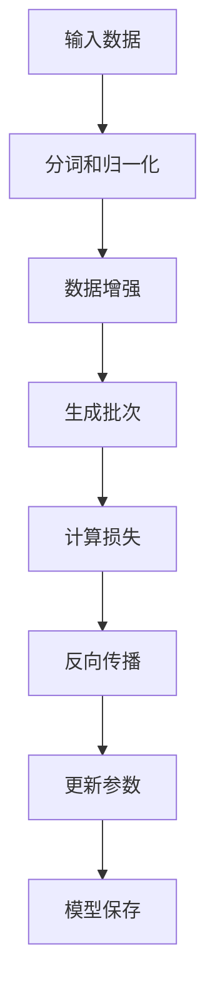
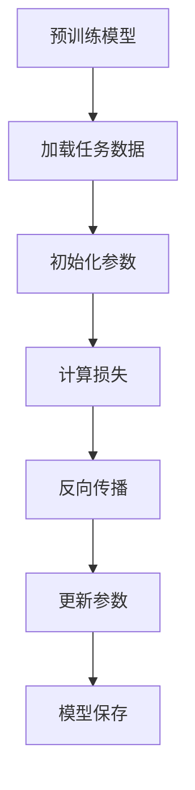
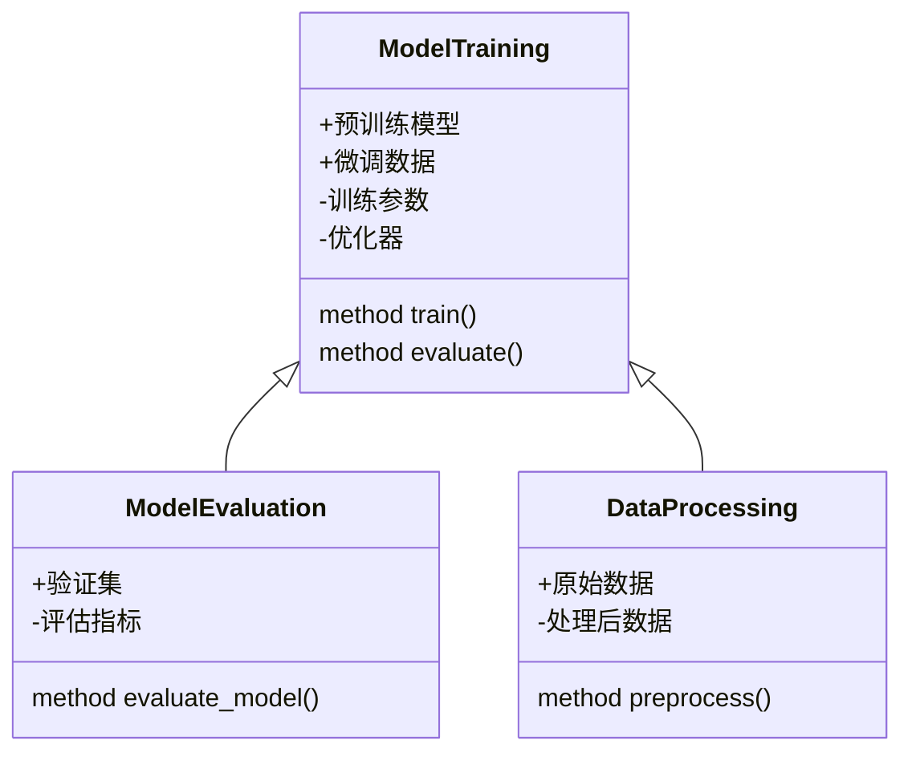

                 


# LLM模型训练实践：从预训练到微调的全流程

## 关键词：大语言模型, LLM训练, 预训练, 微调, NLP, 深度学习

## 摘要：  
本文将深入探讨大语言模型（LLM）从预训练到微调的全流程，涵盖模型架构、预训练与微调的核心原理、系统设计与实现等内容。通过详细分析，读者将掌握LLM训练的关键步骤和实践技巧，从理论到实践全面了解如何高效训练和优化LLM模型。

---

## 第1章: LLM模型训练的背景与概念

### 1.1 大语言模型的基本概念  
- **1.1.1 什么是大语言模型**  
  大语言模型（LLM）是指基于Transformer架构的大型神经网络模型，具有千亿甚至万亿参数量，能够理解和生成人类语言。  
  $$LLM = f_{\theta}(x)$$  
  其中，$\theta$ 表示模型参数，$x$ 是输入文本。

- **1.1.2 LLM的核心技术特点**  
  - 深度多层网络：通过多层Transformer结构捕捉长距离依赖关系。  
  - 自注意力机制：允许模型在处理每个词时考虑上下文信息。  
  - 预训练+微调模式：通过大规模未标注数据预训练，再针对特定任务微调。  

- **1.1.3 LLM与传统NLP模型的区别**  
  | 特性 | LLM | 传统NLP模型 |  
  |------|-----|--------------|  
  | 参数量 | 十亿级别 | 几百万级别 |  
  | 任务通用性 | 高 | 低 |  
  | 预训练 | 必须 | 通常无 |  

### 1.2 LLM训练的背景与现状  
- **1.2.1 为什么需要大语言模型**  
  - 提高NLP任务的准确性和鲁棒性。  
  - 实现通用的人工智能，支持多任务处理。  

- **1.2.2 当前LLM训练的主要应用场景**  
  - 机器翻译、问答系统、文本生成、对话系统。  

- **1.2.3 LLM训练的挑战与机遇**  
  - 挑战：计算资源消耗大，模型调优复杂。  
  - 机遇：推动NLP技术在各领域的广泛应用。  

### 1.3 本章小结  
本章介绍了LLM的基本概念、技术特点及其应用场景，为后续章节的深入分析奠定了基础。

---

## 第2章: LLM模型训练的核心概念与联系

### 2.1 模型架构原理  
- **2.1.1 Transformer模型的基本结构**  
  Transformer由编码器和解码器组成，编码器负责将输入序列编码为语义向量，解码器负责根据编码结果生成输出序列。  
  $$encoder(x) \rightarrow decoder(encoder(x))$$  

- **2.1.2 多层感知机与注意力机制的结合**  
  - 多层感知机（MLP）用于非线性变换。  
  - 注意力机制捕捉序列中重要的位置信息。  

- **2.1.3 模型参数量与训练效率的关系**  
  模型参数量越大，计算资源消耗越大，训练效率越低。  

### 2.2 预训练与微调的原理  
- **2.2.1 预训练的目标函数**  
  预训练通常采用掩码语言模型（如BERT）或对比语言模型（如GPT）。  
  $$L(\theta) = -\frac{1}{N}\sum_{i=1}^{N}\log p_{\theta}(y_i|x_{<i})$$  
  其中，$y_i$ 是目标词，$x_{<i}$ 是输入序列。  

- **2.2.2 微调的任务适配策略**  
  在预训练的基础上，针对特定任务调整模型参数，通常只微调部分层或全层。  
  $$f_{\theta}^{task}(x) = g_{\phi}(f_{\theta}(x))$$  
  其中，$g_{\phi}$ 是微调后的模型。  

- **2.2.3 预训练与微调的优缺点对比**  
  | 特性 | 预训练 | 微调 |  
  |------|--------|------|  
  | 计算资源 | 高 | 中 |  
  | 灵活性 | 低 | 高 |  

### 2.3 模型评估与优化  
- **2.3.1 常见的模型评估指标**  
  - 准确率（Accuracy）、F1分数、困惑度（Perplexity）。  

- **2.3.2 模型优化的策略与方法**  
  - 参数剪裁（Parameter Pruning）。  
  - 知识蒸馏（Knowledge Distillation）。  

- **2.3.3 模型压缩与部署的注意事项**  
  - 使用剪枝和量化技术减少模型大小。  
  - 优化推理速度和内存占用。  

### 2.4 本章小结  
本章详细介绍了LLM模型的架构原理、预训练与微调的原理及其优缺点，为后续章节的实现提供了理论基础。

---

## 第3章: LLM预训练的原理与实现

### 3.1 预训练的目标函数  
- **3.1.1 语言模型的损失函数**  
  交叉熵损失函数用于衡量模型预测与真实标签的差异。  
  $$L = -\sum_{i=1}^{n}\sum_{j=1}^{m} y_{ij}\log p_{model}(y_j|x_{<j})$$  

### 3.2 预训练的数据处理  
- **3.2.1 数据清洗与预处理**  
  - 去除低频词和特殊符号。  
  - 分词和归一化处理。  

- **3.2.2 数据增强技术的应用**  
  - 同义词替换（Word Replacement）。  
  - 句子重排（Sentence Reordering）。  

- **3.2.3 多样化数据源的整合策略**  
  组合书籍、网页、论文等多种数据源，提升模型的泛化能力。  

### 3.3 预训练的实现细节  
- **3.3.1 分布式训练的优化方法**  
  使用多GPU并行训练，优化数据加载和梯度同步。  

- **3.3.2 梯度裁剪与学习率调整**  
  - 梯度裁剪防止梯度爆炸。  
  - 学习率衰减策略（如余弦退火）。  

- **3.3.3 模型收敛的监控与评估**  
  - 验证集上的损失值作为监控指标。  
  - 定期保存模型快照，防止过拟合。  

### 3.4 预训练流程图  


### 3.5 本章小结  
本章详细讲解了预训练的实现细节，包括数据处理、训练策略和模型优化方法，为后续的微调奠定了基础。

---

## 第4章: LLM微调的原理与实现

### 4.1 微调的目标与方法  
- **4.1.1 微调的基本概念**  
  微调是基于预训练模型，针对特定任务调整模型参数。  

- **4.1.2 参数调整的策略**  
  - 全部参数微调：适合数据量较小的任务。  
  - 部分参数微调：冻结部分层，仅微调顶层。  

### 4.2 微调的数据准备  
- **4.2.1 任务特定数据的收集**  
  根据任务需求，收集标注数据。  

- **4.2.2 数据标注与格式化**  
  使用工具（如Label Studio）进行标注，并将数据格式化为模型所需的形式。  

- **4.2.3 数据集的划分与管理**  
  将数据划分为训练集、验证集和测试集，确保数据均衡分布。  

### 4.3 微调的实现细节  
- **4.3.1 模型加载与参数初始化**  
  加载预训练模型，并初始化微调任务的参数。  

- **4.3.2 微调过程中的优化方法**  
  - 使用合适的优化器（如AdamW）。  
  - 设置合理的学习率和训练轮数。  

- **4.3.3 模型评估与调优**  
  - 持续监控验证集性能，防止过拟合。  
  - 调整超参数（如批次大小、学习率）优化性能。  

### 4.4 微调流程图  


### 4.5 本章小结  
本章详细介绍了微调的原理和实现细节，包括数据准备和模型优化策略。

---

## 第5章: LLM微调的系统架构与设计

### 5.1 系统功能设计  
- **5.1.1 系统模块划分**  
  - 数据处理模块：负责数据加载和预处理。  
  - 模型训练模块：负责加载预训练模型并进行微调。  
  - 模型评估模块：负责模型性能的监控和评估。  

- **5.1.2 系统功能流程**  
  数据输入 -> 数据处理 -> 模型训练 -> 模型评估 -> 模型部署。  

### 5.2 系统架构设计  


### 5.3 系统接口设计  
- **5.3.1 API接口定义**  
  - 输入：模型参数、训练数据、超参数。  
  - 输出：训练后的模型、模型评估结果。  

### 5.4 本章小结  
本章从系统架构的角度，详细设计了微调的实现模块和接口，为实际项目提供了参考。

---

## 第6章: LLM微调的项目实战

### 6.1 环境搭建  
- **6.1.1 安装依赖**  
  使用Python和PyTorch框架，安装必要的库（如transformers、torch）。  

### 6.2 数据准备  
- **6.2.1 数据下载与清洗**  
  下载公开数据集（如 squad），清洗并格式化数据。  

### 6.3 模型实现  
- **6.3.1 加载预训练模型**  
  ```python
  from transformers import AutoTokenizer, AutoModelForQuestionAnswering
  tokenizer = AutoTokenizer.from_pretrained('bert-base-uncased')
  model = AutoModelForQuestionAnswering.from_pretrained('bert-base-uncased')
  ```

- **6.3.2 定义微调任务**  
  ```python
  def compute_loss(outputs, labels):
      loss_fn = nn.CrossEntropyLoss()
      loss = loss_fn(outputs.logits, labels)
      return loss
  ```

### 6.4 模型微调与训练  
- **6.4.1 定义训练循环**  
  ```python
  optimizer = AdamW(model.parameters(), lr=1e-5)
  model.train()
  for epoch in range(num_epochs):
      for batch in train_loader:
          inputs, labels = batch
          outputs = model(**inputs)
          loss = compute_loss(outputs, labels)
          loss.backward()
          optimizer.step()
          optimizer.zero_grad()
  ```

### 6.5 模型部署与测试  
- **6.5.1 模型保存**  
  ```python
  model.save_pretrained(output_dir)
  tokenizer.save_pretrained(output_dir)
  ```

- **6.5.2 模型推理**  
  ```python
  model = AutoModelForQuestionAnswering.from_pretrained(output_dir)
  inputs = tokenizer.encode_plus("What is the capital of France?", return_tensors="pt")
  outputs = model(**inputs)
  print(outputs.logits)
  ```

### 6.6 本章小结  
本章通过实际案例，详细指导了LLM微调的环境搭建、数据准备、模型实现和训练部署过程。

---

## 第7章: LLM微调的最佳实践与总结

### 7.1 最佳实践  
- **7.1.1 数据处理技巧**  
  - 数据清洗要彻底，确保数据质量。  
  - 使用数据增强提升模型鲁棒性。  

- **7.1.2 模型优化建议**  
  - 合理选择微调策略，平衡训练效率和模型性能。  
  - 使用合适的优化器和学习率策略。  

### 7.2 案例分析与经验总结  
- **7.2.1 案例分析**  
  通过具体案例分析，总结微调过程中常见的问题及解决方案。  

- **7.2.2 经验总结**  
  - 微调过程中，验证集性能是关键指标。  
  - 避免过拟合，合理设置训练轮数和批次大小。  

### 7.3 未来展望  
- **7.3.1 LLM训练的未来方向**  
  - 更高效的模型架构设计。  
  - 更绿色的训练方法，降低碳排放。  

### 7.4 本章小结  
本章总结了LLM微调的最佳实践，为读者提供了宝贵的经验和未来研究方向。

---

## 作者：AI天才研究院/AI Genius Institute & 禅与计算机程序设计艺术 /Zen And The Art of Computer Programming

---

希望这篇文章能为读者提供从预训练到微调的全流程实践指南，帮助读者掌握LLM模型训练的核心技术和实践技巧。

