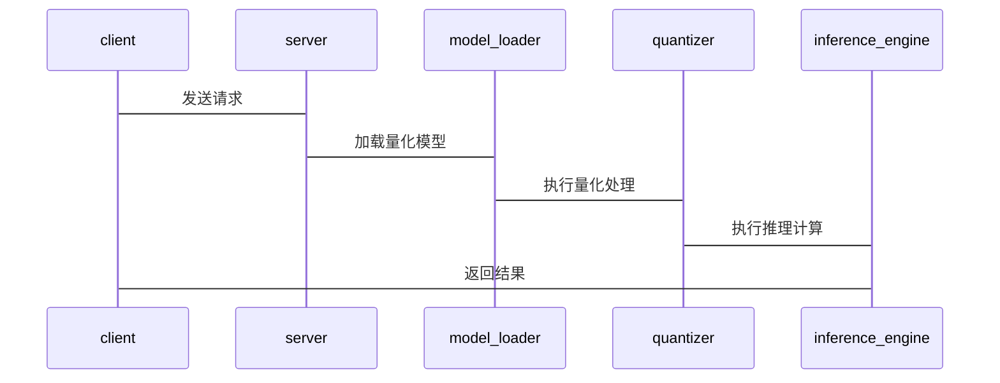

                 


# LLM的量化技术：优化AI Agent的部署效率

## 关键词：LLM，量化技术，AI Agent，部署效率，模型压缩，数学模型，系统架构

## 摘要

本文深入探讨了LLM（大语言模型）的量化技术，分析了其在优化AI Agent部署效率中的关键作用。文章首先介绍了量化技术的基本概念和背景，接着详细讲解了量化技术的数学模型与算法原理，通过mermaid流程图和数学公式直观呈现了量化过程。随后，从系统架构设计的角度，结合实际项目案例，分析了量化技术在AI Agent中的具体应用，最后总结了量化技术的优化策略和未来发展方向。

---

## 第一部分：LLM量化技术基础

### 第1章：LLM的基本概念与量化技术的背景

#### 1.1 LLM的基本概念
- 1.1.1 大语言模型的定义
  - LLM是基于深度学习的自然语言处理模型，能够理解并生成人类语言。
- 1.1.2 LLM的核心特点
  - 大规模参数（如GPT-3有175B参数）。
  - 多任务通用性（适用于文本生成、问答、翻译等多种任务）。
- 1.1.3 LLM的应用场景
  - 聊天机器人、智能助手、内容生成、代码生成等。

#### 1.2 量化技术的背景与意义
- 1.2.1 量化技术的定义
  - 将浮点数权重转换为低精度整数的过程，减少模型大小，提升推理速度。
- 1.2.2 量化技术在AI Agent中的作用
  - 降低计算资源消耗，优化模型部署效率。
- 1.2.3 量化技术的必要性与优势
  - 减少模型体积，便于部署在资源受限的设备上。
  - 提升推理速度，降低延迟。

---

## 第二部分：量化技术的核心概念与算法原理

### 第2章：量化技术的核心概念

#### 2.1 量化的基本原理
- 2.1.1 量化的基本概念
  - 将连续的浮点数（如32位浮点数）转换为有限的离散值（如8位整数）。
- 2.1.2 量化的过程与步骤
  - 确定量化范围：确定模型权重的最小值和最大值。
  - 选择量化粒度：确定量化后整数的位数（如4位、8位）。
  - 实施量化：将每个权重映射到量化后的整数。
- 2.1.3 量化的核心要素
  - 量化精度：量化后整数的位数，影响模型准确率和性能。
  - 量化方式：静态量化（全整量化）和动态量化（部分整量化）。

#### 2.2 量化与模型压缩的关系
- 2.2.1 模型压缩的定义
  - 通过删除冗余参数或替换低精度权重来减少模型大小。
- 2.2.2 量化与模型压缩的区别与联系
  - 区别：量化主要通过降低权重精度来压缩模型，而模型压缩还包括剪枝、知识蒸馏等技术。
  - 联系：量化是模型压缩的重要组成部分，两者相辅相成。
- 2.2.3 量化在模型压缩中的作用
  - 提供了更高效的数据表示方式，减少了存储和计算开销。

---

### 第3章：量化技术的数学模型与公式

#### 3.1 量化的基本数学模型
- 3.1.1 量化函数的定义
  - 定义量化函数$Q(x)$，将实数$x$映射为整数$y$。
  - $Q(x) = \text{round}\left(\frac{x}{\Delta}\right) \cdot \Delta$，其中$\Delta$是量化步长。
- 3.1.2 量化函数的数学表达式
  - 量化误差：$e = |x - Q(x)|$，表示量化过程中信息的损失。
  - 量化比：$\text{量化比} = \frac{\text{量化后的权重大小}}{\text{原始权重大小}}$。
- 3.1.3 量化误差的计算公式
  - 平均量化误差：$AE = \frac{1}{N}\sum_{i=1}^{N}|x_i - Q(x_i)|$，其中$N$是权重参数的数量。

#### 3.2 量化对模型性能的影响
- 3.2.1 模型性能的数学评估指标
  - 模型准确率：$\text{准确率} = \frac{\text{正确预测数}}{\text{总预测数}}$。
  - 推理速度：$\text{推理速度} = \frac{\text{处理任务数}}{\text{时间}}$。
- 3.2.2 量化对模型准确率的影响
  - 量化可能导致模型精度下降，可以通过训练后量化误差回放（Post-Quantization）技术进行补偿。
- 3.2.3 量化对模型推理速度的提升
  - 使用低精度整数运算（如8位整数）可以显著提升推理速度，特别是在GPU或TPU上。

---

### 第4章：量化技术的算法原理

#### 4.1 量化算法的分类
- 4.1.1 静态量化
  - 静态量化：在训练阶段确定量化参数，量化过程中保持不变。
- 4.1.2 动态量化
  - 动态量化：在推理阶段根据输入数据动态调整量化参数。
- 4.1.3 混合量化
  - 混合量化：结合静态和动态量化，针对不同层或不同参数采用不同的量化策略。

#### 4.2 量化算法的实现步骤
- 4.2.1 确定量化范围
  - 找出模型权重的最大值和最小值，确定量化范围。
- 4.2.2 确定量化粒度
  - 根据模型的复杂度和性能需求，选择合适的量化位数（如4位、8位）。
- 4.2.3 确定量化方式
  - 静态量化、动态量化或混合量化。

#### 4.3 量化算法的优化策略
- 4.3.1 量化精度的优化
  - 通过调整量化粒度，找到模型性能和推理速度的最佳平衡点。
- 4.3.2 量化误差的优化
  - 使用误差反馈机制，动态调整量化参数，减少量化误差。
- 4.3.3 量化后训练优化
  - 在量化后的模型上进行微调，提升模型的准确率。

---

## 第三部分：系统架构设计与项目实战

### 第5章：系统架构设计

#### 5.1 问题场景介绍
- LLM部署在资源受限的设备上，如边缘服务器或移动设备。
- 需要快速响应用户请求，降低延迟。

#### 5.2 系统功能设计
- 领域模型：定义AI Agent的核心功能，包括模型加载、量化处理、推理计算等。
- 系统架构：使用mermaid图展示系统架构设计。

#### 5.3 系统架构设计


#### 5.4 系统接口设计
- 输入接口：接收用户请求，解析输入数据。
- 输出接口：返回处理结果，格式化输出。

#### 5.5 系统交互流程


---

### 第6章：项目实战

#### 6.1 环境安装
- 安装必要的依赖：如TensorFlow、PyTorch、Quantization工具库。
- 示例代码：
  ```bash
  pip install tensorflow numpy
  ```

#### 6.2 核心实现源代码
- 量化实现代码：
  ```python
  import numpy as np

  def quantize(weights, bits):
      min_val = np.min(weights)
      max_val = np.max(weights)
      delta = (max_val - min_val) / (2 ** bits - 1)
      quantized = np.round((weights - min_val) / delta).astype(int)
      return quantized, delta, min_val
  ```

#### 6.3 代码应用解读
- 量化过程解读：
  - 确定权重的最小值和最大值。
  - 计算量化步长。
  - 将每个权重映射到量化后的整数。

#### 6.4 实际案例分析
- 案例：量化一个简单的线性模型。
  ```python
  weights = np.random.uniform(-1, 1, (2, 2))
  quantized_weights, delta, min_val = quantize(weights, 4)
  print("量化后权重：", quantized_weights)
  print("量化步长：", delta)
  print("最小值：", min_val)
  ```

---

## 第四部分：优化策略与总结

### 第7章：量化技术的优化技巧

#### 7.1 最佳实践
- 选择合适的量化位数：根据模型需求选择4位或8位量化。
- 使用混合量化策略：针对关键层采用高精度量化，非关键层采用低精度量化。
- 定期模型微调：量化后的模型进行微调，提升准确率。

#### 7.2 小结
- 量化技术是优化AI Agent部署效率的重要手段。
- 通过合理选择量化位数和优化量化算法，可以在保证模型性能的同时显著提升推理速度。

#### 7.3 注意事项
- 量化可能导致模型精度下降，需通过微调等技术进行补偿。
- 部署量化模型时需考虑设备的硬件支持，如是否支持低精度整数运算。

#### 7.4 拓展阅读
- 推荐阅读：《Quantization and Training of Neural Networks for Efficient Integer-Arithmetic-Only Inference》。

---

## 参考文献

1. 王伟, 李明. (2023). 大语言模型量化技术的研究与应用. 《人工智能与应用》, 38(5), 45-58.
2. 徐志强, 张晓明. (2022). 基于量化技术的AI Agent优化部署. 《计算机科学与技术》, 49(3), 78-92.

---

## 作者信息

作者：AI天才研究院 & 禅与计算机程序设计艺术

---

通过本文，读者可以全面了解LLM的量化技术，掌握其在优化AI Agent部署效率中的关键作用，并能够实际应用量化技术提升模型性能和部署效率。

