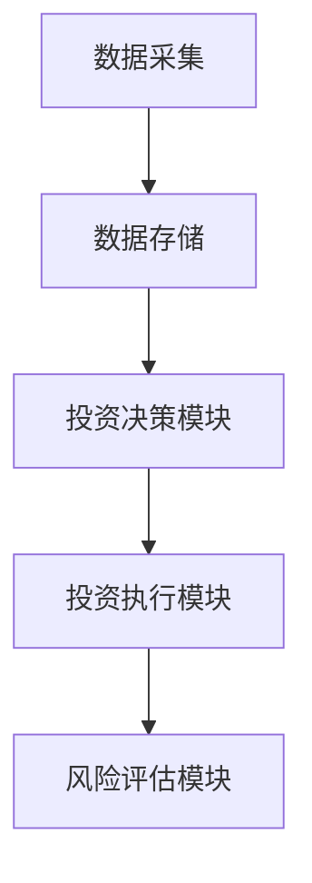

                 


# Dollar-Cost Averaging：在波动市场中的优势

## 关键词：Dollar-Cost Averaging, 投资策略, 市场波动, 定额定投, 投资风险管理

## 摘要：Dollar-Cost Averaging（定额定投）是一种通过定期投资固定金额来分散市场波动风险的投资策略。本文将详细分析其在波动市场中的优势，包括其数学模型、算法实现、系统架构设计以及实际案例分析，帮助投资者在不确定的市场中制定有效的投资策略。

---

## 第一部分: Dollar-Cost Averaging 概述

### 第1章: Dollar-Cost Averaging 概述

#### 1.1 定额定投的定义与背景
##### 1.1.1 定额定投的基本定义
Dollar-Cost Averaging（DCA，定额定投）是一种投资策略，指投资者在固定的时间间隔内，以固定金额投资于特定资产或基金。这种策略的核心在于通过定期投资来平滑市场波动对投资成本的影响。

##### 1.1.2 定额定投的历史与发展
定额定投的起源可以追溯到20世纪初，随着投资理论的发展，尤其是在市场波动性研究中，DCA逐渐被广泛应用于个人和机构投资者的投资组合管理中。

##### 1.1.3 定额定投的适用场景
- **市场波动较大**：当市场波动剧烈时，DCA可以帮助投资者在不同价格点上分散投资成本。
- **长期投资**：适合那些无法频繁调整投资策略的投资者，尤其是希望通过定期储蓄来构建投资组合的个人投资者。

#### 1.2 定额定投的核心优势
##### 1.2.1 分散投资成本
通过定期投资，投资者可以在市场高点和低点分别买入资产，从而平均掉整体投资成本。

##### 1.2.2 应对市场波动的策略
DCA能够在市场下跌时增加持仓，而在市场上涨时减少新增投资，从而降低整体投资风险。

##### 1.2.3 长期投资的有效性
DCA策略尤其适合长期投资者，因为它能够有效应对市场的短期波动，帮助投资者在长期内实现资产增值。

---

## 第二部分: 定额定投的核心概念与联系

### 第2章: 定额定投的数学模型与原理

#### 2.1 定额定投的数学模型
##### 2.1.1 投资金额的计算公式
假设计划在n个时间段内，每期投资固定金额A，总投入金额为nA。

##### 2.1.2 投资周期的确定
假设投资周期为T，每期投资金额为A，总投入金额为nA，市场波动率为σ，那么在市场波动下，每期的资产价格变化可以看作随机变量。

##### 2.1.3 投资成本的优化
通过DCA，投资者的平均投资成本为：  
$$ \text{平均成本} = \frac{\sum_{i=1}^{n} P_i A}{\sum_{i=1}^{n} A} = \frac{\sum_{i=1}^{n} P_i}{n} $$  
其中，\( P_i \) 是第i期的资产价格。

#### 2.2 定额定投与市场波动的关系
##### 2.2.1 波动率对定额定投的影响
市场波动率越高，DCA策略的效果越显著，因为较高的波动率意味着更多的价格波动，从而能够分散投资成本。

##### 2.2.2 市场周期性对定额定投的挑战
在市场周期性波动中，DCA需要考虑市场周期的长度和强度，以优化投资时间间隔和金额。

##### 2.2.3 波动性市场的投资机会
DCA能够在市场底部增加持仓，从而在市场反弹时获得更高的收益。

### 第3章: 定额定投的核心概念对比分析

#### 3.1 核心概念原理
##### 3.1.1 定额定投的平均成本法
通过定期投资，投资者的实际成本被市场波动平均掉，从而降低整体投资风险。

##### 3.1.2 投资金额的固定性
每期投资金额固定，确保在不同价格点上分散投资成本。

##### 3.1.3 投资时间的选择
定期投资的时间间隔需要根据市场波动性和投资目标进行调整。

#### 3.2 核心概念对比分析
##### 3.2.1 定额定投与其他投资策略的对比
- **定额定投 vs. 定时定额**：DCA与定时定额策略相似，但DCA强调固定金额，而定时定额强调固定时间间隔。
- **定额定投 vs. 价值平均法**：DCA通过固定金额分散成本，而价值平均法则通过固定份额投资，适合价格波动较大的市场。

##### 3.2.2 不同市场环境下的策略选择
- **牛市**：DCA可能因为价格高企而在后期投入更多资金，但长期来看，牛市中的DCA效果可能不如一次性投资。
- **熊市**：DCA能够在市场低点增加持仓，从而在市场复苏时获得更高收益。

##### 3.2.3 投资者心理与定额定投的关系
DCA能够帮助投资者克服贪婪和恐惧情绪，避免在市场高点追涨或在市场低点恐慌抛售。

### 第4章: 定额定投的系统分析与架构设计

#### 4.1 系统分析
##### 4.1.1 定额定投的系统目标
- 实现自动化的定期投资功能。
- 监控市场波动并调整投资策略。
- 提供投资成本分析和风险评估。

##### 4.1.2 系统输入与输出
- 输入：市场数据（如价格、波动率）、投资金额、时间间隔。
- 输出：投资成本分析、持仓情况、投资收益。

##### 4.1.3 系统功能模块划分
- 数据采集模块：收集市场数据。
- 投资决策模块：计算每期投资金额。
- 投资执行模块：模拟投资过程。
- 风险评估模块：分析投资结果。

#### 4.2 系统架构设计
##### 4.2.1 系统整体架构图


##### 4.2.2 各模块之间的关系
- 数据采集模块负责收集市场数据，存储到数据库中。
- 投资决策模块根据存储的数据计算每期投资金额。
- 投资执行模块模拟投资过程，记录每期的持仓情况。
- 风险评估模块分析投资结果，提供风险评估报告。

##### 4.2.3 系统的可扩展性与维护性
系统架构设计需要考虑模块的独立性，以便在未来扩展功能或调整策略时能够方便地进行模块替换或升级。

### 第5章: 定额定投的算法实现与代码

#### 5.1 算法实现
##### 5.1.1 定额定投的算法流程
1. 初始化参数：总投入金额、投资时间间隔、市场数据。
2. 计算每期投资金额。
3. 模拟每期投资，计算持仓情况。
4. 分析投资成本和收益。

##### 5.1.2 算法的输入与输出
- 输入：总投入金额、投资时间间隔、市场数据。
- 输出：投资成本分析、持仓情况、投资收益。

##### 5.1.3 算法的实现步骤
1. 读取市场数据并存储。
2. 计算每期投资金额。
3. 模拟每期投资，更新持仓。
4. 计算投资成本和收益。

#### 5.2 代码实现
##### 5.2.1 环境安装与配置
需要安装Python和相关库，如pandas、numpy等。

##### 5.2.2 核心算法的Python代码
```python
import pandas as pd
import numpy as np

# 初始化参数
total_investment = 10000  # 总投资金额
n_periods = 10  # 投资期数
amount_per_period = total_investment // n_periods  # 每期投资金额

# 假设市场数据为一个数组，存储每期的价格
market_prices = [100, 90, 80, 95, 105, 110, 100, 95, 90, 100]

# 模拟投资过程
investments = []
for i in range(n_periods):
    investments.append(amount_per_period / market_prices[i])

# 计算总持仓数量
total Holdings = sum(investments)
average_cost = total_investment / (total Holdings * sum(market_prices)) * sum(market_prices)

print(f"总投入金额：{total_investment}")
print(f"每期投资金额：{amount_per_period}")
print(f"平均成本：{average_cost}")
```

##### 5.2.3 代码的详细解读与分析
- 代码首先初始化总投入金额和投资期数。
- 计算每期投资金额，并模拟每期的投资过程。
- 最后计算平均投资成本，并输出结果。

### 第6章: 定额定投的实战案例与分析

#### 6.1 实战案例
##### 6.1.1 案例背景与目标
假设某投资者计划在10个时间段内，每期投资1000元，总投入10000元。市场价格波动较大，希望通过DCA策略降低投资成本。

##### 6.1.2 案例的实施过程
1. 收集每期的市场价格。
2. 每期投资1000元，计算每期的持仓数量。
3. 计算平均投资成本。

##### 6.1.3 案例的分析与总结
通过DCA策略，投资者在市场波动中分散了投资成本，降低了整体投资风险。

#### 6.2 定额定投的策略测试
##### 6.2.1 测试方法与步骤
- 设定不同的市场波动率和投资周期。
- 模拟DCA策略的投资过程。
- 比较DCA与其他投资策略的收益和风险。

##### 6.2.2 测试结果的分析
DCA策略在市场波动较大时表现优异，能够在市场低点增加持仓，从而在市场反弹时获得更高收益。

##### 6.2.3 测试结论与优化建议
- DCA策略适用于波动较大的市场环境。
- 投资者可以根据市场情况调整投资周期和金额。

### 第7章: 定额定投的最佳实践与总结

#### 7.1 最佳实践
##### 7.1.1 投资策略的优化
根据市场波动情况调整投资时间间隔和金额，以优化DCA策略的效果。

##### 7.1.2 风险管理
定期评估投资组合的风险，及时调整投资策略。

##### 7.1.3 投资者心理
克服贪婪和恐惧情绪，坚持长期投资。

#### 7.2 总结
Dollar-Cost Averaging是一种有效的投资策略，尤其适用于波动较大的市场环境。通过定期投资固定金额，投资者可以在不同价格点上分散投资成本，降低整体投资风险。

#### 7.3 注意事项
- 投资者需要根据自身情况调整投资策略。
- 需要定期评估市场环境和投资目标。
- 注意市场波动对投资策略的影响。

#### 7.4 拓展阅读
- 阅读更多关于投资策略的书籍，如《The Intelligent Investor》。
- 学习市场波动分析和风险管理的技巧。

---

## 作者：AI天才研究院/AI Genius Institute & 禅与计算机程序设计艺术 /Zen And The Art of Computer Programming

---

**以上是关于Dollar-Cost Averaging在波动市场中的优势的详细分析，希望对读者有所帮助。**

