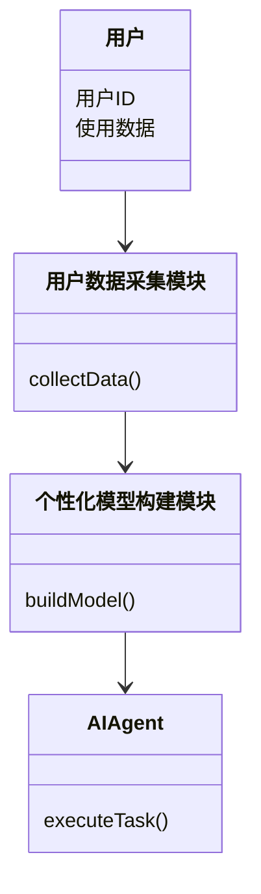
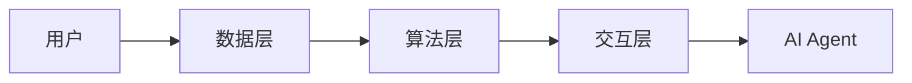

                 


# 个性化定制：打造独特风格的AI Agent

---

## 关键词

- 个性化定制
- AI Agent
- 人工智能
- 机器学习
- 自然语言处理

---

## 摘要

本文将深入探讨如何打造具有独特风格的AI Agent。通过分析个性化定制的核心概念、AI Agent的基本原理、算法实现及系统架构，结合实际案例，展示如何通过技术手段实现AI Agent的个性化定制。文章从背景介绍、核心概念、算法原理、系统分析与架构设计、项目实战等多方面展开，最终为读者提供一套完整的个性化定制AI Agent的实现方案。

---

## 第一部分：个性化定制与AI Agent的背景介绍

### 第1章：个性化定制与AI Agent概述

#### 1.1 个性化定制的背景与意义

个性化定制是现代技术发展的重要趋势之一。随着人工智能技术的不断进步，用户对智能化、个性化服务的需求日益增长。AI Agent作为一种能够自主执行任务的智能体，其核心目标是为用户提供高效、个性化的服务。

个性化定制在AI Agent中的意义在于，通过分析用户的个性化需求，优化AI Agent的行为模式，使其能够更好地适应用户的使用习惯和偏好。这种定制化的能力不仅提升了用户体验，还能够提高AI Agent的效率和准确性。

个性化定制的背景可以追溯到以下几个方面：
1. **技术进步**：人工智能技术的快速发展，使得个性化定制成为可能。
2. **用户需求多样化**：不同用户有不同的需求和偏好，单一化的服务无法满足所有用户。
3. **市场竞争**：个性化定制成为企业差异化竞争的重要手段。

个性化定制的边界与外延：
- **边界**：个性化定制应基于用户授权，尊重用户隐私。
- **外延**：个性化定制可以涵盖功能、界面、交互等多个方面。

个性化定制的结构：
个性化定制的实现需要结合用户数据、算法模型和系统架构三者的协同工作。

---

### 第2章：AI Agent的基本概念与特点

AI Agent是一种能够感知环境、自主决策并执行任务的智能体。它具有以下几个核心特点：
1. **智能性**：能够通过学习和推理完成复杂的任务。
2. **自主性**：能够在没有外部干预的情况下独立运行。
3. **交互性**：能够与用户或其他系统进行交互。
4. **适应性**：能够根据环境变化调整自身行为。

AI Agent的核心要素包括：
1. **感知模块**：用于感知环境信息。
2. **推理模块**：用于处理和分析信息。
3. **决策模块**：用于做出决策并执行任务。

---

### 第3章：个性化定制与AI Agent的发展趋势

个性化定制与AI Agent的结合是当前技术发展的趋势之一。随着深度学习和自然语言处理技术的不断进步，AI Agent的个性化定制能力将更加智能化和精准化。

个性化定制的市场需求主要体现在以下几个方面：
1. **用户体验优化**：通过个性化定制，提升用户的使用体验。
2. **效率提升**：通过个性化定制，提高AI Agent的工作效率。
3. **市场竞争**：个性化定制成为企业差异化竞争的重要手段。

AI Agent技术的演进主要体现在以下几个方面：
1. **算法优化**：通过改进算法模型，提升AI Agent的智能性。
2. **数据处理能力提升**：通过增强数据处理能力，提高AI Agent的准确性。
3. **交互方式多样化**：通过引入新的交互方式，如语音和视觉交互，提升用户体验。

---

## 第二部分：个性化定制与AI Agent的核心概念与联系

### 第4章：个性化定制的核心概念与原理

#### 4.1 个性化定制的核心概念

个性化定制的核心概念包括以下几个方面：
1. **用户需求分析**：通过分析用户的使用习惯和偏好，确定个性化定制的方向。
2. **数据收集与处理**：收集用户的使用数据，并进行分析和处理。
3. **个性化模型构建**：基于用户数据，构建个性化的算法模型。

#### 4.2 AI Agent的核心概念与属性

AI Agent的核心概念包括以下几个方面：
1. **感知能力**：AI Agent能够感知环境信息。
2. **推理能力**：AI Agent能够对感知到的信息进行推理和分析。
3. **决策能力**：AI Agent能够基于推理结果做出决策。

#### 4.3 个性化定制与AI Agent的关系

个性化定制与AI Agent的关系是相互依存的：
- 个性化定制为AI Agent提供个性化的能力。
- AI Agent为个性化定制提供技术支持。

---

### 第5章：个性化定制与AI Agent的核心要素对比

#### 5.1 核心要素对比分析

个性化定制与AI Agent的核心要素对比如下：

| **核心要素** | **个性化定制** | **AI Agent** |
|--------------|-----------------|--------------|
| 目标          | 满足用户的个性化需求 | 执行任务，提供服务 |
| 方法          | 数据分析、算法模型 | 感知、推理、决策 |
| 输出          | 个性化服务       | 任务执行结果   |

#### 5.2 个性化定制与AI Agent的属性特征对比

个性化定制与AI Agent的属性特征对比如下：

| **属性特征** | **个性化定制** | **AI Agent** |
|--------------|-----------------|--------------|
| 智能性        | 基于算法模型     | 自主决策     |
| 交互性        | 用户驱动         | 自动交互     |
| 适应性        | 根据用户需求调整 | 根据环境调整 |

---

## 第三部分：个性化定制AI Agent的算法原理

### 第6章：个性化推荐算法

个性化推荐是实现AI Agent个性化定制的重要手段之一。常用的个性化推荐算法包括协同过滤和基于内容的推荐。

#### 6.1 协同过滤算法

协同过滤是一种基于用户行为数据的推荐算法。其实现原理如下：

1. **数据收集**：收集用户的使用数据，包括用户的偏好、行为等。
2. **相似性计算**：计算用户之间的相似性，通常使用余弦相似度。
3. **推荐生成**：基于相似用户的偏好，生成推荐结果。

协同过滤的数学模型如下：
$$ \text{相似度}(u, v) = \frac{\sum_{i=1}^{n} w_{u,i} w_{v,i}}{\sqrt{\sum_{i=1}^{n} w_{u,i}^2} \sqrt{\sum_{i=1}^{n} w_{v,i}^2}} } $$

---

### 第7章：生成式模型

生成式模型是实现个性化定制的另一种重要手段。常用的生成式模型包括基于Transformer的生成模型。

#### 7.1 Transformer架构

Transformer架构是一种基于自注意力机制的生成模型。其核心思想是通过计算输入序列中每个位置的重要性，生成输出序列。

Transformer的自注意力机制公式如下：
$$ \text{Attention}(Q, K, V) = \text{softmax}\left(\frac{QK^T}{\sqrt{d_k}}\right)V $$

---

## 第四部分：系统分析与架构设计

### 第8章：系统功能设计

个性化定制AI Agent的系统功能设计包括以下几个方面：
1. **用户数据采集**：采集用户的使用数据。
2. **个性化模型构建**：基于用户数据，构建个性化模型。
3. **AI Agent执行**：基于个性化模型，执行任务。

系统功能设计的类图如下：



---

### 第9章：系统架构设计

个性化定制AI Agent的系统架构设计包括以下几个方面：
1. **数据层**：存储用户数据和模型参数。
2. **算法层**：实现个性化推荐算法和生成式模型。
3. **交互层**：实现用户与AI Agent的交互。

系统架构设计的架构图如下：



---

## 第五部分：项目实战

### 第10章：环境安装与核心代码实现

#### 10.1 环境安装

个性化定制AI Agent的环境安装如下：
1. 安装Python和相关库：
   ```bash
   pip install numpy pandas scikit-learn transformers
   ```

#### 10.2 核心代码实现

个性化定制AI Agent的核心代码实现如下：

```python
import numpy as np
from sklearn.metrics.pairwise import cosine_similarity

def collaborative_filtering(user_matrix):
    similarity = cosine_similarity(user_matrix)
    return similarity

# 示例用户矩阵
user_matrix = np.array([[1, 0, 1], [0, 1, 1], [1, 1, 0]])
# 计算协同过滤相似度
similarity = collaborative_filtering(user_matrix)
print(similarity)
```

---

### 第11章：案例分析与项目小结

#### 11.1 案例分析

通过上述代码实现，我们可以看到协同过滤算法在个性化定制中的应用。通过计算用户之间的相似度，我们可以为每个用户推荐个性化的内容。

#### 11.2 项目小结

个性化定制AI Agent的实现需要结合用户数据、算法模型和系统架构。通过协同过滤算法和生成式模型，我们可以实现高效的个性化推荐和生成。

---

## 第六部分：总结与展望

### 第12章：总结与展望

个性化定制是打造独特风格AI Agent的重要手段。通过本文的探讨，我们了解了个性化定制的核心概念、AI Agent的基本原理、算法实现及系统架构。未来，个性化定制AI Agent将更加智能化和精准化，为用户带来更优质的服务。

---

## 作者：AI天才研究院/AI Genius Institute & 禅与计算机程序设计艺术 /Zen And The Art of Computer Programming

