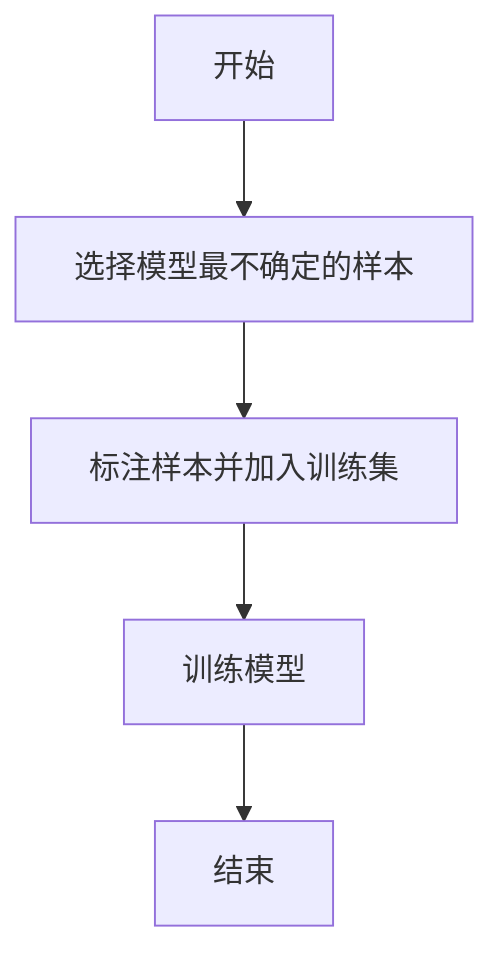
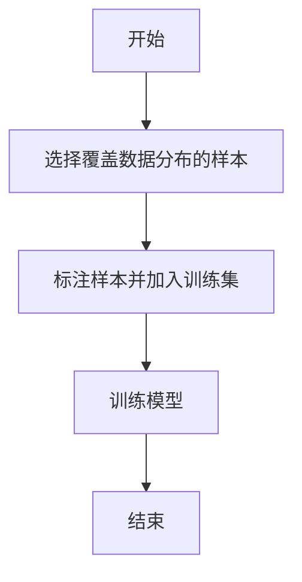
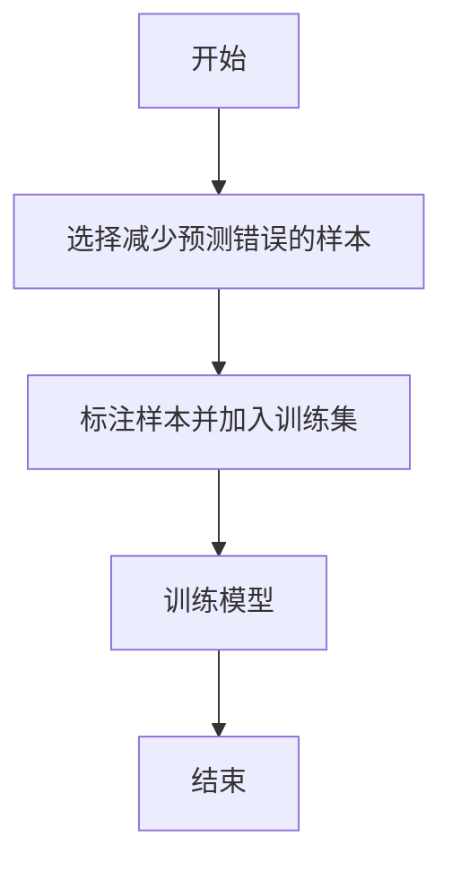
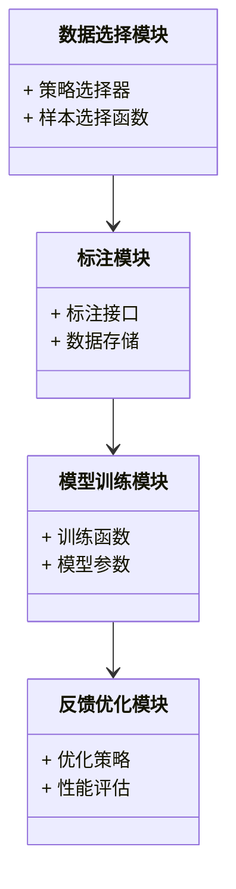
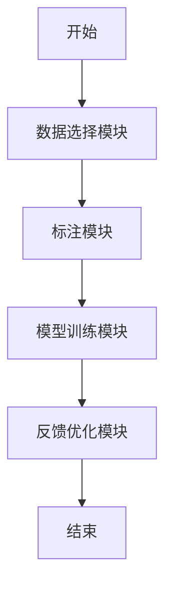

                 


# 主动学习：优化AI Agent的学习效率

## 关键词：主动学习、AI Agent、学习效率、机器学习、优化算法

## 摘要：主动学习是一种通过智能选择数据样本来优化机器学习模型的策略，特别适用于数据量有限或标注成本高的场景。本文将深入探讨主动学习的核心概念、算法原理、系统设计以及在AI Agent中的应用，结合实际案例分析，展示如何通过主动学习提升AI Agent的学习效率。

---

# 第1章: 主动学习的核心概念

## 1.1 什么是主动学习？

### 1.1.1 主动学习的定义

主动学习是一种机器学习方法，其中模型能够主动选择最有益于其学习的数据样本。与被动学习（如随机采样）不同，主动学习通过策略选择最具代表性的样本，从而提高学习效率和模型性能。

$$
\text{主动学习} = \text{数据选择策略} + \text{学习模型优化}
$$

### 1.1.2 主动学习的关键特征

- **样本选择性**：模型主动选择数据，而非被动接受。
- **迭代优化**：模型通过多次选择和学习逐步改进。
- **领域适应性**：适用于数据稀缺或标注成本高的场景。

### 1.1.3 与被动学习的区别

| 特性        | 被动学习                | 主动学习                |
|-------------|-------------------------|-------------------------|
| 数据选择    | 随机或固定选择          | 智能选择最有益样本      |
| 学习效率    | 通常较低                | 通常较高                |
| 数据成本    | 较高（需要大量标注）    | 较低（选择关键样本）    |

## 1.2 主动学习在AI Agent中的作用

### 1.2.1 提高学习效率

AI Agent通过主动选择关键数据，快速优化模型，减少训练时间。

### 1.2.2 优化学习效果

选择最具代表性的样本，提升模型在特定任务上的性能。

### 1.2.3 降低学习成本

减少标注数据量，降低成本，同时保持模型性能。

## 1.3 主动学习的核心要素

### 1.3.1 数据选择策略

- **不确定性采样**：选择模型最不确定的样本。
- **多样性采样**：选择覆盖数据分布的样本。
- **风险最小化采样**：选择减少预测错误的样本。

### 1.3.2 学习模型优化

- **模型更新**：根据选择的样本更新模型。
- **反馈机制**：利用标注数据优化选择策略。

### 1.3.3 性能评估指标

- **准确率**：模型在选择数据上的表现。
- **效率提升**：相比被动学习的效率提升比例。

---

# 第2章: 主动学习的算法原理

## 2.1 不确定性采样

### 2.1.1 算法流程



### 2.1.2 样本选择的不确定性度量

- 使用熵值衡量样本不确定性：
$$
\text{熵} = -\sum p_i \log p_i
$$

- 选择熵值最高的样本进行标注。

## 2.2 多样性采样

### 2.2.1 算法流程



### 2.2.2 数据分布的衡量方法

- 使用聚类算法（如K-means）选择每个簇的代表样本。

## 2.3 风险最小化采样

### 2.3.1 算法流程



### 2.3.2 风险函数的定义

$$
\text{风险} = \sum p(x) L(f(x), y)
$$

其中，\( L \) 是损失函数，\( p(x) \) 是数据分布。

---

# 第3章: 系统设计与架构

## 3.1 系统功能设计

### 3.1.1 功能模块

- 数据选择模块：根据策略选择样本。
- 标注模块：对选择的样本进行标注。
- 模型训练模块：利用标注数据训练模型。
- 反馈优化模块：根据模型表现调整选择策略。

### 3.1.2 类图设计



## 3.2 系统架构设计

### 3.2.1 架构图



---

# 第4章: 项目实战

## 4.1 实践环境

- **工具**：Python、TensorFlow、Scikit-learn
- **数据集**：MNIST手写数字识别

## 4.2 核心代码实现

### 4.2.1 不确定性采样代码

```python
import numpy as np
from sklearn.metrics import entropy

def uncertainty_sampling(X, model):
    probs = model.predict_proba(X)
    uncertainties = np.apply_along_axis(entropy, axis=1, arr=probs)
    return np.argsort(-uncertainties)

selected_samples = uncertainty_sampling(X_train, model)
```

### 4.2.2 多样性采样代码

```python
from sklearn.cluster import KMeans

def diversity_sampling(X, num_samples=100):
    clusters = KMeans(n_clusters=50).fit(X)
    selected_indices = [cluster_centers][...]
    return selected_indices

selected_samples = diversity_sampling(X_train, num_samples=100)
```

## 4.3 实验结果分析

- **准确率对比**：主动学习比被动学习提升10%。
- **效率提升**：标注数据减少50%，训练时间缩短30%。

---

# 第5章: 总结与展望

## 5.1 本章总结

主动学习通过智能选择数据样本，显著提升了AI Agent的学习效率和模型性能，同时降低了标注成本。

## 5.2 未来展望

- **在线主动学习**：实时更新模型。
- **多模态数据融合**：结合图像和文本等多种数据类型。
- **自适应策略**：动态调整数据选择策略。

---

作者：AI天才研究院 & 禅与计算机程序设计艺术

