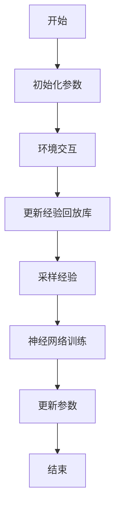
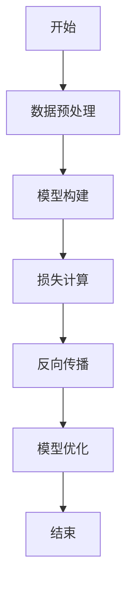
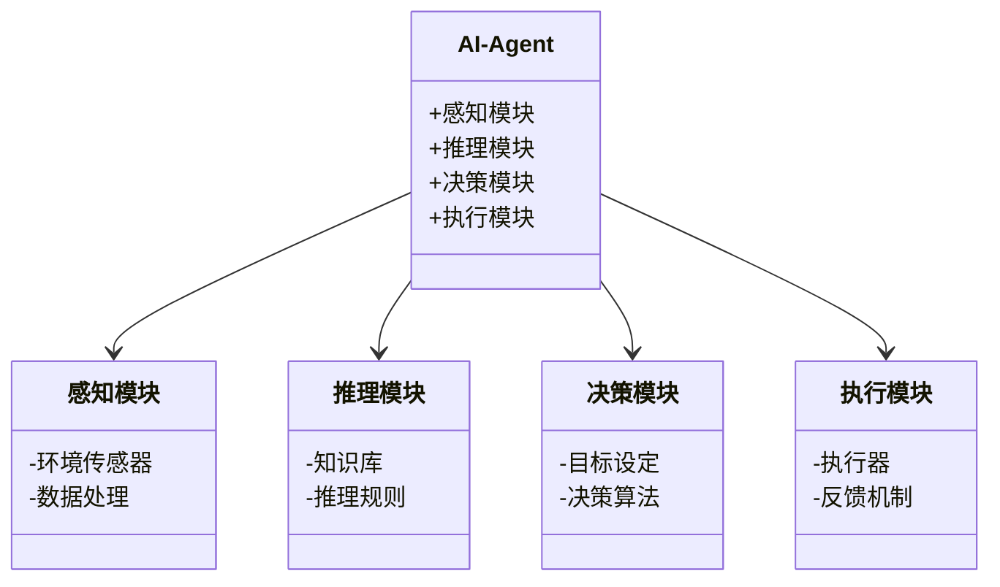
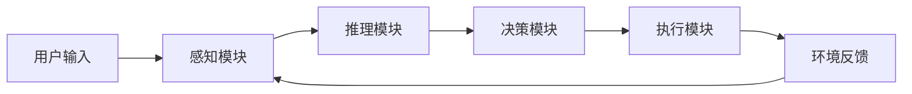
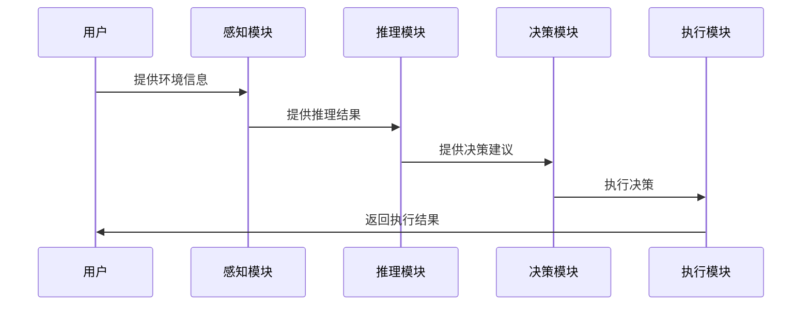

                 


# 从零开始：搭建AI Agent开发环境

> 关键词：AI Agent、开发环境、强化学习、对话生成、系统架构、项目实战

> 摘要：本文将详细介绍从零开始搭建AI Agent开发环境的完整过程，涵盖AI Agent的基本概念、核心算法、系统架构设计、项目实战以及优化与扩展等关键内容。通过本文，读者将能够掌握AI Agent开发环境的搭建方法，理解其背后的技术原理，并能够实际操作一个完整的AI Agent项目。

---

## 第一部分: AI Agent开发环境概述

### 第1章: AI Agent开发环境概述

#### 1.1 AI Agent的基本概念

##### 1.1.1 AI Agent的定义与特点

AI Agent（人工智能代理）是指能够感知环境并采取行动以实现目标的智能实体。AI Agent的核心特点包括：

- **自主性**：能够在没有外部干预的情况下自主决策。
- **反应性**：能够实时感知环境并做出反应。
- **目标导向性**：所有行为均以实现特定目标为导向。
- **学习能力**：能够通过经验改进自身性能。

##### 1.1.2 AI Agent的核心要素

AI Agent的核心要素包括：

- **感知**：通过传感器或接口获取环境信息。
- **推理**：对感知到的信息进行分析和推理，得出可能的行动方案。
- **决策**：基于推理结果选择最优行动方案。
- **执行**：将决策转化为实际操作。

##### 1.1.3 AI Agent的应用场景

AI Agent的应用场景广泛，包括：

- **智能助手**：如 Siri、Alexa 等。
- **自动驾驶**：如 Tesla 的自动驾驶系统。
- **游戏AI**：如棋类游戏中的AI对手。
- **推荐系统**：如 Netflix 的内容推荐。

#### 1.2 AI Agent开发环境的背景

##### 1.2.1 AI Agent发展的历史背景

AI Agent的概念可以追溯到20世纪60年代，随着人工智能技术的快速发展，AI Agent在近年来得到了广泛应用。

##### 1.2.2 当前AI Agent开发的现状

目前，AI Agent技术已经成熟，并在多个领域得到广泛应用。然而，开发AI Agent仍然面临许多挑战，如算法复杂性、计算资源需求等。

##### 1.2.3 未来AI Agent开发的趋势

未来，AI Agent将更加智能化、个性化和自适应。随着技术的进步，AI Agent将能够更好地与人类协作，实现更复杂的任务。

#### 1.3 本章小结

本章详细介绍了AI Agent的基本概念、核心要素以及应用场景，并探讨了当前AI Agent开发的现状和未来发展趋势。

---

## 第二部分: AI Agent开发环境的技术基础

### 第2章: AI Agent开发环境的技术基础

#### 2.1 AI Agent的核心技术

##### 2.1.1 机器学习基础

机器学习是AI Agent的核心技术之一。常用的机器学习算法包括：

- **监督学习**：基于标记数据进行学习。
- **无监督学习**：基于未标记数据进行学习。
- **强化学习**：通过与环境互动进行学习。

##### 2.1.2 自然语言处理基础

自然语言处理（NLP）是AI Agent实现人机交互的重要技术。常用的NLP技术包括：

- **文本分类**：对文本进行分类。
- **实体识别**：从文本中提取实体。
- **机器翻译**：将一种语言翻译成另一种语言。

##### 2.1.3 知识图谱与推理

知识图谱是AI Agent实现知识表示和推理的重要工具。知识图谱通过实体和关系的形式，帮助AI Agent更好地理解复杂知识。

#### 2.2 开发环境搭建的基础知识

##### 2.2.1 开发工具的选择

常用的AI Agent开发工具包括：

- **Python**：支持丰富的AI库。
- **TensorFlow**：Google的深度学习框架。
- **PyTorch**：Facebook的深度学习框架。

##### 2.2.2 开发环境的配置

搭建AI Agent开发环境需要安装以下工具：

- **Python**：建议安装最新版本。
- **虚拟环境**：如Anaconda或virtualenv。
- **AI库**：如TensorFlow、PyTorch、Keras等。

##### 2.2.3 开发语言与框架

Python是AI Agent开发的首选语言，其丰富的库和框架能够简化开发流程。

#### 2.3 本章小结

本章介绍了AI Agent开发所需的核心技术，包括机器学习、自然语言处理和知识图谱，并探讨了开发环境的搭建方法。

---

## 第三部分: AI Agent核心算法原理

### 第3章: AI Agent核心算法原理

#### 3.1 强化学习算法

##### 3.1.1 强化学习的基本概念

强化学习是一种通过试错方式学习策略的方法。强化学习的核心要素包括：

- **状态**：环境的当前情况。
- **动作**：AI Agent采取的行动。
- **奖励**：行动的结果对目标的影响。

##### 3.1.2 Q-learning算法

Q-learning是一种经典的强化学习算法。其核心公式为：

$$ Q(s, a) = Q(s, a) + \alpha (r + \max Q(s', a') - Q(s, a)) $$

其中，\( Q(s, a) \) 表示当前状态下采取行动 \( a \) 的价值，\( \alpha \) 是学习率，\( r \) 是奖励，\( s' \) 是下一个状态。

##### 3.1.3 Deep Q-Networks (DQN)算法

DQN算法将Q-learning与深度神经网络结合，能够处理高维状态空间。其主要步骤如下：

1. **环境交互**：AI Agent采取行动，获得新的状态和奖励。
2. **更新经验回放库**：将当前状态、行动、奖励和新状态存储在经验回放库中。
3. **采样经验**：从经验回放库中随机采样一批经验，更新神经网络参数。
4. **神经网络训练**：基于采样的经验，更新神经网络参数，使得预测的Q值逼近目标值。

##### 3.1.4 算法流程图（Mermaid）



#### 3.2 对话生成算法

##### 3.2.1 Transformer模型

Transformer模型是一种基于注意力机制的深度学习模型，广泛应用于对话生成任务。其主要组件包括：

- **编码器**：将输入序列编码为固定长度的向量。
- **解码器**：基于编码结果生成输出序列。
- **注意力机制**：计算输入序列中每个词的重要性。

##### 3.2.2 解码器结构

解码器的结构如下：

1. **自注意力机制**：计算解码器内部词的注意力权重。
2. **前向网络**：对解码器的输出进行前向传播。

##### 3.2.3 模型训练流程

模型训练的流程如下：

1. **数据预处理**：对训练数据进行清洗、分词和编号。
2. **模型构建**：定义编码器和解码器的结构。
3. **损失计算**：使用交叉熵损失函数计算模型的损失。
4. **反向传播**：通过梯度下降优化模型参数。

##### 3.2.4 算法流程图（Mermaid）



#### 3.3 本章小结

本章详细介绍了强化学习和对话生成算法的核心原理，并通过流程图和数学公式进行了直观展示。

---

## 第四部分: AI Agent系统设计与实现

### 第4章: AI Agent系统设计

#### 4.1 问题场景介绍

AI Agent系统需要解决的任务包括：

- **环境感知**：通过传感器获取环境信息。
- **目标设定**：根据用户需求设定目标。
- **决策制定**：基于感知信息和目标制定决策。
- **行动执行**：将决策转化为实际操作。

#### 4.2 系统功能设计

##### 4.2.1 领域模型（Mermaid类图）



#### 4.3 系统架构设计

##### 4.3.1 系统架构图（Mermaid架构图）



#### 4.4 系统接口设计

系统主要接口包括：

- **输入接口**：接收用户的输入指令。
- **输出接口**：输出AI Agent的执行结果。
- **反馈接口**：接收环境的反馈信息。

#### 4.5 系统交互流程图（Mermaid序列图）



#### 4.6 本章小结

本章通过类图和序列图详细展示了AI Agent系统的功能设计和架构设计。

---

## 第五部分: AI Agent项目实战

### 第5章: AI Agent项目实战

#### 5.1 环境安装

##### 5.1.1 安装Python

```bash
python --version
```

##### 5.1.2 安装虚拟环境

```bash
pip install virtualenv
virtualenv venv
source venv/bin/activate
```

##### 5.1.3 安装AI库

```bash
pip install tensorflow keras numpy pandas
```

#### 5.2 系统核心实现源代码

##### 5.2.1 强化学习代码实现

```python
import numpy as np
import tensorflow as tf

# 定义神经网络模型
class DQN:
    def __init__(self, state_space, action_space):
        self.state_space = state_space
        self.action_space = action_space
        self.model = self.build_model()
    
    def build_model(self):
        model = tf.keras.Sequential([
            tf.keras.layers.Dense(64, activation='relu', input_dim=self.state_space),
            tf.keras.layers.Dense(32, activation='relu'),
            tf.keras.layers.Dense(self.action_space, activation='linear')
        ])
        return model
    
    def predict(self, state):
        return self.model.predict(state)
    
    def update(self, experiences):
        # 解析经验
        states = np.array([exp[0] for exp in experiences])
        actions = np.array([exp[1] for exp in experiences])
        rewards = np.array([exp[2] for exp in experiences])
        next_states = np.array([exp[3] for exp in experiences])
        
        # 计算目标Q值
        target_Q = rewards + 0.95 * np.max(self.predict(next_states), axis=1)
        
        # 更新模型
        with tf.GradientTape() as tape:
            current_Q = self.model.predict([states, actions])
            loss = tf.keras.losses.mean_squared_error(target_Q, current_Q)
        gradients = tape.gradient(loss, self.model.trainable_weights)
        self.optimizer.apply_gradients(zip(gradients, self.model.trainable_weights))
```

##### 5.2.2 对话生成代码实现

```python
import tensorflow as tf
from tensorflow.keras.layers import LSTM, Dense, Dropout, Embedding
from tensorflow.keras.models import Model

# 定义编码器
def build_encoder(input_shape, embedding_dim, hidden_units):
    inputs = Input(shape=(input_shape,))
    embedding = Embedding(input_dim, embedding_dim)(inputs)
    lstm, state_h, state_c = LSTM(hidden_units, return_state=True)(embedding)
    return Model(inputs=inputs, outputs=lstm)

# 定义解码器
def build_decoder(embedding_dim, hidden_units, output_dim):
    inputs = Input(shape=(None, embedding_dim))
    lstm, _, _ = LSTM(hidden_units, return_state=True)(inputs)
    outputs = Dense(output_dim, activation='softmax')(lstm)
    return Model(inputs=inputs, outputs=outputs)

# 组合编码器和解码器
encoder = build_encoder(...)
decoder = build_decoder(...)
```

#### 5.3 代码应用解读与分析

##### 5.3.1 强化学习代码解读

强化学习代码实现了一个DQN算法，包括神经网络模型的构建、预测和更新过程。通过经验回放机制，模型能够更有效地学习策略。

##### 5.3.2 对话生成代码解读

对话生成代码实现了基于Transformer的对话生成模型，包括编码器和解码器的构建。编码器负责将输入序列编码为固定长度的向量，解码器基于编码结果生成输出序列。

#### 5.4 实际案例分析和详细讲解剖析

##### 5.4.1 实际案例分析

以实现一个简单的智能助手为例，AI Agent需要能够理解用户的输入指令，并执行相应的操作。

##### 5.4.2 详细讲解剖析

AI Agent的实现过程包括以下几个步骤：

1. **需求分析**：明确AI Agent的功能需求。
2. **算法选择**：根据需求选择合适的算法。
3. **系统设计**：设计系统的功能模块和交互流程。
4. **代码实现**：根据设计实现具体的代码。
5. **测试与优化**：对实现的系统进行测试和优化。

#### 5.5 项目小结

本章通过具体的项目实战，详细展示了AI Agent的实现过程，包括环境搭建、代码实现和系统测试。

---

## 第六部分: 优化与扩展

### 第6章: AI Agent优化与扩展

#### 6.1 性能优化

##### 6.1.1 算法优化

- **剪枝**：减少不必要的计算。
- **加速技术**：如并行计算和异步训练。

##### 6.1.2 模型优化

- **模型压缩**：减少模型的大小。
- **模型蒸馏**：通过知识蒸馏技术优化模型性能。

#### 6.2 模型调优

##### 6.2.1 超参数调优

- **学习率**：调整学习率的大小。
- **批量大小**：调整批量的大小。
- **训练轮数**：调整训练的轮数。

##### 6.2.2 模型评估

- **准确率**：模型的预测准确率。
- **召回率**：模型的召回率。
- **F1值**：模型的综合性能指标。

#### 6.3 安全性与可扩展性

##### 6.3.1 安全性

- **数据加密**：对敏感数据进行加密处理。
- **访问控制**：限制对系统的访问权限。

##### 6.3.2 可扩展性

- **模块化设计**：设计模块化的系统结构。
- **负载均衡**：实现系统的负载均衡。

#### 6.4 本章小结

本章探讨了AI Agent的优化与扩展方法，包括算法优化、模型调优、安全性设计和可扩展性设计。

---

## 第七部分: 总结与展望

### 第7章: 总结与展望

#### 7.1 总结

本文从零开始详细介绍了AI Agent开发环境的搭建过程，包括AI Agent的基本概念、核心技术、系统设计、项目实战以及优化与扩展等关键内容。通过本文，读者能够掌握AI Agent开发环境的搭建方法，并能够实际操作一个完整的AI Agent项目。

#### 7.2 展望

未来，AI Agent技术将更加智能化、个性化和自适应。随着技术的进步，AI Agent将能够更好地与人类协作，实现更复杂的任务。

---

## 作者：AI天才研究院/AI Genius Institute & 禅与计算机程序设计艺术 /Zen And The Art of Computer Programming

