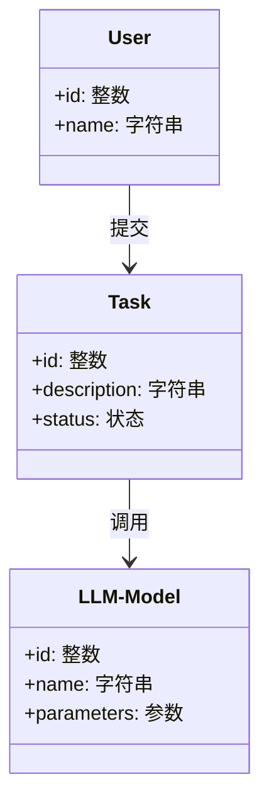
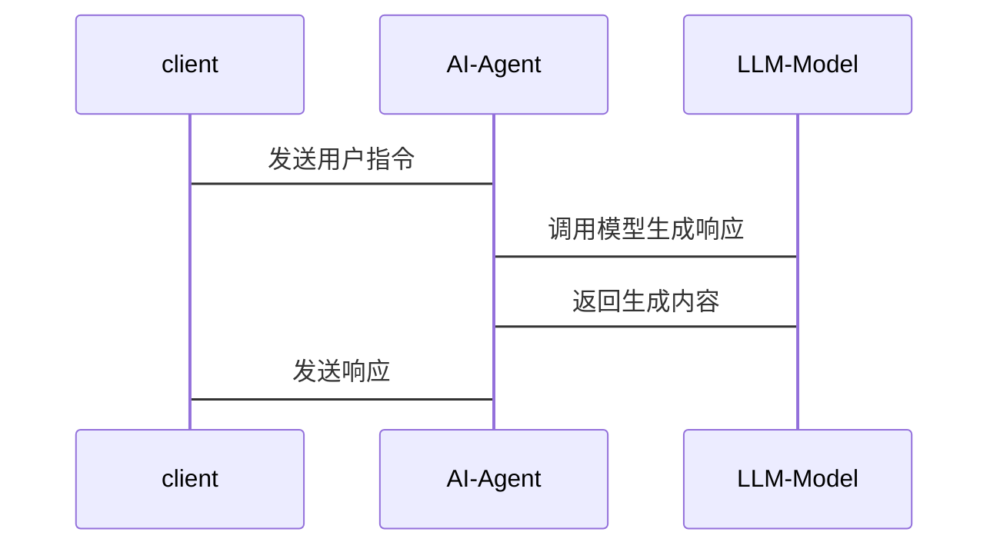

                 


# 从零构建 AI Agent：LLM 大模型应用开发实践

---

## 关键词：AI Agent, LLM 大模型, 人工智能, 应用开发, 系统架构, 实践指南

---

## 摘要：  
本文将从零开始，系统地介绍如何构建基于 LLM 大模型的 AI Agent。通过分析 AI Agent 的核心概念、算法原理、系统架构以及实际项目案例，本文旨在为开发者提供一份完整的实践指南。从背景介绍到代码实现，从系统设计到优化建议，本文将一步步带领读者构建属于自己的 AI Agent。

---

# 第一部分: 从零构建 AI Agent 的背景与基础

## 第1章: AI Agent 与 LLM 大模型概述

### 1.1 AI Agent 的定义与核心概念
#### 1.1.1 AI Agent 的定义  
AI Agent（人工智能代理）是指能够感知环境、自主决策并执行任务的智能实体。它能够通过与用户的交互或环境的反馈，动态调整行为以完成特定目标。  

#### 1.1.2 LLM 大模型与 AI Agent 的关系  
LLM（Large Language Model，大语言模型）是 AI Agent 的核心驱动力。LLM 通过自然语言处理技术，使 AI Agent 能够理解和生成人类语言，从而实现更复杂的对话和任务处理。  

#### 1.1.3 AI Agent 的核心功能与特点  
- **核心功能**：信息检索、对话生成、任务规划、决策推理。  
- **特点**：智能性、适应性、可解释性、实时性。  

---

### 1.2 LLM 大模型的基本原理  
#### 1.2.1 什么是 LLM  
LLM 是一种基于深度学习的自然语言处理模型，通过大量的数据训练，能够理解并生成人类语言。  

#### 1.2.2 LLM 的主要技术特点  
- **Transformer 架构**：基于自注意力机制，能够捕捉长距离依赖关系。  
- **大规模数据训练**：通过海量数据训练，提升模型的泛化能力。  
- **多任务学习**：能够同时处理多种任务（如对话生成、文本摘要）。  

#### 1.2.3 LLM 与 AI Agent 的结合  
AI Agent 通过调用 LLM 的 API，实现自然语言交互、知识检索和任务规划等功能。  

---

### 1.3 AI Agent 的应用场景  
#### 1.3.1 智能对话系统  
AI Agent 可以通过 LLM 实现智能对话，例如客服机器人、虚拟助手。  

#### 1.3.2 自动化任务处理  
AI Agent 可以根据用户的指令，自动执行任务，例如日程管理、信息查询。  

#### 1.3.3 企业级应用中的 AI Agent  
在企业中，AI Agent 可以用于内部流程自动化、客户支持、数据分析等场景。  

---

### 1.4 本章小结  
本章介绍了 AI Agent 的定义、核心概念以及 LLM 大模型的基本原理，为后续内容奠定了基础。

---

# 第二部分: AI Agent 的核心概念与联系

## 第2章: AI Agent 的核心概念与联系

### 2.1 AI Agent 的核心概念
#### 2.1.1 AI Agent 的组成要素  
- **感知层**：负责接收输入并理解环境。  
- **决策层**：负责生成行动策略。  
- **执行层**：负责执行具体任务。  

#### 2.1.2 AI Agent 的行为模式  
- **反应式行为**：基于当前输入做出即时反应。  
- **认知式行为**：结合知识库和上下文进行推理。  

#### 2.1.3 AI Agent 的决策机制  
- **规则驱动**：基于预设规则做出决策。  
- **数据驱动**：基于数据和模型进行预测。  

---

### 2.2 LLM 大模型的核心原理
#### 2.2.1 从输入到输出的处理流程  
1. 输入文本经过分词处理。  
2. 生成词向量表示。  
3. 通过自注意力机制生成上下文表示。  
4. 最后通过全连接层生成输出。  

#### 2.2.2 注意力机制的数学模型  
自注意力机制的公式如下：  
$$ \text{Attention}(Q, K, V) = \text{softmax}\left(\frac{QK^T}{\sqrt{d_k}}\right)V $$  

其中，$Q$ 是查询向量，$K$ 是键向量，$V$ 是值向量，$d_k$ 是向量维度。  

#### 2.2.3 梯度下降与损失函数  
常用的损失函数是交叉熵损失：  
$$ \mathcal{L} = -\sum_{i=1}^{n} y_i \log(p_i) $$  
其中，$y_i$ 是真实标签，$p_i$ 是预测概率。  

---

### 2.3 AI Agent 与 LLM 的关系
#### 2.3.1 AI Agent 的任务分解  
- **输入处理**：解析用户的输入并生成任务描述。  
- **LLM 调用**：将任务描述传递给 LLM，生成输出结果。  
- **结果处理**：对输出结果进行解析并反馈给用户。  

#### 2.3.2 LLM 在 AI Agent 中的作用  
LLM 作为 AI Agent 的“大脑”，负责理解和生成语言，是其实现智能交互的核心。  

#### 2.3.3 AI Agent 的系统架构  
AI Agent 的系统架构包括前端交互模块、LLM 调用模块和后端处理模块。  

---

### 2.4 核心概念对比与 ER 实体关系图
#### 2.4.1 核心概念属性特征对比表  

| 概念     | 输入 | 输出 | 内部处理 |  
|----------|------|------|----------|  
| AI Agent | 用户指令 | 执行结果 | LLM 调用、任务规划 |  

#### 2.4.2 AI Agent 的 ER 实体关系图  
```mermaid
er
classDiagram
    class AI-Agent {
        +id: 整数
        +name: 字符串
        +LLM-Model: LLM-Model
        +task-list: 任务列表
    }
    class LLM-Model {
        +id: 整数
        +name: 字符串
        +parameters: 参数
    }
    AI-Agent --> LLM-Model: 使用
```

---

## 第3章: AI Agent 的系统分析与架构设计

### 3.1 问题场景介绍  
假设我们需要构建一个智能对话系统，用户可以通过文字或语音与 AI Agent 交互，完成信息查询、任务安排等功能。  

### 3.2 项目介绍  
项目目标是开发一个基于 LLM 的 AI Agent，能够支持多种交互方式，并具备任务执行能力。  

### 3.3 系统功能设计  
#### 3.3.1 领域模型设计  


### 3.4 系统架构设计  
#### 3.4.1 系统架构图  
```mermaid
archi
    client -> AI-Agent: 发送请求
    AI-Agent -> LLM-Model: 调用模型
    LLM-Model -> AI-Agent: 返回结果
    AI-Agent -> client: 发送反馈
```

### 3.5 系统接口设计  
系统接口包括：  
- 用户输入接口（文本/语音）  
- LLM 调用接口（API）  
- 任务执行接口（数据库/外部服务）  

### 3.6 系统交互设计  


---

## 第4章: AI Agent 的算法实现与优化

### 4.1 LLM 的训练过程  
#### 4.1.1 Transformer 模型的训练流程  
1. 输入文本分词。  
2. 生成词向量。  
3. 计算自注意力权重。  
4. 前向传播生成输出。  
5. 反向传播优化参数。  

#### 4.1.2 模型优化技巧  
- **学习率调整**：使用学习率衰减策略。  
- **批次处理**：通过批量处理提升训练效率。  

### 4.2 AI Agent 的优化策略  
#### 4.2.1 知识库的构建与管理  
- **数据清洗**：去除重复、噪声数据。  
- **索引优化**：通过索引提升查询效率。  

#### 4.2.2 对话历史的管理  
- **上下文记忆**：记录对话历史，提升对话连贯性。  
- **情感分析**：通过情感分析优化对话体验。  

---

## 第5章: AI Agent 的项目实战

### 5.1 环境安装与配置  
#### 5.1.1 安装 Python 环境  
使用 Anaconda 或 virtualenv 创建虚拟环境。  

#### 5.1.2 安装依赖库  
安装必要的库：  
```bash
pip install numpy torch transformers
```

### 5.2 核心功能实现  
#### 5.2.1 LLM 的调用  
使用预训练的 LLM 模型，例如 GPT-2 或 ChatGPT。  

#### 5.2.2 对话历史的管理  
通过列表记录对话历史，并在生成回复时考虑历史内容。  

### 5.3 代码实现与解读  
#### 5.3.1 LLM 调用代码  
```python
import torch
from transformers import AutoTokenizer, AutoModelForCausalLM

tokenizer = AutoTokenizer.from_pretrained("gpt2")
model = AutoModelForCausalLM.from_pretrained("gpt2")

def generate_response(prompt):
    inputs = tokenizer.encode(prompt, return_tensors="pt")
    outputs = model.generate(inputs, max_length=50, do_sample=True)
    response = tokenizer.decode(outputs[0], skip_special_tokens=True)
    return response
```

#### 5.3.2 对话历史的管理  
```python
class ChatAgent:
    def __init__(self):
        self.history = []
    
    def add_to_history(self, message):
        self.history.append(message)
    
    def get_context(self):
        return " ".join(self.history)
```

### 5.4 实际案例分析  
通过实际案例分析，展示 AI Agent 在智能对话系统中的应用。  

### 5.5 项目小结  
总结项目实现的关键步骤和经验教训。

---

## 第6章: AI Agent 的最佳实践

### 6.1 小结  
总结本文的主要内容和关键点。  

### 6.2 注意事项  
- **数据安全**：确保用户数据的安全性。  
- **性能优化**：优化模型推理速度和资源消耗。  

### 6.3 拓展阅读  
推荐一些深入学习 AI Agent 和 LLM 的资料和书籍。

---

## 作者：AI天才研究院/AI Genius Institute & 禅与计算机程序设计艺术 /Zen And The Art of Computer Programming

