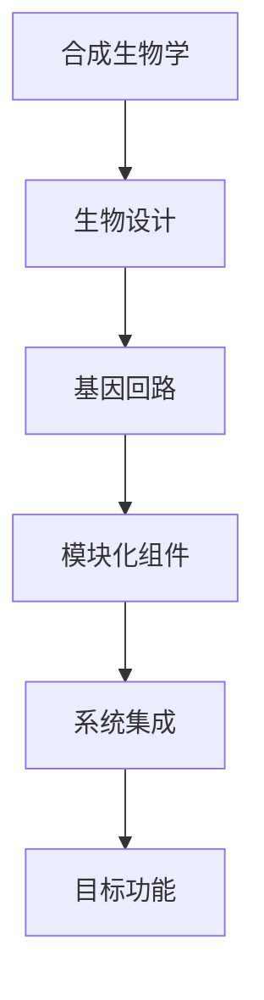
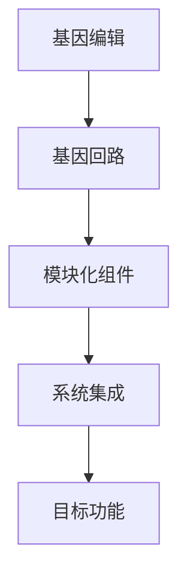

                 

# 价值投资中的合成生物学机遇

---

## 关键词：
- 合成生物学
- 价值投资
- 生物技术
- 投资机遇
- 系统设计

---

## 摘要：
合成生物学作为一门新兴的交叉学科，正在改变我们对生命科学的认知和应用方式。它通过工程化设计和改造生物系统，为医疗、农业、能源等领域带来了革命性的变革。与此同时，合成生物学也为价值投资提供了新的机遇和挑战。本文将深入探讨合成生物学的基本概念、技术进展及其在价值投资中的应用潜力，结合实际案例分析，为投资者提供科学的决策依据。

---

## 第一部分：合成生物学的基本概念

### 第1章：合成生物学的定义与核心要素

#### 1.1 合成生物学的定义与核心要素

合成生物学（Synthetic Biology）是一门结合了生物学、工程学和信息技术的新兴学科，旨在通过设计和构建新的生物元件、装置和系统，来实现特定的生物功能。其核心目标是将生物学从“研究生命”转变为“工程化生命”。

**核心要素：**
1. **生物设计**：通过计算机辅助设计，构建合成基因回路。
2. **工程化**：将生物系统模块化，使其具有可编程性。
3. **系统集成**：将多个生物模块整合成复杂的生物系统。

**对比传统生物学：**
- **研究对象**：传统生物学关注自然存在的生物系统；合成生物学关注人工设计的生物系统。
- **研究方法**：传统生物学以观察和描述为主；合成生物学以工程化和构建为主。

---

#### 1.2 合成生物学的技术进展

合成生物学的核心技术包括基因编辑、合成基因回路和生物模块化设计。以下是近年来的重要进展：

1. **基因编辑技术**：
   - CRISPR-Cas9技术的突破使基因编辑更加精准和高效。
   - 基因编辑工具箱的扩展（如CRISPR-Cas12、CRISPR-Cas13）进一步提升了合成生物学的构建能力。

2. **合成基因回路**：
   - 基因回路的设计与构建已成为合成生物学的核心技术。
   - 例如，通过设计逻辑门电路（如AND门、OR门）实现复杂的生物逻辑运算。

3. **生物模块化设计**：
   - 将生物系统分解为标准化的模块，如代谢模块、基因表达模块。
   - 模块化设计使得生物系统的构建更加灵活和高效。

---

#### 1.3 合成生物学的经济影响

合成生物学的应用领域广泛，涵盖了医疗、农业、能源、化工等多个领域。以下是其对经济的主要影响：

1. **医疗领域**：
   - 合成生物学用于生产药物中间体（如青蒿素）和生物疗法（如CAR-T细胞）。
   - 例如，Moderna和BioNTech利用mRNA技术开发疫苗，展现了合成生物学在医疗领域的巨大潜力。

2. **农业领域**：
   - 通过设计合成生物系统，提高作物的抗病性和营养价值。
   - 例如，合成酵母菌用于生产植物所需的营养物质。

3. **能源领域**：
   - 合成生物学用于生产生物燃料（如乙醇、生物柴油）。
   - 例如，蓝藻被工程化改造用于生产氢气。

---

## 第二部分：价值投资的基本理论

### 第2章：价值投资的核心理念

#### 2.1 价值投资的定义与原则

价值投资是一种长期投资策略，以寻找被市场低估的优质资产为核心。以下是其核心原则：

1. **安全边际**：买入价格低于内在价值。
2. **长期视角**：关注公司的长期盈利能力。
3. **优质企业**：投资具有强大竞争优势的企业。

#### 2.2 价值投资的分析框架

价值投资的分析框架包括以下几个方面：

1. **财务指标分析**：
   - 市盈率（P/E）：市价与每股收益的比率。
   - 市净率（P/B）：市价与每股净资产的比率。
   - 净资产收益率（ROE）：衡量企业盈利能力的重要指标。

2. **企业竞争优势分析**：
   - 护城河：企业竞争优势的核心因素。
   - 市场地位：企业在行业中的排名和影响力。

3. **管理团队与公司治理**：
   - 管理层的素质和战略能力。
   - 公司治理结构的透明度和规范性。

#### 2.3 价值投资在合成生物学领域的应用

合成生物学作为一门高技术、高投入的学科，其投资价值主要体现在以下几个方面：

1. **技术创新**：
   - 合成生物学企业的核心竞争力在于其技术创新能力。
   - 投资者需要评估企业的技术壁垒和研发能力。

2. **市场潜力**：
   - 合成生物学在医疗、农业、能源等领域的应用潜力巨大。
   - 投资者需要关注企业的市场定位和商业模式。

3. **财务健康性**：
   - 合成生物学企业的研发投入较大，需要关注其财务健康性和盈利能力。

---

## 第三部分：合成生物学与价值投资的结合

### 第3章：合成生物学如何创造投资价值

#### 3.1 合成生物学的应用领域与投资机会

合成生物学在以下领域具有巨大的投资潜力：

1. **医疗领域**：
   - 生物药物的生产：如抗体药物、基因疗法。
   - 疫苗开发：如mRNA疫苗。

2. **农业领域**：
   - 高产作物的培育：如耐旱、耐盐碱作物。
   - 农业微生物的开发：如固氮菌、植物生长促进菌。

3. **能源领域**：
   - 生物燃料的生产：如乙醇、生物柴油。
   - 可再生能源：如蓝藻产氢。

#### 3.2 合成生物学企业的投资价值评估

评估合成生物学企业的投资价值需要从以下几个方面入手：

1. **技术评估**：
   - 企业的技术专利数量和质量。
   - 技术的创新性和领先性。

2. **市场评估**：
   - 企业的市场定位和商业模式。
   - 目标市场的规模和增长潜力。

3. **财务评估**：
   - 企业的财务状况和盈利能力。
   - 研发投入和资本支出。

#### 3.3 合成生物学投资的风险与挑战

合成生物学投资面临以下风险与挑战：

1. **技术风险**：
   - 技术研发的不确定性和失败风险。
   - 技术被替代的可能性。

2. **市场风险**：
   - 市场需求的不确定性。
   - 竞争对手的崛起。

3. **政策风险**：
   - 政府政策的变化对行业的影响。
   - 监管的不确定性。

---

## 第四部分：投资策略与风险管理

### 第4章：合成生物学投资策略

#### 4.1 投资策略的核心要素

1. **行业选择**：
   - 优先选择具有巨大市场潜力的领域，如医疗和能源。

2. **企业筛选**：
   - 重点关注具有强大技术壁垒和优秀管理团队的企业。

3. **分散投资**：
   - 通过分散投资降低风险。

#### 4.2 风险管理

1. **风险识别**：
   - 定期评估投资组合的风险。
   - 关注企业的财务健康性和市场风险。

2. **风险管理工具**：
   - 使用期权、期货等金融工具进行风险管理。

---

## 第五部分：案例分析与未来展望

### 第5章：合成生物学投资案例分析

#### 5.1 成功案例：Moderna

- **公司简介**：Moderna是一家专注于mRNA技术的生物技术公司。
- **投资价值**：
  - 技术领先：mRNA技术在疫苗和药物开发中的应用。
  - 市场潜力巨大：mRNA技术在个性化医疗中的应用前景广阔。
- **投资回报**：Moderna的股价在2020年暴涨，展现了其巨大的投资价值。

#### 5.2 潜在案例：合成生物燃料企业

- **公司简介**：某合成生物燃料企业专注于利用合成生物学技术生产生物燃料。
- **投资价值**：
  - 技术创新：利用合成生物学技术提高生物燃料的生产效率。
  - 市场需求：随着环保政策的加强，生物燃料的市场需求日益增长。
- **投资风险**：技术尚未成熟，市场需求存在不确定性。

---

## 第六部分：总结与展望

### 第6章：总结与未来展望

#### 6.1 总结

合成生物学作为一门新兴的学科，正在改变我们对生命科学的认知和应用方式。它为医疗、农业、能源等领域带来了革命性的变革，同时也为价值投资提供了新的机遇和挑战。投资者需要从技术、市场和财务等多个角度评估合成生物学企业的投资价值，并通过分散投资和风险管理来降低投资风险。

#### 6.2 未来展望

随着合成生物学技术的不断进步和应用领域的拓展，其投资价值将进一步提升。未来，合成生物学将在以下几个方面展现更大的潜力：

1. **医疗领域**：合成生物学在基因疗法、个性化医疗中的应用将更加广泛。
2. **农业领域**：合成生物学在高产作物、农业微生物中的应用将推动农业革命。
3. **能源领域**：合成生物学在生物燃料、可再生能源中的应用将推动能源结构的转型。

---

## 作者信息

作者：AI天才研究院/AI Genius Institute & 禅与计算机程序设计艺术 /Zen And The Art of Computer Programming

---

通过以上目录大纲和内容，您可以开始撰写完整的技术博客文章。每一部分都按照上述结构进行详细展开，确保内容的逻辑性和深度。

