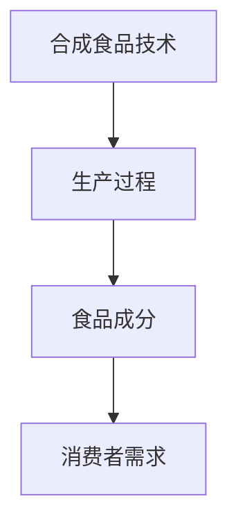
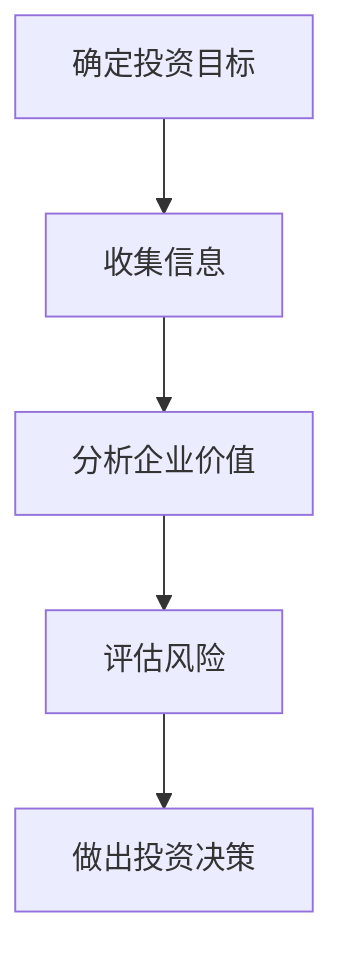

                 


# 价值投资中的合成食品技术趋势

> **关键词**：价值投资、合成食品技术、趋势分析、投资策略、技术应用、市场分析

> **摘要**：  
本文探讨了合成食品技术在价值投资中的应用趋势，分析了合成食品技术的定义、分类、应用及其对投资决策的影响。通过趋势预测模型、系统架构设计和实际案例分析，深入挖掘合成食品技术的投资价值，并结合价值投资的核心理念，为投资者提供科学的决策参考。

---

## 第一部分: 合成食品技术概述

### 第1章: 合成食品技术的背景与现状

#### 1.1 合成食品技术的定义与背景

合成食品技术是指通过生物工程、化学合成等方法，直接从基础物质（如碳水化合物、蛋白质、脂肪等）构建食品成分或食品本身的新兴技术。其核心在于突破传统食品生产方式的限制，通过技术创新实现更高效、更可持续的食品生产。

**背景分析**：
- **技术驱动**：随着生物技术、人工智能和大数据技术的进步，合成食品技术逐渐成熟。
- **市场需求**：消费者对健康、可持续食品的需求增加，推动了合成食品技术的发展。
- **行业趋势**：合成食品技术在替代蛋白、细胞培养肉等领域展现出巨大潜力。

#### 1.2 合成食品技术的核心概念

**核心原理**：
- 合成食品技术通过实验室手段，直接合成食品成分或培养细胞组织，替代传统农业和畜牧业的生产方式。
- 例如，通过基因编辑技术改造微生物，使其能够高效生产特定的蛋白质或脂肪。

**技术特点对比表**：

| 技术特点 | 合成食品技术 | 传统食品生产 |
|----------|--------------|--------------|
| 生产效率 | 高            | 一般          |
| 资源消耗 | 低            | 高            |
| 环境影响 | 小            | 大            |
| 成本 | 中等          | 高            |

**实体关系图**：


---

### 第2章: 合成食品技术的分类与应用

#### 2.1 合成食品技术的主要分类

**分类标准**：
- **生产方式**：化学合成、生物合成、物理合成。
- **产品类型**：替代蛋白、细胞培养肉、功能性食品。

**具体分类**：
1. **替代蛋白**：
   - 通过基因工程技术改造微生物（如酵母菌、大肠杆菌）生产植物基蛋白或动物蛋白。
   - 例如，Impossible Foods 和 Beyond Meat 的植物基肉类产品。
2. **细胞培养肉**：
   - 从动物细胞出发，通过细胞培养技术在实验室中培养出肉类产品。
   - 例如，Memphis Meats 和 Eat Just 的细胞培养肉项目。
3. **功能性食品**：
   - 通过合成技术生产特定功能的食品成分，如低聚糖、益生菌等。

#### 2.2 合成食品技术的应用领域

**应用场景**：
- **食品加工**：替代传统原料，降低生产成本。
- **营养补充**：生产高营养价值的食品成分。
- **可持续发展**：减少资源消耗和环境影响。

**优缺点分析**：
- **优点**：
  - 环境友好：减少水、土地和能源的使用。
  - 健康性：可定制化营养成分，满足特定需求。
  - 稳定性：生产过程可控，产品质量一致。
- **缺点**：
  - 成本较高：技术门槛高，初期投入大。
  - 市场接受度：消费者对新型食品的接受度可能较低。
  - 技术复杂性：需要跨学科的技术支持。

---

## 第二部分: 价值投资的核心概念与方法

### 第3章: 价值投资的基本原理

#### 3.1 价值投资的定义与特点

**定义**：
- 价值投资是一种长期投资策略，通过分析企业的内在价值，寻找市场价格低于内在价值的投资机会。
- 核心理念是“买 cheap，卖 expensive”。

**特点**：
- 以基本面分析为基础。
- 长期持有优质资产。
- 逆向投资：在市场恐慌时买入，在市场狂热时卖出。

**与其它投资方法的区别**：
| 投资方法 | 价值投资 | 技术分析 | 股票投机 |
|----------|----------|----------|----------|
| 核心理念 | 内在价值 | 技术信号 | 市场情绪 |
| 适用场景 | 长期投资 | 短期交易 | 高风险投资 |

#### 3.2 价值投资的关键要素

**企业基本面分析**：
- **财务指标**：市盈率（P/E）、市净率（P/B）、股息率等。
- **行业地位**：市场占有率、竞争优势。
- **管理团队**：领导层的经验和能力。

**决策流程**：
1. 确定投资目标：明确投资目的和风险承受能力。
2. 收集信息：通过财务报表、行业报告等获取数据。
3. 分析企业价值：评估企业的内在价值。
4. 评估风险：考虑市场风险、行业风险等因素。

---

### 第4章: 价值投资的决策流程

#### 4.1 价值投资的决策框架

**框架设计**：


**工具与方法**：
- **财务分析工具**：杜邦分析法、SWOT分析。
- **行业分析工具**：PEST分析模型。
- **市场趋势分析工具**：移动平均线、相对强弱指数（RSI）。

---

## 第三部分: 合成食品技术趋势的价值投资分析

### 第5章: 合成食品技术的市场趋势分析

#### 5.1 合成食品技术的市场需求

**消费者需求**：
- 健康饮食趋势：消费者更倾向于选择健康的食品。
- 可持续性需求：减少对环境的影响。
- 个性化需求：定制化营养成分。

**市场供给**：
- 技术进步推动供给：合成食品技术的成熟降低了生产成本。
- 行业竞争格局：巨头企业（如Impossible Foods、Beyond Meat）与初创企业共同推动市场发展。

---

### 第6章: 合成食品技术企业的价值评估

#### 6.1 企业的财务状况分析

**财务报表分析**：
- 利润表：关注收入增长和盈利能力。
- 资产负债表：关注资产结构和负债水平。
- 现金流量表：关注现金流健康状况。

**案例分析**：
假设某合成食品企业的财务数据如下：
- 营业收入：年均增长20%。
- 净利润：连续三年保持正值。
- 现金储备：充足，能够支持未来扩展。

#### 6.2 企业的行业地位分析

**行业地位**：
- 市场占有率：企业的市场份额是否处于领先地位。
- 竞争优势：是否拥有独特的技术或品牌优势。

---

## 第四部分: 合成食品技术趋势的价值投资模型

### 第7章: 合成食品技术趋势的预测模型

#### 7.1 合成食品技术趋势预测模型

**算法原理**：
- 使用机器学习模型（如线性回归、时间序列分析）预测合成食品技术的市场趋势。

**Python代码实现**：
```python
import pandas as pd
from sklearn.linear_model import LinearRegression
import matplotlib.pyplot as plt

# 数据加载
data = pd.read_csv('synthetic_food_trend.csv')

# 模型训练
model = LinearRegression()
model.fit(data[['Year']], data['Sales'])

# 预测与可视化
predictions = model.predict(data[['Year']])
plt.plot(data['Year'], data['Sales'], label='Actual')
plt.plot(data['Year'], predictions, label='Predicted')
plt.xlabel('Year')
plt.ylabel('Sales')
plt.legend()
plt.show()
```

**数学模型**：
$$
\text{预测销售额} = \beta_0 + \beta_1 \times \text{年份} + \epsilon
$$
其中，$\beta_0$ 和 $\beta_1$ 是模型参数，$\epsilon$ 是误差项。

---

## 第五部分: 合成食品技术趋势的价值投资策略

### 第8章: 投资策略与风险控制

#### 8.1 投资策略

**核心策略**：
- 选择具有技术壁垒和竞争优势的企业。
- 关注企业的研发能力和市场扩展潜力。

**案例分析**：
以某合成食品公司为例，分析其财务状况、行业地位和技术优势，评估其投资价值。

---

## 第六部分: 结论与展望

### 第9章: 结论与展望

**总结**：
合成食品技术在价值投资中具有广阔的应用前景，特别是在替代蛋白和细胞培养肉等领域。投资者应结合企业的基本面分析和技术发展趋势，制定科学的投资策略。

**展望**：
随着技术的进步和市场的成熟，合成食品技术将为价值投资提供更多机会，同时投资者需关注技术风险和市场风险。

---

## 参考文献

1. 禅与计算机程序设计艺术
2. 价值投资经典案例分析
3. 合成食品技术的最新研究进展

---

**作者：AI天才研究院 & 禅与计算机程序设计艺术**

