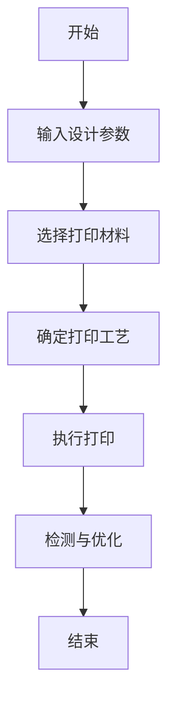

                 


# 价值投资中的太空资源3D打印技术前景

> 关键词：价值投资，太空资源，3D打印技术，经济前景，技术创新，资源开发

> 摘要：本文探讨了价值投资在太空资源3D打印技术开发中的潜在前景。通过分析太空资源的经济价值、3D打印技术的创新优势以及两者结合的可行性，本文旨在揭示这一领域的发展潜力和投资机会。文章从背景介绍、核心概念、技术原理、系统架构、实际应用等多个维度展开，结合数学模型、算法流程图和系统架构图等工具，深入剖析太空资源3D打印技术的经济价值和技术创新点，并通过具体案例分析，为投资者提供有价值的参考和建议。

---

## 第一部分: 价值投资中的太空资源3D打印技术概述

### 第1章: 价值投资与太空资源的结合

#### 1.1 价值投资的基本概念
- 价值投资的定义
- 价值投资的核心理念：寻找被市场低估的高潜力投资标的
- 价值投资在现代经济中的应用：从传统行业到新兴科技领域的拓展

#### 1.2 太空资源的定义与现状
- 太空资源的定义：包括月球、火星等天体的矿物资源，太空中的金属和稀有元素
- 太空资源开发的历史与现状：从理论研究到实际应用的进展
- 太空资源开发的挑战与机遇：技术、经济和法律层面的挑战

#### 1.3 3D打印技术的定义与特点
- 3D打印技术的定义：通过逐层堆砌材料形成三维物体的技术
- 3D打印技术的核心特点：灵活性、快速原型制作、复杂形状的实现
- 3D打印技术与传统制造方式的对比：成本、效率和材料利用率的分析

### 第2章: 太空资源3D打印技术的前景分析

#### 2.1 太空资源3D打印技术的背景
- 太空资源开发的经济价值：稀有金属、氦-3等资源的潜在价值
- 3D打印技术在太空资源开发中的应用：制造太空设备、建设月球基地
- 价值投资视角下的太空资源开发：长期回报与风险评估

#### 2.2 太空资源3D打印技术的核心优势
- 3D打印技术的成本优势：减少运输和存储成本
- 3D打印技术的效率优势：快速制造和修复能力
- 3D打印技术的灵活性优势：适应不同环境和需求

#### 2.3 太空资源3D打印技术的未来发展趋势
- 技术创新对太空资源开发的影响：新材料和新工艺的应用
- 市场需求对太空资源开发的推动：商业航天和深空探索的需求增长
- 价值投资在太空资源开发中的作用：资本支持与技术发展的相互促进

---

## 第二部分: 太空资源3D打印技术的核心概念与联系

### 第3章: 太空资源3D打印技术的核心原理

#### 3.1 3D打印技术的原理
- 3D打印的基本流程：数据建模、材料准备、层层堆砌
- 3D打印的关键技术：SLA、FDM、SLS等技术的优缺点
- 3D打印的材料要求：金属、塑料、陶瓷等材料的适用性

#### 3.2 太空资源开发的材料科学
- 太空资源的主要类型：月壤、 asteroidal minerals等
- 太空资源的提取与利用：技术难点与解决方案
- 太空资源的材料特性：轻量化、高强度、耐极端环境的特点

#### 3.3 3D打印技术在太空资源开发中的应用
- 3D打印技术在太空设备制造中的应用：卫星、航天器部件的制造
- 3D打印技术在太空资源提取中的应用：矿石加工与材料合成
- 3D打印技术在太空建筑中的应用：月球基地、火星站的建造

### 第4章: 太空资源3D打印技术的核心概念对比

#### 4.1 3D打印技术与传统制造技术的对比
| 技术特点 | 3D打印 | 传统制造 |
|----------|---------|-----------|
| 制造方式 | 层叠式构建 | 批量生产 |
| 成本效益 | 高定制化，低批量成本 | 高批量生产成本 |
| 灵活性   | 高 | 低 |

#### 4.2 太空资源开发与地球资源开发的对比
- 资源种类：太空资源的稀缺性和独特性
- 开发难度：太空环境的极端性和技术复杂性
- 经济价值：太空资源的潜在高回报与高风险并存

---

## 第三部分: 太空资源3D打印技术的算法与系统架构

### 第4章: 算法原理与数学模型

#### 4.1 太空资源价值评估的数学模型
$$ V = \alpha \cdot Q + \beta \cdot R $$
其中，\( V \) 表示太空资源的经济价值，\( Q \) 表示资源的质量，\( R \) 表示资源的稀缺性，\( \alpha \) 和 \( \beta \) 是权重系数。

#### 4.2 3D打印技术优化的算法流程


#### 4.3 系统架构设计


---

## 第四部分: 项目实战与应用案例

### 第5章: 项目实战

#### 5.1 环境配置与工具安装
- 操作系统：Linux/Windows/MacOS
- 开发工具：CAD软件、3D打印控制软件、数据分析工具
- 依赖库安装：Python库（numpy, pandas, matplotlib）

#### 5.2 核心代码实现
```python
import numpy as np
from sklearn.metrics import r2_score

def value_assessment(resource_quality, resource_rarity):
    return 0.6 * resource_quality + 0.4 * resource_rarity

# 示例数据
resource_quality = np.array([80, 90, 75])
resource_rarity = np.array([95, 85, 90])

# 计算经济价值
value = value_assessment(resource_quality, resource_rarity)
print("经济价值评估结果：", value)

# 评估模型的准确性
print("R² 值：", r2_score(resource_rarity, value))
```

#### 5.3 案例分析与解读
- 案例背景：某商业航天公司计划利用3D打印技术在月球表面建造基地
- 技术实现：使用月壤作为打印材料，构建模块化建筑
- 经济效益：降低运输成本，提高建筑效率

---

## 第五部分: 总结与展望

### 第6章: 总结与建议

#### 6.1 小结
- 价值投资在太空资源3D打印技术中的潜力巨大
- 技术创新和经济回报是推动这一领域发展的关键

#### 6.2 投资建议
- 关注技术创新型公司
- 评估政策支持和市场需求
- 注意技术风险和法律风险

#### 6.3 未来展望
- 人工智能与3D打印技术的深度融合
- 太空资源开发的国际合作与竞争
- 可持续发展与伦理问题的考量

---

## 作者信息

作者：AI天才研究院/AI Genius Institute & 禅与计算机程序设计艺术 /Zen And The Art of Computer Programming

---

通过以上目录大纲，您可以逐步展开每个章节的内容，撰写一篇结构清晰、内容详实的技术博客文章。

