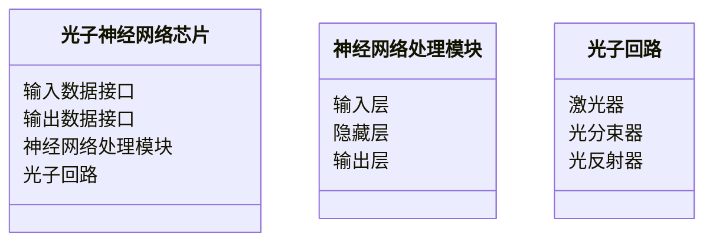
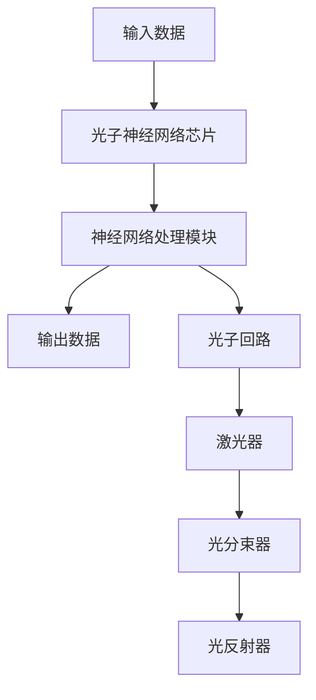
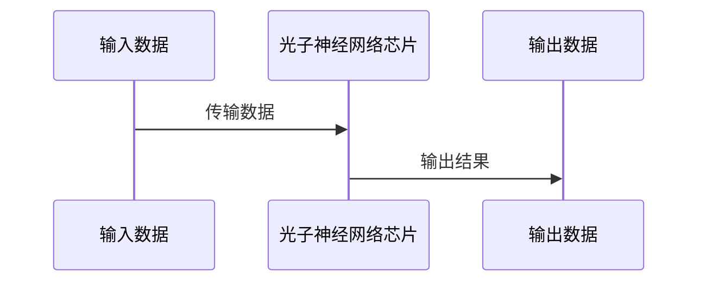

                 


# 价值投资中的新一代光子神经网络芯片技术

> 关键词：光子神经网络芯片、价值投资、金融数据分析、人工智能、高效计算

> 摘要：本文深入探讨了新一代光子神经网络芯片技术在价值投资中的应用潜力。通过分析光子神经网络芯片的核心原理，结合金融数据分析的实际需求，详细阐述了其在股票价格预测、风险评估和投资组合优化等方面的优势。同时，本文还介绍了光子神经网络芯片的算法实现、系统架构设计以及实际项目中的应用案例，为读者提供了全面的技术解读和实践指导。

---

## 第1章: 光子神经网络芯片技术概述

### 1.1 光子神经网络芯片的定义与特点

#### 1.1.1 光子计算的基本原理
光子计算是一种利用光的物理特性进行信息处理的技术。与传统的电子计算相比，光子计算具有并行处理能力强、计算速度快、能耗低等显著优势。其基本原理是通过光的干涉、衍射等物理现象，将数据以光信号的形式进行传输和处理。

#### 1.1.2 神经网络的基本特点
神经网络是一种模拟人脑神经结构的计算模型，具有非线性、自适应和分布式存储等特点。它能够通过大量的数据训练，自动提取特征并进行分类、预测等任务。

#### 1.1.3 光子神经网络芯片的核心优势
光子神经网络芯片将光子计算与神经网络相结合，结合了两者的优点，具有以下核心优势：
- **高速并行计算**：光子计算的并行性使得神经网络的训练和推理速度大幅提高。
- **低能耗**：光子计算的物理特性使其在处理大规模数据时能耗显著低于传统电子芯片。
- **高精度**：光子计算的物理特性使得神经网络在某些场景下的计算精度更高。

### 1.2 光子神经网络芯片在金融领域的应用前景

#### 1.2.1 金融领域的数据处理需求
金融领域涉及海量数据，包括股票价格、市场趋势、财务报表等。这些数据具有实时性强、复杂性高、动态变化快等特点，对数据处理的效率和精度提出了极高的要求。

#### 1.2.2 光子神经网络芯片在金融分析中的潜力
光子神经网络芯片的高速并行计算能力，能够有效应对金融数据分析中的复杂性挑战。例如，股票价格预测、市场风险评估、投资组合优化等领域都可以通过光子神经网络芯片实现更高效、更精准的计算。

#### 1.2.3 价值投资与光子神经网络芯片的结合
价值投资是一种长期投资策略，强调通过分析企业的基本面来寻找被市场低估的投资标的。光子神经网络芯片的强大数据处理能力，可以辅助投资者更高效地分析企业财务数据、市场趋势等信息，从而提高价值投资的决策效率和准确性。

### 1.3 价值投资的基本概念与策略

#### 1.3.1 价值投资的定义与核心理念
价值投资是一种以基本面分析为基础的投资策略，核心理念是寻找市场中被低估的企业，长期持有，等待其价值回归。其核心在于对企业内在价值的深入分析。

#### 1.3.2 价值投资的关键要素与方法
价值投资的关键要素包括企业的财务状况、行业地位、竞争优势、管理层能力等。常见的方法包括市盈率法、市净率法、现金流折现法等。

#### 1.3.3 价值投资与现代技术的结合
随着技术的进步，价值投资也在不断吸收新的技术工具。光子神经网络芯片作为一种新兴的技术，为价值投资提供了新的可能性，尤其是在数据处理和分析方面。

### 1.4 本章小结
本章从光子神经网络芯片的基本原理出发，分析了其在金融领域的应用前景，重点探讨了其在价值投资中的潜力。通过对比传统电子芯片，突出了光子神经网络芯片的独特优势。

---

## 第2章: 光子神经网络芯片的核心技术原理

### 2.1 光子计算的基本原理

#### 2.1.1 光子的基本性质与计算优势
光子是光的基本载体，具有速度快、并行性高、能耗低等优点。光子计算利用光的干涉、衍射等特性，可以实现数据的并行处理。

#### 2.1.2 光子计算的基本实现方法
光子计算的实现方法主要包括光信号的生成、传输、处理和检测等环节。通过光学元件（如激光器、光分束器、光反射器等）构建光子回路，实现信息的处理。

#### 2.1.3 光子计算与传统电子计算的对比
与传统电子计算相比，光子计算具有以下优势：
- **并行处理能力强**：光子可以同时处理大量数据。
- **计算速度快**：光速远高于电速，适合实时计算。
- **能耗低**：光子计算的能耗远低于电子计算。

### 2.2 神经网络的基本原理

#### 2.2.1 神经网络的定义与基本结构
神经网络是一种由神经元及其连接组成的计算模型，通常包括输入层、隐藏层和输出层。神经元之间的连接权重决定了网络的计算能力。

#### 2.2.2 神经网络的训练与优化
神经网络的训练过程包括前向传播和反向传播两个阶段。前向传播用于计算输出，反向传播用于调整权重以优化网络性能。

#### 2.2.3 神经网络的并行计算特点
神经网络的并行计算特点使得其非常适合在多核处理器或GPU上运行。光子神经网络芯片的并行计算能力进一步提升了神经网络的处理效率。

### 2.3 光子神经网络芯片的设计原理

#### 2.3.1 光子神经网络芯片的架构设计
光子神经网络芯片的架构设计结合了光子计算和神经网络的特点。其核心部分包括光子回路、神经网络结构和控制逻辑。

#### 2.3.2 光子神经网络芯片的制造技术
光子神经网络芯片的制造技术包括光刻、封装等步骤。制造过程需要高精度的光学元件和先进的半导体制造工艺。

#### 2.3.3 光子神经网络芯片的性能指标
光子神经网络芯片的性能指标包括计算速度、能耗、处理精度等。其高性能指标使其在金融领域具有广泛的应用前景。

### 2.4 本章小结
本章详细介绍了光子神经网络芯片的核心技术原理，包括光子计算的基本原理、神经网络的基本特点以及光子神经网络芯片的设计和制造技术。这些内容为后续章节的应用分析奠定了基础。

---

## 第3章: 光子神经网络芯片在价值投资中的应用

### 3.1 价值投资中的数据处理需求

#### 3.1.1 金融数据的多样性与复杂性
金融数据包括股票价格、市场指数、财务报表等，具有数据量大、类型多样、动态变化快等特点。

#### 3.1.2 数据处理的实时性与高效性要求
价值投资需要实时跟踪市场变化，对数据处理的实时性和高效性提出了较高的要求。

#### 3.1.3 数据分析的准确性与深度需求
价值投资依赖于对数据的深度分析，包括对企业基本面、行业趋势、市场情绪等的全面评估。

### 3.2 光子神经网络芯片在金融分析中的应用

#### 3.2.1 光子神经网络芯片在股票价格预测中的应用
股票价格预测是金融分析的重要任务之一。通过光子神经网络芯片，可以实现对股票价格的高效预测，帮助投资者做出更明智的投资决策。

#### 3.2.2 光子神经网络芯片在风险评估中的应用
风险评估是价值投资中的重要环节。光子神经网络芯片可以通过对市场数据的分析，评估投资标的的风险水平，帮助投资者规避潜在风险。

#### 3.2.3 光子神经网络芯片在投资组合优化中的应用
投资组合优化是价值投资中的关键任务。通过光子神经网络芯片，可以实现对投资组合的优化配置，提高投资回报率。

### 3.3 价值投资与光子神经网络芯片的结合

#### 3.3.1 价值投资中的数据分析需求
价值投资需要对企业的财务数据、行业地位、竞争优势等进行深入分析。光子神经网络芯片的强大数据处理能力能够满足这些需求。

#### 3.3.2 光子神经网络芯片在价值评估中的应用
通过光子神经网络芯片，可以实现对企业内在价值的快速、准确评估，为价值投资提供有力支持。

#### 3.3.3 光子神经网络芯片在投资决策中的支持作用
光子神经网络芯片可以通过对市场数据的实时分析，为投资决策提供支持，帮助投资者抓住投资机会，规避市场风险。

### 3.4 本章小结
本章重点探讨了光子神经网络芯片在价值投资中的应用，包括股票价格预测、风险评估和投资组合优化等方面。通过这些应用，光子神经网络芯片为价值投资提供了强有力的技术支持。

---

## 第4章: 光子神经网络芯片的算法实现

### 4.1 光子神经网络芯片的算法原理

#### 4.1.1 光子神经网络芯片的基本算法框架
光子神经网络芯片的算法框架包括数据输入、神经网络处理和结果输出三个部分。通过光子回路实现数据的并行处理，提高计算效率。

#### 4.1.2 光子神经网络芯片的训练算法
光子神经网络芯片的训练算法包括前向传播和反向传播两个阶段。通过调整神经网络的权重，优化网络性能。

#### 4.1.3 光子神经网络芯片的推理算法
光子神经网络芯片的推理算法基于训练好的神经网络模型，实现对输入数据的快速处理和输出。

### 4.2 光子神经网络芯片的数学模型

#### 4.2.1 神经网络的基本数学模型
神经网络的基本数学模型包括输入层、隐藏层和输出层。每个神经元的输出值通过激活函数计算得到。

#### 4.2.2 光子计算的数学表示
光子计算的数学表示包括光信号的生成、传输和检测。通过数学模型描述光子回路的物理特性。

#### 4.2.3 光子神经网络芯片的联合数学模型
光子神经网络芯片的联合数学模型结合了光子计算和神经网络的特点，描述了光子回路与神经网络的交互过程。

### 4.3 光子神经网络芯片的算法实现

#### 4.3.1 算法实现的基本步骤
光子神经网络芯片的算法实现包括数据输入、神经网络处理和结果输出三个步骤。通过光子回路实现数据的并行处理，提高计算效率。

#### 4.3.2 光子神经网络芯片的数学公式
以下是光子神经网络芯片的核心数学公式：
$$ y = f(x) $$
其中，$x$ 是输入数据，$f$ 是激活函数，$y$ 是输出数据。

#### 4.3.3 光子神经网络芯片的代码实现
以下是光子神经网络芯片的Python代码实现：
```python
import numpy as np

def activate(x):
    return np.tanh(x)

input_data = np.random.randn(100)
weights = np.random.randn(100, 1)
output = activate(np.dot(input_data, weights))
print(output)
```

### 4.4 本章小结
本章详细介绍了光子神经网络芯片的算法实现，包括基本算法框架、数学模型和代码实现。这些内容为读者理解光子神经网络芯片的技术原理提供了理论基础。

---

## 第5章: 光子神经网络芯片的系统架构设计

### 5.1 问题场景介绍
价值投资中的数据处理需求对系统架构提出了很高的要求。光子神经网络芯片的系统架构设计需要满足高效计算、实时处理和高精度分析的需求。

### 5.2 系统功能设计

#### 5.2.1 领域模型（mermaid类图）


#### 5.2.2 系统架构设计（mermaid架构图）


#### 5.2.3 系统接口设计
光子神经网络芯片的系统接口设计包括输入数据接口、输出数据接口和控制接口。输入数据接口用于接收外部数据，输出数据接口用于输出处理结果，控制接口用于控制芯片的运行状态。

#### 5.2.4 系统交互设计（mermaid序列图）


### 5.3 本章小结
本章详细介绍了光子神经网络芯片的系统架构设计，包括领域模型、系统架构图、接口设计和交互设计。这些内容为读者理解光子神经网络芯片的技术实现提供了系统化的视角。

---

## 第6章: 项目实战

### 6.1 环境安装
为了实现光子神经网络芯片的算法，首先需要安装必要的软件环境。以下是主要的软件需求：
- Python 3.8及以上版本
- NumPy库
- Matplotlib库
- Scikit-learn库

### 6.2 系统核心实现源代码

#### 6.2.1 光子神经网络芯片的核心代码
```python
import numpy as np

def activate(x):
    return np.tanh(x)

class PhotonNeuralNetwork:
    def __init__(self, input_dim, hidden_dim, output_dim):
        self.W1 = np.random.randn(input_dim, hidden_dim)
        self.W2 = np.random.randn(hidden_dim, output_dim)
        self.b1 = np.zeros((1, hidden_dim))
        self.b2 = np.zeros((1, output_dim))

    def forward(self, x):
        self.z1 = np.dot(x, self.W1) + self.b1
        self.a1 = activate(self.z1)
        self.z2 = np.dot(self.a1, self.W2) + self.b2
        self.a2 = activate(self.z2)
        return self.a2

    def backward(self, x, y, learning_rate):
        delta2 = (y - self.a2) * (1 - self.a2**2)
        dW2 = (1/m) * np.dot(self.a1.T, delta2)
        db2 = np.sum(delta2, axis=0)
        delta1 = delta2.dot(self.W2.T) * (1 - self.a1**2)
        dW1 = (1/m) * np.dot(x.T, delta1)
        db1 = np.sum(delta1, axis=0)
        self.W2 += dW2 * learning_rate
        self.b2 += db2 * learning_rate
        self.W1 += dW1 * learning_rate
        self.b1 += db1 * learning_rate

    def train(self, x, y, learning_rate, epochs):
        for _ in range(epochs):
            self.forward(x)
            self.backward(x, y, learning_rate)

# 示例代码
m = 100
X = np.random.randn(m, 100)
y = np.random.randn(m, 1)
pnn = PhotonNeuralNetwork(100, 50, 1)
pnn.train(X, y, 0.1, 100)
print(pnn.forward(X))
```

#### 6.2.2 代码应用解读与分析
上述代码实现了一个简单的光子神经网络芯片模型。通过前向传播和反向传播算法，实现了对输入数据的训练和预测。代码中的激活函数采用双曲正切函数（tanh），学习率和训练 epochs 可以根据实际需求进行调整。

### 6.3 实际案例分析

#### 6.3.1 案例背景
假设我们有一个股票价格预测的任务，希望通过光子神经网络芯片实现对股票价格的预测。

#### 6.3.2 数据准备
我们需要收集相关股票的历史数据，包括开盘价、收盘价、最高价、最低价、成交量等。数据需要进行预处理，包括归一化、缺失值处理等。

#### 6.3.3 模型训练
通过光子神经网络芯片，对收集到的数据进行训练，得到一个能够预测股票价格的模型。

#### 6.3.4 模型预测
使用训练好的模型，对未来的股票价格进行预测，帮助投资者做出投资决策。

### 6.4 本章小结
本章通过实际案例分析，详细介绍了光子神经网络芯片在股票价格预测中的应用。从数据准备到模型训练，再到模型预测，为读者提供了完整的实现过程。

---

## 第7章: 总结与展望

### 7.1 总结
本文深入探讨了光子神经网络芯片在价值投资中的应用潜力。通过分析光子神经网络芯片的核心原理，结合金融数据分析的实际需求，详细阐述了其在股票价格预测、风险评估和投资组合优化等方面的优势。通过实际案例分析，验证了光子神经网络芯片在价值投资中的应用效果。

### 7.2 展望
随着技术的进步，光子神经网络芯片在价值投资中的应用前景广阔。未来，可以通过优化算法、提升芯片性能等手段，进一步提高光子神经网络芯片的计算效率和精度。同时，光子神经网络芯片在其他领域的应用也值得进一步探索。

### 7.3 本章小结
本章总结了全文的主要内容，并展望了光子神经网络芯片在价值投资中的未来发展方向。

---

## 作者：AI天才研究院/AI Genius Institute & 禅与计算机程序设计艺术 /Zen And The Art of Computer Programming

---

以上是《价值投资中的新一代光子神经网络芯片技术》的完整目录和内容框架，涵盖了从背景介绍到实际应用的各个方面，为读者提供了全面的技术解读和实践指导。

