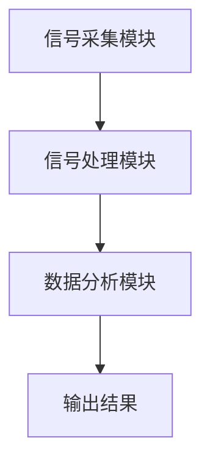

                 


# 价值投资中的新一代生物传感器阵列技术前景

> 关键词：生物传感器阵列技术，价值投资，医疗健康监测，信号处理算法，数据分析模型

> 摘要：生物传感器阵列技术作为一种新兴的技术手段，在医疗健康、环境监测等领域展现了广阔的应用前景。本文将深入探讨生物传感器阵列技术的核心概念、算法原理、系统架构设计以及在价值投资中的潜在应用。通过结合实际案例和系统分析，本文旨在为读者提供一个全面的技术视角，展望生物传感器阵列技术在未来的价值投资中的重要地位和应用场景。

---

## 第1章: 生物传感器阵列技术概述

### 1.1 生物传感器阵列的定义与核心概念
#### 1.1.1 生物传感器的基本原理
生物传感器是一种能够检测生物分子或生物信号的装置，通常由传感器和生物识别元件组成。其基本原理是将生物信号（如温度、湿度、化学成分等）转化为可测量的电信号，通过放大和处理后，得到最终的测量结果。

#### 1.1.2 生物传感器阵列的定义
生物传感器阵列是由多个生物传感器组成的集成系统，具有多通道、高灵敏度和高分辨率的特点。每个传感器专注于特定的生物信号，通过阵列的协同工作，可以实现对复杂生物环境的全面感知和分析。

#### 1.1.3 生物传感器阵列的核心要素与组成
生物传感器阵列的核心要素包括：
- **生物识别元件**：用于检测特定的生物分子或信号。
- **传感器芯片**：将生物识别元件的信号转化为电信号。
- **信号处理模块**：对传感器输出的信号进行放大、滤波和数字化处理。
- **数据分析模块**：对处理后的数据进行分析和解读，生成最终的测量结果。

### 1.2 生物传感器阵列技术的发展现状
#### 1.2.1 国内外研究现状
近年来，生物传感器阵列技术在国内外得到了广泛关注和研究。特别是在医疗健康领域，生物传感器阵列被广泛应用于疾病诊断、健康监测和药物筛选等方面。例如，基于微机电系统（MEMS）的生物传感器阵列在基因检测和蛋白质检测方面取得了显著进展。

#### 1.2.2 当前技术瓶颈与挑战
尽管生物传感器阵列技术发展迅速，但仍面临一些技术瓶颈和挑战：
- **灵敏度不足**：部分传感器在检测低浓度生物分子时灵敏度较低。
- **稳定性问题**：传感器在长期使用中容易受到环境因素的影响，导致性能下降。
- **集成化困难**：多传感器阵列的集成化设计和制造工艺较为复杂，成本较高。

#### 1.2.3 未来技术发展趋势
未来，生物传感器阵列技术将朝着以下几个方向发展：
- **高灵敏度与高分辨率**：通过优化传感器材料和结构，提高检测灵敏度和分辨率。
- **微型化与集成化**：推动传感器阵列的微型化和集成化设计，降低制造成本。
- **智能化与自动化**：结合人工智能技术，实现传感器阵列的智能化和自动化操作。

### 1.3 价值投资中的生物传感器阵列技术应用背景
#### 1.3.1 价值投资的基本概念
价值投资是一种投资策略，旨在通过分析企业的基本面（如财务状况、盈利能力、市场地位等），寻找具有长期投资价值的标的。与短期市场波动相比，价值投资更注重企业的内在价值和长期增长潜力。

#### 1.3.2 生物传感器在医疗健康领域的应用前景
医疗健康领域是生物传感器阵列技术的重要应用领域之一。例如，通过生物传感器阵列可以实时监测患者的生理指标（如心率、血压、血糖等），为医生提供准确的诊断依据。此外，生物传感器阵列还可以用于疾病的早期筛查和精准治疗，提高医疗效率和患者生活质量。

#### 1.3.3 生物传感器阵列技术在价值投资中的潜在价值
生物传感器阵列技术在医疗健康领域的广泛应用，为其在价值投资中提供了广阔的市场空间。例如，投资于生物传感器阵列技术的研发和生产的企业，可以通过技术创新和市场拓展实现持续增长，为投资者带来丰厚的回报。此外，生物传感器阵列技术在医疗设备、健康监测和疾病诊断等方面的应用，也为相关企业提供了强大的竞争优势。

---

## 第2章: 生物传感器阵列技术的核心概念与原理

### 2.1 生物传感器阵列的原理
#### 2.1.1 生物传感器的基本工作原理
生物传感器的工作原理可以分为以下几个步骤：
1. **生物分子识别**：传感器表面的生物识别元件（如抗体、酶、核酸等）与目标生物分子发生特异性结合。
2. **信号转换**：结合过程中产生的物理或化学变化（如质量变化、电化学变化等）被传感器芯片转化为电信号。
3. **信号处理**：电信号经过放大、滤波和数字化处理后，传输到数据分析模块。
4. **数据分析**：通过对处理后的数据进行分析和解读，生成最终的测量结果。

#### 2.1.2 生物传感器阵列的信号采集与处理
生物传感器阵列通过多个传感器协同工作，可以实现对复杂生物环境的全面感知。每个传感器负责检测特定的生物信号，通过阵列的组合可以提高检测的准确性和灵敏度。例如，在基因检测中，可以通过多个传感器同时检测不同基因的表达水平，从而实现对复杂基因组的全面分析。

#### 2.1.3 生物传感器阵列的多通道特性
生物传感器阵列的多通道特性是其区别于单个传感器的重要特征。通过多个传感器的协同工作，可以实现对多个生物信号的同时检测和分析。例如，在蛋白质检测中，可以通过多个传感器同时检测不同蛋白质的浓度和种类，从而实现对蛋白质组的全面分析。

### 2.2 生物传感器阵列的数学模型
#### 2.2.1 传感器信号的数学表达式
传感器的输出信号可以表示为以下数学表达式：
$$
y(t) = \sum_{i=1}^{n} a_i \cdot x_i(t) + \epsilon
$$
其中，$y(t)$ 是传感器的输出信号，$a_i$ 是传感器的灵敏度系数，$x_i(t)$ 是输入信号，$\epsilon$ 是噪声项。

#### 2.2.2 阵列信号处理的数学模型
生物传感器阵列的信号处理可以采用以下数学模型：
$$
Y = A \cdot X + N
$$
其中，$Y$ 是传感器阵列的输出信号矩阵，$A$ 是灵敏度矩阵，$X$ 是输入信号矩阵，$N$ 是噪声矩阵。

#### 2.2.3 噪声分析与信号优化
为了提高传感器阵列的检测精度，需要对噪声进行有效的分析和处理。常用的方法包括：
1. **基于小波变换的噪声消除**：
$$
y_{\text{denoised}} = \sum_{i=1}^{n} a_i \cdot \text{Wavelet}(x_i)
$$
2. **基于傅里叶变换的信号增强**：
$$
Y(f) = \sum_{i=1}^{n} a_i \cdot X(f) \cdot e^{-j2\pi f t_i}
$$

### 2.3 生物传感器阵列的实体关系图
```mermaid
er
  entity 生物传感器阵列 {
    id
    类型
    通道数
    灵敏度
  }
  entity 信号处理模块 {
    id
    处理算法
    处理能力
  }
  entity 数据分析模块 {
    id
    分析算法
    分析结果
  }
  生物传感器阵列 --> 信号处理模块
  信号处理模块 --> 数据分析模块
```

---

## 第3章: 生物传感器阵列技术的算法原理

### 3.1 信号处理算法
#### 3.1.1 基于小波变换的信号去噪算法
小波变换是一种有效的信号处理方法，可以用于去除噪声并增强信号。其数学表达式为：
$$
y(t) = \sum_{i=1}^{n} a_i \cdot \psi(t - t_i)
$$
其中，$\psi(t)$ 是小波基函数，$t_i$ 是小波的位置参数。

#### 3.1.2 基于傅里叶变换的信号分析
傅里叶变换可以将信号从时域转换到频域，便于分析信号的频率特性。其数学表达式为：
$$
F(f) = \int_{-\infty}^{\infty} f(t) e^{-j2\pi f t} dt
$$
其中，$F(f)$ 是信号的频域表示，$f$ 是频率变量。

#### 3.1.3 基于神经网络的信号识别算法
神经网络是一种有效的信号识别方法，可以通过训练模型实现对复杂信号的分类和识别。其数学模型为：
$$
y = \sigma(Wx + b)
$$
其中，$W$ 是权重矩阵，$x$ 是输入信号，$b$ 是偏置向量，$\sigma$ 是激活函数。

### 3.2 数据分析算法
#### 3.2.1 基于机器学习的分类算法
机器学习是一种有效的数据分析方法，可以用于对生物传感器阵列的输出数据进行分类和预测。常用的算法包括支持向量机（SVM）和随机森林（Random Forest）。

#### 3.2.2 基于深度学习的特征提取算法
深度学习是一种强大的特征提取方法，可以用于从生物传感器阵列的输出数据中提取有用的特征。常用的模型包括卷积神经网络（CNN）和长短期记忆网络（LSTM）。

#### 3.2.3 基于聚类分析的数据分组算法
聚类分析是一种有效的数据分组方法，可以用于将生物传感器阵列的输出数据分成不同的类别。常用的算法包括K均值聚类和层次聚类。

### 3.3 算法实现的数学模型
#### 3.3.1 小波变换的数学公式
$$
y(t) = \sum_{i=1}^{n} a_i \cdot \psi(t - t_i)
$$
#### 3.3.2 傅里叶变换的数学公式
$$
F(f) = \int_{-\infty}^{\infty} f(t) e^{-j2\pi f t} dt
$$
#### 3.3.3 神经网络的数学模型
$$
y = \sigma(Wx + b)
$$

---

## 第4章: 生物传感器阵列技术的系统架构设计

### 4.1 系统应用场景
#### 4.1.1 医疗健康监测
生物传感器阵列技术可以应用于医疗健康监测，例如实时监测患者的生理指标（如心率、血压、血糖等），为医生提供准确的诊断依据。

#### 4.1.2 环境监测
生物传感器阵列技术可以应用于环境监测，例如检测空气中的有害气体（如甲醛、苯等），为环境保护提供技术支持。

#### 4.1.3 智能设备集成
生物传感器阵列技术可以集成到智能设备（如智能手机、可穿戴设备等）中，实现对人体生理指标的实时监测和数据分析。

### 4.2 系统功能设计
#### 4.2.1 信号采集模块
信号采集模块负责采集生物传感器阵列的输出信号，并将其传输到信号处理模块。

#### 4.2.2 信号处理模块
信号处理模块负责对采集到的信号进行放大、滤波和数字化处理，生成可分析的数字信号。

#### 4.2.3 数据分析模块
数据分析模块负责对处理后的数据进行分析和解读，生成最终的测量结果或诊断报告。

### 4.3 系统架构图


### 4.4 系统接口设计
系统接口设计包括传感器阵列与信号处理模块之间的接口、信号处理模块与数据分析模块之间的接口，以及数据分析模块与输出设备之间的接口。常用的接口协议包括I2C、SPI和UART。

### 4.5 系统交互流程
系统交互流程包括以下步骤：
1. 传感器阵列采集生物信号。
2. 信号处理模块对信号进行放大和数字化处理。
3. 数据分析模块对处理后的数据进行分析和解读。
4. 输出最终的测量结果或诊断报告。

---

## 第5章: 项目实战

### 5.1 环境安装
为了实现生物传感器阵列技术的项目实战，需要安装以下环境和工具：
- **硬件设备**：生物传感器阵列、信号处理模块、数据分析模块。
- **软件工具**：Python编程语言、NumPy库、Matplotlib库、Scikit-learn库。

### 5.2 系统核心实现源代码
以下是生物传感器阵列技术的核心实现源代码：
```python
import numpy as np
from sklearn.svm import SVC
from sklearn.metrics import accuracy_score

# 传感器阵列的输出信号
X = np.random.rand(100, 10)  # 100个样本，10个传感器通道
y = np.random.randint(2, size=100)  # 二分类问题

# 建立支持向量机模型
model = SVC()
model.fit(X, y)

# 预测结果
y_pred = model.predict(X)

# 计算准确率
accuracy = accuracy_score(y, y_pred)
print("Accuracy:", accuracy)
```

### 5.3 代码应用解读与分析
上述代码实现了一个基于支持向量机（SVM）的生物传感器阵列分类系统。首先，生成100个样本，每个样本包含10个传感器通道的输出信号。然后，使用SVM模型对样本进行分类，并计算分类准确率。通过这种方式，可以实现对生物传感器阵列输出数据的分类和分析。

### 5.4 案例分析与详细讲解
以医疗健康监测为例，假设我们有100个患者的生理指标数据，每个患者包含10个传感器通道的输出信号。通过上述代码实现的分类系统，可以对患者进行分类，识别出具有特定生理指标的患者群体，为医生提供诊断依据。

### 5.5 项目小结
通过项目实战，我们可以看到生物传感器阵列技术在实际应用中的潜力和价值。通过结合硬件设备和软件工具，可以实现对生物信号的实时监测和智能分析，为医疗健康、环境监测等领域提供技术支持。

---

## 第6章: 小结与展望

### 6.1 小结
本文详细探讨了生物传感器阵列技术的核心概念、算法原理和系统架构设计。通过结合实际案例和系统分析，展示了生物传感器阵列技术在医疗健康、环境监测等领域的广泛应用前景。

### 6.2 展望
未来，生物传感器阵列技术将朝着高灵敏度、高分辨率、微型化和智能化的方向发展。同时，随着人工智能技术的不断进步，生物传感器阵列技术在价值投资中的应用潜力将更加广阔。我们期待生物传感器阵列技术能够在更多的领域中得到应用，为人类社会的发展和进步做出更大的贡献。

---

## 作者：AI天才研究院 & 禅与计算机程序设计艺术

---

**摘要**：本文从生物传感器阵列技术的基本概念出发，详细探讨了其在医疗健康、环境监测等领域的应用前景。通过结合实际案例和系统分析，展示了生物传感器阵列技术在价值投资中的潜在价值和未来发展趋势。

