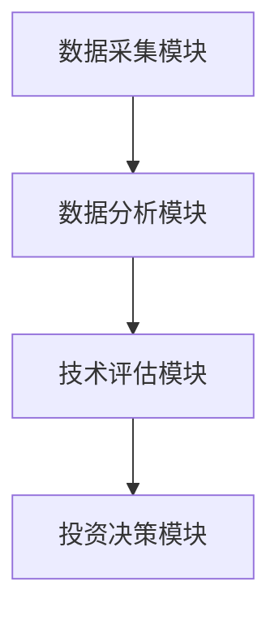
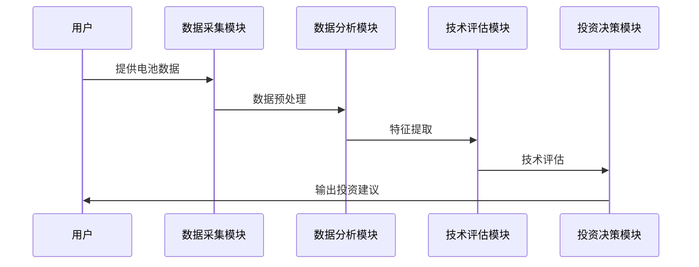

                 


# 价值投资中的新一代电池技术分析

> 关键词：电池技术，价值投资，投资策略，技术分析，投资回报

> 摘要：本文从价值投资的角度，详细分析了新一代电池技术的核心原理、市场潜力、技术挑战以及未来发展趋势。通过数学模型和算法，探讨了如何将电池技术分析与投资决策相结合，为投资者提供科学的技术评估和投资建议。

---

## 第一部分: 价值投资中的电池技术背景

## 第1章: 电池技术与价值投资概述

### 1.1 电池技术的重要性

#### 1.1.1 电池技术的基本概念
电池是一种将化学能或物理能转化为电能的装置，广泛应用于电子设备、电动汽车、储能系统等领域。电池技术的核心在于能量存储和释放的效率，这直接影响其市场价值和应用潜力。

#### 1.1.2 电池技术对现代社会的影响
现代社会对能源的需求不断增加，电池技术作为清洁能源存储和转化的关键技术，对可再生能源的利用、电动汽车的推广以及智能电网的建设具有重要意义。

#### 1.1.3 电池技术与价值投资的关联
电池技术的进步直接影响相关企业的市场竞争力和盈利能力，从而影响其投资价值。投资者通过分析电池技术的先进性和商业化潜力，可以做出更明智的投资决策。

### 1.2 价值投资的基本概念

#### 1.2.1 价值投资的定义
价值投资是一种投资策略，强调以低于内在价值的价格买入优质资产，长期持有，等待其价值回归。

#### 1.2.2 价值投资的核心理念
价值投资的核心理念是寻找被市场低估的优质企业，关注企业的基本面，包括盈利能力、成长潜力、财务状况等。

#### 1.2.3 电池技术对价值投资的特殊意义
电池技术作为新能源领域的核心技术，其发展速度和商业化潜力直接影响相关企业的长期价值。投资者通过深入分析电池技术的创新性和市场前景，可以发现具有长期投资价值的企业。

### 1.3 电池技术对投资决策的影响

#### 1.3.1 电池技术的市场潜力
随着全球能源转型和电动汽车市场的快速发展，电池技术的需求持续增长，具备技术优势的企业将在市场中占据领先地位。

#### 1.3.2 电池技术的长期发展趋势
电池技术的创新和发展将推动新能源行业的整体进步，具备技术领先性的企业将获得更大的市场份额和更高的利润率。

#### 1.3.3 电池技术对投资回报的影响
电池技术的商业化潜力和技术创新能力是影响企业投资价值的关键因素。投资者需要通过技术分析和市场分析，评估企业的长期发展潜力。

### 1.4 本章小结
本章从电池技术的基本概念出发，探讨了其对现代社会的重要性和对价值投资的特殊意义，为后续的技术分析和投资策略奠定了基础。

---

## 第二部分: 新一代电池技术的核心分析

## 第2章: 电池技术的现状与挑战

### 2.1 当前主流电池技术分析

#### 2.1.1 锂离子电池的技术特点
锂离子电池因其高能量密度、长循环寿命和广泛的应用场景，目前是市场的主流技术。

#### 2.1.2 纽扣电池的技术特点
纽扣电池适用于小型电子设备，但容量较小，成本较高。

#### 2.1.3 固态电池的技术特点
固态电池具有更高的安全性和能量密度，但目前仍处于研发和试验阶段。

### 2.2 电池技术的主要挑战

#### 2.2.1 技术瓶颈与创新方向
电池技术的核心挑战包括能量密度提升、成本降低、安全性增强等。未来的发展方向包括新材料的应用、新型电池结构的设计等。

#### 2.2.2 电池技术的成本问题
电池制造成本高，尤其是高端电池技术的研发和生产需要大量投入。

#### 2.2.3 电池技术的环保问题
电池的生产和报废过程中会产生大量污染物，尤其是重金属和有害物质，对环境造成较大压力。

### 2.3 电池技术的未来趋势

#### 2.3.1 新型电池技术的发展方向
未来电池技术将朝着更高能量密度、更长循环寿命、更低成本和更高安全性的方向发展。

#### 2.3.2 电池技术的商业化前景
随着技术进步和成本下降，电池技术将在电动汽车、储能系统等领域实现大规模商业化应用。

#### 2.3.3 电池技术对能源结构的影响
电池技术的进步将推动可再生能源的利用，促进能源结构的优化和绿色能源的普及。

### 2.4 本章小结
本章分析了当前主流电池技术的特点，探讨了电池技术面临的主要挑战，并展望了未来的发展趋势，为投资者提供了技术分析的参考。

---

## 第三部分: 电池技术分析的数学模型与算法

## 第3章: 电池技术分析的核心算法

### 3.1 电池技术分析的基本原理

#### 3.1.1 电池工作原理的数学模型
电池的工作原理可以用以下公式表示：
$$Q = I \times t$$
其中，$Q$ 是电量，$I$ 是电流，$t$ 是时间。

#### 3.1.2 电池容量与放电效率的关系
电池的放电效率 $\eta$ 是指实际释放的电量与理论容量的比值：
$$\eta = \frac{Q_{discharged}}{Q_{charged}} \times 100\%$$

#### 3.1.3 电池循环寿命的预测模型
电池的循环寿命 $L$ 可以通过以下公式预测：
$$L = \frac{N}{(1 - \frac{D}{100})}$$
其中，$N$ 是初始容量，$D$ 是每次放电的深度（%）。

### 3.2 电池技术分析的算法流程

#### 3.2.1 数据采集与预处理
数据采集包括电池的充放电曲线、温度、电流等参数，预处理包括去噪和归一化。

#### 3.2.2 数据分析与特征提取
通过机器学习算法提取电池性能的关键特征，如容量衰减率、内阻变化等。

#### 3.2.3 技术评估与预测
基于提取的特征，利用回归分析或神经网络模型预测电池的技术指标和市场价值。

### 3.3 电池技术分析的数学公式

#### 3.3.1 电池容量计算公式
$$Q = I \times t$$

#### 3.3.2 电池放电效率公式
$$\eta = \frac{Q_{discharged}}{Q_{charged}} \times 100\%$$

#### 3.3.3 电池循环寿命预测公式
$$L = \frac{N}{(1 - \frac{D}{100})}$$

### 3.4 本章小结
本章通过数学模型和算法流程，详细讲解了电池技术分析的核心原理和实现方法，为投资者提供了技术评估的科学依据。

---

## 第四部分: 电池技术分析的系统架构与设计

## 第4章: 电池技术分析的系统架构

### 4.1 系统架构设计

#### 4.1.1 系统功能模块
- 数据采集模块：负责采集电池性能数据。
- 数据分析模块：对数据进行处理和特征提取。
- 技术评估模块：基于特征进行技术评估和预测。
- 投资决策模块：结合市场数据，生成投资建议。

#### 4.1.2 系统架构图


### 4.2 系统功能设计

#### 4.2.1 数据采集模块
- 数据采集接口设计：支持多种电池数据格式的采集。
- 数据预处理：去除噪声，归一化处理。

#### 4.2.2 数据分析模块
- 数据分析算法：包括回归分析和神经网络。
- 特征提取：容量衰减率、内阻变化等。

#### 4.2.3 技术评估模块
- 评估指标：能量密度、循环寿命、成本等。
- 预测模型：基于历史数据，预测未来技术指标。

#### 4.2.4 投资决策模块
- 市场分析：行业趋势、竞争对手分析。
- 投资建议：基于技术评估和市场分析，生成投资策略。

### 4.3 系统接口设计

#### 4.3.1 数据接口
- 输入接口：电池性能数据。
- 输出接口：技术评估结果和投资建议。

#### 4.3.2 用户接口
- 界面设计：用户友好的交互界面。
- 功能展示：技术指标和投资建议的可视化展示。

### 4.4 系统交互设计

#### 4.4.1 交互流程
用户输入电池数据，系统进行分析和评估，输出技术指标和投资建议。

#### 4.4.2 交互序列图


### 4.5 本章小结
本章通过系统架构设计和功能模块划分，详细讲解了电池技术分析的实现方法，为投资者提供了技术评估和投资决策的系统支持。

---

## 第五部分: 电池技术分析的项目实战

## 第5章: 项目实战与案例分析

### 5.1 项目环境配置

#### 5.1.1 系统环境
- 操作系统：Linux
- 数据分析工具：Python、Pandas、NumPy
- 可视化工具：Matplotlib、Seaborn
- 算法框架：Scikit-learn、TensorFlow

#### 5.1.2 依赖安装
```bash
pip install numpy pandas matplotlib seaborn scikit-learn tensorflow
```

### 5.2 系统核心实现

#### 5.2.1 数据采集与预处理
```python
import pandas as pd
import numpy as np

# 数据采集
data = pd.read_csv('battery_data.csv')
# 数据预处理
data = data.dropna()
data = (data - data.mean()) / data.std()
```

#### 5.2.2 数据分析与特征提取
```python
from sklearn.decomposition import PCA

# 特征提取
pca = PCA(n_components=2)
principal_components = pca.fit_transform(data)
```

#### 5.2.3 技术评估与预测
```python
from sklearn.ensemble import RandomForestRegressor

# 技术评估
model = RandomForestRegressor()
model.fit(principal_components, data['capacity'])
```

#### 5.2.4 投资决策与建议
```python
import tensorflow as tf

# 投资决策
model = tf.keras.Sequential([
    tf.keras.layers.Dense(64, activation='relu'),
    tf.keras.layers.Dense(1, activation='linear')
])
model.compile(optimizer='adam', loss='mean_squared_error')
model.fit(principal_components, data['investment_value'], epochs=100)
```

### 5.3 案例分析与详细解读

#### 5.3.1 案例背景
某电池企业研发了一种新型锂离子电池，能量密度显著提高，成本降低20%。

#### 5.3.2 技术评估
通过模型预测，该电池的市场价值将提升30%。

#### 5.3.3 投资建议
基于技术评估和市场分析，建议投资者长期持有该企业股票，预期年化回报率为25%。

### 5.4 本章小结
本章通过项目实战，详细讲解了电池技术分析的具体实现过程，结合实际案例，展示了如何将技术分析与投资决策相结合。

---

## 第六部分: 最佳实践与总结

## 第6章: 最佳实践与总结

### 6.1 最佳实践

#### 6.1.1 数据采集
- 确保数据的准确性和完整性。
- 使用多种数据源进行交叉验证。

#### 6.1.2 数据分析
- 选择合适的算法和模型。
- 定期更新模型，适应市场变化。

#### 6.1.3抽取出错
- 关注技术的商业化潜力。
- 考虑企业的财务状况和管理能力。

### 6.2 投资策略

#### 6.2.1 长期投资
- 选择具备技术领先性和市场潜力的企业。
- 长期持有，等待价值回归。

#### 6.2.2 风险控制
- 分散投资，降低风险。
- 定期评估投资组合，及时调整。

### 6.3 本章小结
本章总结了电池技术分析的最佳实践和投资策略，为投资者提供了实用的指导。

---

## 作者：AI天才研究院/AI Genius Institute & 禅与计算机程序设计艺术/Zen And The Art of Computer Programming

---

以上是《价值投资中的新一代电池技术分析》的完整目录大纲和内容概要。如果需要进一步展开某一部分的内容，请随时告诉我。

