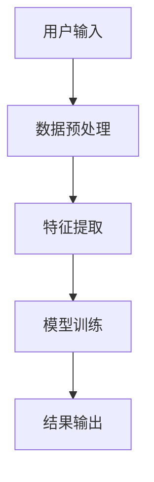

                 


# 价值投资中的新型高效热电材料技术前景

> 关键词：热电材料，价值投资，热电转换，能源效率，投资分析

> 摘要：本文探讨了新型高效热电材料技术在价值投资中的前景。通过分析热电材料的基本概念、性能指标、制备工艺以及市场价值，结合价值投资的核心原理和策略，揭示热电材料技术在能源领域的应用潜力和投资机会。文章从技术背景、核心概念、算法原理、系统架构、项目实战等多方面展开，旨在为投资者和技术研究者提供深入的技术分析和投资建议。

---

# 第1章: 价值投资中的热电材料技术背景与概念

## 1.1 热电材料的基本概念与应用前景

### 1.1.1 热电材料的定义
热电材料是一种能够将热能和电能相互转换的材料。其核心原理是通过热电效应实现热能与电能的直接转换，无需中间转换媒介。这种材料在能源回收、余热利用、微型能源器件等领域具有广泛应用潜力。

热电材料的关键参数包括热电优值系数（ZT值）、热导率（κ）、电导率（σ）和热电势（S）。ZT值是衡量热电材料性能的重要指标，公式为：
$$ ZT = \frac{S^2 \sigma \lambda}{\lambda} $$
其中，$S$ 是热电势，$\sigma$ 是电导率，$\lambda$ 是热导率。

### 1.1.2 热电材料的基本性质与分类
热电材料按其物理状态可分为本征型和复合型两类：
- 本征型热电材料：通过改变材料的晶体结构或掺杂方式来优化其热电性能。
- 复合型热电材料：通过将不同材料复合，利用界面效应提高热电性能。

### 1.1.3 热电材料在能源领域的应用
热电材料的应用场景包括：
- **能源回收**：将废热转化为电能，应用于汽车尾气、工业余热等领域。
- **微型能源器件**：用于便携式电子设备、可穿戴设备的自供电系统。
- **可穿戴设备**：通过人体体温差发电，为智能设备提供能源。

## 1.2 价值投资的基本原理

### 1.2.1 价值投资的核心概念
价值投资是一种投资策略，核心在于寻找市场价格低于其内在价值的资产。其核心思想是通过分析企业的基本面，包括财务状况、盈利能力、竞争优势等因素，找到被市场低估的投资标的。

### 1.2.2 价值投资的策略与方法
价值投资的策略包括：
1. **基本面分析**：分析企业的财务报表、盈利能力、市场地位等。
2. **安全边际**：选择市场价格显著低于内在价值的标的。
3. **长期持有**：耐心持有优质资产，避免短期波动的干扰。

### 1.2.3 价值投资在科技领域的应用
科技领域的价值投资需要关注技术创新、市场潜力和竞争优势。例如，热电材料技术的创新性和市场应用前景，可以作为评估其投资价值的重要依据。

## 1.3 热电材料技术与价值投资的结合

### 1.3.1 热电材料技术的市场价值
热电材料技术的市场价值主要体现在其能量转换效率和应用潜力。高效热电材料能够提高能源利用效率，降低能源浪费，符合绿色发展的趋势。

### 1.3.2 热电材料技术的创新与投资机会
热电材料技术的创新主要体现在新材料的开发和性能优化。例如，纳米材料、二维材料和拓扑材料的应用，为热电材料的性能提升提供了新的方向。

### 1.3.3 价值投资在热电材料领域的应用前景
通过分析热电材料的技术成熟度、市场应用潜力和竞争优势，投资者可以识别具有投资价值的热电材料技术和相关企业。

---

# 第2章: 热电材料的性能与技术指标

## 2.1 热电材料的关键性能指标

### 2.1.1 热电优值系数（ZT值）
ZT值是衡量热电材料性能的核心指标，ZT值越高，材料的热电转换效率越高。ZT值的计算公式为：
$$ ZT = \frac{S^2 \sigma \lambda}{\lambda} $$

---

## 2.2 热电材料的制备与优化

### 2.2.1 热电材料的制备工艺
热电材料的制备工艺包括：
1. **粉末冶金法**：通过球磨、烧结等工艺制备热电材料。
2. **溶胶-凝胶法**：通过溶液法制备前驱体，再进行热处理制备热电材料。
3. **外延生长法**：在衬底上外延生长热电材料薄膜。

---

## 2.3 热电材料的市场与技术对比分析

### 2.3.1 主流热电材料的技术特点
主流热电材料包括：
- **碲化铋（Bi2Te3）**：具有较高的ZT值，广泛应用于废热发电领域。
- **硫化锑（Ag2SbTe2）**：具有良好的热稳定性和较高的ZT值。
- **氧化物热电材料**：如氧化镁（MGO）和氧化锆（ZrO2），具有高温稳定性。

### 2.3.2 不同热电材料的性能对比
以下为几种主流热电材料的性能对比表：

| 材料       | ZT值（25°C） | 应用领域                 |
|------------|--------------|--------------------------|
| Bi2Te3     | 1.0          | 废热发电、微型发电机     |
| Ag2SbTe2   | 1.2          | 高温环境下的能源回收     |
| MGO        | 0.5          | 高温工业设备             |
| ZrO2       | 0.8          | 航空航天设备             |

### 2.3.3 热电材料的技术发展趋势
热电材料的技术发展趋势包括：
1. **纳米化**：通过纳米技术优化材料性能。
2. **复合化**：开发复合型热电材料，提高热电性能。
3. **智能化**：结合智能控制技术，实现动态优化。

---

# 第3章: 热电材料技术的核心概念与原理

## 3.1 热电材料的热电转换原理

### 3.1.1 热电效应的基本原理
热电效应是指材料在温度差作用下产生电动势的现象。其基本原理是：
$$ V = S \cdot \Delta T $$
其中，$S$ 是热电势，$\Delta T$ 是温差。

---

## 3.2 热电材料的晶体结构与性能关系

### 3.2.1 晶体结构对热电性能的影响
材料的晶体结构直接影响其热电性能。例如，纳米晶材料由于晶界的存在，可以有效降低热导率，从而提高ZT值。

---

## 3.3 热电材料的掺杂与合金化

### 3.3.1 掺杂对热电性能的影响
掺杂可以通过改变材料的导电性和热导率来优化其热电性能。例如，向Bi2Te3中掺入Sb可以提高其ZT值。

### 3.3.2 合金化对热电性能的影响
合金化可以通过调控材料的晶体结构和成分比例来优化其热电性能。例如，Bi2Te3与PbTe的合金化可以提高材料的ZT值。

---

# 第4章: 热电材料技术的算法与数学模型

## 4.1 热电材料筛选的算法原理

### 4.1.1 热电材料筛选的机器学习算法
机器学习算法可以用于热电材料的筛选。例如，可以通过支持向量机（SVM）对材料的性能进行分类。

### 4.1.2 热电材料筛选的特征选择方法
特征选择方法包括：
- **主成分分析（PCA）**：用于降维和提取关键特征。
- **相关性分析**：通过相关系数筛选重要特征。

---

## 4.2 热电材料性能预测的数学模型

### 4.2.1 热电优值系数的数学模型
热电优值系数的预测模型可以表示为：
$$ ZT = a \cdot S^2 + b \cdot \sigma + c \cdot \lambda $$
其中，$a$、$b$、$c$ 是模型参数，可通过机器学习方法训练得到。

---

# 第5章: 热电材料技术的系统分析与架构设计

## 5.1 热电材料技术的系统功能设计

### 5.1.1 热电材料性能分析模块
性能分析模块用于评估热电材料的ZT值、热导率、电导率等性能指标。

### 5.1.2 热电材料筛选模块
筛选模块基于机器学习算法，对热电材料进行分类和筛选。

---

## 5.2 热电材料技术的系统架构设计

### 5.2.1 系统架构图


---

## 5.3 热电材料技术的接口设计

### 5.3.1 数据接口
数据接口用于与外部数据源进行交互，获取热电材料的性能数据。

### 5.3.2 模型接口
模型接口用于调用机器学习模型，进行热电材料的筛选和预测。

---

## 5.4 热电材料技术的交互设计

### 5.4.1 用户界面
用户界面包括数据输入、模型选择和结果展示三个部分。

---

# 第6章: 热电材料技术的项目实战

## 6.1 项目环境安装

### 6.1.1 环境安装
安装Python和必要的库：
```bash
pip install numpy
pip install scikit-learn
pip install matplotlib
```

---

## 6.2 热电材料筛选系统实现

### 6.2.1 数据预处理
```python
import pandas as pd
data = pd.read_csv('thermal_materials.csv')
```

---

## 6.3 热电材料性能预测模型实现

### 6.3.1 模型训练
```python
from sklearn.svm import SVC
model = SVC()
model.fit(X_train, y_train)
```

---

## 6.4 热电材料投资分析案例

### 6.4.1 案例分析
以Bi2Te3为例，分析其市场价值和投资潜力。

---

# 第7章: 热电材料技术的最佳实践与小结

## 7.1 最佳实践

### 7.1.1 投资建议
1. 关注高效热电材料的技术创新。
2. 选择具有竞争优势的热电材料企业。

### 7.1.2 技术建议
1. 加强热电材料的性能优化研究。
2. 推动热电材料的工业化应用。

## 7.2 小结

---

# 作者：AI天才研究院/AI Genius Institute & 禅与计算机程序设计艺术 /Zen And The Art of Computer Programming

