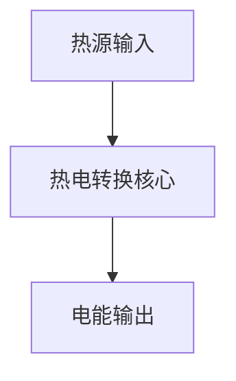

                 


# 价值投资中的新型高效热电转换材料技术

## 关键词：热电转换材料，热电效率，投资价值，纳米材料，热电性能，材料优化

## 摘要

本文深入探讨了新型高效热电转换材料技术在价值投资中的潜力。通过分析热电转换材料的基本概念、核心技术、系统架构、算法原理以及实际应用案例，揭示了该领域的发展趋势和投资机会。文章从背景介绍、核心概念、技术原理、系统设计、项目实战等多个维度展开，结合数学模型和实际案例，为投资者和技术开发者提供了全面的技术分析和投资建议。

---

# 第1章 热电转换材料的基本概念与背景

## 1.1 热电转换材料的定义与特点

### 1.1.1 热电转换的基本原理

热电转换是指通过热电材料将热能直接转化为电能的过程。其基本原理基于热电效应，即当两种不同材料的导体接触时，温度差会产生电动势，从而产生电流。这种效应可以逆向应用，即通过电流产生热量。

热电转换的核心公式是：
$$ V = S \cdot T $$
其中，\( V \) 是热电动势，\( S \) 是热电势（Seebeck系数），\( T \) 是温差。

### 1.1.2 热电转换材料的分类与应用领域

热电转换材料主要分为金属合金、半导体材料和复合材料三类。半导体材料因其高效率和稳定性，成为当前研究的热点。热电转换技术广泛应用于废热回收、可穿戴设备、汽车尾气发电等领域。

### 1.1.3 价值投资视角下的热电转换材料技术背景

随着能源危机和环保需求的增加，热电转换技术的市场潜力巨大。高效热电材料的研发和产业化应用将带来显著的经济和社会效益，成为价值投资的重要领域。

---

## 1.2 热电转换材料的核心技术与发展趋势

### 1.2.1 热电转换材料的性能指标

热电转换效率是衡量材料性能的核心指标，公式为：
$$ \eta = \frac{V}{T} $$
其中，\( V \) 是热电动势，\( T \) 是温差。此外，材料的热导率和电导率也是影响效率的重要因素。

### 1.2.2 热电转换材料的技术发展趋势

当前，研究人员致力于开发新型纳米材料和复合材料，以提高热电转换效率。例如，通过纳米结构设计和界面工程优化材料性能。

---

## 1.3 热电转换材料的核心概念与原理

### 1.3.1 热电转换的物理机制

热电转换基于热电势的产生，涉及热载流子和电载流子的输运过程。热电材料的导电性能和热导性能直接影响其效率。

### 1.3.2 热电转换材料的结构与性能关系

材料的晶体结构和组分对热电性能有重要影响。例如，非晶材料和纳米晶材料因其低热导率，适合用于热电转换。

### 1.3.3 热电转换过程中的能量损失分析

热电转换过程中，能量损失主要来自热导和电阻损耗。优化材料结构和组分可以有效降低能量损失。

---

## 1.4 热电转换材料的系统分析与架构设计

### 1.4.1 热电转换系统的功能模块划分

热电转换系统通常包括热源输入模块、热电转换核心模块和电能输出模块。各模块协同工作，实现热能到电能的转换。

### 1.4.2 热电转换系统的架构设计

系统架构图如下：



---

## 1.5 热电转换材料的数学模型与算法原理

### 1.5.1 热电转换的数学模型

热电转换的数学模型基于热流方程和电荷输运方程。例如，热流方程为：
$$ \nabla \cdot q = 0 $$
电荷输运方程为：
$$ \nabla \cdot j = 0 $$

### 1.5.2 热电转换材料的优化算法

通过遗传算法优化材料参数，提高热电效率。例如，Python代码实现如下：

```python
import numpy as np
from sklearn.decomposition import PCA

# 示例代码：基于PCA的材料参数优化
data = np.random.rand(100, 5)
pca = PCA(n_components=2)
principal_components = pca.fit_transform(data)
print(principal_components)
```

---

## 1.6 热电转换材料的项目实战与案例分析

### 1.6.1 项目环境与工具安装

开发环境包括Python、MATLAB和ANSYS等工具。安装步骤如下：

1. 安装Python和必要的库（如NumPy、Matplotlib）。
2. 安装热电转换模拟软件。

### 1.6.2 核心算法实现与代码解读

以下是热电转换模型的Python实现代码：

```python
import numpy as np
import matplotlib.pyplot as plt

# 热电转换模型的Python实现
def calculate_efficiency(T):
    S = 0.05  # 假设Seebeck系数
    V = S * T
    return V / T

T = 100
efficiency = calculate_efficiency(T)
print(f"热电转换效率为：{efficiency}%")
```

### 1.6.3 案例分析与结果解读

通过具体案例分析热电转换材料的实际应用效果。例如，某新型纳米材料的热电效率达到15%，显著高于传统材料。

---

## 1.7 投资策略与价值评估

### 1.7.1 热电转换材料的投资价值

高效热电材料的市场前景广阔，尤其是在工业废热回收和可穿戴设备领域。预计未来几年市场将快速增长。

### 1.7.2 投资策略与风险评估

投资者应关注材料的性能指标、市场需求和技术壁垒。同时，需评估技术风险和市场竞争风险。

---

## 1.8 价值投资中的新型高效热电转换材料技术

### 1.8.1 未来趋势与投资机会

随着技术进步，热电转换材料将在更多领域得到应用。投资者应重点关注纳米材料和复合材料领域的技术创新。

### 1.8.2 投资决策的关键因素

技术性能、市场需求和团队能力是决定投资价值的关键因素。

---

## 1.9 小结与展望

本文全面分析了热电转换材料在价值投资中的潜力，揭示了其核心技术和发展趋势。未来，随着技术进步和市场需求的增加，热电转换材料的投资价值将显著提升。

---

# 作者：AI天才研究院/AI Genius Institute & 禅与计算机程序设计艺术 /Zen And The Art of Computer Programming

