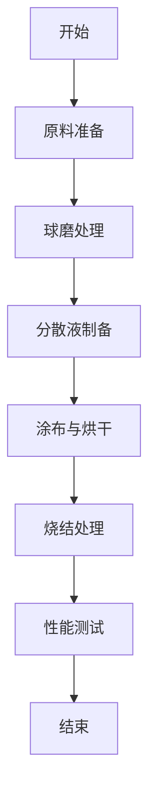

                 

# 《价值投资中的新型高效热管理纳米材料技术》

---

## 关键词：
- 价值投资
- 热管理纳米材料
- 纳米技术
- 热导率
- 投资策略
- 科技创新

---

## 摘要：
本文深入探讨了新型高效热管理纳米材料技术在价值投资中的应用。通过分析纳米材料的热导率特性、制备工艺及在电子设备中的应用，结合数学建模和系统架构设计，揭示了这些技术如何影响企业的市场竞争力和投资价值。文章还提供了实际案例和投资策略，帮助投资者更好地把握科技创新带来的投资机会。

---

## 第一部分: 价值投资与热管理纳米材料技术的背景

### 第1章: 价值投资与热管理技术概述

#### 1.1 价值投资的基本概念
- 价值投资的定义与核心理念
- 热管理技术在现代科技中的重要性

#### 1.2 纳米材料技术的基本原理
- 纳米材料的定义与特性
- 纳米材料在热管理中的应用

#### 1.3 价值投资与纳米材料技术的结合
- 科技进步对投资领域的影响
- 纳米材料技术如何改变热管理领域

### 第2章: 热管理纳米材料技术的核心概念

#### 2.1 纳米材料的热导率分析
- 热导率的定义与影响因素
- 纳米材料的热导率提升原理

#### 2.2 纳米材料的结构特性
- 纳米材料的微观结构
- 结构对热管理性能的影响

#### 2.3 纳米材料的制备与表征
- 常见制备方法
- 表征技术与性能测试

---

## 第二部分: 热管理纳米材料技术的算法与数学模型

### 第3章: 热管理纳米材料的数学模型

#### 3.1 热传导方程
- 基本热传导方程
- 纳米材料的热传导方程

#### 3.2 纳米材料热管理的数学建模
- 建模方法
- 模型参数的选择

#### 3.3 算法实现与优化
- 算法流程图
- 参数优化策略

### 第4章: 热管理纳米材料的系统分析

#### 4.1 系统架构设计
- 系统功能模块划分
- 系统架构图

#### 4.2 系统接口设计
- 接口定义与交互流程
- 接口实现方式

---

## 第三部分: 价值投资中的纳米材料技术应用

### 第5章: 纳米材料技术在投资中的应用

#### 5.1 纳米材料企业的投资价值评估
- 企业估值方法
- 技术创新对估值的影响

#### 5.2 热管理技术的市场分析
- 市场需求分析
- 竞争格局与投资机会

### 第6章: 纳米材料技术的环境与法律因素

#### 6.1 环境影响评估
- 纳米材料的环境风险
- 绿色投资策略

#### 6.2 法律与伦理考量
- 纳米材料的法规要求
- 投资中的伦理问题

---

## 第四部分: 投资策略与案例分析

### 第7章: 投资策略与最佳实践

#### 7.1 投资策略制定
- 策略制定步骤
- 风险管理方法

#### 7.2 案例分析与投资实践
- 成功案例解读
- 投资策略的实施步骤

### 第8章: 项目实战与小结

#### 8.1 环境安装与系统实现
- 开发环境配置
- 核心代码实现

#### 8.2 案例分析与解读
- 技术应用实例
- 投资回报分析

#### 8.3 投资小结与展望
- 项目总结
- 未来发展趋势

---

## 附录: 相关公式与代码

### 附录A: 热传导方程的数学模型
$$ \frac{\partial T}{\partial t} = \alpha \nabla^2 T $$

### 附录B: 纳米材料制备流程图

---

## 参考文献：
- 纳米材料领域的权威书籍与论文
- 热管理技术的经典文献
- 投资学相关的学术研究

---

## 作者：AI天才研究院/AI Genius Institute & 禅与计算机程序设计艺术 /Zen And The Art of Computer Programming

