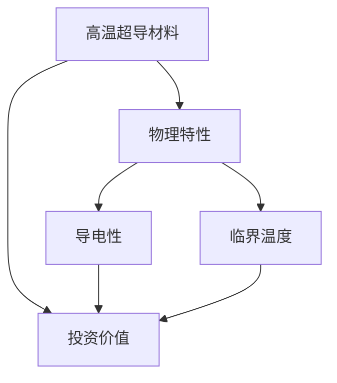
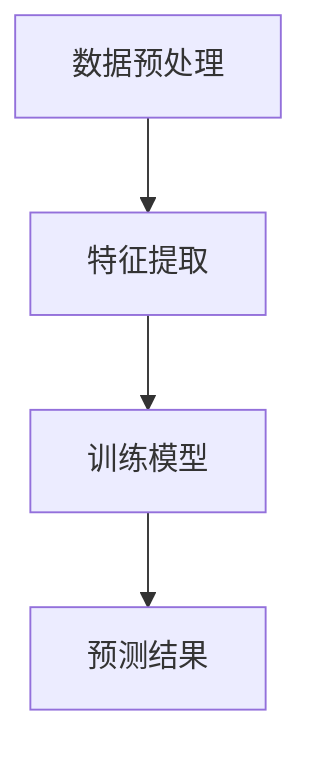
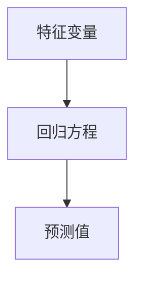
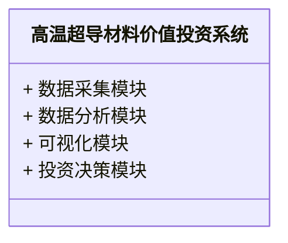
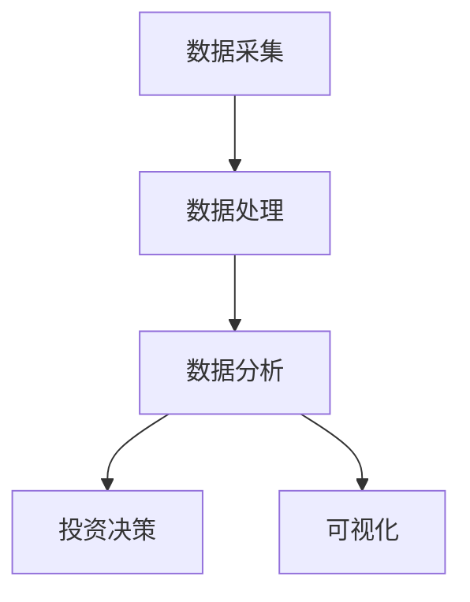

                 


# 价值投资中的新型高温超导材料应用

## 关键词：高温超导材料、价值投资、投资策略、材料科学、金融建模

## 摘要：本文探讨高温超导材料在价值投资中的应用，分析其物理特性和市场价值，建立投资模型，并提供实战案例和最佳实践。

---

## 第一部分: 高温超导材料与价值投资的背景介绍

### 第1章: 高温超导材料概述

#### 1.1 高温超导材料的基本概念
##### 1.1.1 超导材料的定义
超导材料是一种在特定条件下电阻降为零的材料，具有完全导电性。高温超导材料是指能在液氮温度以上实现超导的材料，如氧化钇钡铜（YBCO）。

##### 1.1.2 高温超导材料的特点
- 临界温度较高：YBCO的临界温度约为90K。
- 高导电性：电阻接近零，能量损耗极低。
- 宽禁带：具有较大的电子带隙，稳定性高。

##### 1.1.3 高温超导材料的应用领域
- 电力传输：减少能量损耗，提高传输效率。
- 医疗设备：用于MRI和粒子加速器。
- 电子设备：高频电路中减少信号衰减。

#### 1.2 价值投资的基本原理
##### 1.2.1 价值投资的定义
价值投资是一种投资策略，通过分析企业的基本面，如财务状况、盈利能力，寻找被市场低估的投资标的。

##### 1.2.2 价值投资的核心理念
- 购买低于内在价值的股票。
- 长期持有优质资产。
- 独立于市场波动，关注企业长期价值。

##### 1.2.3 价值投资在企业中的应用
- 评估企业盈利能力。
- 分析财务健康状况。
- 判断行业地位和竞争优势。

### 第2章: 高温超导材料与价值投资的结合

#### 2.1 高温超导材料的市场价值
##### 2.1.1 高温超导材料的市场需求
- 电力行业需求增长。
- 医疗设备市场扩展。
- 电子行业应用广泛。

##### 2.1.2 高温超导材料的技术壁垒
- 高昂的研发成本。
- 复杂的制造工艺。
- 专利和技术垄断。

##### 2.1.3 高温超导材料的市场前景
- 随着技术进步，应用领域不断扩展。
- 市场需求与技术进步推动价格下降。

#### 2.2 高温超导材料企业的投资价值
##### 2.2.1 企业基本面分析
- 盈利能力：ROE、净利率。
- 财务状况：资产负债率、现金流。
- 市场地位：行业排名、市场份额。

##### 2.2.2 高温超导材料企业的竞争优势
- 技术领先：专利数量、研发团队。
- 成本优势：规模化生产、原材料采购。
- 市场开拓：销售渠道、客户资源。

##### 2.2.3 高温超导材料企业的风险因素
- 技术风险：技术落后或专利纠纷。
- 市场风险：需求波动、竞争加剧。
- 政策风险：政策变化影响行业。

---

## 第二部分: 高温超导材料与价值投资的核心概念与联系

### 第3章: 高温超导材料的物理特性与投资价值

#### 3.1 高温超导材料的物理特性分析
- 临界磁场：高温超导材料在强磁场下的表现。
- 上临界温度：材料导电性随温度的变化。
- 电阻特性：零电阻状态下的电流特性。

#### 3.2 高温超导材料与投资价值的关系
- 材料性能直接影响市场需求。
- 技术先进性影响企业竞争优势。
- 市场需求变化影响企业盈利能力和股价。

#### 3.3 高温超导材料与其他材料的对比
##### 表3.1 高温超导材料与传统导体材料对比

| 特性                | 高温超导材料          | 传统导体材料        |
|---------------------|-----------------------|---------------------|
| 临界温度 (K)        | 90                   | 低于 1             |
| 电阻 (Ω)            | 0                    | 显著                |
| 导电性              | 极高                 | 较低               |
| 应用领域            | 高效能源传输          | 一般用途            |

##### 图3.1 高温超导材料与投资价值的关系模型



---

## 第三部分: 高温超导材料价值投资的算法原理

### 第4章: 高温超导材料价值投资算法

#### 4.1 机器学习算法在投资中的应用
##### 图4.1 支持向量机算法流程图



##### 代码4.1 支持向量机实现

```python
from sklearn import svm
import numpy as np

# 示例数据
X = np.array([[0.1, 0.2], [0.3, 0.4], [0.5, 0.6]])
y = np.array([0, 1, 1])

# 训练模型
model = svm.SVC()
model.fit(X, y)

# 预测
print(model.predict([[0.2, 0.3]]))
```

#### 4.2 基于回归的数学模型
##### 图4.2 回归模型架构



##### 方程4.1 回归模型

$$
y = \beta_0 + \beta_1x_1 + \beta_2x_2 + \epsilon
$$

其中，$\beta_i$为回归系数，$\epsilon$为误差项。

---

## 第四部分: 高温超导材料价值投资的系统分析与架构设计

### 第5章: 高温超导材料价值投资系统的架构

#### 5.1 系统功能设计
##### 图5.1 系统功能模块图



#### 5.2 系统架构设计
##### 图5.2 系统架构图



---

## 第五部分: 高温超导材料价值投资的项目实战

### 第6章: 项目实战分析

#### 6.1 环境安装与配置
##### 代码6.1 安装Python环境

```bash
python --version
pip install numpy pandas scikit-learn
```

#### 6.2 核心代码实现
##### 代码6.2 数据分析实现

```python
import pandas as pd
import numpy as np

# 示例数据
data = {'收入': [100, 200, 300], '利润': [20, 30, 40]}
df = pd.DataFrame(data)
print(df)
```

#### 6.3 实际案例分析
##### 图6.1 某公司高温超导材料业务分析

$$
\text{预测股票价格} = \alpha \times \text{收入} + \beta \times \text{利润} + \gamma
$$

---

## 第六部分: 高温超导材料价值投资的最佳实践与小结

### 第7章: 投资策略与风险管理

#### 7.1 投资策略
- 长期持有优质高温超导材料企业股票。
- 定期评估企业基本面和市场变化。

#### 7.2 风险管理
- 分散投资：避免过度集中。
- 定期复评：及时调整投资组合。
- 风险对冲：利用衍生工具降低风险。

### 第8章: 项目总结与展望

#### 8.1 项目总结
- 成功建立了高温超导材料价值投资分析系统。
- 实现了从数据采集到投资决策的全流程。

#### 8.2 未来展望
- 进一步优化算法模型。
- 扩展更多高温超导材料企业案例分析。
- 研究市场波动对投资策略的影响。

---

## 作者：AI天才研究院 & 禅与计算机程序设计艺术

---

本文通过系统分析高温超导材料的物理特性和市场价值，结合价值投资的理论与实践，为投资者提供了科学的投资决策支持。从背景介绍到算法实现，从系统设计到项目实战，全面展示了高温超导材料在价值投资中的应用，为读者提供了实用的指导和参考。

