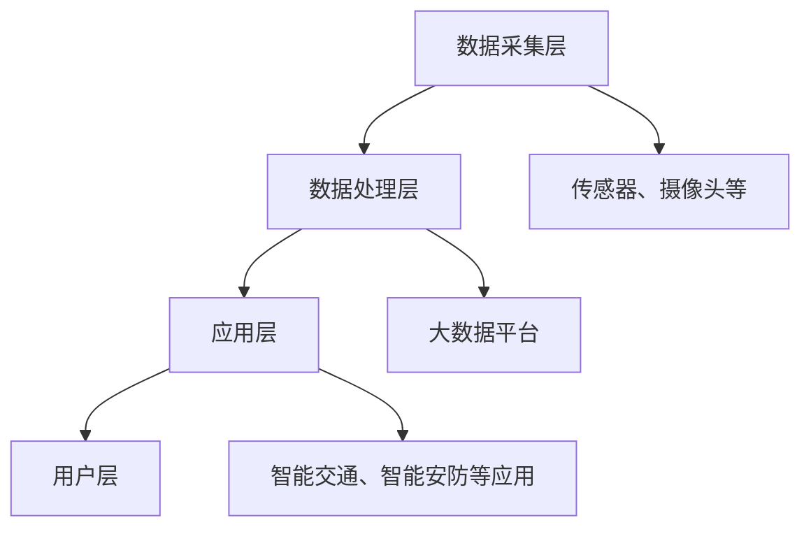

                 


```markdown
# 价值投资中的智慧城市发展机遇

> 关键词：价值投资，智慧城市，技术驱动，投资机会，价值评估模型

> 摘要：随着科技的飞速发展和城市化进程的加快，智慧城市成为全球关注的焦点。本文将从价值投资的角度，深入探讨智慧城市发展的机遇与挑战，分析如何通过技术驱动和市场洞察，抓住智慧城市领域的投资机会。文章结合实际案例，详细阐述了价值评估模型的构建与应用，系统分析了智慧城市发展的核心驱动力，以及如何在智慧城市建设中实现价值投资的共赢。

---

## 第一部分: 价值投资与智慧城市背景介绍

### 第1章: 智慧城市的发展概述

#### 1.1 智慧城市的定义与特征
- **智慧城市**是指通过运用信息和通信技术(ICT)，将城市各领域（如交通、能源、医疗、教育等）进行智能化改造，以提高城市运行效率、居民生活质量和社会可持续发展能力的新型城市发展模式。
- **特征与核心要素**：
  - 智能化：利用大数据、人工智能、物联网等技术实现城市运行的智能化。
  - 集成化：各子系统（交通、能源、环境等）高度集成，形成协同效应。
  - 可持续性：注重资源节约和环境保护，推动绿色城市发展。
  - 以人为本：以提升居民生活质量为核心目标。

#### 1.2 智慧城市的发展历程
- **萌芽阶段**：20世纪末，城市化快速发展，但面临资源紧张、环境污染等问题。
- **初步探索阶段**：21世纪初，各国开始尝试将信息技术应用于城市管理。
- **快速发展阶段**：近年来，5G、AI、大数据等技术的成熟推动了智慧城市的快速落地。

#### 1.3 智慧城市的核心领域
- **交通**：智能交通管理、自动驾驶、共享出行。
- **能源**：智能电网、可再生能源利用。
- **医疗**：远程医疗、智能健康管理。
- **教育**：在线教育、智慧校园。
- **安防**：智能监控、公共安全预警系统。

### 第2章: 价值投资的基本原理

#### 2.1 价值投资的定义与核心理念
- **价值投资**：一种以基本面分析为基础的投资策略，注重分析企业的内在价值，寻找被市场低估的投资标的。
- **核心理念**：
  - 价格围绕价值波动。
  - 长期投资，追求安全边际。
  - 重点关注企业的财务状况、行业地位、竞争优势和未来发展前景。

#### 2.2 价值投资的三大要素
- **企业内在价值**：企业未来现金流的现值。
- **市场价格**：市场对企业的估值。
- **安全边际**：买入价格低于内在价值的部分。

#### 2.3 价值投资与智慧城市的关系
- 智慧城市是技术进步和城市化发展的必然产物，具备较高的成长性和投资价值。
- 价值投资者可以通过分析智慧城市建设的驱动因素、技术成熟度、市场空间等因素，寻找具有竞争优势的企业。

### 第3章: 智慧城市与价值投资的结合

#### 3.1 智慧城市发展的投资机会
- **技术驱动型**：人工智能、大数据、物联网等技术企业的投资机会。
- **应用场景型**：智能交通、智慧医疗、智慧能源等领域的投资机会。
- **政策支持型**：政府政策支持下的智慧城市项目投资机会。

#### 3.2 价值投资在智慧城市中的应用
- **行业分析**：分析智慧城市的产业链，识别关键领域和龙头企业。
- **企业基本面分析**：研究企业的财务状况、盈利能力、竞争优势。
- **估值分析**：通过DCF模型等方法，评估企业的内在价值。
- **投资策略**：寻找具有持续竞争优势、估值合理的投资标的，长期持有。

### 第4章: 智慧城市发展的核心驱动力

#### 4.1 技术驱动
- **人工智能**：在智慧城市中的应用包括智能决策、自动驾驶、智能安防等。
- **大数据**：支持城市运行数据的采集、分析和决策。
- **物联网**：实现城市设备和系统的互联互通。

#### 4.2 政策驱动
- **国家政策**：政府出台的智慧城市发展规划、产业政策、财政支持等。
- **地方政府**：各地政府推动智慧城市建设，提供政策支持和资金投入。

#### 4.3 市场驱动
- **市场需求**：居民对智能化服务的需求推动智慧城市建设。
- **市场竞争**：企业间的竞争推动技术进步和成本下降。

---

## 第二部分: 智慧城市发展的价值投资分析

### 第5章: 智慧城市领域的价值评估模型

#### 5.1 价值评估模型的构建
- **目标**：评估智慧城市相关企业的内在价值。
- **方法**：基于现金流折现法（DCF模型）构建价值评估模型。
- **步骤**：
  1. 确定企业的未来现金流。
  2. 选择合适的折现率。
  3. 计算企业价值。

#### 5.2 价值评估模型的数学公式
- **自由现金流公式**：
  $$\text{FCF} = \text{EBIT} \times (1 - \text{税率}) + \text{折旧} - \text{资本支出}$$

- **企业价值公式**：
  $$\text{EV} = \sum_{t=1}^{n} \frac{\text{FCF}_t}{(1 + r)^t}$$

#### 5.3 案例分析：某智慧城市技术企业的价值评估
- **假设条件**：
  - 未来5年的自由现金流分别为1000万、1200万、1400万、1600万、1800万。
  - 折现率=10%。

- **计算过程**：
  $$
  \text{EV} = \frac{1000}{1.1} + \frac{1200}{1.1^2} + \frac{1400}{1.1^3} + \frac{1600}{1.1^4} + \frac{1800}{1.1^5}
  $$

---

### 第6章: 智慧城市系统架构设计与投资机会

#### 6.1 系统架构设计
- **整体架构**：分层架构，包括数据采集层、数据处理层、应用层和用户层。
- **关键模块**：
  - 数据采集模块：传感器、摄像头等设备采集城市运行数据。
  - 数据处理模块：大数据平台对数据进行清洗、分析和建模。
  - 应用模块：智能交通、智能安防等应用系统。
  - 用户层：终端用户（居民、企业）使用智慧城市服务。

#### 6.2 系统架构的Mermaid图


#### 6.3 投资机会分析
- **技术供应商**：提供人工智能、大数据等技术的企业。
- **系统集成商**：负责智慧城市建设的总承包商。
- **运营服务商**：提供智慧城市运营维护服务的企业。

---

## 第三部分: 项目实战与总结

### 第7章: 智慧城市价值投资实战案例

#### 7.1 环境安装
- **技术环境**：Python 3.8及以上版本，安装Pandas、NumPy、Scipy等库。
- **代码实现**：
  ```python
  import pandas as pd
  import numpy as np

  # 示例数据：未来5年的自由现金流（单位：万元）
  fcf = [1000, 1200, 1400, 1600, 1800]
  # 折现率
  discount_rate = 0.1

  # 计算现值
  pv = [cash / (1 + discount_rate) ** (i+1) for i, cash in enumerate(fcf)]
  # 计算企业价值
  ev = sum(pv)

  print(f"企业价值：{round(ev, 2)}万元")
  ```

#### 7.2 案例分析
- **案例背景**：某智慧城市技术企业，未来5年现金流分别为1000万、1200万、1400万、1600万、1800万，折现率10%。
- **计算结果**：企业价值约为5423.30万元。

#### 7.3 投资决策
- **估值合理**：企业价值与当前市值对比，若市值低于5423.30万元，具备投资价值。
- **风险分析**：技术风险、政策风险、市场竞争风险。

### 第8章: 总结与展望

#### 8.1 总结
- 价值投资在智慧城市领域具有广阔的应用前景。
- 通过技术驱动和市场洞察，投资者可以找到具有竞争优势的投资标的。
- 价值评估模型是实现智慧城市建设与投资的重要工具。

#### 8.2 展望
- 随着技术的不断进步和智慧城市建设的深入推进，智慧城市领域将涌现出更多的投资机会。
- 价值投资者需要持续关注行业动态，深入分析企业的基本面，抓住智慧城市发展的历史性机遇。

---

## 第四部分: 最佳实践与注意事项

### 第9章: 最佳实践 tips

#### 9.1 价值投资的核心要素
- 选择具有强大竞争优势的企业。
- 估值要留有安全边际。
- 长期持有，避免频繁交易。

#### 9.2 智慧城市投资的注意事项
- **技术风险**：关注技术的成熟度和商业化能力。
- **政策风险**：关注政策的变化对企业的影响。
- **市场竞争**：分析行业内的竞争格局。

### 第10章: 小结

#### 10.1 投资总结
- 价值投资是一种长期的投资策略，需要耐心和坚持。
- 在智慧城市建设的大背景下，投资者可以通过深入分析，找到具有投资价值的企业。

#### 10.2 未来展望
- 随着技术的不断进步和智慧城市建设的深入推进，智慧城市领域将为投资者带来更多机会。

---

## 作者：AI天才研究院 & 禅与计算机程序设计艺术
```

