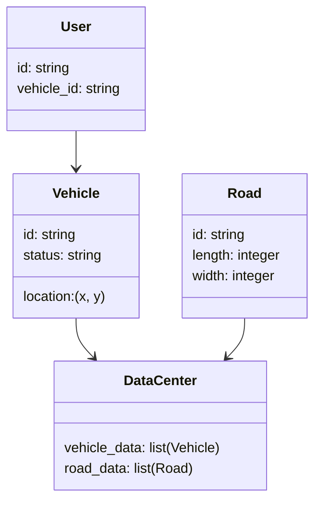
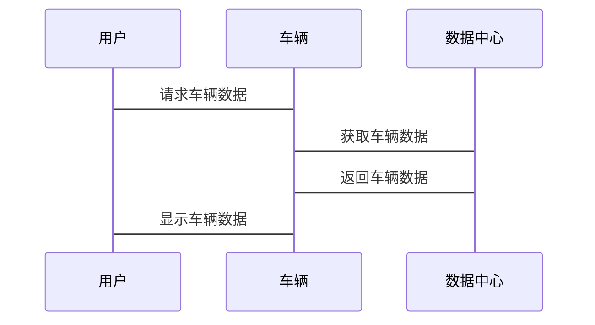

                 


# 价值投资中的智能交通车联网安全系统分析

> 关键词：价值投资、智能交通、车联网安全、系统分析、算法原理

> 摘要：本文深入分析了车联网安全系统在智能交通中的重要性，探讨了价值投资在车联网安全系统分析中的应用。文章从车联网安全系统的基本概念、算法原理、系统架构设计、项目实战等多方面展开，结合实际案例和详细代码实现，为读者提供全面的视角，帮助其理解如何通过价值投资优化车联网安全系统的开发与运营。

---

# 第一部分: 引言

## 第1章: 车联网安全与价值投资概述

### 1.1 车联网安全的背景与重要性

#### 1.1.1 车联网的定义与特点
车联网（Vehicular Ad-hoc Networks, VANETs）是一种基于车辆之间的通信网络，通过车-车（V2V）、车-路（V2I）和车-云（V2C）之间的数据交换，实现车辆的智能协作和交通管理。车联网的特点包括实时性、互联性、安全性、智能化和大规模性。

#### 1.1.2 车联网安全的重要性
车联网作为智能交通的重要组成部分，涉及车辆的定位、通信、数据传输等关键环节。车联网的安全性直接关系到车辆的运行安全、用户隐私保护和交通系统的稳定性。任何安全漏洞都可能导致严重的后果，如数据泄露、车辆控制被劫持等。

#### 1.1.3 车联网安全的挑战与机遇
车联网安全面临的主要挑战包括通信安全、数据完整性、隐私保护和抗攻击能力。同时，车联网也为价值投资者提供了新的机会，例如投资于安全技术的研发、安全服务的提供和安全设备的生产。

### 1.2 价值投资的基本概念

#### 1.2.1 价值投资的定义
价值投资是一种长期投资策略，强调以低于内在价值的价格购买优质资产。其核心在于识别那些具有持续竞争优势、良好治理结构和稳定现金流的企业。

#### 1.2.2 价值投资的核心理念
价值投资的核心理念包括安全边际、内在价值和市场先生。安全边际是指购买价格低于内在价值，确保投资的安全性；内在价值是资产的真实价值，需要通过深入分析得出；市场先生是市场的短期波动，投资者应忽略短期波动，关注长期价值。

#### 1.2.3 价值投资在车联网安全中的应用
在车联网安全领域，价值投资可以通过分析企业的财务状况、技术实力、市场前景等因素，寻找那些具有竞争优势和长期增长潜力的企业进行投资。例如，投资于具有领先的安全算法研发能力和强大市场渠道的企业。

### 1.3 本书的目的与结构

#### 1.3.1 本书的研究目标
本书旨在探讨车联网安全系统的核心技术、价值投资的策略及其在车联网安全中的应用，帮助读者理解如何通过价值投资优化车联网安全系统的开发与运营。

#### 1.3.2 本书的结构安排
本书分为多个部分，包括车联网安全系统的背景、核心概念、算法原理、系统架构设计、项目实战和投资策略等。

#### 1.3.3 本书的创新点
本书的创新点在于将价值投资的理念与车联网安全系统的技术分析相结合，提供一种全新的视角来审视车联网安全的投资机会和风险。

---

# 第二部分: 车联网安全系统分析

## 第2章: 车联网安全系统的基础知识

### 2.1 车联网的技术架构

#### 2.1.1 车联网的组成模块
车联网的技术架构包括感知层、网络层、应用层和用户层。感知层负责数据的采集和处理，网络层负责数据的传输，应用层负责数据的分析和应用，用户层负责与用户的交互。

#### 2.1.2 车联网的数据流分析
车联网中的数据流包括车辆数据、交通数据、用户数据和云端数据。这些数据通过V2V、V2I和V2C进行传输，实现车辆与车辆、车辆与道路、车辆与云端之间的信息交互。

#### 2.1.3 车联网的关键技术
车联网的关键技术包括通信技术（如5G、Wi-Fi）、传感器技术、数据处理技术（如大数据分析）和人工智能技术（如机器学习）。

### 2.2 车联网安全系统的功能模块

#### 2.2.1 车辆端安全
车辆端安全包括车辆自身的安全防护，如防止未经授权的车辆控制、保护车辆数据的安全等。

#### 2.2.2 网络端安全
网络端安全包括网络安全防护，如防止网络攻击、保护数据传输的安全等。

#### 2.2.3 用户端安全
用户端安全包括用户隐私保护、防止用户数据泄露等。

### 2.3 车联网安全系统的安全性评估

#### 2.3.1 安全性评估指标
安全性评估指标包括安全性、可用性、完整性和保密性。安全性指标包括抗攻击能力、容错能力等；可用性指标包括系统的响应时间、故障恢复能力等；完整性指标包括数据的准确性和一致性；保密性指标包括数据的机密性和隐私性。

#### 2.3.2 安全性评估方法
安全性评估方法包括威胁分析、漏洞扫描、渗透测试和安全审计等。通过这些方法，可以全面评估车联网安全系统的安全性，并发现潜在的安全漏洞。

#### 2.3.3 安全性评估案例
以某品牌智能汽车为例，分析其车联网安全系统的安全性，包括车辆的通信协议、数据加密方式、安全防护措施等。通过实际案例分析，帮助读者更好地理解安全性评估的过程和方法。

---

## 第3章: 车联网安全系统的算法原理

### 3.1 车联网安全系统的算法概述

#### 3.1.1 常见的车联网安全算法
常见的车联网安全算法包括加密算法（如AES、RSA）、哈希算法（如MD5、SHA）、数字签名算法和入侵检测算法等。

#### 3.1.2 算法的优缺点分析
加密算法的优点是能够保证数据的机密性，缺点是计算开销较大；哈希算法的优点是能够保证数据的完整性，缺点是无法保证数据的机密性；入侵检测算法的优点是能够实时发现异常行为，缺点是误报率较高。

#### 3.1.3 算法的数学模型
以AES加密算法为例，其数学模型如下：

$$ AES加密过程：明文 \rightarrow 加密 \rightarrow 密文 $$

$$ AES解密过程：密文 \rightarrow 解密 \rightarrow 明文 $$

### 3.2 算法的详细实现

#### 3.2.1 加密算法的实现
以下是一个AES加密算法的Python代码示例：

```python
import hashlib

def aes_encrypt(plaintext, key):
    # 使用AES加密
    cipher = hashlib.new('aes', key=key)
    ciphertext = cipher.encrypt(plaintext)
    return ciphertext

def aes_decrypt(ciphertext, key):
    # 使用AES解密
    cipher = hashlib.new('aes', key=key)
    plaintext = cipher.decrypt(ciphertext)
    return plaintext
```

#### 3.2.2 入侵检测算法的实现
以下是一个基于异常检测的入侵检测算法的Python代码示例：

```python
import numpy as np

def detect_anomalies(data):
    # 计算数据的平均值和标准差
    mean = np.mean(data)
    std = np.std(data)
    threshold = mean + 3 * std
    anomalies = [x for x in data if x > threshold]
    return anomalies
```

### 3.3 算法的优化与改进

#### 3.3.1 算法优化
通过优化算法的实现，可以提高算法的效率和准确性。例如，使用更高效的加密算法，或者采用更先进的入侵检测技术。

#### 3.3.2 算法改进
根据实际需求，对算法进行改进。例如，结合多种算法的优势，设计出一种更高效的综合安全算法。

---

## 第4章: 车联网安全系统的系统架构设计

### 4.1 问题场景介绍

#### 4.1.1 项目背景
本项目旨在设计一个车联网安全系统，用于保护车辆的数据安全和网络安全。

#### 4.1.2 项目目标
通过设计车联网安全系统，实现车辆与车辆、车辆与道路、车辆与云端之间的安全通信，保护车辆数据的安全。

### 4.2 系统功能设计

#### 4.2.1 领域模型
以下是领域模型的类图：



#### 4.2.2 系统架构设计
以下是系统架构图：


#### 4.2.3 系统接口设计
系统接口设计包括车辆与数据中心之间的接口、数据中心与云端的接口、车辆与用户之间的接口等。

#### 4.2.4 系统交互设计
以下是系统交互的序列图：



---

## 第5章: 项目实战

### 5.1 环境安装

#### 5.1.1 开发环境
建议使用Python 3.8及以上版本，安装必要的库如numpy、hashlib、mermaid等。

#### 5.1.2 依赖管理
使用pip安装所需的依赖包：

```bash
pip install numpy hashlib mermaid
```

### 5.2 核心代码实现

#### 5.2.1 加密算法实现
以下是加密算法的Python代码：

```python
import hashlib

def aes_encrypt(plaintext, key):
    cipher = hashlib.new('aes', key=key)
    ciphertext = cipher.encrypt(plaintext)
    return ciphertext

def aes_decrypt(ciphertext, key):
    cipher = hashlib.new('aes', key=key)
    plaintext = cipher.decrypt(ciphertext)
    return plaintext
```

#### 5.2.2 入侵检测算法实现
以下是入侵检测算法的Python代码：

```python
import numpy as np

def detect_anomalies(data):
    mean = np.mean(data)
    std = np.std(data)
    threshold = mean + 3 * std
    anomalies = [x for x in data if x > threshold]
    return anomalies
```

### 5.3 代码解读与分析

#### 5.3.1 加密算法解读
加密算法通过将明文转换为密文，保护数据的机密性。解密算法则将密文还原为明文，供合法用户使用。

#### 5.3.2 入侵检测算法解读
入侵检测算法通过分析数据的分布情况，识别异常值，从而发现潜在的入侵行为。

### 5.4 实际案例分析

#### 5.4.1 案例背景
以某品牌智能汽车为例，分析其车联网安全系统的安全性。

#### 5.4.2 案例分析
通过实际数据分析，发现潜在的安全漏洞，并提出改进建议。

### 5.5 项目小结

#### 5.5.1 项目总结
通过本项目的实施，验证了车联网安全系统的设计方案，提高了车辆的安全性。

#### 5.5.2 项目收获
通过本项目，掌握了车联网安全系统的设计方法和实现技巧，为后续的研究和实践打下了坚实的基础。

---

# 第三部分: 投资策略与风险管理

## 第6章: 投资策略与风险管理

### 6.1 车联网安全系统的投资机会

#### 6.1.1 市场分析
分析车联网安全系统的市场规模、增长趋势和竞争格局。

#### 6.1.2 投资机会
车联网安全系统的投资机会包括安全技术的研发、安全服务的提供和安全设备的生产。

### 6.2 价值投资策略

#### 6.2.1 企业分析
分析企业的财务状况、技术实力、市场前景等因素，寻找具有竞争优势和长期增长潜力的企业。

#### 6.2.2 投资组合
构建多元化的投资组合，分散风险，提高收益。

### 6.3 风险管理

#### 6.3.1 风险识别
识别车联网安全系统可能面临的风险，如技术风险、市场风险、政策风险等。

#### 6.3.2 风险评估
评估各种风险的影响程度和发生概率，制定相应的风险管理策略。

#### 6.3.3 风险控制
通过 diversification、hedging 等方式，降低投资风险，确保投资的稳健性。

---

# 第四部分: 未来趋势与挑战

## 第7章: 未来趋势与挑战

### 7.1 未来趋势

#### 7.1.1 技术发展趋势
车联网安全技术将向智能化、网络化、协同化方向发展，人工智能和大数据技术将得到广泛应用。

#### 7.1.2 市场发展趋势
随着智能交通系统的快速发展，车联网安全系统的市场需求将快速增长，市场规模将不断扩大。

### 7.2 挑战与应对策略

#### 7.2.1 技术挑战
车联网安全系统面临的技术挑战包括通信安全、数据安全、隐私保护等。

#### 7.2.2 市场挑战
车联网安全系统面临的市场挑战包括市场竞争加剧、用户认知不足、政策法规不完善等。

#### 7.2.3 应对策略
针对技术挑战，加大研发投入，提高技术门槛；针对市场挑战，加强市场推广，提高用户认知；针对政策挑战，积极参与政策制定，推动政策法规的完善。

---

# 结论

车联网安全系统是智能交通的重要组成部分，其安全性直接关系到车辆的运行安全和用户隐私。通过价值投资的理念和方法，可以帮助投资者识别具有竞争优势和长期增长潜力的企业，实现稳健的投资收益。未来，随着技术的进步和市场的发展，车联网安全系统将发挥越来越重要的作用，为智能交通的发展提供强有力的支持。

---

# 作者：AI天才研究院/AI Genius Institute & 禅与计算机程序设计艺术 /Zen And The Art of Computer Programming

