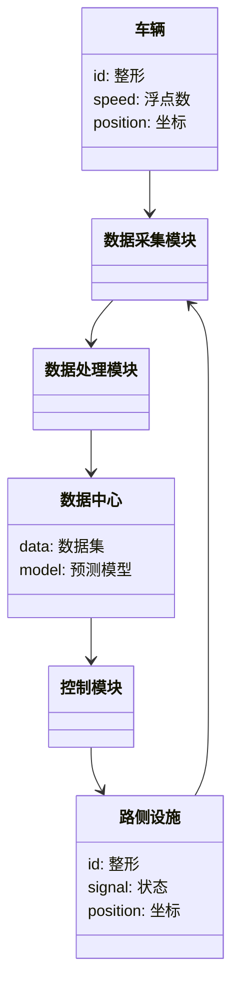
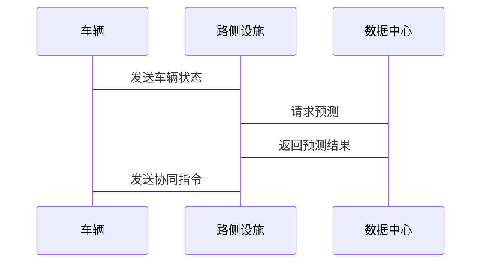

                 


# 价值投资中的智能交通车路协同系统分析

## 关键词：智能交通、车路协同、价值投资、算法原理、系统架构、投资策略

## 摘要：  
本文从价值投资的角度分析智能交通中的车路协同系统，探讨其在交通优化、投资决策中的应用价值。通过详细分析车路协同系统的概念、架构、协同机制、算法原理及投资策略，揭示其在智能交通领域的核心价值和未来发展方向。

---

# 第一部分: 车路协同系统概述

## 第1章: 车路协同系统的背景与概念

### 1.1 车路协同的定义与背景
车路协同（Vehicular Communication，VC）是一种通过车辆与道路基础设施之间的通信，实现车辆与环境交互的智能交通系统。其核心目标是提高交通效率、减少事故发生率并优化资源利用。随着5G、物联网和人工智能技术的快速发展，车路协同已成为智能交通领域的重要研究方向。

**问题背景：**  
传统交通系统依赖人工驾驶和交通信号灯控制，存在效率低、资源浪费和安全隐患等问题。车路协同通过实时信息交互，能够实现车辆与道路的高效协同，从而优化交通流量和安全性。

**问题解决：**  
车路协同通过通信技术、传感器和数据处理技术，实现车辆与道路设施之间的实时信息共享，从而优化交通信号控制、路径规划和驾驶行为。

**边界与外延：**  
车路协同的外延包括车车通信（V2V）、车路通信（V2I）和车云通信（V2C）等。其边界在于通信范围和技术实现方式。

### 1.2 车路协同系统的组成与架构
车路协同系统由多个核心要素组成，包括：

- **车辆端：** 车载传感器（如摄像头、雷达）、车载通信设备。
- **路侧端：** 路侧传感器、交通信号灯控制器、通信设备。
- **云端：** 数据处理中心、交通管理系统。

**概念结构与核心要素：**

- **数据采集：** 通过传感器和通信设备获取车辆和道路的实时数据。
- **数据传输：** 通过5G、Wi-Fi、蓝牙等技术实现数据的实时传输。
- **数据处理：** 利用算法对数据进行分析，生成控制指令。
- **协同控制：** 根据处理结果优化交通信号、车辆路径。

**核心属性对比：**

| 核心要素 | 描述 | 属性 | 对比 |
|----------|------|------|------|
| 数据采集 | 获取车辆和道路状态 | 实时性、准确性 | 传感器 vs. 人工记录 |
| 数据传输 | 数据的通信 | 速度、带宽 | 5G vs. 4G |
| 数据处理 | 数据分析与决策 | 精度、效率 | 机器学习 vs. 规则引擎 |

---

## 第2章: 车路协同系统的协同机制

### 2.1 协同机制的核心原理
车路协同的核心机制包括车车协同、车路协同和路路协同。其中：

- **车车协同（V2V）：** 车辆之间通过通信技术共享位置、速度和意图信息，避免碰撞。
- **车路协同（V2I）：** 车辆与路侧设施（如交通信号灯）通信，优化信号控制。
- **路路协同（I2I）：** 路侧设施之间的信息共享，优化道路资源分配。

**实现原理：**  
车路协同通过通信协议（如LTE-V、5G）实现数据传输，利用边缘计算和云计算技术进行实时数据处理，生成协同控制指令。

**优化策略：**  
- **降低延迟：** 通过边缘计算减少数据传输延迟。
- **提高可靠性：** 采用多路径通信和冗余设计。
- **增强安全性：** 通过加密通信和安全协议保障数据安全。

### 2.2 协同机制的优化与改进
现有协同机制的不足包括通信延迟、数据冗余和计算资源不足。未来可以通过以下方式优化：

- **边缘计算：** 将计算资源部署在路边，减少数据传输距离。
- **智能调度：** 利用AI算法优化通信资源分配。
- **多技术融合：** 结合5G、AI和区块链技术，提升协同效率。

---

# 第二部分: 车路协同系统的算法与系统架构

## 第3章: 车路协同系统的算法原理

### 3.1 数据预处理与特征提取
**数据预处理：**  
- 清洗数据：去除噪声和异常值。
- 数据增强：通过插值方法补充缺失数据。

**特征提取：**  
- 时间特征：速度、加速度、时间戳。
- 空间特征：位置、方向、距离。
- 行为特征：驾驶意图、路径偏移。

### 3.2 协同预测模型的构建
**模型选择：**  
常用的预测模型包括随机森林、支持向量机（SVM）和长短期记忆网络（LSTM）。

**模型训练：**  
以交通流量预测为例，利用历史数据训练LSTM模型：

$$ LSTM(t) = \sigma(W_{f} \cdot [h(t-1), x(t)] + b_f) $$

其中，$h(t)$ 是隐藏层状态，$x(t)$ 是输入数据。

**模型评估：**  
通过均方误差（MSE）和准确率评估模型性能：

$$ MSE = \frac{1}{N}\sum_{i=1}^{N}(y_i - \hat{y}_i)^2 $$

### 3.3 算法优化与调参
**参数优化：**  
通过网格搜索（Grid Search）优化模型参数，如学习率、批次大小。

**算法对比：**  
通过对比不同模型的性能，选择最优模型。

**性能提升：**  
利用并行计算和分布式训练加速模型训练。

---

## 第4章: 车路协同系统的系统架构设计

### 4.1 系统功能模块设计
**功能模块：**  
- 数据采集模块：负责采集车辆和道路数据。
- 数据处理模块：对数据进行清洗、特征提取和预测。
- 控制模块：根据预测结果生成协同控制指令。

**领域模型（Mermaid类图）：**



### 4.2 系统架构设计
**系统架构（Mermaid架构图）：**


其中：
- I1：输入数据
- C1：通信模块
- D1：数据处理模块
- M1：模型预测模块
- C2：控制模块
- R1：输出结果

### 4.3 系统接口设计
**接口设计：**  
- 车辆与路侧设施之间的通信接口。
- 数据中心与路侧设施之间的数据接口。

**交互图（Mermaid序列图）：**



---

# 第三部分: 项目实战与投资策略

## 第5章: 项目实战

### 5.1 环境安装
**依赖环境：**  
- Python 3.8+
- NumPy、Pandas、Scikit-learn、Keras
- Mermaid图表工具

### 5.2 核心实现代码
**数据预处理代码：**

```python
import numpy as np
import pandas as pd

def preprocess_data(data):
    # 去除异常值
    data = data[(data['speed'] > 0) & (data['speed'] < 100)]
    # 插值填充缺失值
    data['acceleration'] = data['speed'].diff().fillna(0)
    return data
```

**模型训练代码：**

```python
from tensorflow.keras import layers

def build_model(input_shape):
    model = layers.Sequential()
    model.add(layers.LSTM(64, input_shape=input_shape))
    model.add(layers.Dense(1, activation='sigmoid'))
    model.compile(optimizer='adam', loss='binary_crossentropy', metrics=['accuracy'])
    return model
```

### 5.3 案例分析
**案例一：交通流量预测**  
通过车路协同系统预测某路段的交通流量，优化信号灯控制，减少拥堵。

**案例二：自动驾驶协同**  
通过车路协同实现自动驾驶车辆与路侧设施的协同，提升行驶效率和安全性。

### 5.4 项目小结
通过项目实战，验证了车路协同系统的可行性和有效性，为后续投资决策提供了数据支持。

---

## 第6章: 投资策略与最佳实践

### 6.1 投资策略
**技术可行性：** 选择技术成熟、市场认可度高的车路协同项目。  
**市场需求：** 关注政策支持和市场需求旺盛的地区。  
**投资回报：** 通过模型评估预测项目的经济效益。

### 6.2 最佳实践
- **技术跟踪：** 关注5G、AI等技术的最新发展。
- **风险管理：** 建立风险评估机制，降低投资风险。
- **长期布局：** 投资车路协同系统的长期发展，关注技术升级和市场扩展。

### 6.3 小结
通过科学的投资策略和最佳实践，投资者可以在车路协同系统中实现较高的投资回报。

---

# 结语

车路协同系统作为智能交通的核心技术，不仅能够优化交通效率，还具有巨大的投资价值。通过本文的分析，读者可以深入了解车路协同系统的技术原理、系统架构和投资策略，为未来的投资决策提供参考。

---

# 作者：AI天才研究院 & 禅与计算机程序设计艺术

