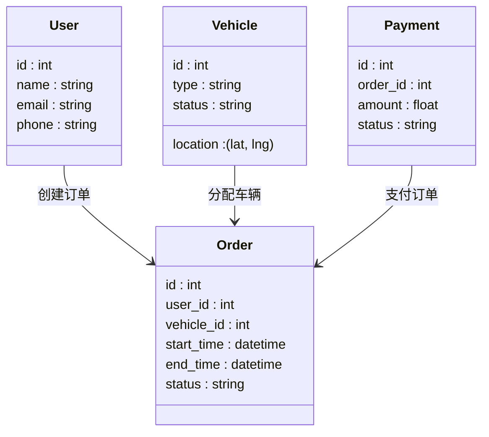
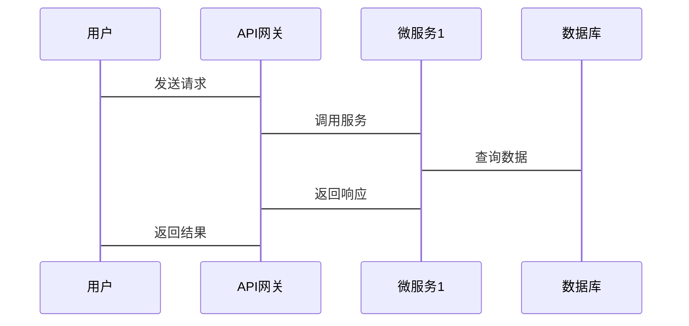

                 


# 价值投资中的智能交通车辆共享系统分析

---

## 关键词
- 价值投资
- 智能交通系统
- 共享经济
- 机器学习
- 系统架构

---

## 摘要
本文深入分析智能交通车辆共享系统的算法原理、系统架构和实际案例，帮助投资者识别该领域的投资价值。通过机器学习预测交通需求，设计系统架构，结合项目实战，提供详细的投资分析方法。

---

## 第一部分：智能交通车辆共享系统的背景与价值投资基础

### 第1章：智能交通车辆共享系统的背景与现状

#### 1.1 智能交通系统的发展背景

##### 1.1.1 智能交通系统的定义与特点
智能交通系统（ITS）利用信息技术优化交通管理，特点包括实时性、数据驱动和智能化。

##### 1.1.2 智能交通系统的全球发展现状
 ITS在欧美和亚洲发展迅速，特别是在城市交通管理中的应用。

##### 1.1.3 智能交通系统的技术趋势
 包括物联网、大数据和人工智能的集成应用。

#### 1.2 共享经济与车辆共享模式

##### 1.2.1 共享经济的定义与特点
 共享经济通过共享资源提高利用率，特点包括按需分配和高效利用。

##### 1.2.2 车辆共享的商业模式
 包括共享单车、共享汽车，通过订阅或按次收费。

##### 1.2.3 共享车辆在城市交通中的应用
 解决城市交通拥堵和资源浪费问题。

#### 1.3 价值投资的基本概念与方法

##### 1.3.1 价值投资的定义与核心理念
 寻找市场低估的优质企业进行投资，强调基本面分析和长期视角。

##### 1.3.2 价值投资的关键步骤与策略
 包括行业分析、财务指标评估、管理层分析和竞争优势评估。

##### 1.3.3 价值投资在智能交通领域的应用潜力
 ITS和共享经济企业具有高增长潜力，适合价值投资。

---

## 第二部分：智能交通车辆共享系统的核心概念与联系

### 第2章：智能交通车辆共享系统的核心要素

#### 2.1 系统的核心概念与属性

##### 2.1.1 智能交通车辆共享系统的构成要素
 包括用户、车辆、订单、支付和管理平台。

##### 2.1.2 各要素的属性与功能对比
 制作对比表格，展示所有权、使用权、交易方式等属性。

#### 2.2 实体关系图（ER图）

```mermaid
erDiagram
    user {
        id
        name
        email
    }
    vehicle {
        id
        type
        status
    }
    order {
        id
        user_id
        vehicle_id
        start_time
        end_time
        status
    }
    payment {
        id
        order_id
        amount
        status
    }
    user -|> order : 下单
    vehicle -|> order : 订单车辆
    payment -|> order : 支付订单
```

---

## 第三部分：智能交通车辆共享系统的算法原理讲解

### 第3章：智能交通车辆共享系统的算法原理

#### 3.1 数据分析与预测模型

##### 3.1.1 机器学习的应用场景
 预测交通需求、用户行为和车辆使用率。

##### 3.1.2 数据预处理与特征提取
 清洗数据，提取用户、时间和地理特征。

##### 3.1.3 算法选择与模型训练
 使用线性回归或随机森林进行建模。

##### 3.1.4 模型评估与优化
 通过交叉验证和超参数调优提升性能。

#### 3.2 代码实现

##### 3.2.1 数据预处理代码

```python
import pandas as pd
from sklearn.model_selection import train_test_split
from sklearn.linear_model import LinearRegression
from sklearn.metrics import mean_squared_error

# 加载数据
data = pd.read_csv('vehicle_sharing.csv')

# 数据清洗
data.dropna(inplace=True)
data['date'] = pd.to_datetime(data['date'])

# 特征提取
features = ['temperature', 'rainfall', 'hour']
target = 'demand'

X = data[features]
y = data[target]

# 划分训练集和测试集
X_train, X_test, y_train, y_test = train_test_split(X, y, test_size=0.2, random_state=42)

# 模型训练
model = LinearRegression()
model.fit(X_train, y_train)

# 模型预测
y_pred = model.predict(X_test)
print('均方误差:', mean_squared_error(y_test, y_pred))
```

##### 3.2.2 算法原理的数学公式
线性回归的最小二乘法公式为：
$$ \hat{y} = \beta_0 + \beta_1 x_1 + \beta_2 x_2 + \dots + \beta_n x_n $$

---

## 第四部分：智能交通车辆共享系统的系统分析与架构设计方案

### 第4章：智能交通车辆共享系统的系统分析与架构设计

#### 4.1 系统功能设计

##### 4.1.1 领域模型设计



#### 4.2 系统架构设计

##### 4.2.1 微服务架构图


#### 4.3 系统接口设计

##### 4.3.1 API接口定义



---

## 第五部分：项目实战与投资分析

### 第5章：项目实战与投资分析

#### 5.1 环境安装

##### 5.1.1 安装必要的工具与库
 安装Python、Jupyter Notebook、Pandas、Scikit-learn等。

#### 5.2 核心代码实现

##### 5.2.1 数据分析与预测代码

```python
import pandas as pd
from sklearn.ensemble import RandomForestRegressor
from sklearn.metrics import r2_score

# 加载数据
data = pd.read_csv('vehicle_sharing.csv')

# 数据清洗
data.dropna(inplace=True)
data['date'] = pd.to_datetime(data['date'])

# 特征提取
features = ['temperature', 'rainfall', 'hour', 'is_weekend']
target = 'demand'

X = data[features]
y = data[target]

# 划分训练集和测试集
X_train, X_test, y_train, y_test = train_test_split(X, y, test_size=0.2, random_state=42)

# 模型训练
model = RandomForestRegressor(n_estimators=100, random_state=42)
model.fit(X_train, y_train)

# 模型预测
y_pred = model.predict(X_test)
print('R²分数:', r2_score(y_test, y_pred))
```

#### 5.3 投资分析案例

##### 5.3.1 某城市共享单车系统的分析
 分析该系统的用户增长、收入模式和市场潜力，评估其投资价值。

---

## 第六部分：最佳实践与总结

### 第6章：最佳实践与总结

#### 6.1 小结

 智能交通车辆共享系统具有巨大的市场潜力，投资者应关注技术创新和商业模式优化。

#### 6.2 注意事项

 注意数据隐私、模型泛化能力和政策风险，确保投资决策的稳健性。

#### 6.3 拓展阅读

 推荐阅读《智能交通系统》和《共享经济与价值投资》等书籍，深入理解相关理论与实践。

---

## 作者：AI天才研究院/AI Genius Institute & 禅与计算机程序设计艺术/Zen And The Art of Computer Programming

---

本文通过系统分析智能交通车辆共享系统的算法原理、架构设计和项目实战，为投资者提供了详细的投资分析方法，帮助识别投资价值。

