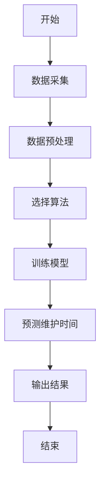
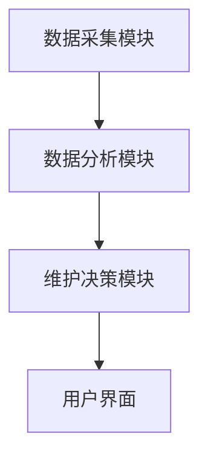

                 


# 价值投资中的智能制造预测性维护分析

> 关键词：智能制造、预测性维护、价值投资、算法原理、系统架构

> 摘要：本文深入探讨了智能制造中的预测性维护如何影响企业的运营效率和盈利能力，从而为价值投资者提供新的分析维度。通过分析预测性维护的核心概念、算法原理、系统架构以及实际案例，本文揭示了如何将预测性维护数据整合到价值投资策略中，以提升投资决策的准确性和有效性。

---

# 第1章: 智能制造与预测性维护概述

## 1.1 智能制造的背景与概念
### 1.1.1 智能制造的定义与特点
智能制造是一种通过数字化技术优化生产过程的先进制造模式，其特点包括自动化、数据化和智能化。它利用物联网（IoT）、大数据和人工智能（AI）等技术，实现生产过程的实时监控和优化。

### 1.1.2 预测性维护的基本概念
预测性维护（Predictive Maintenance）是一种基于设备状态数据的维护策略，旨在通过预测设备故障时间，提前安排维护，避免设备停机。与传统的预防性维护不同，预测性维护更具主动性，能够显著降低维护成本和停机时间。

### 1.1.3 价值投资与智能制造的结合
价值投资是一种通过分析企业的基本面，寻找被低估的投资标的的投资策略。在智能制造领域，预测性维护能够提高企业的运营效率和降低成本，从而增强企业的盈利能力和市场竞争力。这为企业提供了更高的估值空间，使其成为价值投资者的潜在目标。

## 1.2 预测性维护的背景与应用
### 1.2.1 预测性维护的定义
预测性维护是通过收集设备运行数据，利用数据分析技术预测设备故障，并安排最优的维护计划。这种方法能够减少设备停机时间，延长设备寿命，并降低维护成本。

### 1.2.2 预测性维护的实现方法
预测性维护的实现通常包括数据采集、数据分析和决策制定三个步骤。数据采集通过传感器获取设备运行参数，数据分析利用机器学习算法预测设备状态，决策制定根据预测结果安排维护计划。

### 1.2.3 预测性维护在制造业中的应用
预测性维护广泛应用于航空航天、汽车制造、化工等行业。例如，在航空领域，预测性维护能够有效减少飞机停飞时间，提高运营效率。

## 1.3 价值投资中的预测性维护分析
### 1.3.1 价值投资的基本概念
价值投资强调通过分析企业的财务状况、市场地位和竞争优势，寻找市场价格低于内在价值的投资标的。这种方法注重长期收益，而非短期市场波动。

### 1.3.2 预测性维护在价值投资中的作用
预测性维护能够提高企业的运营效率和降低成本，从而增强企业的盈利能力。对于价值投资者来说，企业通过预测性维护优化了生产流程，提升了产品竞争力，进而可能带来更高的利润和股价表现。

### 1.3.3 预测性维护分析的边界与外延
在价值投资中，预测性维护分析的边界包括设备数据的准确性、模型的预测精度以及维护策略的有效性。其外延则涉及企业整体运营效率的提升和市场竞争力的增强。

---

# 第2章: 预测性维护的核心概念与联系

## 2.1 预测性维护的核心原理
### 2.1.1 数据采集与处理
数据采集是预测性维护的基础，通常通过传感器获取设备的振动、温度、压力等参数。数据处理包括数据清洗、特征提取和数据预处理。

### 2.1.2 故障预测模型
故障预测模型是预测性维护的核心，常用的算法包括回归分析、时间序列分析和支持向量机（SVM）等。这些算法能够根据历史数据预测设备的健康状况。

### 2.1.3 维护决策优化
维护决策优化是根据预测结果制定最优的维护计划，包括维护时间、维护方式和维护成本的优化。

## 2.2 核心概念对比分析
### 2.2.1 预测性维护与传统维护的对比
预测性维护与传统维护的主要区别在于，前者基于数据预测，后者基于固定时间表。预测性维护能够减少维护成本和停机时间，而传统维护则可能导致设备过度维护或维护不足。

### 2.2.2 不同预测模型的特征对比
不同的预测模型在准确度、计算复杂度和实时性方面存在差异。例如，回归分析适合线性关系，而时间序列分析适合趋势预测。

### 2.2.3 维护策略的差异分析
维护策略的差异体现在预防性维护和修复性维护的选择上。预测性维护能够帮助企业在设备故障前进行维护，从而避免修复性维护的高成本。

---

# 第3章: 预测性维护的算法原理

## 3.1 常见预测算法介绍
### 3.1.1 回归分析
回归分析是一种统计学方法，用于预测设备的剩余寿命。线性回归模型可以通过以下公式表示：
$$ y = \beta_0 + \beta_1x + \epsilon $$
其中，$y$是目标变量，$x$是自变量，$\beta_0$和$\beta_1$是回归系数，$\epsilon$是误差项。

### 3.1.2 时间序列分析
时间序列分析适用于预测设备的未来状态。ARIMA模型是一种常用的时间序列模型，其数学表达式为：
$$ ARIMA(p, d, q) $$
其中，$p$是自回归阶数，$d$是差分阶数，$q$是移动平均阶数。

### 3.1.3 支持向量机
支持向量机（SVM）是一种监督学习算法，适用于分类和回归问题。SVM通过构建超平面将数据分成两类，适用于设备状态分类。

## 3.2 算法原理与流程图
### 3.2.1 算法流程图展示
以下是一个预测性维护算法的流程图：


### 3.2.2 算法实现步骤
1. 数据采集：通过传感器获取设备运行参数。
2. 数据预处理：清洗数据，提取特征。
3. 选择算法：根据数据类型和任务选择合适的算法。
4. 训练模型：使用训练数据训练模型。
5. 预测维护时间：利用模型预测设备故障时间。
6. 输出结果：生成维护计划。

### 3.2.3 算法优缺点分析
回归分析的优点是简单易懂，缺点是适用于线性关系。时间序列分析适合趋势预测，但对异常值敏感。支持向量机具有高维空间的分割能力，但计算复杂度较高。

---

# 第4章: 系统分析与架构设计

## 4.1 项目背景与目标
### 4.1.1 项目背景
随着制造业的智能化发展，预测性维护的需求日益增加。企业希望通过预测性维护提高生产效率和降低成本。

### 4.1.2 项目目标
本项目旨在开发一个基于预测性维护的智能维护系统，帮助企业在智能制造中实现高效维护。

## 4.2 系统功能设计
### 4.2.1 数据采集模块
数据采集模块负责采集设备的运行参数，包括振动、温度和压力等。

### 4.2.2 数据分析模块
数据分析模块对采集的数据进行处理和分析，生成设备的健康报告。

### 4.2.3 维护决策模块
维护决策模块根据分析结果制定维护计划，包括维护时间、方式和成本。

## 4.3 系统架构设计
### 4.3.1 系统架构图
以下是一个预测性维护系统的架构图：


### 4.3.2 系统接口设计
系统接口包括数据采集接口、数据分析接口和维护决策接口，确保模块之间的数据流畅通。

### 4.3.3 系统交互设计
系统交互设计包括用户与系统的操作流程，例如用户输入维护需求，系统生成维护计划。

---

# 第5章: 项目实战与案例分析

## 5.1 环境搭建与数据准备
### 5.1.1 工具安装
安装必要的工具，如Python、Jupyter Notebook和机器学习库（如Scikit-learn）。

### 5.1.2 数据来源与处理
数据来源包括传感器数据和历史维护记录，数据处理包括清洗和特征提取。

## 5.2 核心代码实现
### 5.2.1 数据采集代码
```python
import pandas as pd
import numpy as np

# 读取数据
data = pd.read_csv('设备数据.csv')
```

### 5.2.2 预测模型实现
```python
from sklearn.linear_model import LinearRegression

# 训练模型
model = LinearRegression()
model.fit(X_train, y_train)
```

### 5.2.3 维护决策代码
```python
# 预测维护时间
y_pred = model.predict(X_test)
```

## 5.3 案例分析
以某制造企业的设备维护为例，展示如何通过预测性维护优化维护计划，降低维护成本。

---

# 第6章: 最佳实践与投资策略

## 6.1 投资策略与风险管理
### 6.1.1 投资策略制定
在选择投资标的时，应考虑企业是否采用预测性维护，以及其对成本和效率的提升效果。

### 6.1.2 风险评估与控制
风险包括数据质量问题和模型准确性问题，需通过数据清洗和模型优化进行控制。

## 6.2 投资组合优化
通过分析不同企业的预测性维护应用情况，构建多元化投资组合，分散风险，提升收益。

---

作者：AI天才研究院/AI Genius Institute & 禅与计算机程序设计艺术 /Zen And The Art of Computer Programming

