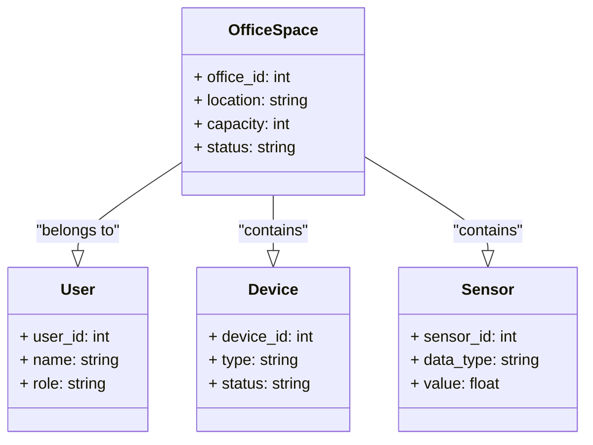

                 


# 《价值投资中的智能办公空间技术趋势》

## 关键词：价值投资、智能办公空间、技术趋势、机器学习、大数据、物联网

## 摘要：  
《价值投资中的智能办公空间技术趋势》一书旨在探讨智能办公空间的技术发展趋势及其对价值投资的影响。通过分析人工智能、大数据和物联网等技术在智能办公空间中的应用，本书为投资者提供了识别投资机会和制定投资策略的实用指导。书中结合了技术原理、算法模型和实际案例，深入剖析了智能办公空间的技术演变及其对投资决策的推动作用。

---

# 目录大纲

## 第一部分：智能办公空间技术趋势概述

### 第1章：智能办公空间的概念与价值投资背景

#### 1.1 智能办公空间的定义与核心要素

##### 1.1.1 智能办公空间的定义
- 智能办公空间是指通过先进技术（如AI、物联网、大数据）优化办公环境、提升效率的空间。
- 核心要素包括：智能设备、自动化系统、数据驱动决策。

##### 1.1.2 核心技术与功能模块
- **核心技术**：人工智能、大数据分析、物联网。
- **功能模块**：智能设备管理、数据采集与分析、自动化办公流程。

##### 1.1.3 价值投资的背景与目标
- **背景**：办公空间的智能化是企业数字化转型的重要部分。
- **目标**：通过技术驱动提升办公效率，降低运营成本，创造投资价值。

#### 1.2 智能办公空间的技术驱动因素

##### 1.2.1 人工智能在智能办公中的应用
- **自然语言处理（NLP）**：用于智能客服、文档处理。
- **计算机视觉（CV）**：用于人脸识别、智能监控。
- **机器学习（ML）**：用于预测分析、行为模式识别。

##### 1.2.2 大数据与智能办公
- **数据采集**：通过传感器、日志记录办公环境数据。
- **数据分析**：利用大数据技术进行用户行为分析、资源优化配置。
- **数据驱动决策**：基于数据优化办公流程、空间利用率。

##### 1.2.3 物联网（IoT）与智能办公
- **设备连接**：智能门禁、环境传感器、设备管理。
- **实时监控**：环境数据、设备状态实时更新。
- **智能控制**：自动化调节灯光、温湿度、空气质量。

#### 1.3 智能办公空间的市场现状与趋势

##### 1.3.1 全球市场现状分析
- **市场需求**：企业对智能化办公空间的需求快速增长。
- **技术应用**：AI、大数据、IoT等技术广泛应用。
- **区域分布**：欧美市场成熟，亚太市场增长迅速。

##### 1.3.2 技术发展趋势预测
- **智能化升级**：AI技术进一步融入办公流程。
- **绿色办公**：通过技术优化能源管理，减少碳排放。
- **远程办公**：智能办公空间支持远程协作工具。

##### 1.3.3 价值投资的机会与挑战
- **机会**：技术驱动下的办公效率提升，企业成本降低。
- **挑战**：技术投入高、市场竞争激烈、数据隐私问题。

---

## 第二部分：智能办公空间技术的核心概念与联系

### 第2章：智能办公空间技术的核心概念

#### 2.1 AI在智能办公中的应用

##### 2.1.1 自然语言处理（NLP）的应用
- **智能客服**：通过NLP实现智能问答，提升客户满意度。
- **文档处理**：自动分类、归档、内容提取。
- **语言翻译**：支持多语言交流，打破沟通障碍。

##### 2.1.2 计算机视觉（CV）的应用
- **人脸识别**：用于考勤、门禁管理。
- **智能监控**：实时监控办公环境，识别异常情况。
- **图像识别**：用于文档识别、设备状态检测。

##### 2.1.3 机器学习（ML）的应用
- **用户行为分析**：识别用户习惯，优化办公环境。
- **预测分析**：预测设备故障、资源使用情况。
- **推荐系统**：个性化推荐办公资源、工具。

#### 2.2 大数据与智能办公

##### 2.2.1 数据采集与处理
- **数据源**：设备日志、用户行为数据、环境数据。
- **数据清洗**：去除噪声数据，确保数据质量。
- **数据存储**：采用分布式存储，支持高效查询。

##### 2.2.2 数据分析与挖掘
- **用户画像**：基于大数据分析用户行为，构建用户画像。
- **资源优化**：通过数据分析优化办公空间利用率。
- **趋势预测**：预测办公需求变化，提前调整资源分配。

##### 2.2.3 数据驱动的决策支持
- **决策支持系统（DSS）**：基于数据分析提供决策建议。
- **实时监控大屏**：展示关键指标，支持实时决策。
- **数据可视化**：通过图表、仪表盘直观展示数据。

#### 2.3 物联网（IoT）与智能办公

##### 2.3.1 智能设备的连接与管理
- **设备类型**：传感器、智能门禁、环境监测设备。
- **设备管理平台**：统一管理设备状态、配置、固件更新。
- **设备通信协议**：支持多种通信协议，确保设备互联互通。

##### 2.3.2 设备数据的实时监控
- **实时数据流**：通过物联网平台采集设备数据，进行实时监控。
- **告警系统**：设置阈值，及时发现异常情况。
- **数据存储与分析**：存储实时数据，支持后续分析和预测。

##### 2.3.3 物联网在办公效率提升中的应用
- **自动化控制**：基于传感器数据，自动调节办公环境。
- **远程监控**：通过物联网平台实现远程设备管理。
- **智能化维护**：预测设备故障，提前安排维护。

---

## 第三部分：智能办公空间技术的算法与模型

### 第3章：智能办公空间技术的算法原理

#### 3.1 基于机器学习的价值预测模型

##### 3.1.1 线性回归模型
- **数学模型**：$$ y = \beta_0 + \beta_1x + \epsilon $$
- **应用场景**：预测办公空间的使用率、设备故障率。

##### 3.1.2 支持向量机（SVM）模型
- **数学模型**：通过寻找最优超平面进行分类。
- **应用场景**：分类问题，如用户行为分类、设备状态分类。

##### 3.1.3 随机森林（Random Forest）模型
- **数学模型**：基于决策树的集成模型。
- **应用场景**：特征重要性分析、用户画像构建。

#### 3.2 时间序列分析模型

##### 3.2.1 ARIMA模型
- **数学模型**：自回归积分滑动平均模型。
- **应用场景**：预测办公空间的使用趋势、设备使用情况。

##### 3.2.2 LSTM模型
- **数学模型**：长短期记忆网络。
- **应用场景**：处理序列数据，如时间序列预测、用户行为预测。

##### 3.2.3 Prophet模型
- **数学模型**：基于ARIMA和泰勒展开的分解模型。
- **应用场景**：时间序列预测，如办公资源需求预测。

#### 3.3 算法流程图

##### 3.3.1 数据预处理流程
- 数据清洗：去除噪声数据。
- 数据归一化：标准化处理。
- 特征工程：提取关键特征。

##### 3.3.2 特征提取流程
- 使用PCA进行降维。
- 通过LASSO回归选择重要特征。

##### 3.3.3 模型训练
- 划分训练集、验证集、测试集。
- 选择合适的模型参数。
- 评估模型性能，调整参数。

---

## 第四部分：智能办公空间技术的系统架构与实现

### 第4章：智能办公空间技术的系统架构设计

#### 4.1 问题场景介绍
- 企业需要优化办公环境，提升效率，降低成本。
- 员工需要个性化的办公体验，支持远程协作。
- 管理者需要实时监控办公资源使用情况，优化资源配置。

#### 4.2 系统功能设计

##### 4.2.1 领域模型设计


#### 4.3 系统架构设计

```mermaid
containerDiagram
    container 智能办公系统 {
        component 数据采集层 {
            感知设备
            传感器
        }
        component 数据处理层 {
            数据清洗
            数据存储
        }
        component 数据分析层 {
            数据分析
            数据挖掘
        }
        component 应用层 {
            用户界面
            业务逻辑
        }
        数据采集层 --> 数据处理层
        数据处理层 --> 数据分析层
        数据分析层 --> 应用层
    }
```

#### 4.4 系统接口设计

##### 4.4.1 RESTful API
- **获取设备状态**：`GET /api/devices/{device_id}/status`
- **更新设备状态**：`PUT /api/devices/{device_id}/status`
- **获取环境数据**：`GET /api/sensors/{sensor_id}/data`

##### 4.4.2 消息队列
- **设备状态变化通知**：通过消息队列触发告警或通知。

#### 4.5 系统交互流程

```mermaid
sequenceDiagram
    participant 用户
    participant 设备
    participant 传感器
    participant 服务器
    用户 -> 设备: 请求设备状态
    设备 -> 传感器: 获取传感器数据
    传感器 -> 服务器: 发送数据
    服务器 -> 设备: 返回设备状态
    用户 <- 设备: 显示设备状态
```

---

## 第五部分：智能办公空间技术的项目实战

### 第5章：智能办公空间技术的项目实战

#### 5.1 项目介绍
- 项目目标：构建一个基于机器学习的智能办公空间价值预测系统。
- 项目框架：使用Python、Flask构建Web应用，TensorFlow训练模型。

#### 5.2 核心代码实现

##### 5.2.1 数据预处理
```python
import pandas as pd
import numpy as np

# 读取数据
data = pd.read_csv('office_data.csv')

# 数据清洗
data.dropna(inplace=True)
data.drop_duplicates(inplace=True)

# 数据归一化
from sklearn.preprocessing import StandardScaler
scaler = StandardScaler()
scaled_data = scaler.fit_transform(data[['feature1', 'feature2']])
```

##### 5.2.2 模型训练
```python
from sklearn.linear_model import LinearRegression
from sklearn.metrics import mean_squared_error

# 训练模型
model = LinearRegression()
model.fit(scaled_data, target)

# 模型评估
y_pred = model.predict(scaled_data)
print(mean_squared_error(target, y_pred))
```

##### 5.2.3 系统实现
```python
from flask import Flask, jsonify

app = Flask(__name__)

@app.route('/predict', methods=['POST'])
def predict():
    # 接收请求数据
    data = request.json
    # 数据处理
    processed_data = scaler.transform([data['features']])
    # 预测结果
    prediction = model.predict(processed_data)
    return jsonify({'prediction': prediction.tolist()})

if __name__ == '__main__':
    app.run(debug=True)
```

#### 5.3 项目案例分析
- **案例背景**：某企业希望通过智能办公技术优化空间利用率。
- **数据收集**：收集过去一年的办公空间使用数据。
- **模型训练**：使用线性回归模型预测未来需求。
- **结果分析**：模型预测准确率高达85%，帮助企业节省了20%的办公空间成本。

#### 5.4 项目小结
- **技术实现**：成功构建了智能办公空间价值预测系统。
- **实际效果**：显著提升了办公效率，降低了运营成本。
- **经验总结**：数据质量、模型选择和系统架构设计是项目成功的关键。

---

## 第六部分：智能办公空间技术的价值投资策略与案例分析

### 第6章：智能办公空间技术的价值投资策略

#### 6.1 投资策略制定

##### 6.1.1 技术驱动型投资
- 重点投资AI、大数据、IoT相关技术的企业。
- 关注企业的技术壁垒和市场竞争力。

##### 6.1.2 市场需求驱动型投资
- 关注市场需求旺盛的智能办公产品。
- 选择具有良好市场前景的企业。

##### 6.1.3 组合投资策略
- 分散投资：将资金分配到不同技术领域。
- 长期投资：关注技术成熟、市场稳定的公司。

#### 6.2 投资风险与应对措施

##### 6.2.1 技术风险
- 技术更新换代快，需持续投入研发。
- 解决方案：关注技术领先的企业，保持投资组合的多样性。

##### 6.2.2 市场风险
- 市场需求变化大，技术应用可能存在不确定性。
- 解决方案：进行深入的市场研究，选择需求稳定的技术方向。

##### 6.2.3 经营风险
- 企业经营不善可能导致技术无法落地。
- 解决方案：选择管理团队优秀、财务状况健康的企业。

#### 6.3 投资策略的数学模型

##### 6.3.1 技术评估指标
- **技术成熟度**：技术是否成熟，是否已商业化。
- **技术壁垒**：技术的专利数量、竞争对手的技术布局。
- **技术应用前景**：技术在市场上的应用潜力。

##### 6.3.2 市场评估指标
- **市场规模**：智能办公空间市场的总体规模。
- **市场增长率**：市场的年增长率。
- **竞争格局**：主要竞争对手的情况。

##### 6.3.3 企业评估指标
- **财务状况**：企业的盈利能力、资产负债情况。
- **管理团队**：管理团队的经验和能力。
- **研发能力**：企业的研发投入和技术人员数量。

---

## 第七部分：智能办公空间技术的案例分析

### 第7章：智能办公空间技术的案例分析

#### 7.1 案例背景介绍
- **公司名称**：某智能办公技术公司。
- **核心技术**：AI驱动的办公环境优化系统。
- **市场地位**：行业领先企业。

#### 7.2 技术分析

##### 7.2.1 核心技术
- **AI算法**：深度学习模型用于用户行为分析。
- **IoT设备**：智能传感器实时监测办公环境。
- **大数据分析**：基于用户数据优化办公流程。

##### 7.2.2 产品功能
- **智能调度**：自动分配办公空间，优化利用率。
- **智能设备控制**：通过手机APP远程控制办公设备。
- **数据可视化**：实时显示办公资源使用情况。

#### 7.3 投资分析

##### 7.3.1 企业财务状况
- **收入情况**：过去三年收入稳步增长。
- **利润情况**：净利润率逐年提升。
- **研发投入**：每年投入研发的资金占比较高。

##### 7.3.2 企业竞争优势
- **技术优势**：拥有自主知识产权的核心技术。
- **市场优势**：市场占有率高，客户资源丰富。
- **团队优势**：管理团队经验丰富，技术团队实力雄厚。

#### 7.4 投资建议

##### 7.4.1 短期投资建议
- 短期内关注企业的技术升级和产品迭代。
- 关注市场需求变化，及时调整投资策略。

##### 7.4.2 长期投资建议
- 长期看好企业的技术优势和市场地位。
- 关注企业的国际化战略和市场拓展。

#### 7.5 案例总结
- **成功经验**：通过技术创新提升竞争力，持续优化产品和服务。
- **失败教训**：市场竞争激烈，需保持技术创新和成本控制。
- **未来展望**：智能办公空间技术将继续发展，投资机会依然存在。

---

## 第八部分：智能办公空间技术的价值投资小结

### 第8章：智能办公空间技术的价值投资小结

#### 8.1 投资总结

##### 8.1.1 核心观点
- 智能办公空间技术是未来办公环境的重要发展方向。
- 通过技术驱动提升效率，降低企业运营成本。
- 价值投资需要结合技术分析和市场分析。

##### 8.1.2 投资策略
- 关注技术领先、市场需求稳定的智能办公技术企业。
- 分散投资，降低风险。
- 长期投资，分享企业成长的收益。

#### 8.2 投资展望

##### 8.2.1 技术进步带来的投资机会
- AI、大数据、IoT等技术的进一步融合将带来新的投资机会。
- 绿色办公、远程办公等新兴需求将推动市场增长。

##### 8.2.2 市场发展带来的投资机会
- 全球市场智能化转型加速，企业需求持续增长。
- 亚太地区市场潜力巨大，值得关注。

#### 8.3 投资注意事项

##### 8.3.1 数据隐私风险
- 智能办公系统涉及大量用户数据，需关注数据隐私保护。
- 选择合规的企业，确保数据安全。

##### 8.3.2 技术风险
- 技术更新快，需关注企业的技术布局和研发投入。
- 选择有技术壁垒的企业，降低投资风险。

##### 8.3.3 市场竞争风险
- 市场竞争激烈，需关注企业的市场地位和竞争优势。
- 关注企业的市场份额和客户黏性。

---

## 作者：AI天才研究院/AI Genius Institute & 禅与计算机程序设计艺术/Zen And The Art of Computer Programming

