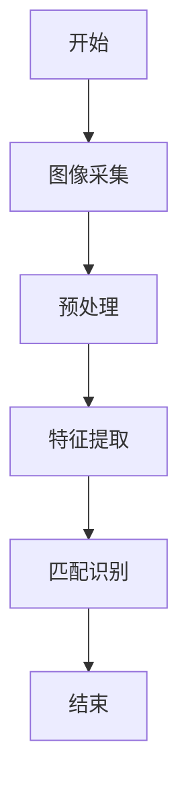
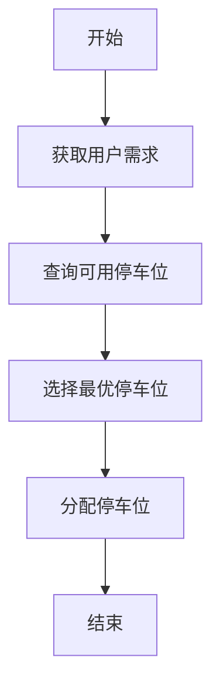
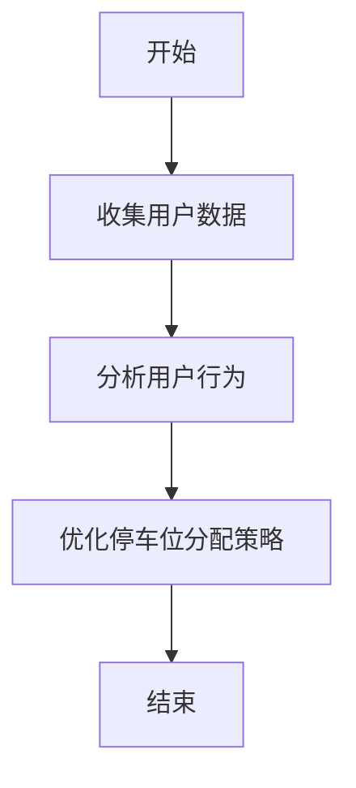
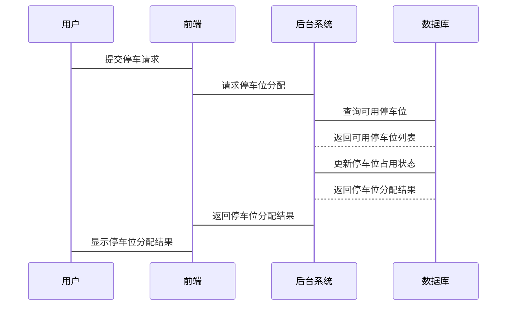

                 


# 价值投资中的智能城市停车管理系统分析

## 关键词：智能停车系统，价值投资，城市交通管理，算法优化，系统架构

## 摘要：本文深入分析智能城市停车管理系统在价值投资中的应用，探讨其技术实现、系统架构、项目实战及案例分析，帮助读者理解如何通过智能系统优化停车管理，实现经济效益最大化。

---

# 第一部分: 价值投资中的智能城市停车管理系统背景与概念

## 第1章: 智能城市停车管理系统概述

### 1.1 问题背景与价值分析

#### 1.1.1 城市停车问题的现状与挑战

随着城市化进程的加快，停车位不足、停车效率低下、停车资源浪费等问题日益突出。传统停车管理方式依赖人工管理，效率低且容易出错。智能城市停车管理系统通过自动化技术优化停车资源分配，提升停车效率，减少交通拥堵，具有重要的社会价值和经济价值。

#### 1.1.2 智能停车管理系统的核心价值

智能停车管理系统通过整合传感器、摄像头、车牌识别技术、算法优化等手段，实现停车位的智能化管理和用户服务的智能化。其核心价值体现在以下几个方面：

1. **提高停车效率**：通过实时停车位信息更新和智能分配，减少用户寻找停车位的时间。
2. **优化资源利用率**：通过动态调整停车位分配策略，充分利用空闲停车位，减少资源浪费。
3. **降低交通拥堵**：通过优化停车流程，减少因寻找停车位导致的交通拥堵问题。
4. **提升用户体验**：通过智能化服务，如预约停车、无感支付等，提升用户停车体验。

#### 1.1.3 价值投资视角下的停车管理优化

从价值投资的角度来看，智能停车管理系统不仅能够提高停车场的运营效率，还能通过数据驱动的优化策略，进一步挖掘停车资源的潜力。例如，通过数据分析，可以发现高峰时段和低谷时段的停车需求差异，并据此制定灵活的定价策略，从而提高停车场的收益。

### 1.2 智能停车管理系统的概念与特点

#### 1.2.1 智能停车管理系统的定义

智能停车管理系统是一种基于物联网、大数据和人工智能技术的智能化停车管理解决方案。通过部署智能传感器、摄像头和车牌识别设备，结合后台算法优化，实现停车位的实时监测、智能分配和用户服务的智能化。

#### 1.2.2 系统的核心功能与优势

智能停车管理系统的功能包括：

1. **实时停车位监测**：通过传感器和摄像头实时监测停车位的占用状态。
2. **智能分配停车位**：根据用户需求和停车位占用情况，智能分配最优停车位。
3. **预约停车**：用户可以通过手机APP或网页提前预约停车位。
4. **无感支付**：通过车牌识别和支付系统，实现无感支付。
5. **数据分析与优化**：通过数据分析，优化停车位分配策略和定价策略。

其优势在于高效、便捷和智能，能够显著提升停车管理效率和用户体验。

#### 1.2.3 与传统停车管理的区别

传统停车管理依赖人工管理，效率低且容易出错。而智能停车管理系统通过自动化技术实现了停车位的智能化管理和用户服务的智能化。与传统停车管理相比，智能停车管理系统具有更高的效率和更低的成本。

### 1.3 价值投资中的停车管理分析

#### 1.3.1 停车管理系统的经济效益

智能停车管理系统能够显著提高停车场的运营效率，减少人工成本，同时通过优化停车位分配策略和灵活定价，提高停车场的收益。例如，通过数据分析发现高峰时段和低谷时段的停车需求差异，制定灵活的定价策略，从而提高停车场的收益。

#### 1.3.2 价值投资的理论基础

价值投资的理论基础在于通过优化资源配置和提高效率，实现收益的最大化。智能停车管理系统通过优化停车位分配策略和提高运营效率，实现收益的最大化，符合价值投资的理论基础。

#### 1.3.3 系统优化与投资回报的关系

系统优化能够显著提高停车场的运营效率，减少人工成本，同时通过灵活定价策略提高收益。因此，系统优化与投资回报密切相关。通过系统优化，可以实现更高的投资回报率。

### 1.4 本章小结

本章主要介绍了智能城市停车管理系统的核心价值和与传统停车管理的区别，探讨了价值投资视角下的停车管理优化。通过分析智能停车管理系统的功能和优势，可以看出其在提高停车效率、优化资源利用率和提升用户体验方面具有重要的价值。

---

## 第2章: 智能停车管理系统的核心概念与联系

### 2.1 核心概念的原理分析

#### 2.1.1 车位分配与调度算法

车位分配与调度算法是智能停车管理系统的核心算法之一。通过实时监测停车位的占用状态，系统可以根据用户的需求和停车位的可用情况，智能分配最优停车位。常见的车位分配算法包括随机分配、最近空闲分配、最远空闲分配等。

#### 2.1.2 车牌识别技术

车牌识别技术是智能停车管理系统的重要组成部分。通过摄像头和图像处理技术，系统可以自动识别停车位上停放的车辆的车牌号，并更新停车位的占用状态。车牌识别技术的核心在于图像处理和模式识别。

#### 2.1.3 用户行为分析

用户行为分析是智能停车管理系统优化的重要手段。通过分析用户的停车需求、停车时间和支付习惯等，系统可以制定更加灵活的定价策略和停车位分配策略。

### 2.2 核心概念属性对比分析

#### 2.2.1 系统功能模块对比表

| 功能模块         | 描述                                   | 优点                                   | 缺点                                   |
|------------------|--------------------------------------|--------------------------------------|--------------------------------------|
| 车位实时监测     | 实时监测停车位的占用状态             | 实时更新，准确性高                   | 依赖传感器和摄像头的准确性           |
| 车牌识别技术     | 自动识别停车位上的车牌号           | 提高效率，减少人工干预               | 依赖图像处理技术和硬件设备的准确性   |
| 用户预约停车     | 用户可以提前预约停车位             | 方便用户，提高用户满意度             | 可能出现预约冲突                     |
| 无感支付         | 用户可以通过车牌识别实现无感支付     | 提高支付效率，减少用户操作           | 依赖支付系统的安全性                 |
| 数据分析与优化   | 通过数据分析优化停车位分配策略     | 提高效率，降低成本                   | 数据分析需要时间和计算资源           |

#### 2.2.2 系统功能模块的属性特征对比分析

| 功能模块         | 属性         | 特征描述                           |
|------------------|--------------|------------------------------------|
| 车位实时监测     | 数据实时性   | 高                                  |
|                  | 准确性       | 高                                  |
|                  | 响应速度     | 快                                  |
| 车牌识别技术     | 图像处理能力 | 强                                  |
|                  | 精确度       | 高                                  |
| 用户预约停车     | 方便性       | 高                                  |
|                  | 用户体验     | 好                                  |
| 无感支付         | 支付效率     | 高                                  |
|                  | 用户体验     | 好                                  |
| 数据分析与优化   | 分析能力     | 强                                  |
|                  | 优化效果     | 显著                                |

#### 2.2.3 系统功能模块的优缺点对比分析

| 功能模块         | 优点                                   | 缺点                                   |
|------------------|--------------------------------------|--------------------------------------|
| 车位实时监测     | 实时更新，准确性高                   | 依赖传感器和摄像头的准确性           |
| 车牌识别技术     | 提高效率，减少人工干预               | 依赖图像处理技术和硬件设备的准确性   |
| 用户预约停车     | 方便用户，提高用户满意度             | 可能出现预约冲突                     |
| 无感支付         | 提高支付效率，减少用户操作           | 依赖支付系统的安全性                 |
| 数据分析与优化   | 提高效率，降低成本                   | 数据分析需要时间和计算资源           |

### 2.3 ER实体关系图

```mermaid
erd
    parking_system
    actor: 用户
    parking_spot: 停车位
    vehicle: 车辆
    reservation: 预约记录
    payment: 支付记录
    actor --> parking_spot: 使用
    actor --> reservation: 创建
    reservation --> parking_spot: 关联
    actor --> payment: 完成
```

### 2.4 本章小结

本章详细分析了智能停车管理系统的核心概念，包括车位分配与调度算法、车牌识别技术和用户行为分析。通过对比分析系统功能模块的属性特征和优缺点，进一步明确了系统的核心功能和优化方向。

---

## 第3章: 智能停车管理系统的技术实现

### 3.1 算法原理与流程

#### 3.1.1 车牌识别算法

车牌识别算法是智能停车管理系统的重要组成部分。通过摄像头拍摄停车位上的车辆牌照，利用图像处理技术提取车牌号，实现停车位的占用状态监测。以下是车牌识别算法的流程图：



#### 3.1.2 车位分配与调度算法

车位分配与调度算法是智能停车管理系统的另一个核心技术。通过实时监测停车位的占用状态，系统可以根据用户需求和停车位可用情况，智能分配最优停车位。以下是车位分配与调度算法的流程图：



#### 3.1.3 用户行为分析算法

用户行为分析算法通过分析用户的停车需求、停车时间和支付习惯等，优化停车位分配策略和定价策略。以下是用户行为分析算法的流程图：



### 3.2 算法实现代码

以下是车牌识别算法的Python代码示例：

```python
import cv2

def detect_license_plate(image):
    # 车牌识别算法实现
    gray = cv2.cvtColor(image, cv2.COLOR_BGR2GRAY)
    # 图像预处理
    blurred = cv2.GaussianBlur(gray, (3, 3), 0)
    # 边缘检测
    edges = cv2.Canny(blurred, 50, 150)
    # 查找车牌区域
    contours, _ = cv2.findContours(edges, cv2.RETR_EXTERNAL, cv2.CHAIN_APPROX_SIMPLE)
    # 遍历所有轮廓，找到最大的矩形区域作为车牌
    max_area = 0
    license_plate = None
    for contour in contours:
        area = cv2.contourArea(contour)
        if area > max_area:
            max_area = area
            license_plate = contour
    if license_plate is not None:
        # 绘制车牌区域
        cv2.drawContours(image, [license_plate], -1, (0, 255, 0), 2)
        # 提取车牌字符
        # （此处省略具体的字符识别代码）
    return license_plate
```

### 3.3 算法优化与实现

车牌识别算法的优化可以通过改进图像预处理和特征提取算法来实现。例如，使用更高效的边缘检测算法和更准确的特征提取方法，可以提高车牌识别的准确率。

### 3.4 本章小结

本章详细讲解了智能停车管理系统的核心算法，包括车牌识别算法、车位分配与调度算法和用户行为分析算法。通过代码示例和流程图，进一步明确了算法的实现过程和优化方向。

---

## 第4章: 智能停车管理系统架构设计

### 4.1 系统功能模块设计

智能停车管理系统的功能模块包括：

1. **停车位实时监测模块**：实时监测停车位的占用状态。
2. **车牌识别模块**：自动识别停车位上停放的车辆的车牌号。
3. **用户预约模块**：用户可以通过手机APP或网页提前预约停车位。
4. **无感支付模块**：通过车牌识别和支付系统，实现无感支付。
5. **数据分析与优化模块**：通过数据分析，优化停车位分配策略和定价策略。

#### 4.1.1 功能模块的详细描述

停车位实时监测模块通过传感器和摄像头实时监测停车位的占用状态，并将数据传输到后台系统。车牌识别模块通过摄像头拍摄停车位上的车辆牌照，利用图像处理技术提取车牌号，并更新停车位的占用状态。用户预约模块允许用户通过手机APP或网页提前预约停车位，并将预约信息传输到后台系统。无感支付模块通过车牌识别和支付系统，实现无感支付。数据分析与优化模块通过数据分析，优化停车位分配策略和定价策略，提高停车场的运营效率和收益。

### 4.2 系统架构设计

智能停车管理系统的架构设计包括前端、后端和数据库三个部分。

#### 4.2.1 前端设计

前端包括用户界面和传感器接口。用户界面通过手机APP或网页实现用户与系统的交互，传感器接口用于连接停车位上的传感器和摄像头。

#### 4.2.2 后端设计

后端包括停车位实时监测模块、车牌识别模块、用户预约模块、无感支付模块和数据分析与优化模块。停车位实时监测模块通过传感器和摄像头实时监测停车位的占用状态，并将数据传输到后台系统。车牌识别模块通过摄像头拍摄停车位上的车辆牌照，利用图像处理技术提取车牌号，并更新停车位的占用状态。用户预约模块允许用户通过手机APP或网页提前预约停车位，并将预约信息传输到后台系统。无感支付模块通过车牌识别和支付系统，实现无感支付。数据分析与优化模块通过数据分析，优化停车位分配策略和定价策略，提高停车场的运营效率和收益。

#### 4.2.3 数据库设计

数据库设计包括停车位信息表、用户信息表、预约记录表和支付记录表。停车位信息表存储停车位的编号、位置和占用状态。用户信息表存储用户的基本信息，包括用户ID、姓名和联系方式。预约记录表存储用户的预约信息，包括预约时间、停车位编号和用户ID。支付记录表存储用户的支付信息，包括支付时间、支付金额和支付状态。

#### 4.2.4 系统交互流程设计

以下是系统交互流程的Mermaid序列图：



### 4.3 系统架构图

以下是智能停车管理系统架构的Mermaid图：


### 4.4 本章小结

本章详细讲解了智能停车管理系统的架构设计，包括功能模块设计、系统架构设计和系统交互流程设计。通过Mermaid图和序列图，进一步明确了系统各部分之间的关系和交互流程。

---

## 第5章: 智能停车管理系统项目实战

### 5.1 项目背景与目标

#### 5.1.1 项目背景

本项目旨在开发一个智能城市停车管理系统，通过整合传感器、摄像头和车牌识别技术，实现停车位的智能化管理和用户服务的智能化。

#### 5.1.2 项目目标

1. 实现实时停车位监测。
2. 实现车牌识别和停车位分配。
3. 实现用户预约停车和无感支付。
4. 实现数据分析与优化。

### 5.2 项目实施步骤

#### 5.2.1 环境安装

1. 安装Python和必要的开发工具。
2. 安装OpenCV和TensorFlow等图像处理和机器学习库。
3. 安装数据库和服务器软件。

#### 5.2.2 系统核心实现

以下是停车位实时监测模块的Python代码示例：

```python
import serial

def read_sensor_data(port):
    ser = serial.Serial(port, 9600)
    while True:
        data = ser.readline().decode()
        if data:
            return data
    return None
```

#### 5.2.3 系统测试与优化

1. 测试系统功能模块，确保各模块正常运行。
2. 优化系统性能，提高停车位监测的实时性和准确性。
3. 通过用户测试反馈，进一步优化用户体验。

### 5.3 项目小结

本章通过一个具体的项目实战，详细讲解了智能停车管理系统的开发和实施过程。通过环境安装、系统核心实现和系统测试与优化，进一步明确了系统开发的步骤和注意事项。

---

## 第6章: 价值投资中的停车管理分析与案例

### 6.1 价值投资视角下的停车管理分析

#### 6.1.1 停车管理系统的投资价值

智能停车管理系统通过优化停车位分配策略和提高运营效率，显著提高了停车场的收益。例如，通过数据分析发现高峰时段和低谷时段的停车需求差异，制定灵活的定价策略，从而提高停车场的收益。

#### 6.1.2 停车管理系统的市场前景

随着城市化进程的加快和智能技术的不断发展，智能停车管理系统市场需求巨大。未来，随着5G、物联网和人工智能技术的进一步发展，智能停车管理系统将更加智能化和高效化。

### 6.2 价值投资中的停车管理案例分析

#### 6.2.1 案例背景

某城市中心商业区的停车场，由于停车位有限，常常出现停车难的问题。通过引入智能停车管理系统，优化停车位分配策略和提高运营效率，显著提高了停车场的收益。

#### 6.2.2 案例分析

通过智能停车管理系统，停车场实现了停车位的实时监测和智能分配，用户可以通过手机APP预约停车位，并通过车牌识别实现无感支付。通过数据分析，优化停车位分配策略和定价策略，显著提高了停车场的收益。

#### 6.2.3 案例总结

通过智能停车管理系统的应用，停车场的运营效率和收益显著提高。这充分体现了智能停车管理系统在价值投资中的重要价值。

### 6.3 本章小结

本章通过价值投资视角，分析了智能停车管理系统的投资价值和市场前景，并通过具体案例分析，进一步明确了智能停车管理系统在价值投资中的应用和价值。

---

## 第7章: 总结与展望

### 7.1 本章总结

智能城市停车管理系统是一种基于物联网、大数据和人工智能技术的智能化停车管理解决方案。通过实时监测停车位的占用状态和智能分配停车位，显著提高了停车效率和用户体验。同时，通过数据分析和优化，显著提高了停车场的收益。

### 7.2 未来展望

随着智能技术的不断发展，智能停车管理系统将更加智能化和高效化。未来，随着5G、物联网和人工智能技术的进一步发展，智能停车管理系统将实现更加智能化的停车位分配和用户服务，进一步提高停车效率和用户体验。

### 7.3 本章小结

本章总结了智能城市停车管理系统的应用价值和未来发展方向，展望了智能停车管理系统在价值投资中的巨大潜力。

---

## 作者：AI天才研究院/AI Genius Institute & 禅与计算机程序设计艺术 /Zen And The Art of Computer Programming

