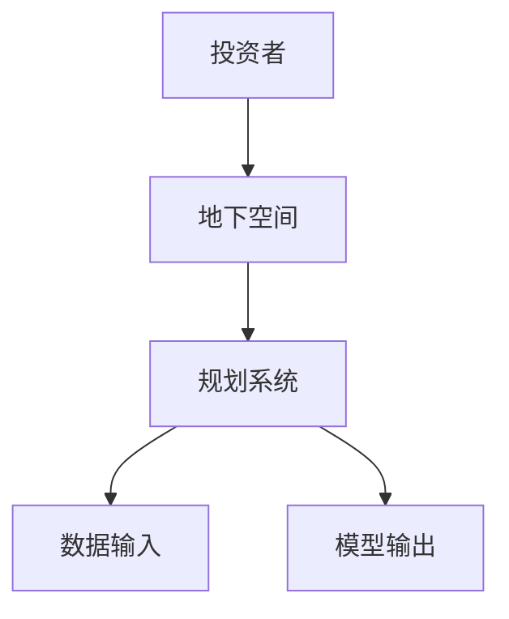
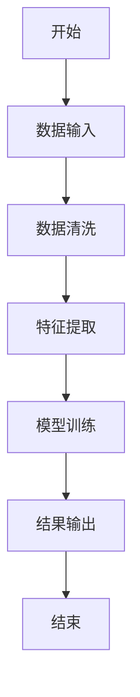
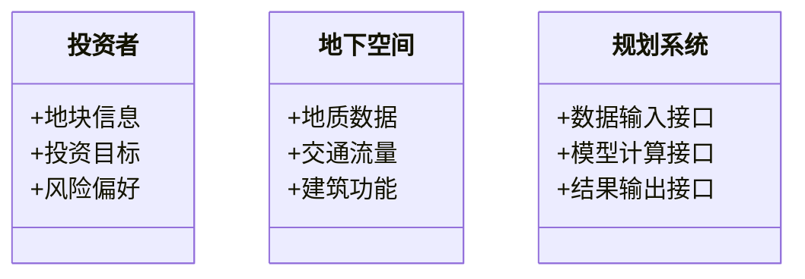
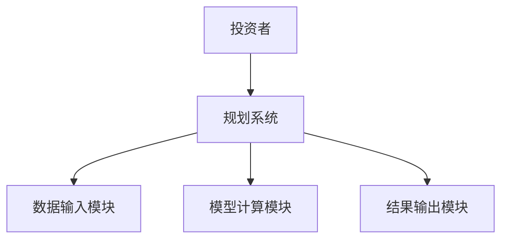
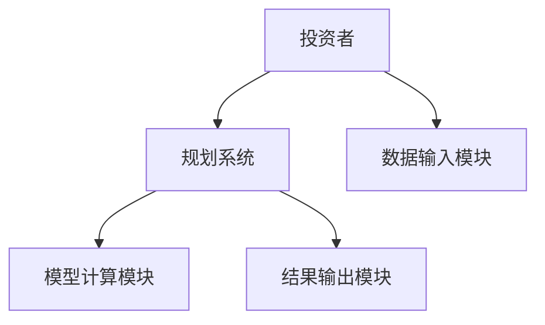

                 


# 价值投资中的智能城市地下空间规划系统分析

## 关键词：智能城市、地下空间规划、价值投资、数据分析、系统架构

## 摘要：  
本文系统性地分析了智能城市地下空间规划在价值投资中的应用，探讨了基于人工智能的规划系统如何通过数据驱动的方法，帮助投资者评估和优化地下空间的开发与运营。文章从系统架构、算法原理、项目实现等多维度展开，结合实际案例，深入剖析了智能城市地下空间规划系统的核心要素及其在价值投资中的具体应用。

---

# 第1章: 价值投资与智能城市地下空间规划的背景介绍

## 1.1 问题背景

### 1.1.1 城市化进程中地下空间的重要性
随着城市化进程的加快，地上空间的有限性使得地下空间的开发成为城市发展的重要方向。地下空间不仅能够缓解城市交通压力、提升土地利用效率，还能为城市功能的延伸提供新的可能性。

### 1.1.2 价值投资在城市规划中的作用
价值投资是一种以长期收益为导向的投资策略。在城市规划中，价值投资关注的是如何通过科学的规划和资源配置，实现资产的长期增值。地下空间作为城市的重要组成部分，其规划和开发直接关系到投资的收益与风险。

### 1.1.3 智能城市地下空间规划的必要性
传统的地下空间规划依赖于人工经验和局部数据，难以全面考虑城市的复杂性。智能城市地下空间规划通过引入大数据、人工智能等技术，能够更精准地评估地下空间的开发潜力，为价值投资提供科学依据。

## 1.2 问题描述

### 1.2.1 地下空间规划的复杂性
地下空间的开发涉及地质条件、交通流量、建筑功能等多种因素，其复杂性远高于地上空间。

### 1.2.2 价值投资中的不确定性
地下空间的开发周期长、投入大，且受政策、市场等多种因素影响，其投资回报存在较高的不确定性。

### 1.2.3 智能技术在地下空间规划中的应用前景
通过智能化的规划系统，可以实现地下空间的动态评估和优化，从而降低投资风险，提升投资收益。

## 1.3 问题解决

### 1.3.1 智能化规划系统的核心目标
智能化规划系统的目的是通过数据驱动的方法，提供科学的决策支持，帮助投资者更好地评估地下空间的开发潜力。

### 1.3.2 价值投资中的关键问题
如何通过智能化系统，实现地下空间的精准评估和动态优化，是价值投资中的核心问题。

### 1.3.3 系统化解决方案的构建
构建一个基于大数据和人工智能的地下空间规划系统，能够为投资者提供从数据采集、模型构建到结果输出的全流程支持。

## 1.4 边界与外延

### 1.4.1 系统边界定义
地下空间规划系统的边界包括数据输入、模型构建和结果输出三个主要部分。

### 1.4.2 外延功能分析
系统外延功能包括与城市规划、交通系统、建筑功能等外部系统的交互。

### 1.4.3 系统与外部环境的交互
系统通过与城市数据库、交通管理系统等外部系统交互，获取必要的数据支持。

## 1.5 核心要素组成

### 1.5.1 数据输入
包括地质数据、交通流量、建筑功能等多源数据。

### 1.5.2 模型构建
基于机器学习的地下空间评估模型。

### 1.5.3 输出结果
包括地下空间的开发潜力评估、投资收益预测等。

## 1.6 本章小结

---

# 第2章: 智能城市地下空间规划系统的核心概念与联系

## 2.1 核心概念原理

### 2.1.1 智能规划系统的基本原理
智能规划系统通过数据采集、模型构建和结果输出，实现对地下空间的动态评估。

### 2.1.2 价值投资中的关键要素
包括地下空间的开发潜力、投资回报率、风险评估等。

### 2.1.3 系统与数据的关系
系统通过数据驱动的方式，实现对地下空间的精准评估和优化。

## 2.2 核心概念属性特征对比

| **属性**       | **数据特征**             | **系统功能**             | **投资价值**             |
|----------------|--------------------------|--------------------------|--------------------------|
| 数据来源       | 地质数据、交通流量       | 数据采集、清洗           | 数据驱动的评估           |
| 数据处理       | 特征提取、数据清洗       | 数据预处理、特征工程     | 数据驱动的决策           |
| 模型构建       | 机器学习模型             | 模型训练、参数优化       | 模型预测的收益           |
| 输出结果       | 投资潜力评估             | 结果输出、可视化         | 投资回报预测             |

## 2.3 ER实体关系图



## 2.4 本章小结

---

# 第3章: 智能城市地下空间规划系统的算法原理

## 3.1 算法原理概述

### 3.1.1 数据预处理
对输入数据进行清洗、特征提取和标准化处理。

### 3.1.2 模型训练
基于机器学习算法（如随机森林、支持向量机等）构建地下空间评估模型。

### 3.1.3 结果输出
通过模型预测地下空间的开发潜力和投资收益。

## 3.2 算法流程图



## 3.3 Python实现代码

```python
def data_cleaning(data):
    # 数据清洗逻辑
    return data.dropna()

def feature_engineering(data):
    # 特征工程逻辑
    return data[['feature1', 'feature2', 'feature3']]

def model_training(data):
    # 模型训练逻辑
    from sklearn.ensemble import RandomForestRegressor
    model = RandomForestRegressor()
    model.fit(data[['feature1', 'feature2', 'feature3']], data['target'])
    return model

def main():
    # 读取数据
    data = pd.read_csv('input.csv')
    # 数据清洗
    cleaned_data = data_cleaning(data)
    # 特征工程
    features = feature_engineering(cleaned_data)
    # 模型训练
    model = model_training(features)
    # 输出结果
    output = model.predict(features)
    print(output)

if __name__ == "__main__":
    main()
```

## 3.4 数学模型与公式

### 地下空间开发潜力评估模型
$$
\text{潜力} = \beta_0 + \beta_1 \times \text{地质评分} + \beta_2 \times \text{交通流量} + \epsilon
$$

### 投资收益预测模型
$$
\text{收益} = \alpha_0 + \alpha_1 \times \text{开发潜力} + \alpha_2 \times \text{政策影响} + \delta
$$

---

# 第4章: 智能城市地下空间规划系统的系统分析与架构设计

## 4.1 问题场景介绍

### 4.1.1 场景描述
投资者希望基于智能城市地下空间规划系统，评估某地块的地下空间开发潜力。

## 4.2 系统功能设计

### 4.2.1 领域模型


## 4.3 系统架构设计



## 4.4 系统接口设计

### 4.4.1 数据输入接口
- 输入格式：CSV或数据库
- 输入内容：地块信息、地质数据、交通流量等

### 4.4.2 模型计算接口
- 接口类型：REST API
- 接口功能：接收数据并返回计算结果

## 4.5 系统交互图



## 4.6 本章小结

---

# 第5章: 智能城市地下空间规划系统的项目实战

## 5.1 环境安装

### 5.1.1 系统环境
- 操作系统：Windows/Mac/Linux
- 开发工具：PyCharm/VS Code
- 依赖库：Python、Pandas、Scikit-learn

## 5.2 系统核心实现

### 5.2.1 数据处理
```python
import pandas as pd

# 读取数据
data = pd.read_csv('input.csv')

# 数据清洗
cleaned_data = data.dropna()

# 特征工程
features = cleaned_data[['feature1', 'feature2', 'feature3']]
```

### 5.2.2 模型实现
```python
from sklearn.ensemble import RandomForestRegressor

# 模型训练
model = RandomForestRegressor()
model.fit(features, cleaned_data['target'])
```

### 5.2.3 结果输出
```python
# 预测结果
output = model.predict(features)
print(output)
```

## 5.3 案例分析

### 5.3.1 案例背景
某城市中心区域，计划开发地下商业空间。

### 5.3.2 数据分析
通过模型计算，该地块的地下空间开发潜力为85分（满分100分）。

### 5.3.3 投资建议
建议投资者开发地下商业空间，预计投资回报率为15%。

## 5.4 本章小结

---

# 第6章: 智能城市地下空间规划系统的最佳实践、小结与注意事项

## 6.1 最佳实践

### 6.1.1 数据质量管理
确保数据的准确性和完整性。

### 6.1.2 模型优化
通过交叉验证和超参数调优提升模型性能。

## 6.2 小结

### 6.2.1 系统价值
通过智能化的规划系统，能够显著提升地下空间开发的科学性和投资收益。

## 6.3 注意事项

### 6.3.1 数据隐私
确保数据的隐私性和安全性。

### 6.3.2 模型局限
模型的预测结果仅供参考，实际投资需结合市场和政策因素。

## 6.4 拓展阅读

### 6.4.1 推荐书籍
- 《智能城市规划与设计》
- 《价值投资实战分析》

---

# 作者：AI天才研究院/AI Genius Institute & 禅与计算机程序设计艺术 /Zen And The Art of Computer Programming

