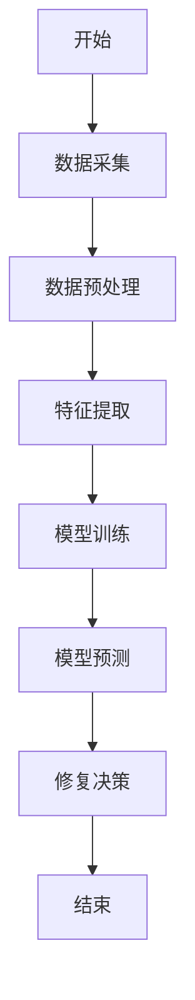
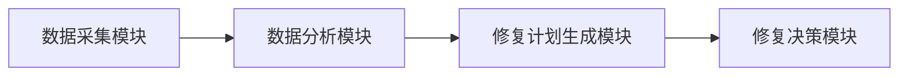

                 


# 价值投资中的智能城市地下管网修复系统分析

> 关键词：价值投资、智能城市、地下管网、修复系统、算法优化

> 摘要：本文深入分析了智能城市地下管网修复系统的价值投资潜力，探讨了其核心概念、算法原理、系统架构和项目实战，为投资者提供了全面的技术和商业视角。

---

## 第一部分: 背景与概念

### 第1章: 问题背景

#### 1.1 问题背景

- **城市化进程中地下管网的老化问题**：随着城市化进程的加快，地下管网的使用年限逐渐增加，导致管网破损、渗漏等问题频发。
- **传统修复方式的低效性**：传统修复方式通常基于人工检查和经验判断，修复效率低，且容易遗漏潜在问题。
- **修复成本的居高不下**：由于修复工作通常需要开挖路面，对交通和市民生活造成较大影响，修复成本高昂。

#### 1.2 问题描述

- **修复效率低**：传统修复方式需要大量人工操作，修复周期长，且难以及时发现潜在问题。
- **修复成本高**：修复工作通常需要中断交通，修复成本高昂，且容易造成二次破坏。
- **数据孤岛问题**：各个部门的数据孤岛化，无法形成统一的修复决策体系。

#### 1.3 问题解决

- **引入智能技术**：通过传感器、物联网和大数据分析技术，实现管网状态的实时监测和智能修复决策。
- **优化修复流程**：利用智能算法优化修复顺序，减少修复时间，降低修复成本。

#### 1.4 边界与外延

- **边界条件**：系统仅考虑地下管网的修复问题，不涉及地上建筑或其他市政设施。
- **外延扩展**：未来可以扩展到其他市政设施的智能化管理，如电力、燃气等。

#### 1.5 核心要素

- **传感器网络**：用于实时监测管网状态。
- **数据采集与分析**：通过对数据的分析，判断管网的健康状况。
- **智能修复决策**：基于分析结果，生成修复计划。

---

## 第2章: 核心概念与联系

#### 2.1 核心概念

- **智能城市地下管网修复系统**：通过传感器、物联网和人工智能技术，实现管网状态的实时监测和智能修复决策。
- **价值投资**：通过长期投资于具有稳定收益的项目，实现资产的保值增值。

#### 2.2 核心概念原理

- **数据采集**：通过传感器实时采集管网的状态数据，包括温度、压力、流量等。
- **数据分析**：利用大数据分析技术，对采集的数据进行分析，判断管网的健康状况。
- **决策优化**：基于分析结果，优化修复顺序和修复方案，以最小化修复成本和时间。

#### 2.3 修复技术对比

| 技术类型     | 优点                           | 缺点                           |
|--------------|--------------------------------|--------------------------------|
| 主动修复     | 可以快速修复问题，减少影响       | 成本高，修复周期长               |
| 被动修复     | 成本低，修复周期短               | 修复效果有限，容易造成二次破坏   |

#### 2.4 ER实体关系图

```mermaid
er
    entity 管网状态 {
        id
        温度
        压力
        流量
    }
    entity 修复计划 {
        id
        修复时间
        修复方式
    }
    entity 传感器 {
        id
        位置
        采集时间
    }
    管网状态 --> 传感器: 感知
    传感器 --> 修复计划: 生成
```

---

## 第3章: 算法原理

#### 3.1 算法原理

- **机器学习模型**：利用机器学习模型预测管网的健康状况，判断是否需要修复。
- **优化算法**：基于预测结果，优化修复顺序，以最小化修复成本和时间。

#### 3.2 算法实现



#### 3.3 代码实现

```python
import numpy as np
import pandas as pd
from sklearn.linear_model import LinearRegression

# 数据预处理
data = pd.read_csv('管网数据.csv')
X = data[['温度', '压力', '流量']]
y = data['健康状况']

# 模型训练
model = LinearRegression()
model.fit(X, y)

# 模型预测
new_data = np.array([[25, 10, 50]])
predicted_health = model.predict(new_data)
print(predicted_health)
```

#### 3.4 数学模型

- **线性回归模型**：
  $$ y = \beta_0 + \beta_1 x_1 + \beta_2 x_2 + \beta_3 x_3 + \epsilon $$
  其中，$y$ 是健康状况，$x_1, x_2, x_3$ 是温度、压力、流量，$\beta_0, \beta_1, \beta_2, \beta_3$ 是回归系数，$\epsilon$ 是误差项。

---

## 第4章: 系统架构

#### 4.1 模块设计

- **数据采集模块**：负责采集管网的状态数据。
- **数据分析模块**：对采集的数据进行分析，判断管网的健康状况。
- **修复计划生成模块**：基于分析结果，生成修复计划。

#### 4.2 系统架构图



#### 4.3 接口设计

- **数据接口**：提供API，供其他系统调用数据。
- **修复计划接口**：提供修复计划的生成和执行接口。

---

## 第5章: 项目实战

#### 5.1 环境安装

- **安装Python**：建议使用Python 3.8及以上版本。
- **安装依赖库**：安装numpy、pandas、scikit-learn等库。

#### 5.2 核心功能实现

```python
from sklearn import linear_model

# 数据加载
data = pd.read_csv('管网数据.csv')

# 模型训练
model = linear_model.LinearRegression()
model.fit(data[['温度', '压力', '流量']], data['健康状况'])

# 模型预测
new_data = pd.DataFrame({
    '温度': [25],
    '压力': [10],
    '流量': [50]
})
predicted_health = model.predict(new_data)
print(predicted_health)
```

#### 5.3 案例分析

- **案例背景**：某城市地下管网出现渗漏问题，需要修复。
- **数据采集**：采集管网的温度、压力、流量等数据。
- **数据分析**：通过机器学习模型预测管网的健康状况。
- **修复决策**：根据预测结果，生成修复计划，选择最优修复方案。

---

## 第6章: 总结与扩展

#### 6.1 小结

- **核心价值**：智能城市地下管网修复系统通过智能化手段，优化修复流程，降低成本，提高效率。
- **投资价值**：该系统具有广阔的市场前景，可以为投资者带来稳定的收益。

#### 6.2 注意事项

- **数据质量**：数据的准确性和完整性对系统的性能影响重大。
- **模型优化**：需要不断优化算法，提高预测准确率。

#### 6.3 拓展阅读

- **推荐书籍**：《智能城市：大数据与人工智能的应用》
- **推荐网站**：[智能城市技术论坛](https://www.zhihu.com)

---

作者：AI天才研究院 & 禅与计算机程序设计艺术

