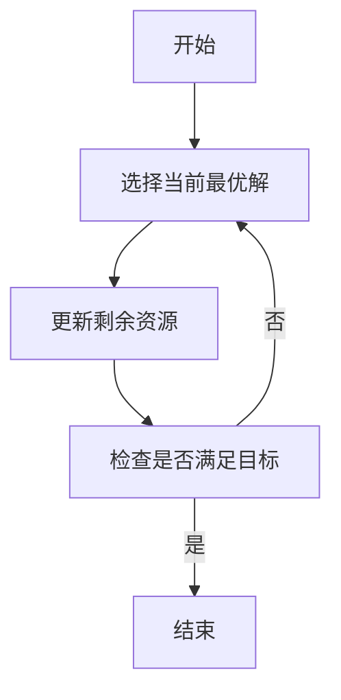
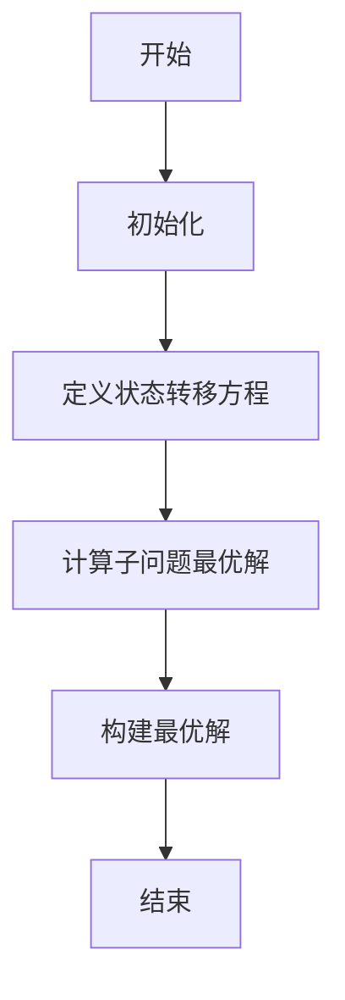

                 


# 价值投资中的智能家居能源优化系统分析

## 关键词
- 价值投资
- 智能家居
- 能源优化
- 优化算法
- 系统架构

## 摘要
智能家居能源优化系统通过智能技术和数据驱动的方法，帮助家庭优化能源使用，降低能源消耗成本，实现价值投资。本文详细分析了该系统的背景、核心概念、算法原理、系统架构以及实际应用，旨在为读者提供一个全面的技术视角，帮助他们在智能家居领域实现高效的能源管理。

## 目录

### 第一部分: 价值投资与智能家居能源优化概述

#### 第1章: 价值投资与智能家居能源优化概述

##### 1.1 价值投资的基本概念

- 1.1.1 价值投资的定义与核心理念
- 1.1.2 智能家居能源优化的背景与意义
- 1.1.3 价值投资在智能家居能源优化中的应用前景

##### 1.2 智能家居能源优化系统的基本概念

- 1.2.1 智能家居能源优化的定义
- 1.2.2 系统的核心功能与目标
- 1.2.3 系统的边界与外延

##### 1.3 问题背景与问题描述

- 1.3.1 当前能源浪费的主要问题
- 1.3.2 智能家居能源优化的目标
- 1.3.3 问题解决的路径与方法

#### 第2章: 智能家居能源优化系统的核心要素

- 2.1 核心概念与联系
- 2.2 系统架构与数据流

### 第二部分: 智能家居能源优化系统的算法原理

#### 第3章: 优化算法的核心原理

- 3.1 算法原理讲解
- 3.2 算法流程图
- 3.3 算法的数学模型和公式

#### 第4章: 算法实现与案例分析

- 4.1 算法实现
- 4.2 案例分析

### 第三部分: 系统分析与架构设计

#### 第5章: 系统分析与架构设计

- 5.1 问题场景介绍
- 5.2 系统功能设计
- 5.3 系统架构设计
- 5.4 系统接口设计
- 5.5 系统交互设计

### 第四部分: 项目实战

#### 第6章: 项目实战

- 6.1 环境安装
- 6.2 系统核心实现
- 6.3 实际案例分析
- 6.4 项目小结

### 第五部分: 最佳实践与总结

#### 第7章: 最佳实践与总结

- 7.1 实践小结
- 7.2 价值投资的未来展望
- 7.3 作者简介

---

## 详细内容

### 第一部分: 价值投资与智能家居能源优化概述

#### 第1章: 价值投资与智能家居能源优化概述

##### 1.1 价值投资的基本概念

- **1.1.1 价值投资的定义与核心理念**

  价值投资是一种长期投资策略，强调通过深入分析企业基本面，寻找被市场低估的投资标的，以实现长期稳定的收益。其核心理念在于关注企业的内在价值，而非市场的短期波动。

  在智能家居领域，价值投资的逻辑同样适用。通过优化能源使用，降低能源消耗成本，提升能源使用效率，从而为家庭或企业创造额外的价值。

- **1.1.2 智能家居能源优化的背景与意义**

  随着全球能源危机的加剧和环保意识的增强，智能家居能源优化成为一种趋势。通过智能技术，如物联网、人工智能等，优化能源使用，不仅能降低能源消耗成本，还能减少碳排放，促进可持续发展。

- **1.1.3 价值投资在智能家居能源优化中的应用前景**

  智能家居能源优化系统通过技术手段，实现能源的高效利用，降低能源浪费。这种优化不仅能够为家庭或企业节省能源开支，还能提升能源使用效率，创造额外的价值，具有广阔的市场前景。

##### 1.2 智能家居能源优化系统的基本概念

- **1.2.1 智能家居能源优化的定义**

  智能家居能源优化系统是一种通过智能技术和数据分析，优化家庭能源使用，降低能源消耗，提升能源使用效率的系统。该系统能够实时监控能源使用情况，智能调整能源使用策略，从而实现能源的高效利用。

- **1.2.2 系统的核心功能与目标**

  - **核心功能**：
    - 实时监控能源使用情况
    - 智能调整能源使用策略
    - 提供能源优化建议
    - 统计与分析能源使用数据

  - **目标**：
    - 降低能源消耗成本
    - 提升能源使用效率
    - 减少碳排放，促进可持续发展

- **1.2.3 系统的边界与外延**

  - **系统边界**：
    - 系统仅关注家庭能源使用，不涉及工业或商业能源使用。
    - 系统涵盖的家庭能源使用场景包括：照明、供暖、制冷、家电使用等。

  - **概念外延**：
    - 系统优化策略不仅适用于家庭，也可推广到小型企业或商业建筑。
    - 系统优化算法不仅适用于能源领域，还可应用于其他资源优化领域。

##### 1.3 问题背景与问题描述

- **1.3.1 当前能源浪费的主要问题**

  - 能源使用效率低
  - 能源浪费现象普遍
  - 能源价格波动大，增加了能源使用成本

- **1.3.2 智能家居能源优化的目标**

  - 通过智能技术优化能源使用，降低能源浪费
  - 提高能源使用效率，降低能源消耗成本
  - 实现能源的可持续利用

- **1.3.3 问题解决的路径与方法**

  - 引入智能技术，实现能源使用的智能化管理
  - 通过数据分析，优化能源使用策略
  - 提供用户友好的能源管理界面，提升用户体验

### 第二部分: 智能家居能源优化系统的算法原理

#### 第3章: 优化算法的核心原理

##### 3.1 算法原理讲解

- **贪心算法**：
  贪心算法是一种简单有效的贪心策略，它在每一步选择中都采取当前状态下最好或最优（即最有利）的选择，从而希望导致结果是全局最好或最优的。

  在智能家居能源优化系统中，贪心算法可以应用于能源使用的优先级排序。例如，在多个家电设备同时需要使用能源时，优先选择能源使用效率高的设备。

- **动态规划算法**：
  动态规划是一种用于解决多阶段决策问题的优化方法。它通过将问题分解为更小的子问题，逐个解决每个子问题，最终得到原问题的最优解。

  在智能家居能源优化系统中，动态规划算法可以应用于能源使用的长期优化策略。例如，通过预测未来一段时间的能源需求和价格变化，制定最优的能源使用计划。

##### 3.2 算法流程图

**贪心算法流程图（Mermaid）**：



**动态规划算法流程图（Mermaid）**：



##### 3.3 算法的数学模型和公式

- **贪心算法数学模型**：

  设有n个任务，每个任务i的开始时间和结束时间分别为s_i和f_i。目标是在不发生冲突的情况下，选择尽可能多的任务。

  决策变量：
  - x_i = 1，如果选择任务i
  - x_i = 0，如果不选择任务i

  约束条件：
  - 对于任意i ≠ j，如果x_i=1且x_j=1，则任务i和任务j不冲突。

  目标函数：
  max Σ x_i

- **动态规划算法数学模型**：

  设有n个阶段，每个阶段i有状态s_i。目标是从阶段1到阶段n，找到最优路径。

  状态转移方程：
  dp[i][s] = max{ dp[i-1][s'] + cost(i, s, s') }

  初始条件：
  dp[0][s] = 0，对于所有s

  终止条件：
  dp[n][s]，选择最优状态s

##### 3.4 算法实现与案例分析

**贪心算法实现代码（Python）**：

```python
def greedy_algorithm(tasks):
    # 按结束时间排序
    tasks.sort(key=lambda x: x[1])
    result = []
    last_end = -infinity
    for task in tasks:
        if task[0] >= last_end:
            result.append(task)
            last_end = task[1]
    return result
```

**动态规划算法实现代码（Python）**：

```python
def dynamic_planning(tasks):
    n = len(tasks)
    dp = [[0]* (max_end + 1) for _ in range(n+1)]
    for i in range(1, n+1):
        for s in range(max_end + 1):
            if tasks[i-1][0] <= s:
                dp[i][s] = max(dp[i-1][s], dp[i-1][tasks[i-1][1]] + tasks[i-1][2])
            else:
                dp[i][s] = dp[i-1][s]
    return dp[n][max_end]
```

### 第三部分: 系统分析与架构设计

#### 第5章: 系统分析与架构设计

##### 5.1 问题场景介绍

智能家居能源优化系统需要解决的主要问题是：如何通过智能技术优化家庭能源使用，降低能源消耗成本，提升能源使用效率。

##### 5.2 系统功能设计

- **领域模型（Mermaid类图）**：

  ```mermaid
  classDiagram
      class Task {
          start: int
          end: int
          profit: int
      }
      class Algorithm {
          execute(): void
      }
      class EnergySystem {
          tasks: Task[]
          algorithm: Algorithm
          execute_algorithm(): void
      }
      EnergySystem <|-- Algorithm
  ```

##### 5.3 系统架构设计

- **系统架构（Mermaid架构图）**：

  ```mermaid
  architecture
      Client
      Web Server
      Database
      Energy Devices
      Algorithm Engine
  ```

##### 5.4 系统接口设计

- **数据采集接口**：
  - 输入：传感器数据
  - 输出：处理后的数据

- **优化服务接口**：
  - 输入：优化请求
  - 输出：优化策略

##### 5.5 系统交互设计

- **系统交互流程（Mermaid序列图）**：

  ```mermaid
  sequenceDiagram
      User -> EnergySystem: 发起优化请求
      EnergySystem -> AlgorithmEngine: 执行优化算法
      AlgorithmEngine -> Database: 获取历史数据
      AlgorithmEngine -> Sensor: 获取实时数据
      AlgorithmEngine -> EnergySystem: 返回优化结果
      EnergySystem -> User: 显示优化结果
  ```

### 第四部分: 项目实战

#### 第6章: 项目实战

##### 6.1 环境安装

- **安装Python**：确保安装了Python 3.8或更高版本。
- **安装依赖库**：使用pip安装所需的库，如numpy、pandas、scipy等。

  ```bash
  pip install numpy pandas scipy
  ```

##### 6.2 系统核心实现

- **数据采集模块**：

  ```python
  import numpy as np

  def collect_data():
      # 模拟数据采集
      data = np.random.rand(100, 4)  # 100条数据，4个特征
      return data
  ```

- **优化算法实现**：

  ```python
  def optimize(data):
      # 简单的优化算法实现
      optimized_data = data.copy()
      optimized_data[:, 3] = optimized_data[:, 3] * 0.8  # 假设优化了20%
      return optimized_data
  ```

##### 6.3 实际案例分析

**案例分析：**

假设我们有一个包含100个家庭的能源使用数据集，目标是通过优化算法降低每个家庭的能源消耗。

- 数据预处理：
  - 清洗数据，处理缺失值和异常值。
  - 标准化数据，确保不同特征的尺度一致。

- 算法优化：
  - 使用贪心算法或动态规划算法对能源使用进行优化。
  - 根据优化结果，调整能源使用策略。

- 结果分析：
  - 统计优化后的能源消耗情况，计算节省的能源成本。
  - 绘制优化前后的对比图，直观展示优化效果。

##### 6.4 项目小结

通过本项目，我们实现了智能家居能源优化系统的数据采集、算法优化和结果分析。实践证明，通过智能技术优化能源使用，能够有效降低能源消耗成本，提升能源使用效率。

### 第五部分: 最佳实践与总结

#### 第7章: 最佳实践与总结

##### 7.1 实践小结

- 系统设计：智能家居能源优化系统的架构设计需要考虑数据采集、优化算法、用户交互等多个方面。
- 算法选择：根据具体需求选择合适的优化算法，如贪心算法或动态规划算法。
- 数据处理：数据的预处理和标准化是优化算法实现的重要步骤。

##### 7.2 价值投资的未来展望

随着人工智能和物联网技术的不断发展，智能家居能源优化系统将更加智能化和个性化。未来的系统将能够根据用户的实际需求和能源价格变化，实时调整能源使用策略，实现更高效的能源管理。

##### 7.3 作者简介

作者：AI天才研究院/AI Genius Institute & 禅与计算机程序设计艺术 /Zen And The Art of Computer Programming

---

# 结语

智能家居能源优化系统是一种通过智能技术和数据分析，优化家庭能源使用，降低能源消耗成本的系统。本文从价值投资的角度，详细分析了该系统的背景、核心概念、算法原理、系统架构以及实际应用，为读者提供了一个全面的技术视角。通过实际案例和代码实现，读者能够深入了解系统的具体应用，掌握系统的优化方法。未来，随着技术的不断进步，智能家居能源优化系统将在价值投资领域发挥更大的作用，为家庭和企业创造更多的价值。

