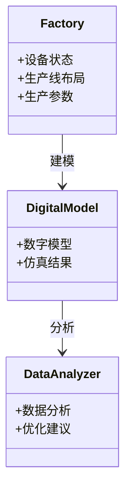
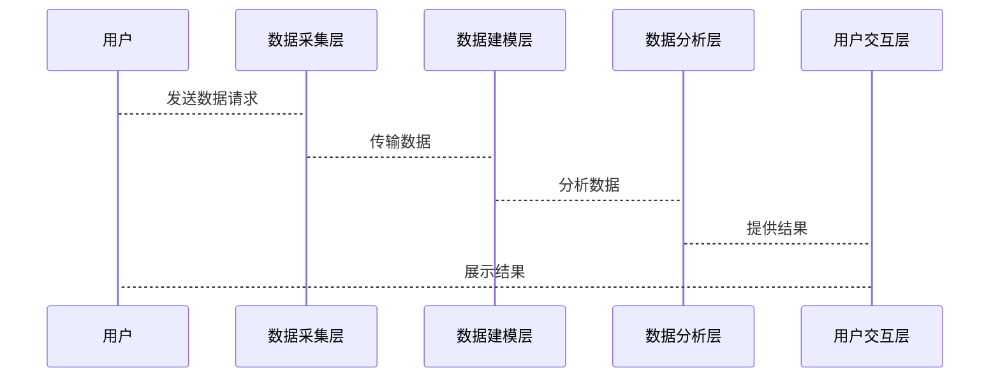

                 


# 价值投资中的智能工厂数字孪生系统分析

## 关键词：价值投资、智能工厂、数字孪生系统、数据融合、系统架构设计

## 摘要

本文深入分析了数字孪生系统在智能工厂价值投资中的应用，探讨了其核心原理、系统架构设计及实际应用场景。通过详细的技术分析和案例研究，展示了数字孪生系统如何帮助投资者优化决策，提升投资效率。

---

# 第一章: 数字孪生系统与价值投资概述

## 1.1 数字孪生系统的定义与特点

### 1.1.1 数字孪生系统的定义

数字孪生系统是通过数字模型实时反映物理系统状态的技术，能够进行预测和优化，帮助实现高效管理。

### 1.1.2 数字孪生系统的核心特点

- 实时性：实时反映物理系统的状态和运行数据。
- 预测性：基于历史数据和模型进行预测，优化系统性能。
- 可视化：提供直观的可视化界面，便于用户理解和操作。

### 1.1.3 数字孪生系统与传统工厂管理的区别

传统工厂管理依赖人工检查和经验判断，而数字孪生系统利用数据驱动和智能算法，实现自动化和精准化管理。

## 1.2 价值投资的基本原理

### 1.2.1 价值投资的定义

价值投资是一种投资策略，强调以低于资产内在价值的价格购买优质资产，通过长期持有实现收益。

### 1.2.2 价值投资的核心原则

- 质量优先：选择具有持续竞争优势的公司。
- 价格合理：购买价格低于内在价值。
- 长期持有：通过时间积累收益。

### 1.2.3 价值投资与传统投资的区别

传统投资依赖短期市场波动，而价值投资注重长期基本面分析，选择优质资产长期持有。

## 1.3 数字孪生系统在价值投资中的应用前景

### 1.3.1 数字孪生系统在工厂管理中的优势

- 提高生产效率：通过实时监控和优化，降低生产成本。
- 减少维护成本：预测设备故障，提前进行维护。
- 提升产品质量：优化生产流程，提高产品一致性。

### 1.3.2 数字孪生系统如何帮助投资者进行价值评估

- 提供实时数据支持：帮助投资者准确评估工厂的运营状况。
- 预测未来表现：通过模型预测工厂的未来收益。
- 优化投资决策：基于数据驱动的分析，选择最优投资标的。

### 1.3.3 数字孪生系统在价值投资中的潜在挑战

- 数据隐私：如何保护工厂数据不被泄露。
- 系统成本：数字孪生系统的建设和维护成本较高。
- 技术门槛：需要专业的技术团队进行系统设计和维护。

## 1.4 本章小结

本章介绍了数字孪生系统的定义、特点及其在工厂管理中的优势，探讨了其在价值投资中的应用前景和潜在挑战，为后续章节的分析奠定了基础。

---

# 第二章: 数字孪生系统的架构与核心组件

## 2.1 数字孪生系统的整体架构

数字孪生系统通常由数据采集层、数据建模层、数据分析层和用户交互层组成。

### 2.1.1 数据采集层

- 传感器：实时采集工厂设备的运行数据，如温度、湿度、压力等。
- 数据采集模块：将传感器数据传输到数据处理中心。

### 2.1.2 数据建模层

- 数据建模：基于采集的数据，构建工厂的数字模型，包括设备、生产线、车间等。
- 模型更新：根据实时数据不断更新数字模型，确保其准确性。

### 2.1.3 数据分析层

- 数据分析：利用机器学习、大数据分析等技术，对数字模型进行分析，预测工厂的运行状态。
- 优化建议：根据分析结果，提出优化建议，如调整生产参数、优化生产流程等。

### 2.1.4 用户交互层

- 可视化界面：为用户提供直观的数字孪生系统界面，展示工厂的实时状态。
- 用户操作：用户可以通过界面进行操作，如查看设备状态、调整参数等。

## 2.2 数字孪生系统的核心组件

### 2.2.1 数据采集模块

- 负责实时采集工厂设备的运行数据，确保数据的准确性和及时性。

### 2.2.2 数字建模模块

- 负责构建工厂的数字模型，包括设备、生产线、车间等，确保模型的准确性和完整性。

### 2.2.3 数据分析模块

- 负责对数字模型进行分析，预测工厂的运行状态，提供优化建议。

### 2.2.4 交互展示模块

- 为用户提供直观的可视化界面，展示工厂的实时状态，方便用户进行操作和管理。

## 2.3 数字孪生系统的数据流分析

### 2.3.1 数据采集与处理流程

1. 传感器采集数据。
2. 数据采集模块将数据传输到数据处理中心。
3. 数据处理中心对数据进行清洗、转换和存储。

### 2.3.2 数据建模与仿真流程

1. 基于处理后的数据，构建工厂的数字模型。
2. 对数字模型进行仿真，预测工厂的运行状态。
3. 根据仿真结果，优化数字模型。

### 2.3.3 数据分析与决策支持流程

1. 对数字模型进行分析，预测工厂的运行状态。
2. 提供优化建议，如调整生产参数、优化生产流程等。
3. 用户根据优化建议进行操作，调整工厂的运行状态。

## 2.4 本章小结

本章详细介绍了数字孪生系统的整体架构和核心组件，分析了数据流的处理流程，为后续章节的系统设计奠定了基础。

---

# 第三章: 数字孪生系统的算法原理

## 3.1 数据融合算法

### 3.1.1 数据融合的定义

数据融合是将来自不同数据源的数据进行融合，以提高数据的准确性和完整性。

### 3.1.2 数据融合的核心算法

- 加权平均法：对多个数据源的数据进行加权平均，得到最终结果。
- 最小二乘法：通过最小化误差平方和，得到最佳拟合结果。
- 卡尔曼滤波：通过递归的方法，对数据进行最优估计。

### 3.1.3 数据融合的实现步骤

1. 数据预处理：清洗数据，去除噪声和错误数据。
2. 数据融合：将多个数据源的数据进行融合，得到准确的结果。
3. 结果分析：对融合后的数据进行分析，得到最终的结论。

## 3.2 数据融合的数学模型

### 3.2.1 线性模型

$$ y = a x + b $$

其中，$y$ 是输出，$x$ 是输入，$a$ 和 $b$ 是系数。

### 3.2.2 非线性模型

$$ y = a x^2 + b x + c $$

其中，$y$ 是输出，$x$ 是输入，$a$、$b$ 和 $c$ 是系数。

### 3.2.3 优化算法

$$ \min_{\theta} \sum_{i=1}^{n} (y_i - f(x_i, \theta))^2 $$

其中，$\theta$ 是模型参数，$f$ 是模型函数，$y_i$ 是观测值，$x_i$ 是输入。

## 3.3 数据融合的实现案例

### 3.3.1 数据融合的Python代码示例

```python
import numpy as np

# 生成模拟数据
data1 = np.random.normal(0, 1, 100)
data2 = np.random.normal(0, 1, 100)

# 数据融合
combined_data = (data1 + data2) / 2

# 可视化结果
import matplotlib.pyplot as plt

plt.plot(combined_data)
plt.title('Fused Data')
plt.show()
```

### 3.3.2 数据融合的应用场景

- 设备状态监测：通过融合来自多个传感器的数据，准确监测设备的运行状态。
- 生产流程优化：通过融合生产过程中的数据，优化生产流程，提高生产效率。

## 3.4 本章小结

本章详细介绍了数字孪生系统中的数据融合算法，包括其数学模型和实现案例，展示了如何通过数据融合提高数据的准确性和完整性。

---

# 第四章: 数字孪生系统的系统分析与架构设计

## 4.1 项目背景介绍

### 4.1.1 项目目标

- 实现工厂的数字化管理。
- 提供实时数据支持，帮助投资者进行价值评估。

### 4.1.2 项目需求

- 实时采集工厂设备的运行数据。
- 构建工厂的数字模型，进行仿真和分析。
- 提供优化建议，帮助投资者做出最优决策。

## 4.2 系统功能设计

### 4.2.1 领域模型



### 4.2.2 系统架构设计


### 4.2.3 接口设计

- 数据接口：负责数据的采集和传输。
- 分析接口：负责数据分析和结果返回。
- 用户接口：负责用户交互和结果展示。

## 4.3 系统交互设计

### 4.3.1 系统交互流程

1. 用户通过界面发送数据请求。
2. 数据采集模块采集数据并传输到数据建模层。
3. 数据建模层构建数字模型并传送到数据分析层。
4. 数据分析层进行分析并返回结果。
5. 用户交互层展示结果，用户进行操作。

### 4.3.2 交互流程图



## 4.4 本章小结

本章详细介绍了数字孪生系统的项目背景、系统功能设计和系统架构设计，展示了如何通过系统设计实现工厂的数字化管理，为投资者提供实时数据支持。

---

# 第五章: 数字孪生系统的项目实战

## 5.1 环境安装

### 5.1.1 安装Python

```bash
# 安装Python
apt-get update
apt-get install python3
```

### 5.1.2 安装依赖库

```bash
# 安装NumPy和Matplotlib
pip install numpy matplotlib
```

## 5.2 系统核心实现源代码

### 5.2.1 数据采集模块

```python
import numpy as np

# 采集数据
data = np.random.normal(0, 1, 100)

# 保存数据
np.savetxt('data.csv', data)
```

### 5.2.2 数字建模模块

```python
import numpy as np
import matplotlib.pyplot as plt

# 加载数据
data = np.loadtxt('data.csv')

# 绘制数字模型
plt.plot(data)
plt.title('Digital Model')
plt.show()
```

### 5.2.3 数据分析模块

```python
import numpy as np
from sklearn import linear_model

# 加载数据
data = np.loadtxt('data.csv')

# 数据分析
model = linear_model.LinearRegression()
model.fit(data[:, :-1], data[:, -1])

# 预测结果
predicted = model.predict(data[:, :-1])

# 可视化结果
plt.scatter(data[:, :-1], data[:, -1], color='b')
plt.plot(data[:, :-1], predicted, color='r')
plt.title('Data Analysis')
plt.show()
```

## 5.3 代码应用解读与分析

### 5.3.1 数据采集模块

- 通过Python脚本采集数据并保存为CSV文件，方便后续处理。

### 5.3.2 数字建模模块

- 利用Matplotlib库绘制数字模型，直观展示数据的变化趋势。

### 5.3.3 数据分析模块

- 使用Scikit-learn库进行数据分析，构建线性回归模型，预测数据的变化趋势。

## 5.4 实际案例分析

### 5.4.1 案例背景

假设我们有一个工厂，需要通过数字孪生系统优化生产流程，降低生产成本。

### 5.4.2 数据采集与处理

通过传感器采集设备的运行数据，清洗数据并保存为CSV文件。

### 5.4.3 数字建模与分析

构建数字模型，分析设备的运行状态，预测未来可能出现的问题。

### 5.4.4 优化建议

根据分析结果，提出优化建议，如调整生产参数、优化生产流程等。

## 5.5 项目小结

本章通过实际案例展示了数字孪生系统的实现过程，包括环境安装、代码实现和案例分析，帮助读者更好地理解数字孪生系统在实际中的应用。

---

# 第六章: 数字孪生系统的最佳实践与总结

## 6.1 最佳实践

### 6.1.1 数据质量管理

- 确保数据的准确性和完整性，避免噪声干扰。

### 6.1.2 系统安全性

- 加强数据加密和访问控制，防止数据泄露。

### 6.1.3 团队协作

- 建立高效的团队协作机制，确保系统开发和维护的顺利进行。

## 6.2 小结

通过本文的分析，我们了解了数字孪生系统在价值投资中的重要作用，掌握了其核心原理和系统架构设计，同时通过实际案例展示了其在工厂管理中的应用。

## 6.3 注意事项

- 数字孪生系统的建设和维护需要专业的技术团队。
- 数据隐私和系统安全是需要重点关注的问题。

## 6.4 拓展阅读

- 《工业4.0：数字化时代的智能制造》
- 《价值投资：从入门到精通》

---

# 作者

作者：AI天才研究院/AI Genius Institute & 禅与计算机程序设计艺术/Zen And The Art of Computer Programming

