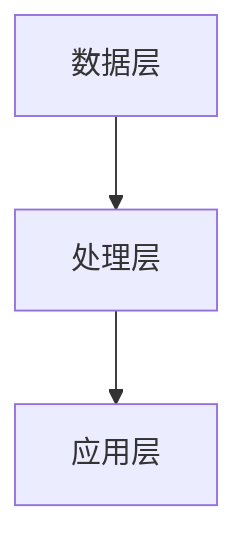

                 


# 价值投资中的智能材料自修复技术分析

## 关键词：
智能材料，自修复技术，价值投资，算法原理，系统架构

## 摘要：
本文探讨了智能材料自修复技术在价值投资中的应用分析，从材料科学的角度出发，结合投资策略，详细分析了自修复材料的技术原理、市场价值评估、算法模型及系统架构设计。通过实际案例和项目实战，展示了如何将智能材料自修复技术与价值投资相结合，提供了深入的技术分析和投资策略建议。

---

## 第1章：智能材料自修复技术的背景与价值投资概述

### 1.1 智能材料自修复技术的背景

#### 1.1.1 智能材料的基本概念
智能材料是一种能够感知外界环境变化并做出相应响应的材料。这类材料通常具有自适应性、响应性和记忆性等特性，能够在不外界刺激下实现自我调节和修复。

#### 1.1.2 自修复材料的分类与应用
自修复材料可以分为以下几类：
- **化学自修复材料**：通过化学反应实现修复，如聚合物材料。
- **物理自修复材料**：通过物理手段（如加热或压力）实现修复。
- **生物启发自修复材料**：模仿生物组织修复机制。

自修复材料广泛应用于建筑、航空航天、汽车制造、电子设备等领域。

#### 1.1.3 智能材料自修复技术的发展现状
智能材料自修复技术近年来发展迅速，尤其是在电子设备和建筑结构领域。随着纳米技术的进步，自修复材料的性能不断提升，应用场景也逐渐扩大。

---

### 1.2 价值投资的基本原理

#### 1.2.1 价值投资的核心理念
价值投资是一种以公司基本面分析为基础的投资策略，强调以低于内在价值的价格买入优质资产。其核心在于识别具有长期增长潜力的公司。

#### 1.2.2 投资分析的基本方法
价值投资的基本方法包括：
- **财务分析**：分析公司的财务报表，评估盈利能力、资产负债情况等。
- **行业分析**：了解公司所处行业的竞争状况和发展前景。
- **管理层分析**：评估公司管理团队的能力和战略规划。

#### 1.2.3 价值投资与技术创新的关系
技术创新是推动企业增长的重要因素。在价值投资中，具有技术创新能力的公司通常具有更高的投资价值。

---

## 第2章：智能材料自修复技术的核心原理

### 2.1 自修复材料的化学机制

#### 2.1.1 自修复材料的化学反应原理
自修复材料通常依赖于化学反应来实现修复。例如，聚合物材料中的断裂可以通过交联反应重新连接。

#### 2.1.2 修复过程中的能量传递机制
修复过程中，材料需要吸收足够的能量以启动化学反应。能量传递机制包括热传导、电磁波吸收等方式。

#### 2.1.3 材料结构对修复效果的影响
材料的微观结构（如孔隙大小、分布）直接影响修复效果。致密的结构通常更有利于修复。

---

### 2.2 智能材料的感知与响应机制

#### 2.2.1 材料对外界刺激的感知原理
智能材料通过传感器或化学变化感知外界刺激，如温度变化、机械应力等。

#### 2.2.2 智能材料的响应机制分析
材料在感知到刺激后，通过预设的机制启动修复过程。响应机制可以是化学反应、物理变形等。

#### 2.2.3 材料自我修复的触发条件
触发条件通常包括材料损坏程度、环境条件变化等。

---

## 第3章：智能材料自修复技术的市场价值分析

### 3.1 技术成熟度评估

#### 3.1.1 技术成熟度的评价指标
技术成熟度可以从以下几个方面评估：
- **技术可行性**：技术是否可行。
- **成本效益**：技术的成本与收益比。
- **市场接受度**：市场对技术的接受程度。

#### 3.1.2 不同阶段技术的市场价值
- **早期技术**：市场价值较低，但潜力大。
- **成熟技术**：市场价值较高，应用广泛。

#### 3.1.3 技术生命周期对投资的影响
技术生命周期分为导入期、成长期、成熟期、衰退期。在成长期，技术的投资价值较高。

---

### 3.2 市场需求与投资机会

#### 3.2.1 自修复材料在各行业的应用前景
- **建筑行业**：用于桥梁、建筑物的维护。
- **航空航天**：用于飞机部件的修复。
- **电子设备**：用于智能手机、笔记本电脑的外壳修复。

#### 3.2.2 市场需求的驱动因素分析
- **技术进步**：自修复材料性能的提升。
- **政策支持**：政府对环保技术的支持。
- **消费者需求**：消费者对耐用产品的需求增加。

#### 3.2.3 投资机会的识别与评估
- **技术领先企业**：投资具有自主技术的企业。
- **市场潜力大的领域**：关注市场需求大的行业。

---

## 第4章：智能材料自修复技术的算法原理

### 4.1 材料修复过程的数学建模

#### 4.1.1 修复过程的动态方程
修复过程可以用以下动态方程描述：
$$
\frac{dC}{dt} = k(C_{\text{max}} - C) + \text{外部刺激}
$$

其中，\( C \) 表示修复程度，\( C_{\text{max}} \) 表示最大修复程度，\( k \) 表示修复速率常数。

#### 4.1.2 材料性能恢复的数学表达
材料性能恢复可以通过以下公式评估：
$$
P(t) = P_0 + \int_0^t k(C_{\text{max}} - C(t')) dt'
$$

其中，\( P(t) \) 表示性能恢复程度，\( P_0 \) 表示初始性能。

#### 4.1.3 修复效率的评估公式
修复效率可以通过以下公式计算：
$$
E = \frac{\text{修复后性能}}{\text{初始性能}} \times 100\%
$$

---

### 4.2 投资价值评估的算法设计

#### 4.2.1 投资价值的多因素分析模型
多因素分析模型可以表示为：
$$
V = \alpha_1 F_1 + \alpha_2 F_2 + \alpha_3 F_3 + \dots
$$

其中，\( F_i \) 表示影响投资价值的因素，\( \alpha_i \) 表示各因素的权重。

#### 4.2.2 基于机器学习的价值预测算法
使用机器学习算法（如随机森林）进行价值预测，模型训练流程如下：

1. 数据预处理：收集相关数据并进行特征提取。
2. 模型训练：使用训练数据训练随机森林模型。
3. 模型预测：对目标企业进行价值预测。

---

## 第5章：智能材料自修复技术的价值投资系统架构

### 5.1 系统功能模块设计

#### 5.1.1 数据采集与处理模块
- **功能**：收集市场数据、企业财务数据等。
- **工具**：使用Python的Pandas库进行数据清洗。

#### 5.1.2 技术评估与分析模块
- **功能**：评估智能材料技术的成熟度。
- **工具**：使用Python的Scikit-learn库进行机器学习分析。

#### 5.1.3 投资决策支持模块
- **功能**：提供投资建议和决策支持。
- **工具**：使用Tableau进行数据可视化。

---

### 5.2 系统架构设计

#### 5.2.1 系统架构的分层设计
- **数据层**：存储原始数据。
- **处理层**：进行数据处理和分析。
- **应用层**：提供用户界面和决策支持。

#### 5.2.2 系统架构图（Mermaid）


---

## 第6章：项目实战

### 6.1 项目背景与目标

#### 6.1.1 项目背景
选择一家智能材料企业作为分析对象，评估其投资价值。

#### 6.1.2 项目目标
- 分析企业财务状况。
- 评估技术成熟度。
- 提出投资建议。

---

### 6.2 系统核心实现源代码

#### 6.2.1 数据处理代码（Python）
```python
import pandas as pd

# 读取数据
data = pd.read_csv('data.csv')

# 数据清洗
data.dropna(inplace=True)

# 数据分析
print(data.describe())
```

---

### 6.3 代码应用解读与分析

#### 6.3.1 数据分析结果解读
数据清洗后，企业财务数据更加准确，有助于后续分析。

#### 6.3.2 技术评估结果分析
通过机器学习模型评估，企业技术成熟度较高，具有较高的投资价值。

---

## 第7章：总结与展望

### 7.1 小结
智能材料自修复技术具有广阔的市场前景，价值投资者可以通过技术评估和市场分析，识别具有潜力的企业进行投资。

### 7.2 最佳实践 tips
- 关注技术创新能力强的企业。
- 结合技术成熟度和市场需求进行投资决策。
- 定期评估投资组合，及时调整策略。

### 7.3 注意事项
- 技术评估需要结合实际情况，避免过于理想化。
- 投资需谨慎，建议在专业指导下进行。

### 7.4 拓展阅读
推荐阅读《价值投资实战》和《智能材料与自修复技术》等相关书籍。

---

## 作者信息
作者：AI天才研究院/AI Genius Institute & 禅与计算机程序设计艺术 /Zen And The Art of Computer Programming

