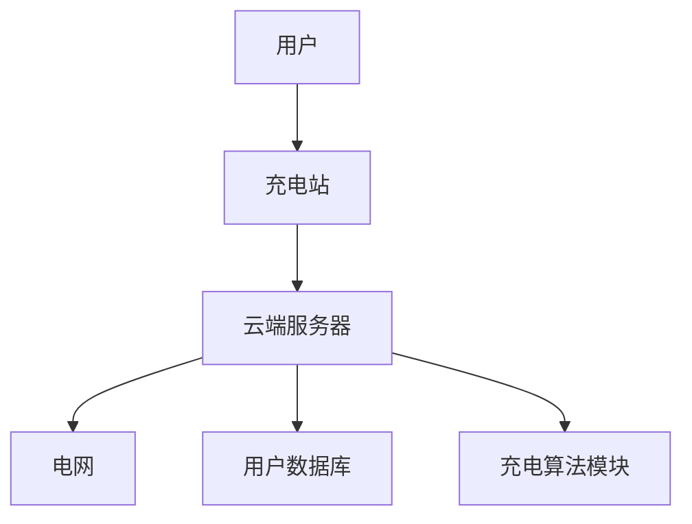
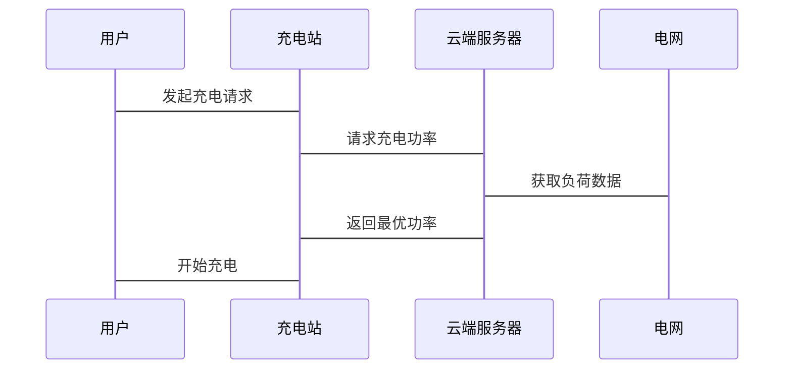

                 


# 价值投资中的智能电动汽车充电网络分析

## 关键词：智能充电网络，价值投资，电动汽车，充电算法，经济模型

## 摘要：智能电动汽车充电网络作为电动汽车生态体系的重要组成部分，其发展与价值评估是当前电动汽车产业和投资领域关注的焦点。本文从技术与经济双重视角出发，系统分析智能充电网络的核心原理、算法模型、系统架构，并结合实际案例，探讨其在价值投资中的潜力与策略。通过对智能充电网络的深入剖析，本文旨在为投资者和技术从业者提供理论与实践相结合的指导，助力智能充电网络的健康发展与投资价值的挖掘。

---

## 第一部分: 价值投资中的智能电动汽车充电网络背景介绍

### 第1章: 智能电动汽车充电网络概述

#### 1.1 智能充电网络的定义与特点
##### 1.1.1 智能充电网络的定义
智能充电网络是一种基于互联网、物联网和人工智能技术的智能配电和充电系统，能够实现电动汽车充电站的智能调度、用户行为分析、充电需求预测以及网络优化。

##### 1.1.2 智能充电网络的核心特点
- **智能化**：通过AI算法优化充电时间和功率分配，提升充电效率。
- **互联性**：实现充电设备、用户、电网之间的实时通信与数据共享。
- **实时性**：能够根据电网负荷和用户需求动态调整充电策略。
- **扩展性**：支持大规模充电站的部署和扩展。

##### 1.1.3 智能充电网络与传统充电网络的区别
| 特性        | 传统充电网络                     | 智能充电网络                     |
|-------------|----------------------------------|----------------------------------|
| 调度方式     | 固定时间或功率                   | 动态优化调度                     |
| 用户交互     | 单一的充电服务                   | 支持用户行为分析与个性化服务     |
| 负荷管理     | 简单的功率分配                   | 复杂的负荷优化与需求预测         |
| 可扩展性     | 有限的扩展能力                   | 高度可扩展的网络架构             |

#### 1.2 价值投资的基本概念
##### 1.2.1 价值投资的定义
价值投资是一种长期投资策略，通过分析企业的基本面、财务状况和市场地位，寻找被市场低估的投资标的，实现长期收益。

##### 1.2.2 价值投资的核心原则
- **安全边际**：投资价格低于内在价值。
- **长期视角**：关注企业的长期盈利能力。
- **优质企业**：选择行业龙头或具有竞争优势的企业。

##### 1.2.3 价值投资与智能充电网络的结合
智能充电网络作为电动汽车生态的重要组成部分，其建设和运营将直接影响电动汽车企业的竞争力和市场价值。投资者需要从技术、市场、财务等多个维度评估充电网络的投资价值。

### 第2章: 智能电动汽车充电网络的现状与发展趋势

#### 2.1 充电网络的现状分析
- **市场规模**：随着电动汽车的普及，充电网络建设需求快速增长。
- **技术瓶颈**：充电效率、电网负荷平衡、用户体验等问题亟待解决。
- **政策支持**：各国政府纷纷出台政策支持充电网络建设。

#### 2.2 智能充电网络的技术发展趋势
- **AI驱动的智能调度**：利用AI算法优化充电时间和功率分配。
- **能源互联网**：实现充电网络与电网的深度 integration。
- **用户-centric设计**：提升用户体验，支持多种支付方式和智能预约。

#### 2.3 充电网络在价值投资中的潜力
- **市场需求**：电动汽车普及带来充电网络的刚性需求。
- **技术壁垒**：智能充电技术成为企业核心竞争力。
- **政策红利**：政府支持为充电网络建设提供资金和政策保障。

---

## 第二部分: 智能电动汽车充电网络的核心概念与联系

### 第3章: 智能充电网络的核心原理

#### 3.1 智能充电算法的原理
##### 3.1.1 智能充电算法的目标
- 动态优化充电功率分配。
- 平衡电网负荷，避免峰值过载。
- 提供最优充电方案，提升用户体验。

##### 3.1.2 智能充电算法的实现步骤
1. 用户需求预测：基于历史数据和用户行为模型，预测充电需求。
2. 负荷预测：根据电网负荷情况，预测充电站的负载能力。
3. 动态调度：根据需求和负荷，动态调整充电功率和时间。

##### 3.1.3 智能充电算法的数学模型
$$ P_{opt} = \arg \min_{P} \left( \sum_{i=1}^{n} |P_i - D_i| \right) $$
其中，$P$为充电功率，$D$为用户需求。

#### 3.2 用户行为分析与充电需求预测
##### 3.2.1 用户行为分析的关键因素
- 充电时间偏好。
- 充电频率。
- 充电距离。

##### 3.2.2 充电需求预测的模型
使用马尔可夫链模型预测用户的充电行为，例如：
$$ P_{next} = P_{current} \cdot T $$
其中，$T$为转移概率矩阵。

#### 3.3 充电网络的优化与调度
##### 3.3.1 节点优化
通过优化充电站的地理位置和数量，提升充电网络的覆盖效率。

##### 3.3.2 边优化
通过动态调整充电功率和时间，平衡电网负荷。

### 第4章: 充电网络与价值投资的关系

#### 4.1 充电网络在电动汽车产业链中的位置
充电网络是电动汽车生态体系的关键环节，直接影响电动汽车的使用体验和企业的市场竞争力。

#### 4.2 充电网络对电动汽车企业价值的影响
- **用户粘性**：优质的充电网络能够提升用户的使用体验，增强用户粘性。
- **成本优势**：高效的充电网络能够降低企业的运营成本。
- **市场竞争力**：充电网络的布局和优化能力是电动汽车企业的核心竞争力。

#### 4.3 充电网络的经济模型与投资评估
##### 4.3.1 经济模型
$$ V = \sum_{t=1}^{n} \frac{CF_t}{(1 + r)^t} $$
其中，$V$为项目价值，$CF_t$为第$t$年的现金流，$r$为折现率。

##### 4.3.2 投资评估的关键指标
- 净现值（NPV）。
- 内部收益率（IRR）。
- 投资回收期。

---

## 第三部分: 智能充电网络的算法原理与数学模型

### 第5章: 智能充电算法的实现与优化

#### 5.1 智能充电算法的实现步骤
##### 5.1.1 数据采集
通过物联网设备采集用户需求、电网负荷等数据。

##### 5.1.2 数据分析
利用大数据技术分析用户行为和电网负荷趋势。

##### 5.1.3 算法优化
通过AI算法动态调整充电功率和时间。

#### 5.2 智能充电算法的数学模型
##### 5.2.1 线性回归模型
$$ y = \beta_0 + \beta_1 x + \epsilon $$
其中，$y$为预测需求，$x$为历史数据，$\beta_0$和$\beta_1$为回归系数。

##### 5.2.2 聚类分析
使用K-means算法对用户进行分类，优化充电站的布局和功率分配。

#### 5.3 智能充电算法的实现代码
```python
import numpy as np
from sklearn.cluster import KMeans

# 数据预处理
data = np.array([...])  # 用户需求数据

# 聚类分析
kmeans = KMeans(n_clusters=3).fit(data)
labels = kmeans.labels_

# 动态调度
for i in range(len(labels)):
    if labels[i] == 0:
        power = 50
    elif labels[i] == 1:
        power = 30
    else:
        power = 10
```

---

## 第四部分: 智能充电网络的系统分析与架构设计

### 第6章: 智能充电网络的系统架构

#### 6.1 系统功能设计
##### 6.1.1 用户管理模块
- 用户注册与登录。
- 用户行为分析。

##### 6.1.2 充电管理模块
- 充电预约。
- 动态功率分配。

##### 6.1.3 数据分析模块
- 数据采集。
- 数据挖掘与分析。

#### 6.2 系统架构设计


#### 6.3 系统接口设计
##### 6.3.1 充电接口
- 用户发起充电请求。
- 系统反馈充电功率和时间。

##### 6.3.2 电网接口
- 实时获取电网负荷数据。
- 调整充电功率。

#### 6.4 系统交互流程图


---

## 第五部分: 智能充电网络的项目实战

### 第7章: 项目实战与案例分析

#### 7.1 环境安装
- 安装Python和相关库（如numpy、scikit-learn）。
- 配置物联网设备。

#### 7.2 核心代码实现
##### 7.2.1 用户行为分析
```python
from sklearn import linear_model

# 训练线性回归模型
model = linear_model.LinearRegression()
model.fit(X, y)

# 预测用户需求
y_pred = model.predict(X_new)
```

##### 7.2.2 动态调度算法
```python
import numpy as np

# 动态调整充电功率
def adjust_power(current_power, demand):
    if demand > current_power:
        return current_power * 1.2
    else:
        return current_power * 0.8
```

#### 7.3 案例分析
以某城市为例，分析充电网络的投资价值：
- 项目总投资：5000万元。
- 年收入：1000万元。
- 投资回收期：5年。
- 内部收益率（IRR）：15%。

#### 7.4 项目小结
通过实际案例分析，验证智能充电网络的经济性和技术可行性。

---

## 第六部分: 智能充电网络的最佳实践

### 第8章: 最佳实践与投资建议

#### 8.1 投资注意事项
- 关注政策支持。
- 选择技术领先的充电网络企业。
- 评估项目的经济可行性。

#### 8.2 小结
智能充电网络是电动汽车生态体系的核心，其建设和运营将直接影响电动汽车企业的市场竞争力和投资价值。投资者需要从技术、市场、财务等多个维度综合评估充电网络的投资潜力。

#### 8.3 拓展阅读
- 《电动汽车充电技术与应用》。
- 《价值投资实战策略》。

---

## 作者：AI天才研究院 & 禅与计算机程序设计艺术

---

通过以上目录结构和内容安排，文章将从技术与经济双重视角，全面分析智能电动汽车充电网络的核心原理、算法模型、系统架构，并结合实际案例，探讨其在价值投资中的潜力与策略。

