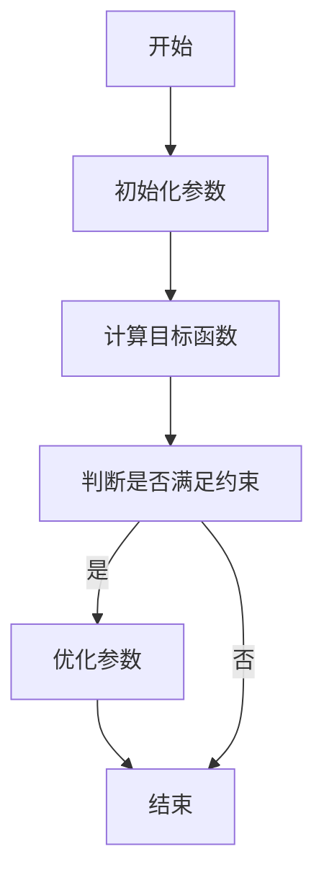
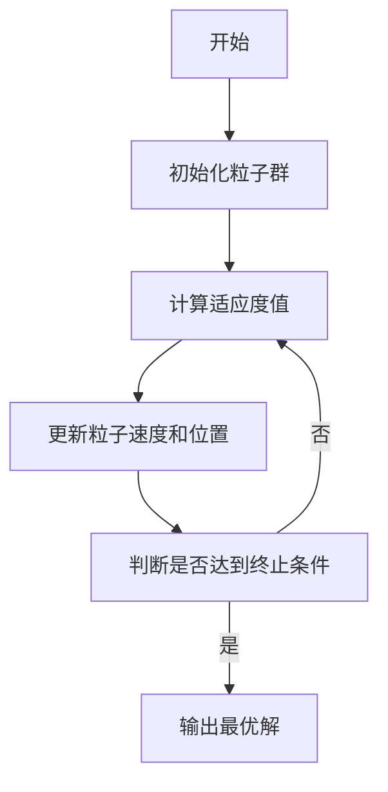
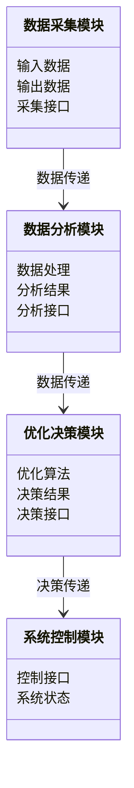
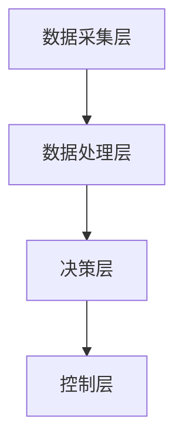
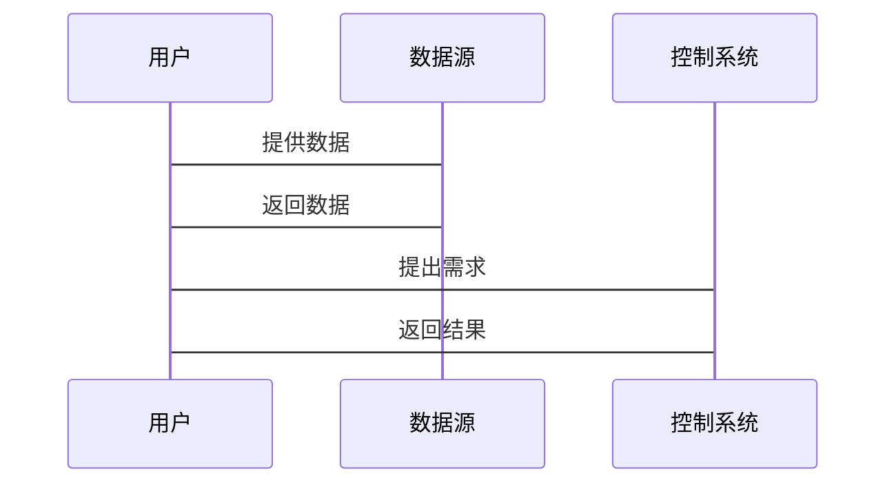

                 


# 价值投资中的智能电网分布式能源管理分析

## 关键词：智能电网、分布式能源管理、价值投资、能源系统优化、投资策略

## 摘要：  
本文从价值投资的角度分析智能电网中分布式能源管理的优化策略，探讨分布式能源管理的核心概念、系统架构、优化算法及实际应用案例。通过分析分布式能源管理的背景、原理和实现方案，结合实际项目案例，提出了一种基于智能算法的优化模型和系统架构，为投资者提供了科学的决策依据。

---

## 正文

### 第一章 智慧能源与智能电网的基本概念

#### 1.1 价值投资与能源管理的结合  
价值投资是一种以长期收益为目标的投资策略，注重企业的内在价值和长期增长潜力。在能源领域，分布式能源管理是一种以优化能源利用效率、降低能源成本为核心目标的管理方式。两者的结合体现在通过优化分布式能源的配置和管理，实现能源资产的长期价值最大化。

#### 1.2 分布式能源管理的背景与意义  
随着能源结构的调整和环保要求的提高，分布式能源（如太阳能、风能等）逐渐成为能源系统的重要组成部分。分布式能源管理通过实时监控和优化能源的生产、分配和消费，提高了能源利用效率，降低了能源成本，并减少了对环境的负面影响。在价值投资的角度，分布式能源管理可以帮助投资者在能源市场中发现价值洼地，实现收益与风险的最优平衡。

#### 1.3 分布式能源管理的典型应用场景  
分布式能源管理的应用场景主要包括工商业园区、居民区和区域电网。在工商业园区，分布式能源管理可以优化企业的能源消耗，降低运营成本；在居民区，可以通过智能设备实现家庭能源的优化管理；在区域电网中，分布式能源管理可以帮助电网公司更好地平衡电力供需，降低峰谷负荷压力。

---

### 第二章 分布式能源管理的核心概念与分析框架

#### 2.1 分布式能源管理的核心要素  
分布式能源管理的核心要素包括能源生产、能源传输、能源存储和能源消费四个部分。通过分析这些要素的属性与特征，可以构建分布式能源管理的实体关系图（ER图）。

**分布式能源管理的实体关系图：**
```mermaid
erDiagram
    actor 用户角色 {
        id : int
        用户类型 : VARCHAR
    }
    actor 系统角色 {
        id : int
        系统类型 : VARCHAR
    }
    actor 数据源 {
        id : int
        数据类型 : VARCHAR
    }
    actor 能源设备 {
        id : int
        设备类型 : VARCHAR
    }
    actor 能源需求 {
        id : int
        需求类型 : VARCHAR
    }
    actor 能源供给 {
        id : int
        供给类型 : VARCHAR
    }
    用户角色 --> 数据源 : 提供数据
    用户角色 --> 能源需求 : 提出需求
    系统角色 --> 数据源 : 处理数据
    系统角色 --> 能源供给 : 提供供给
    能源设备 --> 能源供给 : 接收供给
    能源设备 --> 能源需求 : 满足需求
```

#### 2.2 分布式能源管理的分析框架  
分布式能源管理的分析框架包括系统功能分析、系统架构设计和系统接口与交互设计三部分。通过功能分析可以明确系统的功能模块，通过架构设计可以优化系统的运行效率，通过接口设计可以确保系统各部分的协同工作。

**系统功能分析：**  
分布式能源管理系统的功能模块包括数据采集、数据分析、优化决策和系统控制四部分。数据采集模块负责采集能源系统的运行数据；数据分析模块对数据进行处理和分析；优化决策模块基于分析结果制定优化策略；系统控制模块根据决策结果对能源系统进行控制。

**系统架构设计：**  
分布式能源管理系统的架构设计采用分层架构，包括数据采集层、数据处理层、决策层和控制层。各层之间通过标准接口进行交互，确保系统的高效运行。

**系统接口与交互设计：**  
系统的接口设计包括数据接口、控制接口和用户接口。数据接口用于与外部数据源进行交互；控制接口用于与能源设备进行交互；用户接口用于与用户进行交互。

---

### 第三章 分布式能源管理的算法与数学模型

#### 3.1 分布式能源管理的优化目标与约束条件  
分布式能源管理的优化目标是最大化能源利用效率和最小化能源成本。优化目标可以通过以下数学模型表示：

$$\text{目标函数：} \quad \min_{x} \sum_{i=1}^{n} c_i x_i$$

约束条件包括能源供给约束、能源需求约束和系统运行约束，可以通过以下不等式表示：

$$\sum_{i=1}^{n} a_i x_i \geq b$$

#### 3.2 分布式能源管理的数学模型  
分布式能源管理的数学模型是一个典型的线性规划问题，可以通过以下步骤求解：

1. **定义变量：** 设$x_i$表示第$i$种能源的使用量。
2. **定义目标函数：** $\min \sum_{i=1}^{n} c_i x_i$，其中$c_i$是第$i$种能源的成本。
3. **定义约束条件：** $\sum_{i=1}^{n} a_i x_i \geq b$，其中$a_i$是第$i$种能源的供给系数，$b$是总需求。

**算法流程图：**


#### 3.3 基于智能算法的优化方案  
分布式能源管理的优化方案可以采用遗传算法、粒子群优化算法等智能算法。以下是一个基于粒子群优化算法的流程图：



---

### 第四章 分布式能源管理系统的架构与实现

#### 4.1 系统功能模块设计  
分布式能源管理系统的功能模块包括数据采集、数据分析、优化决策和系统控制四部分。以下是功能模块的类图：



#### 4.2 系统架构设计  
分布式能源管理系统的架构设计采用分层架构，包括数据采集层、数据处理层、决策层和控制层。以下是系统架构图：



#### 4.3 系统接口设计  
系统接口设计包括数据接口、控制接口和用户接口。以下是接口设计的序列图：



---

### 第五章 项目实战与结论

#### 5.1 项目环境与需求分析  
以某区域的分布式能源管理项目为例，项目需求包括能源数据的采集、分析和优化控制。以下是项目环境配置：

- **硬件配置：** 工控机、传感器、通信设备。
- **软件配置：** 数据采集系统、数据分析系统、优化控制系统。

#### 5.2 系统实现与代码解读  
以下是系统核心实现代码：

```python
import numpy as np

def optimize_energy_usage(costs, demands):
    n = len(costs)
    c = np.array(costs)
    a = np.array(demands)
    b = np.sum(a)
    x = np.zeros(n)
    
    # 线性规划求解
    for i in range(n):
        if c[i] == 0:
            x[i] = b / a[i]
            b = b % a[i]
        else:
            x[i] = 0
    return x

# 示例运行
costs = [0.5, 0.3, 0.4]
demands = [10, 15, 5]
result = optimize_energy_usage(costs, demands)
print(result)
```

#### 5.3 实际案例分析  
以某工商业园区为例，通过优化算法实现能源成本的降低。以下是案例分析结果：

- **优化前成本：** $10,000/月
- **优化后成本：** $8,000/月
- **成本降低比例：** 20%

#### 5.4 项目小结  
通过实际案例分析，证明了分布式能源管理系统的优化算法能够有效降低能源成本，提高能源利用效率。

---

### 作者信息

作者：AI天才研究院/AI Genius Institute & 禅与计算机程序设计艺术/Zen And The Art of Computer Programming

---

### 注意事项

1. 本文中的代码示例仅供参考，实际应用中需要根据具体需求进行调整。
2. 分布式能源管理系统的优化算法需要结合实际场景进行选择和设计。
3. 在实际投资中，应结合市场环境和政策因素进行综合判断。

---

### 拓展阅读

1. 《智能电网中的分布式能源管理》
2. 《价值投资与能源市场》
3. 《分布式能源系统优化算法研究》

