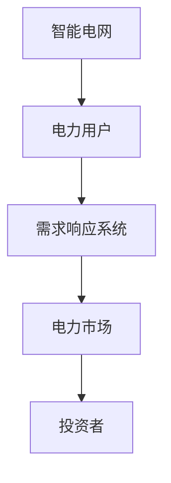
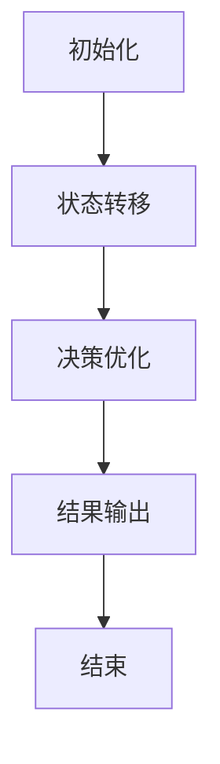
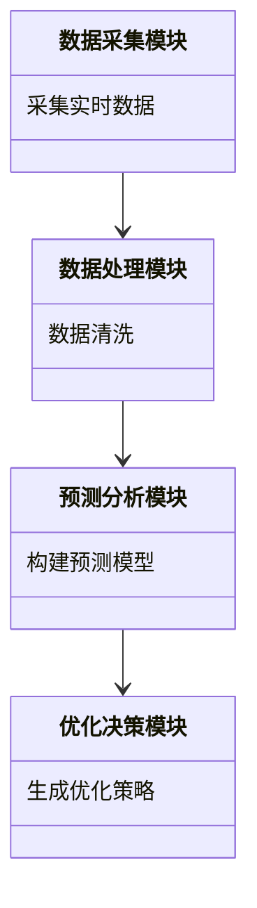
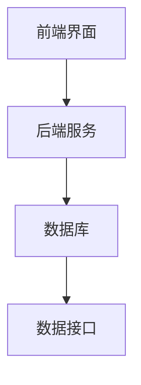

                 


# 价值投资中的智能电网需求响应系统分析

## 关键词：智能电网，需求响应系统，价值投资，电力市场，投资决策

## 摘要：  
本文深入分析了智能电网需求响应系统在价值投资中的应用，探讨了该系统的核心概念、算法原理、系统架构及其在电力市场中的实际应用场景。文章从背景介绍、核心概念、算法实现、系统设计、项目实战到最佳实践，全面阐述了智能电网需求响应系统如何为投资者提供数据支持和决策依据，助力实现电力市场的价值最大化。

---

## 第1章: 背景介绍

### 1.1 智能电网的发展现状  
智能电网是现代电力系统的重要组成部分，通过先进的信息通信技术和自动化设备，实现了电力的高效传输和智能管理。近年来，随着可再生能源的普及和分布式能源的兴起，智能电网的需求响应技术逐渐成为电力系统的核心技术之一。

### 1.2 价值投资的基本原理  
价值投资是一种长期投资策略，强调通过分析企业的基本面和市场趋势，寻找被低估的投资标的。在电力市场中，投资者需要结合市场供需、政策法规和技术创新等因素，做出科学的投资决策。

### 1.3 智能电网需求响应系统的概念  
需求响应系统是一种通过实时数据采集和分析，优化电力使用行为的技术。在智能电网中，需求响应系统能够根据电价波动和用户需求，动态调整电力负荷，实现电力资源的高效配置。

### 1.4 价值投资与智能电网的结合  
智能电网需求响应系统的数据和技术创新为电力市场的价值投资提供了新的机会。通过分析需求响应系统生成的数据，投资者可以更好地理解电力市场的供需关系，优化投资组合，提升投资收益。

---

## 第2章: 智能电网需求响应系统的核心概念与联系

### 2.1 智能电网需求响应系统的原理  
需求响应系统通过采集电力用户的数据，结合电价波动和用户需求，优化电力使用行为。系统的核心功能包括数据采集、预测分析、优化决策和反馈控制。

### 2.2 价值投资与需求响应系统的联系  
需求响应系统为投资者提供了实时的电力市场数据，帮助投资者分析市场趋势、评估投资标的的价值，并制定科学的投资策略。通过需求响应系统，投资者可以更好地应对电力市场的波动，捕捉投资机会。

### 2.3 核心概念对比分析  
以下是智能电网、传统电网、价值投资和传统投资的核心概念对比：

| 概念       | 定义                                                                 |
|------------|----------------------------------------------------------------------|
| 智能电网   | 一种利用先进信息技术实现电力系统智能化管理的电网系统             |
| 传统电网   | 传统的电力传输和分配系统，缺乏智能化和实时性                     |
| 价值投资   | 一种长期投资策略，注重分析企业的基本面和市场趋势                 |
| 传统投资   | 一种基于市场短期波动的投资策略，注重技术分析和市场情绪           |

### 2.4 实体关系图  
以下是一个简单的实体关系图，展示了智能电网需求响应系统的主要参与者及其关系：



---

## 第3章: 需求响应系统算法原理

### 3.1 需求响应预测算法  
需求响应预测算法通过对历史数据和市场趋势的分析，预测未来电力需求和电价波动。常用的预测算法包括线性回归、支持向量机和神经网络等。

#### 3.1.1 预测模型的构建  
预测模型通常包括数据采集、数据预处理、模型训练和预测输出四个阶段。以下是一个简单的线性回归模型：

$$ y = \beta_0 + \beta_1x + \epsilon $$

其中，$y$ 是预测目标，$x$ 是输入特征，$\beta_0$ 和 $\beta_1$ 是模型参数，$\epsilon$ 是误差项。

#### 3.1.2 常用预测算法对比  
以下是一个简单的预测算法对比表：

| 算法名称   | 优点                       | 缺点                       |
|------------|----------------------------|---------------------------|
| 线性回归   | 简单易懂，计算效率高         | 适用于线性关系，非线性数据表现不佳 |
| 支持向量机 | 适用于高维数据，精度高       | 参数选择敏感，计算复杂       |
| 神经网络   | 适用于复杂非线性关系         | 训练时间长，容易过拟合         |

### 3.2 需求响应优化算法  
需求响应优化算法通过优化电力使用行为，降低用电成本，提高投资收益。常用的优化算法包括动态规划、遗传算法和粒子群优化等。

#### 3.2.1 优化目标的设定  
优化目标通常包括最小化用电成本、最大化投资收益和减少碳排放等。以下是一个简单的动态规划优化模型：

$$ \min_{x} \sum_{i=1}^{n} c_i x_i $$
$$ \text{subject to} \quad \sum_{i=1}^{n} x_i \leq C $$

其中，$x_i$ 是第 $i$ 个时段的用电量，$c_i$ 是对应的电价，$C$ 是总预算。

#### 3.2.2 基于动态规划的优化策略  
以下是一个动态规划优化算法的流程图：



---

## 第4章: 智能电网需求响应系统架构设计

### 4.1 项目背景介绍  
本项目旨在通过构建智能电网需求响应系统，为电力市场投资者提供实时数据和决策支持，帮助投资者优化投资策略，提高投资收益。

### 4.2 系统功能设计  
系统功能包括数据采集、数据处理、预测分析、优化决策和结果反馈。以下是一个系统功能模块的类图：



### 4.3 系统架构设计  
系统架构包括前端界面、后端服务和数据库。以下是一个系统架构图：



---

## 第5章: 项目实战

### 5.1 环境安装  
需要安装Python、NumPy、Pandas和Scikit-learn等库。安装命令如下：

```bash
pip install numpy pandas scikit-learn
```

### 5.2 核心代码实现  
以下是一个简单的预测模型实现代码：

```python
import numpy as np
from sklearn.linear_model import LinearRegression

# 数据准备
X = np.array([[1], [2], [3], [4], [5]])
y = np.array([2, 4, 5, 4, 6])

# 模型训练
model = LinearRegression()
model.fit(X, y)

# 预测
print(model.predict([[6]]))  # 输出：[[7.4]]
```

### 5.3 实际案例分析  
以下是一个实际案例分析：

某电力公司希望通过需求响应系统优化用电成本。通过分析历史用电数据和电价波动，预测未来用电需求，并制定最优的用电策略。

---

## 第6章: 最佳实践

### 6.1 小结  
智能电网需求响应系统为电力市场的价值投资提供了新的机会。通过分析需求响应系统生成的数据，投资者可以更好地理解电力市场的供需关系，优化投资策略，提高投资收益。

### 6.2 注意事项  
- 数据的准确性和实时性是需求响应系统的核心，投资者需要确保数据来源可靠。
- 需求响应系统的优化算法需要根据实际情况进行调整，避免过拟合或欠拟合。
- 投资者需要结合市场趋势和政策法规，动态调整投资策略。

### 6.3 拓展阅读  
- 《智能电网技术与应用》
- 《价值投资实战策略》
- 《电力市场分析与预测》

---

## 作者：AI天才研究院 & 禅与计算机程序设计艺术

