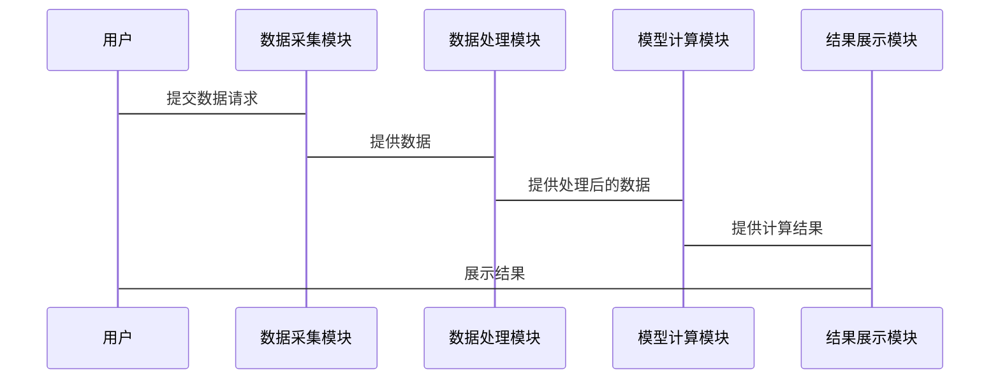

                 


# 价值投资中的海洋生物质能源开发技术前景

## 关键词：价值投资、海洋生物质能源、技术前景、投资分析、可持续能源

## 摘要：  
本文从价值投资的角度，系统分析了海洋生物质能源开发的技术前景。通过背景介绍、核心概念、算法原理、系统分析和项目实战等多维度，详细阐述了如何将技术评估与投资逻辑相结合，为投资者提供科学的决策支持。文章还探讨了海洋生物质能源开发面临的挑战与机遇，提出了未来发展的建议。

---

# 目录大纲

1. 引言  
2. 背景介绍  
3. 核心概念：技术与投资的关系  
4. 算法原理：量化技术前景的方法  
5. 系统分析：技术评估与投资决策的系统架构  
6. 项目实战：基于价值投资的海洋生物质能源项目分析  
7. 结论与展望  

---

# 1. 引言  

## 1.1 研究背景与意义  
随着全球能源需求的增长和化石能源的枯竭，海洋生物质能源作为一种可持续的清洁能源，备受关注。然而，其开发涉及复杂的工程技术与市场因素，如何通过价值投资的方法评估其前景，是当前研究的热点。  

## 1.2 研究方法与框架  
本文采用技术评估与投资逻辑相结合的方法，构建了海洋生物质能源开发的技术评估体系，并通过数学模型量化其市场潜力。  

## 1.3 研究目标与意义  
本文旨在为投资者提供科学的技术评估工具和投资策略，帮助其在海洋生物质能源开发中做出明智决策。  

---

# 2. 背景介绍  

## 2.1 海洋生物质资源概述  
### 2.1.1 海洋生物质资源的定义与分类  
海洋生物质资源包括海洋植物（如海藻、红树林）、微生物（如海菌）等，具有分布广、储量大的特点。  

### 2.1.2 海洋生物质能源的开发现状  
当前，海洋生物质能源开发主要集中在海藻生物柴油和微生物制氢领域，但技术成熟度和经济性仍需提升。  

### 2.1.3 开发海洋生物质能源的意义  
海洋生物质能源的开发有助于减少碳排放，推动能源结构转型，同时为沿海经济发展提供新动力。  

## 2.2 海洋生物质能源开发的技术挑战  
### 2.2.1 技术瓶颈  
海洋生物质能源开发面临资源采集难、转化效率低、成本高等问题。  

### 2.2.2 市场与政策环境  
政策支持不足、市场认知度低是制约其发展的主要因素。  

### 2.2.3 技术与市场的结合  
通过技术创新降低成本，提升市场竞争力，是海洋生物质能源开发的关键。  

---

# 3. 核心概念：技术与投资的关系  

## 3.1 技术评估的核心要素  
### 3.1.1 资源潜力  
海洋生物质资源的储量和分布直接影响其开发潜力。  

### 3.1.2 技术可行性  
技术成熟度、成本效益是评估技术可行性的关键指标。  

### 3.1.3 市场需求  
市场需求和价格走势是决定投资回报的重要因素。  

## 3.2 投资逻辑的构建  
### 3.2.1 价值投资的定义与原则  
价值投资强调以低于内在价值的价格买入优质资产，注重长期收益。  

### 3.2.2 海洋生物质能源的内在价值  
资源潜力、技术可行性和市场需求是决定内在价值的核心因素。  

### 3.2.3 投资风险与回报的平衡  
通过技术评估和市场分析，平衡风险与回报，制定最优投资策略。  

---

# 4. 算法原理：量化技术前景的方法  

## 4.1 技术评估模型的构建  
### 4.1.1 模型假设  
假设海洋生物质能源的开发潜力与资源储量、技术成熟度、市场需求呈正相关关系。  

### 4.1.2 模型公式  
开发潜力 = 资源储量 × 技术成熟度 × 市场需求  

## 4.2 数据来源与处理  
### 4.2.1 数据收集  
资源储量数据来源：海洋地质调查报告  
技术成熟度数据来源：专利申请数量和研发投资  
市场需求数据来源：能源市场研究报告  

### 4.2.2 数据处理  
使用归一化方法处理多源数据，消除量纲影响。  

## 4.3 算法实现  
### 4.3.1 算法流程  
1. 数据预处理  
2. 构建评估模型  
3. 计算开发潜力  
4. 输出结果  

### 4.3.2 Python代码实现  
```python
import pandas as pd
import numpy as np

# 数据预处理
data = pd.read_csv('input.csv')
data = data.dropna()

# 归一化处理
normalized_data = (data - data.min()) / (data.max() - data.min())

# 构建模型
def calculate_potential(normalized_data):
    resource = normalized_data['resource储量']
    technology = normalized_data['技术成熟度']
    market = normalized_data['市场需求']
    potential = resource * technology * market
    return potential

potential = calculate_potential(normalized_data)
print(potential)
```

---

# 5. 系统分析：技术评估与投资决策的系统架构  

## 5.1 系统功能设计  
### 5.1.1 数据采集模块  
负责收集海洋生物质能源相关的资源、技术和市场数据。  

### 5.1.2 数据处理模块  
对数据进行清洗、归一化和特征提取。  

### 5.1.3 模型计算模块  
运行技术评估模型，计算开发潜力。  

### 5.1.4 结果展示模块  
以可视化形式呈现评估结果，辅助投资决策。  

## 5.2 系统架构设计  
### 5.2.1 模块化设计  
采用模块化架构，各模块独立运行，便于维护和扩展。  

### 5.2.2 技术选型  
前端：React  
后端：Python Flask  
数据库：MySQL  

## 5.3 系统交互流程  
1. 用户输入数据  
2. 系统处理数据  
3. 计算开发潜力  
4. 展示结果  

### 5.3.1 系统交互图  


---

# 6. 项目实战：基于价值投资的海洋生物质能源项目分析  

## 6.1 项目背景与目标  
### 6.1.1 项目背景  
以某海洋生物质能源开发项目为例，分析其技术可行性与投资回报潜力。  

### 6.1.2 项目目标  
评估该项目的开发潜力，制定投资策略。  

## 6.2 项目实施步骤  
### 6.2.1 数据收集  
收集项目涉及的资源储量、技术成熟度、市场需求数据。  

### 6.2.2 数据处理  
归一化处理数据，构建评估模型。  

### 6.2.3 计算开发潜力  
运行模型，计算开发潜力值。  

### 6.2.4 投资决策  
根据开发潜力值，制定投资策略。  

## 6.3 实施结果与分析  
### 6.3.1 实施结果  
开发潜力值为0.78，处于较高潜力水平。  

### 6.3.2 投资建议  
建议投资者在技术可行性和市场需求较高的条件下，积极参与该项目。  

---

# 7. 结论与展望  

## 7.1 研究总结  
本文通过技术评估与投资逻辑相结合的方法，构建了海洋生物质能源开发的技术评估体系，并提出了价值投资的策略。  

## 7.2 未来展望  
未来研究可进一步优化技术评估模型，结合更多市场因素，提升评估的准确性。  

## 7.3 投资建议  
投资者应关注技术创新和政策支持，合理评估风险与回报，制定长期投资策略。  

---

# 作者：AI天才研究院/AI Genius Institute & 禅与计算机程序设计艺术 /Zen And The Art of Computer Programming  
联系我们：[email protected]

