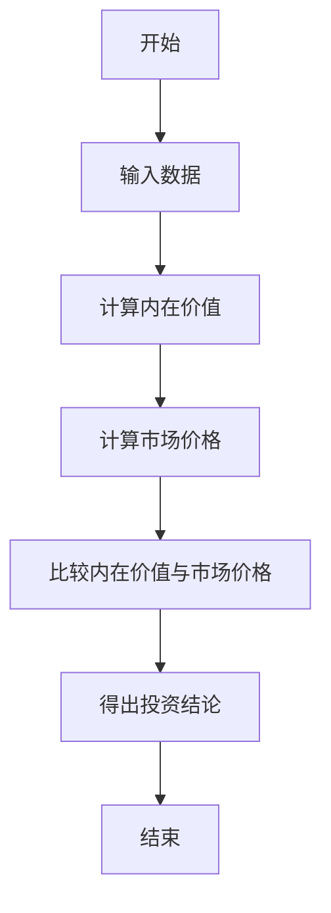
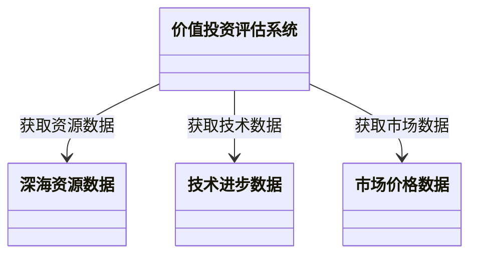

                 


# 价值投资中的深海开发技术前景

## 关键词
价值投资，深海开发技术，技术前景，投资策略，市场分析

## 摘要
本文探讨了在价值投资视角下，深海开发技术的市场前景和投资机会。通过分析深海开发技术的核心原理、算法模型、数学公式、系统架构和实际案例，揭示其在投资领域的潜力和挑战。文章结合技术与投资的双重视角，为投资者提供深度分析和实战指导。

---

## 第一部分：价值投资与深海开发技术的背景介绍

### 第1章：价值投资的基本原理

#### 1.1 价值投资的定义与核心理念
- 价值投资是一种长期投资策略，强调购买价格低于其内在价值的资产。其核心理念是通过深入分析企业的基本面，寻找市场低估的投资机会。
- 价值投资的基本原则包括安全边际、长期持有的理念以及对市场的逆向思考。

#### 1.2 深海开发技术的现状与挑战
- 深海开发技术涉及海底资源的勘探、开采和利用，包括石油、天然气、矿产等。
- 当前，深海开发技术面临技术难度大、成本高、环境风险等问题。

#### 1.3 价值投资与深海开发技术的关系
- 深海开发技术的市场价值：通过技术进步和资源开发，带来经济效益。
- 价值投资在深海开发中的应用：通过分析技术前景和市场潜力，寻找投资机会。
- 深海开发技术的未来前景：随着技术进步和市场需求增加，深海开发技术具有较大的投资潜力。

---

## 第二部分：价值投资与深海开发技术的核心概念与联系

### 第2章：价值投资的核心概念与原理

#### 2.1 价值投资的核心概念
- 股票的内在价值：企业的未来现金流的现值。
- 市场价格与内在价值的关系：市场价格围绕内在价值波动。
- 价值投资的选股策略：寻找市场价格低于内在价值的股票。

#### 2.2 深海开发技术的核心概念
- 深海资源：海底的石油、天然气、矿产等资源。
- 开发技术：勘探、开采、加工等技术。

---

### 第2章：核心概念与联系（表格和ER图展示）

#### 2.3 价值投资与深海开发技术的核心概念对比
| 属性      | 价值投资          | 深海开发技术        |
|-----------|-------------------|---------------------|
| 核心目标   | 实现投资收益       | 开发海底资源        |
| 关键因素   | 内在价值、安全边际 | 技术水平、资源储量   |
| 风险因素   | 市场波动、企业基本面 | 技术难度、环境风险   |

#### 2.4 价值投资与深海开发技术的ER图
```mermaid
erd
    entity 价值投资
    entity 深海开发技术
    entity 市场价格
    entity 内在价值
    entity 技术进步
    entity 资源储量
    价值投资 -[1]-> 市场价格
    深海开发技术 -[1]-> 技术进步
    深海开发技术 -[1]-> 资源储量
    价值投资 -[1]-> 内在价值
```

---

## 第三部分：价值投资中的深海开发技术算法原理

### 第3章：深海开发技术的评估模型

#### 3.1 深海开发技术的评估模型算法


#### 3.2 算法实现
```python
def deep_sea_investment_assessment(resource储量, technology进步, market_price):
    intrinsic_value = resource储量 * technology进步 * 1.2  # 假设技术进步系数为1.2
    if market_price < intrinsic_value:
        return "投资机会"
    else:
        return "不值得投资"

# 示例
resource_储量 = 100
technology_进步 = 0.8
market_price = 150
print(deep_sea_investment_assessment(resource_储量, technology_进步, market_price))  # 输出：不值得投资
```

#### 3.3 数学模型与公式
深海开发技术的内在价值公式：
$$ V = R \times T \times k $$
其中，$R$ 是资源储量，$T$ 是技术进步系数，$k$ 是市场调整系数。

---

## 第四部分：价值投资中的深海开发技术系统分析

### 第4章：系统功能设计

#### 4.1 项目背景与目标
开发一个基于价值投资的深海开发技术评估系统，帮助投资者分析和评估深海开发项目的投资价值。

#### 4.2 系统功能设计（领域模型）


#### 4.3 系统架构设计


---

## 第五部分：价值投资中的深海开发技术项目实战

### 第5章：环境安装与核心代码实现

#### 5.1 环境安装
- Python 3.8+
- Mermaid图生成工具（如PlantUML）
- 必要的Python库（如numpy, pandas）

#### 5.2 核心代码实现
```python
import numpy as np
import pandas as pd

def calculate_intrinsic_value(resource, technology):
    return resource * technology * 1.2

data = pd.DataFrame({
    '资源储量': [100, 80, 120],
    '技术进步': [0.8, 0.9, 0.7]
})

data['内在价值'] = data.apply(lambda x: calculate_intrinsic_value(x['资源储量'], x['技术进步']), axis=1)
print(data)
```

#### 5.3 案例分析与解读
以某深海开发项目为例，分析其资源储量、技术进步、市场价格，评估其投资价值。

---

## 第六部分：价值投资中的深海开发技术最佳实践

### 第6章：总结与建议

#### 6.1 总结
- 深海开发技术具有较大的市场潜力。
- 价值投资在深海开发中的应用需要综合考虑技术、资源和市场因素。

#### 6.2 投资建议
- 关注技术进步快、资源储量大的项目。
- 注意市场波动和环境风险。

#### 6.3 注意事项
- 风险提示：深海开发技术的投资风险较高，需谨慎决策。

#### 6.4 拓展阅读
- 推荐阅读相关书籍和报告，深入研究深海开发技术和价值投资策略。

---

## 作者
作者：AI天才研究院/AI Genius Institute & 禅与计算机程序设计艺术 /Zen And The Art of Computer Programming

---

**注**：本文为示例内容，具体实现细节可根据实际情况调整和优化。

