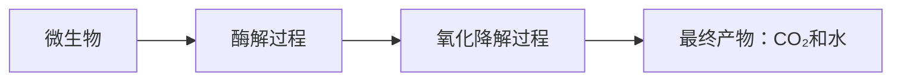

                 

# 价值投资中的生物降解电子元件技术前景

## 关键词：生物降解电子元件，价值投资，技术前景，市场分析，投资策略

## 摘要：  
随着环保意识的增强和可持续发展理念的推动，生物降解电子元件技术逐渐成为科技领域的重要研究方向。本文从技术背景、核心原理、市场分析、经济价值评估以及投资策略等多个维度，详细探讨生物降解电子元件技术的前景及其在价值投资中的应用潜力。通过对技术原理、市场趋势和投资策略的系统分析，为投资者和科技从业者提供有价值的参考。

---

# 第1章: 生物降解电子元件技术的背景与现状

## 1.1 生物降解电子元件的基本概念

### 1.1.1 生物降解材料的定义与特性  
生物降解材料是指在自然环境中能够被微生物分解为二氧化碳和水等简单化合物的材料。其特性包括可降解性、环境友好性、可再生性等。  

### 1.1.2 电子元件与生物降解材料的结合  
生物降解电子元件是将生物降解材料应用于电子元件的制造中，例如生物降解电路板、生物降解显示屏等。这种结合不仅减少了电子废弃物对环境的污染，还提高了资源的可持续性。  

### 1.1.3 生物降解电子元件的应用领域  
- **消费电子**：如可穿戴设备、电子标签等。  
- **医疗领域**：如可降解医疗器件。  
- **环保设备**：如传感器、监测设备等。  

## 1.2 生物降解电子元件技术的发展历程

### 1.2.1 早期研究与技术突破  
早期研究主要集中在生物降解材料的开发上，近年来逐渐将这些材料应用于电子元件的制造。  

### 1.2.2 当前技术现状与瓶颈  
当前，生物降解电子元件技术仍处于实验和小规模应用阶段，主要瓶颈包括材料性能不足、制造成本高等。  

### 1.2.3 未来技术发展趋势  
未来，随着材料科学和制造技术的进步，生物降解电子元件将向高性能、低成本方向发展。  

## 1.3 价值投资与生物降解技术的结合

### 1.3.1 价值投资的基本概念  
价值投资是一种以基本面分析为基础的投资方法，旨在寻找被市场低估的投资标的。  

### 1.3.2 生物降解技术的市场潜力  
生物降解电子元件技术具有广阔的市场前景，尤其是在环保和可持续发展的背景下，市场需求将持续增长。  

### 1.3.3 价值投资在生物降解技术中的应用前景  
通过分析技术领先企业的财务状况、市场竞争力和研发能力，投资者可以找到具有长期价值的投资标的。  

---

# 第2章: 生物降解电子元件的核心技术原理

## 2.1 生物降解材料的分类与特性

### 2.1.1 可生物降解材料的分类  
- **可降解塑料**：如聚乳酸（PLA）、聚乙醇酸（PGA）。  
- **天然高分子材料**：如纤维素、淀粉。  

### 2.1.2 各类材料的物理化学特性对比  
| 材料类型 | 理论降解时间 | 机械强度 | 成本 |
|----------|----------------|-----------|------|
| PLA      | 6-12个月       | 较高       | 中等 |
| PGA      | 2-6个月        | 较低       | 高   |
| 淀粉基材料 | 1-3个月        | 较低       | 低   |

### 2.1.3 生物降解材料的降解机制  
生物降解材料的降解过程主要依赖于微生物的作用，具体包括酶解和氧化降解两个阶段。  

---

## 2.2 生物降解电子元件的制造工艺

### 2.2.1 材料选择与制备  
选择合适的生物降解材料是制造生物降解电子元件的第一步。  

### 2.2.2 制造工艺流程  
1. 材料制备：通过挤出成型、注塑成型等方式制备材料。  
2. 元件设计：根据需求设计电子元件的结构。  
3. 组装与测试：将电子元件组装并进行性能测试。  

### 2.2.3 工艺优化与成本控制  
通过优化材料选择和工艺流程，可以降低制造成本并提高产品性能。  

---

## 2.3 生物降解电子元件的性能评估

### 2.3.1 机械性能测试  
包括材料的拉伸强度、断裂伸长率等指标。  

### 2.3.2 电性能测试  
包括导电性、绝缘性等指标。  

### 2.3.3 环境性能测试  
包括降解速率、环境稳定性等指标。  

---

# 第3章: 生物降解电子元件技术的市场分析

## 3.1 全球生物降解材料市场现状

### 3.1.1 市场规模与增长趋势  
近年来，全球生物降解材料市场规模快速增长，预计未来几年将继续保持较高增长。  

### 3.1.2 主要市场区域分析  
欧洲、北美和亚洲是生物降解材料的主要市场区域。  

### 3.1.3 市场驱动因素  
环保政策、消费者环保意识增强、政府支持等是主要驱动因素。  

---

## 3.2 生物降解电子元件的应用市场

### 3.2.1 消费电子领域  
生物降解电子元件在消费电子领域的应用前景广阔，尤其是在可穿戴设备和电子标签领域。  

### 3.2.2 医疗器械领域  
生物降解材料在医疗器械领域的应用可以减少对人体的长期影响。  

### 3.2.3 环保设备领域  
生物降解电子元件在环保设备中的应用可以减少电子废弃物对环境的污染。  

---

## 3.3 价值投资视角下的市场机会

### 3.3.1 技术领先企业的投资价值  
技术领先企业在生物降解电子元件技术的研发和产业化方面具有竞争优势。  

### 3.3.2 市场需求与供给的平衡点  
随着市场需求的增长，供给能力的提升将推动行业快速发展。  

### 3.3.3 行业竞争格局分析  
当前行业竞争格局分散，未来可能会出现头部企业主导市场的情况。  

---

# 第4章: 生物降解电子元件技术的经济价值评估

## 4.1 价值投资的基本方法

### 4.1.1 基本面分析  
包括企业财务状况、盈利能力、成长能力等分析。  

### 4.1.2 财务指标分析  
如市盈率、市净率、ROE等指标。  

### 4.1.3 行业趋势分析  
分析行业的发展趋势和周期性。  

---

## 4.2 生物降解技术的经济模型

### 4.2.1 投资回报率模型  
$$ ROI = \frac{\text{净利润}}{\text{投资成本}} \times 100\% $$  

### 4.2.2 成本-收益分析  
通过对比项目的总成本和预期收益，评估项目的可行性。  

### 4.2.3 风险评估模型  
包括市场风险、技术风险和政策风险等。  

---

## 4.3 技术与市场的协同效应

### 4.3.1 技术创新对市场的影响  
技术创新可以提升产品性能，扩大市场需求。  

### 4.3.2 市场需求对技术创新的推动  
市场需求的增长可以激励企业加大研发投入，推动技术创新。  

### 4.3.3 技术与市场的平衡点  
找到技术发展与市场需求的最佳匹配点，实现可持续发展。  

---

# 第5章: 价值投资策略与生物降解技术结合的案例分析

## 5.1 投资策略与案例分析

### 5.1.1 技术领先企业的投资价值  
以某生物降解材料生产企业为例，分析其财务状况、技术研发能力和市场竞争力。  

### 5.1.2 投资组合的构建  
根据企业的基本面和技术前景，构建多元化投资组合，分散风险。  

### 5.1.3 风险管理与投资策略  
制定风险管理策略，如设置止损点、定期评估投资组合等。  

---

## 5.2 投资策略的实施步骤

### 5.2.1 确定投资目标  
根据市场趋势和企业基本面，确定投资目标。  

### 5.2.2 进行基本面分析  
分析企业的财务状况、盈利能力、成长能力等。  

### 5.2.3 制定投资计划  
根据分析结果，制定具体的投资计划和风险管理策略。  

---

# 结语

生物降解电子元件技术具有广阔的应用前景和市场潜力，是价值投资的理想标的。通过深入分析技术原理、市场趋势和投资策略，投资者可以在环保和可持续发展的大背景下，找到具有长期价值的投资机会。

---

# 作者：AI天才研究院/AI Genius Institute & 禅与计算机程序设计艺术 /Zen And The Art of Computer Programming

