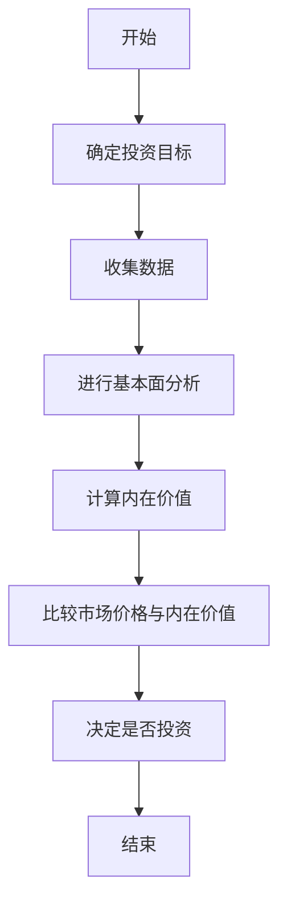

                 


# 价值投资中的绿色经济机遇

> 关键词：绿色经济、价值投资、可持续发展、ESG投资、长期价值、环境影响、投资策略

> 摘要：随着全球环境问题的日益严重，绿色经济成为推动社会可持续发展的重要力量。价值投资作为一种长期、理性、逆向的投资策略，能够通过深入分析企业的内在价值，挖掘绿色经济中的投资机遇。本文将从绿色经济与价值投资的背景出发，深入分析绿色经济与价值投资的核心概念与联系，探讨绿色经济与价值投资的数学模型与算法原理，详细讲解绿色经济与价值投资的系统分析与架构设计方案，并结合实际案例进行项目实战。通过本文的分析，读者将能够更好地理解绿色经济与价值投资的内在联系，并掌握如何在绿色经济中寻找价值投资的机遇。

---

## 第1章 绿色经济与价值投资的背景介绍

### 1.1 绿色经济的定义与背景

#### 1.1.1 绿色经济的定义
绿色经济是一种以可持续发展为目标的经济模式，强调在经济活动中实现资源的高效利用、环境保护和生态平衡。绿色经济不仅关注经济增长，还注重经济活动对环境和社会的影响，力求实现经济效益与环境效益的双重统一。

#### 1.1.2 绿色经济的全球发展趋势
随着全球气候变化、资源枯竭和环境污染等问题的加剧，绿色经济成为全球关注的焦点。各国政府和企业纷纷制定相关政策和战略，推动绿色经济的发展。例如，欧盟提出的“绿色新政”、中国的“双碳目标”（碳达峰、碳中和）等，都是绿色经济在全球范围内的具体体现。

#### 1.1.3 绿色经济与可持续发展的关系
绿色经济是实现可持续发展的重要手段。通过绿色经济，可以减少对自然资源的过度依赖，降低环境污染，促进社会公平与正义，从而实现经济、社会和环境的协调发展。

---

### 1.2 价值投资的核心概念

#### 1.2.1 价值投资的定义
价值投资是一种长期投资策略，强调以低于内在价值的价格买入优质资产。其核心理念是通过深入分析企业的基本面，寻找被市场低估的投资标的。

#### 1.2.2 价值投资的基本原理
价值投资的基本原理包括以下几点：
1. 市场先生：市场的短期波动是不可预测的，但长期趋势是可预测的。
2. 安全边际：买入价格低于内在价值，以降低投资风险。
3. 优质企业：选择具有强大竞争优势、良好管理团队和可持续发展前景的企业。

#### 1.2.3 价值投资与绿色经济的结合
绿色经济的发展需要长期的资金投入和技术创新，而价值投资的长期性和深度分析特点，使其成为绿色经济的重要融资方式。通过价值投资，投资者可以支持绿色产业的发展，同时获得长期的经济回报。

---

### 1.3 绿色经济与价值投资的结合背景

#### 1.3.1 环境问题对企业价值的影响
随着环境问题的加剧，企业对环境的负面影响（如高碳排放、资源浪费）会增加其运营成本，降低市场竞争力。反之，注重环境保护的企业更容易获得政策支持和市场认可，从而提升企业价值。

#### 1.3.2 投资者对绿色经济的关注
越来越多的投资者意识到，绿色经济不仅是社会责任，也是实现长期收益的重要途径。通过投资绿色企业，投资者可以规避环境风险，同时享受绿色产业带来的增长红利。

#### 1.3.3 绿色经济对企业长期价值的提升
绿色经济通过技术创新和资源优化，提高企业的生产效率和盈利能力。同时，绿色企业更容易获得资本市场的青睐，从而提升其市场价值和品牌影响力。

---

## 第2章 绿色经济与价值投资的核心概念与联系

### 2.1 绿色经济的核心概念

#### 2.1.1 绿色经济的定义与属性
绿色经济是以可持续发展为目标的经济模式，具有高效性、环保性和社会性等属性。

#### 2.1.2 绿色经济的核心要素
绿色经济的核心要素包括绿色技术、绿色产业、绿色政策和绿色金融等。

#### 2.1.3 绿色经济的实现路径
绿色经济的实现路径包括技术创新、政策支持、市场推动和公众参与等。

---

### 2.2 价值投资的核心概念

#### 2.2.1 价值投资的定义与属性
价值投资是一种长期、逆向的投资策略，具有安全边际、优质企业和长期性等属性。

#### 2.2.2 价值投资的核心要素
价值投资的核心要素包括内在价值、安全边际和优质企业等。

#### 2.2.3 价值投资的实现路径
价值投资的实现路径包括基本面分析、估值分析和长期持有等。

---

### 2.3 绿色经济与价值投资的联系

#### 2.3.1 绿色经济对价值投资的影响
绿色经济通过技术创新和政策支持，提升企业的内在价值和长期盈利能力，从而为价值投资者提供更多优质的投资标的。

#### 2.3.2 价值投资对绿色经济的推动
价值投资的长期性和深度分析特点，使其能够支持绿色经济的发展，推动技术创新和资源优化，从而实现经济与环境的双赢。

#### 2.3.3 两者结合的必要性与可行性
绿色经济的发展需要长期资金支持，而价值投资的长期性特点使其成为绿色经济的重要融资方式。同时，绿色经济的可持续性特点也符合价值投资的长期收益目标，使得两者结合具有较强的可行性和必要性。

---

### 2.4 绿色经济与价值投资的核心概念对比

#### 2.4.1 核心概念对比表格

| 核心概念 | 绿色经济                  | 价值投资                  |
|----------|--------------------------|---------------------------|
| 定义     | 以可持续发展为目标的经济模式 | 以内在价值为导向的投资策略 |
| 属性     | 高效性、环保性、社会性    | 安全边际、优质企业、长期性 |
| 实现路径 | 技术创新、政策支持        | 基本面分析、估值分析        |

#### 2.4.2 核心概念的ER实体关系图

```mermaid
erDiagram
    actor 投资者 {
        <name>
        <投资策略>
    }
    actor 绿色企业 {
        <行业>
        <技术>
    }
    actor 政府 {
        <政策>
        <资金>
    }
    investor --> 绿色企业: 投资
   绿色企业 --> 政府: 支持
```

---

## 第3章 绿色经济与价值投资的数学模型与算法原理

### 3.1 绿色经济与价值投资的数学模型

#### 3.1.1 绿色经济的数学模型
绿色经济的数学模型可以表示为：
$$ E = k \times T \times P \times Q $$
其中：
- \( E \) 表示环境影响
- \( k \) 表示环境影响系数
- \( T \) 表示技术效率
- \( P \) 表示资源价格
- \( Q \) 表示产量

#### 3.1.2 价值投资的数学模型
价值投资的数学模型可以表示为：
$$ V = \frac{CF}{r - g} $$
其中：
- \( V \) 表示内在价值
- \( CF \) 表示未来现金流
- \( r \) 表示折现率
- \( g \) 表示增长率

#### 3.1.3 两者结合的数学模型
结合绿色经济与价值投资的数学模型，可以表示为：
$$ V_{green} = \frac{CF_{green}}{r_{green} - g_{green}} $$$
其中：
- \( V_{green} \) 表示绿色经济的内在价值
- \( CF_{green} \) 表示绿色经济的未来现金流
- \( r_{green} \) 表示绿色经济的折现率
- \( g_{green} \) 表示绿色经济的增长率

---

### 3.2 算法原理讲解

#### 3.2.1 算法原理的Mermaid流程图



#### 3.2.2 算法原理的Python源代码实现

```python
def calculate_intrinsic_value(enterprise, market_price):
    # 计算未来现金流
    CF = enterprise.future_cash_flows
    # 计算折现率和增长率
    r = enterprise.cost_of_capital
    g = enterprise.expected_growth_rate
    # 计算内在价值
    intrinsic_value = CF / (r - g)
    # 比较市场价格与内在价值
    if market_price < intrinsic_value:
        return "投资"
    else:
        return "不投资"

# 示例企业数据
enterprise = {
    "future_cash_flows": 1000000,
    "cost_of_capital": 0.1,
    "expected_growth_rate": 0.05
}
market_price = 900000

print(calculate_intrinsic_value(enterprise, market_price))
```

#### 3.2.3 算法原理的数学公式
通过上述算法，我们可以得出以下结论：
$$ \text{投资} \quad \text{当} \quad \text{市场价} < \text{内在价值} $$

---

## 第4章 绿色经济与价值投资的系统分析与架构设计方案

### 4.1 系统分析

#### 4.1.1 系统分析的背景
绿色经济与价值投资的结合需要一个综合性的系统来支持数据收集、分析和决策。

#### 4.1.2 系统分析的方法
系统分析的方法包括需求分析、功能分析和数据流分析等。

#### 4.1.3 系统分析的结果
系统分析的结果包括功能需求、数据需求和性能需求等。

---

### 4.2 系统架构设计

#### 4.2.1 系统架构设计的背景
系统架构设计的背景是绿色经济与价值投资的结合需要一个高效、可靠的系统来支持。

#### 4.2.2 系统架构设计的方法
系统架构设计的方法包括模块化设计、分层设计和组件化设计等。

#### 4.2.3 系统架构设计的结果
系统架构设计的结果包括系统模块划分、模块之间的接口定义和模块的功能描述等。

---

### 4.3 系统接口设计

#### 4.3.1 系统接口设计的背景
系统接口设计的背景是绿色经济与价值投资的结合需要系统与其他系统或模块进行数据交互。

#### 4.3.2 系统接口设计的方法
系统接口设计的方法包括需求分析、接口定义和测试用例设计等。

#### 4.3.3 系统接口设计的结果
系统接口设计的结果包括接口定义文档和接口测试用例等。

---

### 4.4 系统交互设计

#### 4.4.1 系统交互设计的背景
系统交互设计的背景是绿色经济与价值投资的结合需要系统与用户或其他系统进行交互。

#### 4.4.2 系统交互设计的方法
系统交互设计的方法包括用户需求分析、交互流程设计和界面设计等。

#### 4.4.3 系统交互设计的结果
系统交互设计的结果包括交互流程图和用户界面原型等。

---

## 第5章 项目实战：绿色经济中的价值投资策略

### 5.1 项目背景与目标

#### 5.1.1 项目背景
随着全球环境问题的加剧，绿色经济成为推动社会可持续发展的重要力量。通过价值投资，我们可以支持绿色产业的发展，同时实现长期的经济回报。

#### 5.1.2 项目目标
本项目的目标是通过价值投资的策略，选择具有长期发展潜力的绿色企业进行投资，实现经济与环境的双赢。

---

### 5.2 项目核心实现

#### 5.2.1 数据收集与处理
数据收集包括绿色企业的财务数据、行业数据和政策数据等。数据处理包括数据清洗、数据转换和数据存储等。

#### 5.2.2 投资策略的制定
投资策略的制定包括基本面分析、估值分析和长期持有等步骤。

#### 5.2.3 投资组合的优化
投资组合的优化包括风险控制、收益最大化和资产配置等。

---

### 5.3 项目案例分析

#### 5.3.1 案例背景
以某家绿色能源企业为例，分析其财务状况、行业地位和政策支持等。

#### 5.3.2 案例分析
通过基本面分析和估值分析，确定该企业的内在价值和市场价格，判断是否进行投资。

#### 5.3.3 案例结果
通过分析，确定该企业具有较高的投资价值，建议进行长期投资。

---

### 5.4 项目总结与小结

#### 5.4.1 项目总结
通过本项目的实施，我们掌握了绿色经济与价值投资的结合方法，提高了对绿色经济的认识和理解。

#### 5.4.2 项目小结
绿色经济与价值投资的结合是实现可持续发展的重要途径，通过价值投资的策略，我们可以支持绿色产业的发展，实现长期的经济回报。

---

## 第6章 最佳实践与注意事项

### 6.1 最佳实践

#### 6.1.1 数据收集与分析
数据收集与分析是绿色经济与价值投资的重要基础，需要确保数据的准确性和完整性。

#### 6.1.2 投资策略的制定
投资策略的制定需要结合企业的基本面和市场环境，确保策略的科学性和可行性。

#### 6.1.3 投资组合的优化
投资组合的优化需要考虑风险与收益的平衡，确保投资组合的稳定性和收益性。

---

### 6.2 注意事项

#### 6.2.1 环境风险
绿色经济的发展需要关注环境风险，避免因环境问题导致的投资损失。

#### 6.2.2 市场风险
绿色经济的发展需要关注市场风险，避免因市场波动导致的投资损失。

#### 6.2.3 政策风险
绿色经济的发展需要关注政策风险，避免因政策变化导致的投资损失。

---

## 第7章 未来趋势与总结

### 7.1 未来趋势

#### 7.1.1 绿色经济的未来发展
绿色经济将逐步成为全球经济发展的重要方向，技术创新和政策支持将推动绿色经济的快速发展。

#### 7.1.2 价值投资的未来发展
价值投资将更加关注绿色经济，长期价值和环境效益将成为投资决策的重要因素。

#### 7.1.3 两者结合的未来趋势
绿色经济与价值投资的结合将更加紧密，技术创新和政策支持将推动绿色经济与价值投资的共同发展。

---

## 作者：AI天才研究院/AI Genius Institute & 禅与计算机程序设计艺术/Zen And The Art of Computer Programming

---

> **版权声明**  
> 本文版权归作者所有，未经授权，不得转载。如需转载请注明出处。

