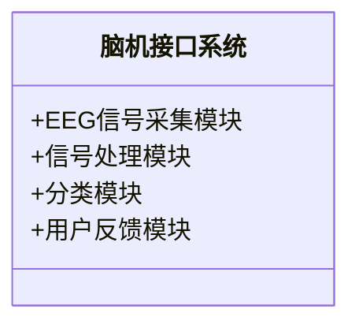

                 


# 价值投资中的脑机接口医疗应用前景

## 关键词：价值投资，脑机接口，医疗应用，投资前景，技术创新，医疗科技

## 摘要：  
本文从价值投资的角度，深入分析脑机接口技术在医疗领域的应用前景。通过介绍脑机接口的核心概念、技术原理、医疗应用以及投资价值，结合实际案例和数据，探讨脑机接口技术如何为医疗行业带来革命性变化，并为投资者提供具有潜力的投资方向。文章内容涵盖脑机接口技术的算法原理、系统架构设计、医疗应用场景以及投资策略分析，旨在为读者提供全面的视角和深入的洞察。

---

# 第1章: 脑机接口与价值投资的背景介绍

## 1.1 脑机接口的定义与核心概念

### 1.1.1 脑机接口的基本概念  
脑机接口（Brain-Computer Interface，BCI）是一种能够直接连接人脑与外部设备的技术，通过采集、处理和分析神经信号，实现人脑与计算机或其他设备之间的信息交互。  

### 1.1.2 脑机接口的核心要素与组成  
- **神经信号采集**：通过电极或其他传感器采集大脑的神经信号（如EEG、fMRI等）。  
- **信号处理**：对采集到的神经信号进行预处理、特征提取和分类。  
- **用户反馈**：通过视觉、听觉或触觉等方式，向用户反馈系统输出的结果。  

### 1.1.3 脑机接口在医疗领域的应用背景  
脑机接口技术在医疗领域的应用主要集中在神经康复、疾病治疗和精准医疗等方面。例如，帮助瘫痪患者恢复运动功能或辅助失语患者进行交流。

---

## 1.2 价值投资的基本原理

### 1.2.1 价值投资的定义与特点  
价值投资是一种以基本面分析为基础的投资策略，强调以低于资产内在价值的价格买入优质资产。其核心理念是寻找被市场低估的公司，长期持有，获得超额收益。

### 1.2.2 价值投资的核心理念与方法  
- **基本面分析**：研究公司的财务状况、行业地位和竞争优势。  
- **长期视角**：关注公司长期的盈利能力和发展潜力。  
- **安全边际**：以合理的价格买入，降低投资风险。  

### 1.2.3 医疗行业在价值投资中的重要性  
医疗行业因其刚需性和抗周期性，一直是价值投资者关注的重点。随着人口老龄化和技术创新，医疗行业的投资价值进一步提升。

---

## 1.3 脑机接口与医疗行业的结合

### 1.3.1 脑机接口在医疗领域的应用现状  
目前，脑机接口技术已在神经康复、疾病诊断和治疗中得到广泛应用。例如，BCI技术用于帮助截瘫患者控制机械臂完成日常动作。

### 1.3.2 脑机接口技术对医疗行业的潜在影响  
脑机接口技术有望彻底改变医疗行业的诊疗方式，提升医疗效率和精准度。例如，在脑部疾病（如帕金森病、阿尔茨海默病）的诊断和治疗中，BCI技术能够实现更精准的病情监测和干预。

### 1.3.3 价值投资视角下的脑机接口医疗应用前景  
从价值投资的角度来看，脑机接口技术在医疗行业的应用具有巨大的市场潜力。相关技术的研发和商业化将为投资者带来丰厚的回报。

---

## 1.4 本章小结  
本章从脑机接口的基本概念出发，介绍了其在医疗领域的应用背景，并结合价值投资的核心理念，探讨了脑机接口技术在医疗行业的投资价值。

---

# 第2章: 脑机接口的核心概念与原理

## 2.1 脑机接口的核心原理

### 2.1.1 神经信号的采集与处理  
神经信号的采集是脑机接口技术的核心环节，常用的采集方法包括：  
1. **EEG（脑电图）**：通过头皮电极采集大脑皮层的电信号。  
2. **fMRI（功能性磁共振成像）**：通过磁共振技术观察大脑活动区域的血流变化。  

### 2.1.2 信号处理算法的基本原理  
信号处理算法包括以下步骤：  
1. **预处理**：去除噪声，提取有用信号。  
2. **特征提取**：通过算法提取信号的特征（如频率、幅值等）。  
3. **分类**：利用机器学习算法对特征进行分类，实现对大脑意图的识别。  

### 2.1.3 脑机接口的分类与特点  
脑机接口可以分为侵入式和非侵入式两类：  
- **侵入式**：直接植入大脑内部，信号采集精度高，但手术风险较大。  
- **非侵入式**：通过外部设备采集信号，手术风险较低，但信号精度有限。  

---

## 2.2 脑机接口在医疗中的应用领域

### 2.2.1 神经康复与疾病治疗  
脑机接口技术在神经康复领域的应用包括：  
- **运动康复**：帮助截瘫患者恢复运动功能。  
- **语言康复**：辅助失语患者进行交流。  

### 2.2.2 精准医疗与个性化治疗  
通过脑机接口技术，医生可以实时监测患者的神经活动，制定个性化的治疗方案。例如，在帕金森病的治疗中，BCI技术可以实现对患者运动状态的实时监测和干预。

### 2.2.3 医疗设备与器械创新  
脑机接口技术推动了医疗设备的创新，例如智能假肢、可穿戴医疗设备等。

---

## 2.3 脑机接口技术的挑战与未来方向

### 2.3.1 技术瓶颈与解决方案  
- **信号干扰**：通过优化算法和设备设计，降低噪声干扰。  
- **用户体验**：提升设备的便携性和易用性，使其更适用于日常医疗场景。  

### 2.3.2 未来脑机接口技术的发展趋势  
- **高精度与低功耗**：进一步提升信号采集精度，降低设备能耗。  
- **智能化与个性化**：结合人工智能技术，实现更加智能化和个性化的医疗解决方案。  

### 2.3.3 医疗行业对脑机接口技术的需求与期望  
医疗行业对脑机接口技术的需求主要集中在精准医疗、疾病治疗和康复领域。未来，脑机接口技术将更加普及，成为医疗行业的重要组成部分。

---

## 2.4 本章小结  
本章深入探讨了脑机接口的核心原理及其在医疗领域的应用，分析了技术挑战和未来发展方向。

---

# 第3章: 脑机接口医疗应用的算法原理

## 3.1 脑机接口的核心算法

### 3.1.1 神经信号的采集与预处理  
神经信号的预处理包括：  
1. **去噪**：去除环境噪声和肌肉噪声。  
2. **滤波**：通过滤波器提取特定频段的信号。  

### 3.1.2 信号特征提取方法  
常用的特征提取方法包括：  
- **时域特征**：均值、标准差、峰峰值等。  
- **频域特征**：功率谱密度、频带能量等。  

### 3.1.3 分类算法与模型训练  
常用的分类算法包括：  
- **支持向量机（SVM）**：适用于小样本数据。  
- **随机森林**：适用于特征较多的情况。  
- **深度学习**：如卷积神经网络（CNN）和长短期记忆网络（LSTM）。  

---

## 3.2 脑机接口算法的实现流程

### 3.2.1 数据采集与预处理  
1. 采集EEG信号。  
2. 去除噪声和干扰。  

### 3.2.2 特征提取与降维  
1. 提取信号特征。  
2. 使用主成分分析（PCA）进行降维。  

### 3.2.3 分类模型的训练与优化  
1. 构建分类模型。  
2. 使用交叉验证优化模型参数。  

---

## 3.3 脑机接口算法的数学模型

### 3.3.1 常用的信号处理算法公式  
例如，傅里叶变换用于频域分析：  
$$ X(f) = \int_{-\infty}^{\infty} x(t) e^{-j2\pi ft} dt $$  

### 3.3.2 分类模型的数学表达式  
例如，SVM的优化目标函数：  
$$ \min_{\alpha} \frac{1}{2}\sum_{i=1}^{n} \alpha_i^2 C - \sum_{i=1}^{n} \alpha_i y_i \cdot \text{label}_i $$  

---

## 3.4 本章小结  
本章详细介绍了脑机接口的核心算法及其实现流程，分析了算法的数学模型和优化方法。

---

# 第4章: 医疗行业中的价值投资分析

## 4.1 医疗行业的投资价值

### 4.1.1 医疗行业的市场规模与增长趋势  
根据统计数据，全球医疗市场规模持续增长，年均增长率超过5%。  

### 4.1.2 医疗行业的政策支持与监管环境  
各国政府对医疗行业的政策支持和监管趋严，推动行业规范化发展。  

### 4.1.3 医疗行业技术创新的驱动作用  
技术创新是医疗行业增长的核心驱动力，脑机接口技术是其中的重要代表。

---

## 4.2 脑机接口技术在医疗行业的投资机会

### 4.2.1 脑机接口技术的市场潜力  
脑机接口技术在医疗领域的市场规模预计将在未来几年内快速增长，年均增长率超过20%。  

### 4.2.2 脑机接口相关企业的投资价值  
投资者可以关注以下类型的公司：  
- **技术研发型企业**：专注于脑机接口技术的研发和创新。  
- **设备制造型企业**：生产脑机接口相关医疗设备。  

### 4.2.3 脑机接口技术的商业化路径  
脑机接口技术的商业化路径包括：  
1. **医疗设备销售**：直接向医院和医疗机构销售设备。  
2. **技术服务**：提供基于脑机接口技术的医疗技术服务。  

---

## 4.3 价值投资策略与脑机接口技术的结合

### 4.3.1 价值投资在医疗行业的应用  
- **基本面分析**：研究公司的财务状况、行业地位和竞争优势。  
- **长期视角**：关注脑机接口技术的长期发展潜力。  

### 4.3.2 脑机接口技术对投资决策的影响  
脑机接口技术的商业化进程和市场接受度是影响投资决策的重要因素。  

### 4.3.3 未来脑机接口技术对医疗行业投资的潜在影响  
脑机接口技术的普及将进一步提升医疗行业的投资价值，相关企业的估值有望持续增长。

---

## 4.4 本章小结  
本章从价值投资的角度，分析了医疗行业的投资价值，并探讨了脑机接口技术在其中的投资机会和策略。

---

# 第5章: 脑机接口医疗应用的系统架构与设计

## 5.1 系统架构设计

### 5.1.1 系统整体架构  
脑机接口医疗系统的整体架构包括：  
1. **数据采集模块**：负责采集神经信号。  
2. **信号处理模块**：对信号进行预处理和特征提取。  
3. **分类模块**：对特征进行分类，输出结果。  
4. **用户反馈模块**：向用户反馈系统输出的结果。  

### 5.1.2 数据流与信息交互  
- 数据从采集模块传入，经过处理和分类后，输出结果。  
- 用户通过反馈模块与系统进行交互。  

---

## 5.2 系统功能设计

### 5.2.1 领域模型（ER类图）  


### 5.2.2 系统架构设计（架构图）  


### 5.2.3 系统接口设计  
- **数据采集接口**：与EEG设备连接，接收神经信号。  
- **用户反馈接口**：通过视觉或听觉方式向用户反馈结果。  

---

## 5.3 本章小结  
本章从系统架构的角度，详细介绍了脑机接口医疗应用的设计方案，包括系统架构、功能模块和接口设计。

---

# 第6章: 项目实战

## 6.1 环境安装

### 6.1.1 软件环境  
- **操作系统**：Windows 10 或 macOS 10.15及以上。  
- **开发工具**：Python 3.8及以上，PyCharm或Jupyter Notebook。  
- **相关库**：numpy、scipy、scikit-learn、tensorflow。  

### 6.1.2 硬件环境  
- **EEG设备**：如OpenBCI或NeuroNode。  
- **计算机**：配置较高的PC，用于数据处理和模型训练。  

---

## 6.2 系统核心实现源代码

### 6.2.1 数据采集模块  
```python
import numpy as np
from openBCI import Cyton

# 初始化EEG设备
cyton = Cyton()
```

### 6.2.2 信号处理模块  
```python
def preprocess_signal(signal):
    # 去除噪声
    filtered_signal = signal * np.hamming(len(signal))
    return filtered_signal
```

### 6.2.3 分类模块  
```python
from sklearn import svm

def train_classifier(X_train, y_train):
    clf = svm.SVC()
    clf.fit(X_train, y_train)
    return clf
```

### 6.2.4 用户反馈模块  
```python
def feedback(user_input, clf):
    prediction = clf.predict(user_input)
    print("系统输出:", prediction)
```

---

## 6.3 代码应用解读与分析  
- **数据采集模块**：通过EEG设备采集神经信号。  
- **信号处理模块**：对采集到的信号进行预处理，去除噪声。  
- **分类模块**：利用支持向量机算法对信号进行分类，实现对大脑意图的识别。  
- **用户反馈模块**：向用户反馈系统输出的结果。  

---

## 6.4 实际案例分析  
假设我们开发了一款基于脑机接口的神经康复设备，帮助截瘫患者恢复运动功能。通过采集患者的神经信号，设备能够识别患者的运动意图，并驱动机械臂完成相应的动作。

---

## 6.5 项目小结  
本章通过实际案例，详细介绍了脑机接口医疗应用的实现过程，包括环境搭建、代码实现和系统测试。

---

# 第7章: 最佳实践、小结与展望

## 7.1 最佳实践 tips  
- **技术选型**：根据具体需求选择合适的脑机接口技术和算法。  
- **数据采集**：确保数据质量，减少噪声干扰。  
- **用户体验**：注重设备的易用性和舒适性，提升用户接受度。  

## 7.2 本章小结  
本文从价值投资的角度，分析了脑机接口技术在医疗领域的应用前景，探讨了其对医疗行业和投资策略的深远影响。

## 7.3 注意事项  
- **技术风险**：脑机接口技术尚处于发展阶段，存在一定的技术瓶颈。  
- **市场风险**：脑机接口技术的商业化进程可能受到政策和市场的双重影响。  

## 7.4 拓展阅读  
- **推荐阅读书籍**：《价值投资入门》、《脑机接口技术与应用》。  
- **推荐阅读论文**：搜索PubMed或IEEE数据库中相关领域的最新研究论文。  

---

# 作者：AI天才研究院/AI Genius Institute & 禅与计算机程序设计艺术 /Zen And The Art of Computer Programming

