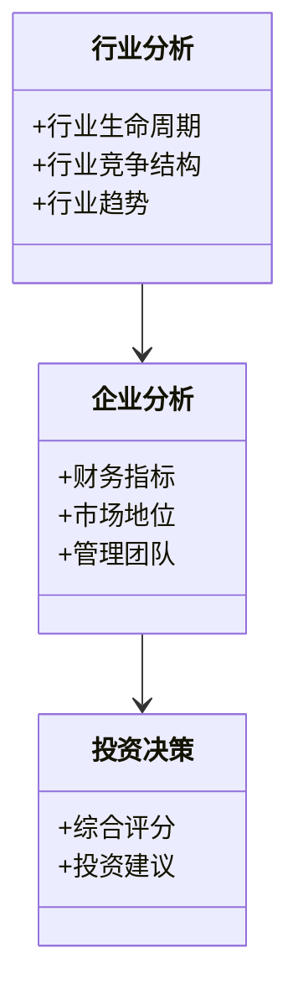
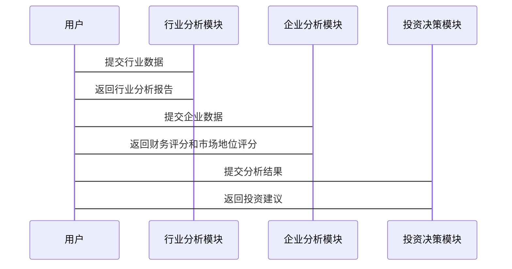

                 


# 价值投资中的行业领导者识别

## 关键词：价值投资、行业领导者、投资策略、财务分析、市场趋势

## 摘要：  
在价值投资中，识别行业领导者是实现长期稳健收益的关键。本文通过分析行业领导者的核心特征、财务指标、市场地位及管理团队等多维度因素，结合实际案例，探讨如何在不同行业中识别具有持续竞争优势的龙头企业。文章还将介绍基于财务指标的行业领导者识别算法，并提供Python代码实现，帮助投资者构建系统化的行业分析框架。

---

# 第1章: 价值投资与行业领导者概述

## 1.1 行业领导者的定义与特征

### 1.1.1 行业领导者的定义  
行业领导者是指在特定行业中占据主导地位，具有显著竞争优势的企业。这类企业通常在市场份额、品牌影响力、技术创新等方面处于行业领先地位。

### 1.1.2 行业领导者的特征  
- **市场份额**：占据行业内较大比例的市场份额。  
- **品牌影响力**：品牌知名度高，具有较强的消费者认知度。  
- **盈利能力**：具备持续稳定的盈利能力，ROE（净资产收益率）和ROA（资产回报率）较高。  
- **技术创新能力**：在技术研发和产品创新方面具有领先优势。  
- **管理团队**：拥有经验丰富、能力强的管理团队。  

### 1.1.3 行业领导者的分类  
行业领导者可以分为以下几类：  
- **市场领导者**：市场份额最高的企业。  
- **创新领导者**：在技术创新方面处于领先地位的企业。  
- **成本领导者**：在成本控制方面具有显著优势的企业。  

---

## 1.2 价值投资的核心理念

### 1.2.1 价值投资的定义  
价值投资是一种投资策略，强调以低于内在价值的价格购买优质资产，长期持有，等待价值回归。其核心在于寻找市场低估的优质企业。

### 1.2.2 价值投资的基本原则  
- **长期视角**：关注企业的长期盈利能力，而非短期市场波动。  
- **安全边际**：以低于内在价值的价格买入，确保投资的安全性。  
- **优质企业**：选择具有竞争优势、管理优秀的企业。  

### 1.2.3 价值投资与行业领导者识别的关系  
识别行业领导者是价值投资的核心步骤之一。行业领导者通常具有较高的内在价值，且其竞争优势能够支撑长期的盈利能力。

---

## 1.3 价值投资中的行业领导者识别的重要性

### 1.3.1 行业领导者在投资中的作用  
- 行业领导者往往具有更强的抗风险能力，在市场波动中表现更为稳定。  
- 具有较高的成长潜力，能够为投资者带来长期收益。  

### 1.3.2 识别行业领导者对投资决策的影响  
- 帮助投资者筛选出具有长期竞争优势的企业，降低投资风险。  
- 提高投资效率，避免将资金投入到竞争力较弱的企业中。  

### 1.3.3 识别行业领导者中的挑战与机遇  
- **挑战**：行业变化快，竞争激烈，识别过程复杂。  
- **机遇**：通过深入分析，投资者可以发现被市场低估的行业领导者，实现超额收益。  

---

## 1.4 本章小结  
本章介绍了行业领导者的定义与特征，阐述了价值投资的核心理念，并强调了识别行业领导者在投资中的重要性。通过识别行业领导者，投资者可以在复杂的市场环境中找到具有长期竞争优势的企业，实现稳健的投资回报。

---

# 第2章: 行业分析与领导者识别的核心概念

## 2.1 行业分析的基本框架

### 2.1.1 行业生命周期分析  
行业生命周期分为四个阶段：导入期、成长期、成熟期和衰退期。在成长期和成熟期，行业领导者更容易脱颖而出。

### 2.1.2 行业竞争结构分析  
- **波特五力模型**：分析行业内竞争程度、供应商议价能力、买家议价能力、新进入者威胁以及替代品威胁。  
- **竞争优势**：分析企业的成本优势、技术优势、品牌优势等。  

### 2.1.3 行业趋势分析  
关注行业的未来发展趋势，如技术进步、政策变化、消费习惯改变等，判断行业领导者的成长空间。

---

## 2.2 行业领导者识别的关键指标

### 2.2.1 财务指标分析  
- **收入与利润**：关注企业的收入增长率、净利润率等指标。  
- **资产负债表**：分析企业的资产结构、负债水平和现金流状况。  

### 2.2.2 市场地位分析  
- **市场份额**：通过行业数据和市场调研，判断企业的市场份额。  
- **品牌影响力**：通过品牌价值评估和消费者认知度分析。  

### 2.2.3 管理团队分析  
- **管理团队的经验**：团队成员的行业经验和管理能力。  
- **战略规划**：企业的发展战略是否清晰，是否具备前瞻性。  

---

## 2.3 行业领导者识别的逻辑框架

### 2.3.1 行业分析与公司筛选的逻辑  
- 先分析行业，再筛选企业：从行业生命周期、竞争结构和趋势入手，找到具有潜力的行业，再在该行业中筛选领导者。  

### 2.3.2 从行业趋势到公司选择的路径  
- 识别行业趋势，锁定具有成长潜力的行业。  
- 在目标行业中，筛选符合财务指标、市场地位和管理团队要求的企业。  

### 2.3.3 行业领导者识别的综合模型  
综合模型包括以下几个方面：  
1. 行业分析：行业生命周期、竞争结构、发展趋势。  
2. 财务分析：收入、利润、现金流等指标。  
3. 市场地位：市场份额、品牌影响力。  
4. 管理团队：团队能力、战略规划。  

---

## 2.4 本章小结  
本章从行业分析的角度，详细阐述了行业领导者识别的关键指标和逻辑框架。通过综合分析行业趋势、企业财务状况、市场地位和管理团队等因素，投资者可以更准确地识别出具有长期竞争优势的行业领导者。

---

# 第3章: 行业领导者识别的算法原理

## 3.1 行业领导者识别的算法概述

### 3.1.1 基于财务指标的算法  
- 通过财务指标对企业的盈利能力和财务健康状况进行评分。  
- 根据评分结果，筛选出行业内表现优异的企业。  

### 3.1.2 基于市场表现的算法  
- 分析企业的股价走势、市盈率、市净率等指标，判断企业的市场估值是否合理。  
- 结合行业趋势和企业基本面，识别具有成长潜力的企业。  

### 3.1.3 基于行业趋势的算法  
- 通过行业趋势分析，判断哪些行业具有较大的成长空间。  
- 在目标行业中，筛选符合财务指标和市场地位要求的企业。  

---

## 3.2 财务指标分析算法

### 3.2.1 财务指标的定义与计算  
- **ROE（净资产收益率）**：净利润 / 平均股东权益。  
- **ROA（资产回报率）**：净利润 / 平均总资产。  
- **毛利率**：（营业收入 - 营业成本） / 营业收入。  

### 3.2.2 财务指标的权重分配  
根据行业特点和投资目标，对不同财务指标赋予不同的权重。例如，对于成长型行业，可以适当提高收入增长率的权重；对于成熟行业，可以提高ROE的权重。

### 3.2.3 财务指标的综合评分  
通过加权平均的方式，对企业的财务指标进行综合评分，判断其在行业中的相对位置。

---

## 3.3 市场地位分析算法

### 3.3.1 市场份额的计算  
- 通过行业数据和企业财报，计算企业的市场份额。  

### 3.3.2 品牌价值评估  
- 通过第三方品牌价值评估机构的数据，判断企业的品牌影响力。  

### 3.3.3 综合评分  
结合市场份额和品牌价值，对企业的市场地位进行综合评分。

---

## 3.4 本章小结  
本章通过财务指标和市场地位两个方面，详细介绍了行业领导者识别的算法原理。通过综合分析企业的财务状况和市场地位，投资者可以更系统地识别出具有竞争优势的行业领导者。

---

# 第4章: 系统分析与架构设计方案

## 4.1 问题场景介绍  
在价值投资中，识别行业领导者需要综合考虑多个因素，包括行业分析、财务指标、市场地位和管理团队等。为了提高效率，可以通过构建一个系统化的分析框架来实现。

---

## 4.2 系统功能设计

### 4.2.1 领域模型类图  


### 4.2.2 系统架构图  
```mermaid
container 行业领导者识别系统 {
    组件 行业分析模块
    组件 企业分析模块
    组件 投资决策模块
}
```

### 4.2.3 接口设计  
- 行业分析模块接口：接收行业数据，输出行业分析报告。  
- 企业分析模块接口：接收企业数据，输出财务评分和市场地位评分。  
- 投资决策模块接口：接收分析结果，输出投资建议。  

---

## 4.3 系统交互序列图  



---

## 4.4 本章小结  
本章通过系统分析与架构设计，构建了一个行业领导者识别的框架。通过领域模型类图、系统架构图和交互序列图，详细描述了系统的功能模块和交互流程。

---

# 第5章: 项目实战

## 5.1 项目环境安装

```python
# 环境要求
import pandas as pd
import numpy as np
import matplotlib.pyplot as plt
```

---

## 5.2 核心代码实现

### 5.2.1 数据收集与预处理  
```python
# 示例代码：从CSV文件中读取数据
data = pd.read_csv('industry_data.csv')
data.head()
```

### 5.2.2 财务指标计算  
```python
# 计算ROE
data['ROE'] = data['净利润'] / data['平均股东权益']

# 计算ROA
data['ROA'] = data['净利润'] / data['平均总资产']
```

### 5.2.3 综合评分模型  
```python
# 定义评分权重
weights = {
    'ROE': 0.4,
    'ROA': 0.3,
    '毛利率': 0.2,
    '市场份额': 0.1
}

# 计算综合评分
data['综合评分'] = 0
for col in weights:
    data['综合评分'] += data[col] * weights[col]
```

---

## 5.3 代码解读与分析  
- 数据收集与预处理：从CSV文件中读取行业数据，并展示前几行数据。  
- 财务指标计算：计算ROE和ROA等关键财务指标。  
- 综合评分模型：根据财务指标和市场份额，计算企业的综合评分。  

---

## 5.4 案例分析  
以科技行业为例，分析苹果、微软和谷歌的财务指标和市场地位，计算它们的综合评分，判断谁是科技行业的领导者。

---

## 5.5 项目小结  
通过项目实战，我们利用Python代码实现了一个行业领导者识别的系统。通过数据收集、预处理和模型训练，我们可以有效地识别出行业内具有竞争优势的企业。

---

# 第6章: 总结与扩展

## 6.1 本章总结  
本文详细介绍了价值投资中的行业领导者识别方法，从行业分析、财务指标、市场地位等多个维度，构建了一个系统化的分析框架，并通过项目实战展示了如何利用Python代码实现行业领导者识别。

## 6.2 投资中的注意事项  
- 投资者需要持续关注行业动态，及时调整投资策略。  
- 在识别行业领导者时，应结合定量分析和定性分析，避免片面性。  

## 6.3 拓展阅读  
- 《投资最重要的事》—— 巴菲特的黄金搭档芒格的投资智慧。  
- 《价值投资入门》—— 适合新手的价值投资指南。  

---

# 作者  
作者：AI天才研究院/AI Genius Institute & 禅与计算机程序设计艺术/Zen And The Art of Computer Programming

