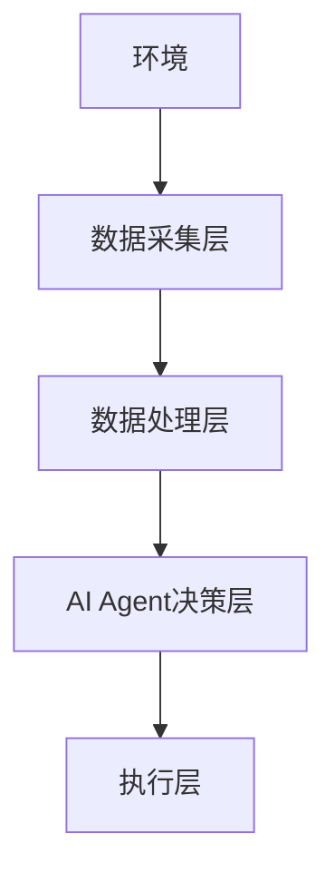
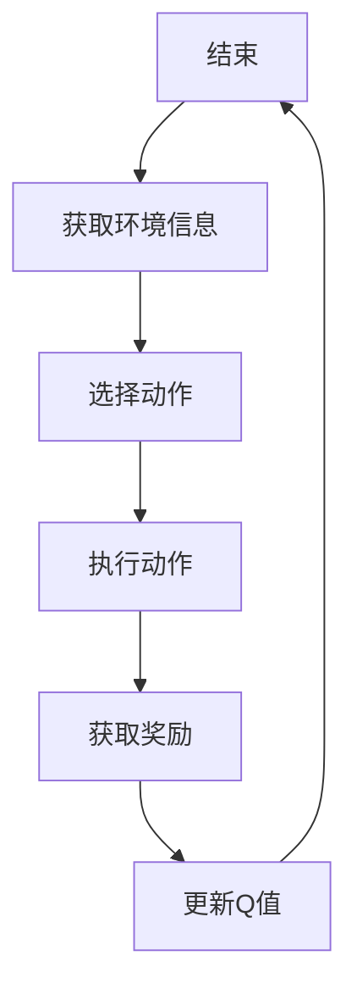

                 

# 企业AI Agent的5G网络应用策略

> 关键词：企业AI Agent，5G网络，AI算法，网络应用，系统架构

> 摘要：本文详细探讨了企业AI Agent在5G网络中的应用策略，从基本概念到系统架构，从算法原理到实际案例，全面分析了AI Agent如何在5G环境下实现智能化应用，为企业数字化转型提供新思路。

---

# 第1章: 企业AI Agent与5G网络概述

## 1.1 5G网络的基本概念

### 1.1.1 5G网络的定义与特点
5G网络是第五代移动通信技术，相较于4G，具有更高的带宽、更低的延迟、更多的连接数和更强的网络切片能力。其特点包括：
- 高带宽（支持更高速的数据传输）
- 低延迟（实时性要求高的场景）
- 大连接数（支持海量设备接入）
- 网络切片（按需分配网络资源）

### 1.1.2 5G网络的核心技术
- **大规模MIMO（多输入多输出）**：通过多天线技术提高网络容量和覆盖范围。
- **网络切片**：将物理网络划分为多个虚拟网络，满足不同场景的需求。
- **边缘计算（MEC）**：将计算能力下沉到网络边缘，降低延迟。
- **毫米波技术**：高频段通信，提升网络容量和传输速度。

### 1.1.3 5G网络对企业数字化转型的推动作用
5G网络为企业提供了更快的连接速度、更低的延迟和更大的连接能力，支持企业实现智能化、自动化和数字化转型。

## 1.2 AI Agent的定义与特点

### 1.2.1 AI Agent的基本概念
AI Agent（人工智能代理）是一种能够感知环境、自主决策并执行任务的智能体。它能够根据输入的信息做出决策，并通过执行动作与环境交互。

### 1.2.2 AI Agent的核心技术
- **感知能力**：通过传感器、摄像头等获取环境信息。
- **决策能力**：基于感知信息，通过算法（如强化学习、深度学习）做出决策。
- **执行能力**：通过执行器（如机器人、物联网设备）实现决策。

### 1.2.3 AI Agent与传统自动化系统的区别
AI Agent具有自主决策能力，能够根据环境变化动态调整行为，而传统自动化系统依赖预设规则，无法自主决策。

## 1.3 企业AI Agent的5G网络应用背景

### 1.3.1 5G网络为企业AI Agent提供的新机遇
- **高带宽**：支持大规模数据传输，满足AI Agent的实时性需求。
- **低延迟**：支持AI Agent的快速决策和执行。
- **大连接数**：支持海量设备接入，满足企业大规模部署需求。

### 1.3.2 企业AI Agent在5G网络中的应用场景
- **智能工厂**：通过5G网络实现设备间的实时通信，支持AI Agent进行生产优化。
- **智慧交通**：通过5G网络实现车辆与道路设施的实时通信，支持自动驾驶。
- **智能物流**：通过5G网络实现物流设备的实时通信，支持物流优化。

### 1.3.3 5G网络对企业AI Agent发展的挑战与机遇
- **挑战**：网络延迟、带宽限制、安全性等问题。
- **机遇**：5G网络的高带宽和低延迟为AI Agent提供了更好的技术支撑。

## 1.4 本章小结
本章介绍了5G网络的基本概念、核心技术以及AI Agent的定义、特点和应用场景。5G网络为企业AI Agent的发展提供了新的机遇，同时也带来了新的挑战。

---

# 第2章: 企业AI Agent的核心概念与原理

## 2.1 企业AI Agent的核心概念

### 2.1.1 企业AI Agent的定义与组成
企业AI Agent是一种能够在企业环境中感知环境、自主决策并执行任务的智能体。它通常由感知模块、决策模块和执行模块组成。

### 2.1.2 企业AI Agent的功能与特性
- **感知功能**：通过传感器、数据库等获取环境信息。
- **决策功能**：基于感知信息，通过算法做出决策。
- **执行功能**：通过执行器实现决策。

### 2.1.3 企业AI Agent的分类与应用场景
- **分类**：
  - **基于规则的AI Agent**：通过预设规则进行决策。
  - **基于学习的AI Agent**：通过机器学习算法进行决策。
  - **基于知识的AI Agent**：通过知识库进行决策。
- **应用场景**：
  - 智能工厂：生产优化、设备监控。
  - 智慧交通：自动驾驶、交通优化。
  - 智能物流：物流优化、库存管理。

## 2.2 5G网络的核心技术与AI Agent的结合

### 2.2.1 5G网络的低时延特性与AI Agent的实时性需求
5G网络的低时延特性能够满足AI Agent的实时性需求，支持其快速决策和执行。

### 2.2.2 5G网络的高带宽特性与AI Agent的数据传输效率
5G网络的高带宽特性能够支持AI Agent的大规模数据传输，提高数据处理效率。

### 2.2.3 5G网络的海量连接特性与AI Agent的规模部署
5G网络的海量连接特性能够支持AI Agent的规模部署，满足企业对大规模设备接入的需求。

## 2.3 企业AI Agent的算法原理

### 2.3.1 基于强化学习的AI Agent算法
强化学习是一种通过试错机制进行决策的算法，适用于动态环境下的决策问题。其数学模型如下：
$$
Q(s, a) = r + \gamma \max_{a'} Q(s', a')
$$
其中，$Q(s, a)$表示状态$s$和动作$a$的Q值，$r$是奖励，$\gamma$是折扣因子。

### 2.3.2 基于深度学习的AI Agent算法
深度学习是一种通过多层神经网络进行特征提取和决策的算法，适用于复杂环境下的决策问题。其数学模型如下：
$$
y = f(x) = W_2 \cdot \sigma(W_1 \cdot x + b_1) + b_2
$$
其中，$W_1$和$W_2$是权重矩阵，$b_1$和$b_2$是偏置向量，$\sigma$是激活函数。

### 2.3.3 基于规则引擎的AI Agent算法
基于规则引擎的AI Agent算法通过预设规则进行决策，适用于规则明确的场景。其流程如下：
1. 获取环境信息。
2. 匹配预设规则。
3. 执行对应动作。

## 2.4 本章小结
本章详细介绍了企业AI Agent的核心概念和算法原理，分析了5G网络核心技术与AI Agent的结合方式。基于强化学习和深度学习的算法是AI Agent的核心，而5G网络的特性为AI Agent的实时性和大规模部署提供了技术支撑。

---

# 第3章: 企业AI Agent的系统架构设计

## 3.1 企业AI Agent的系统组成

### 3.1.1 数据采集层
数据采集层负责从环境获取数据，包括传感器数据、数据库数据等。

### 3.1.2 数据处理层
数据处理层负责对采集的数据进行预处理、特征提取和模型训练。

### 3.1.3 AI Agent决策层
AI Agent决策层负责根据处理后的数据，通过算法做出决策。

### 3.1.4 执行层
执行层负责根据决策结果，通过执行器实现动作。

## 3.2 5G网络环境下的系统架构优化

### 3.2.1 边缘计算与AI Agent的结合
边缘计算将计算能力下沉到网络边缘，能够减少延迟，提高AI Agent的实时性。

### 3.2.2 网络切片技术与AI Agent的优化
网络切片技术可以根据不同的应用场景，动态分配网络资源，提高AI Agent的性能。

### 3.2.3 网络功能虚拟化与AI Agent的部署
网络功能虚拟化（NFV）通过虚拟化技术实现网络功能的灵活部署，支持AI Agent的快速部署和扩展。

## 3.3 系统架构的实现与优化

### 3.3.1 系统架构的实现流程
1. 确定系统需求。
2. 设计系统功能。
3. 实现系统架构。
4. 优化系统性能。

### 3.3.2 系统架构的优化策略
- **降低延迟**：通过边缘计算和网络切片技术优化系统延迟。
- **提高带宽**：通过5G网络的高带宽特性优化数据传输效率。
- **增强安全性**：通过加密技术和访问控制优化系统安全性。

### 3.3.3 系统架构的可扩展性设计
系统架构应具有良好的可扩展性，支持AI Agent的规模部署和功能扩展。

## 3.4 本章小结
本章详细介绍了企业AI Agent的系统组成和架构设计，分析了5G网络环境下系统架构的优化策略。通过边缘计算、网络切片和网络功能虚拟化等技术，可以显著提高AI Agent的性能和可扩展性。

---

# 第4章: 企业AI Agent的5G网络应用实现

## 4.1 5G网络环境下的AI Agent实现

### 4.1.1 5G网络环境下的AI Agent数据传输
在5G网络环境下，AI Agent的数据传输可以通过边缘计算和网络切片技术实现低延迟和高带宽。

### 4.1.2 5G网络环境下的AI Agent实时性保障
通过边缘计算和网络切片技术，可以在5G网络环境下实现AI Agent的实时性需求。

### 4.1.3 5G网络环境下的AI Agent安全性设计
通过加密技术和访问控制，可以在5G网络环境下保障AI Agent的安全性。

## 4.2 企业AI Agent的5G网络应用案例

### 4.2.1 智能工厂中的AI Agent应用
在智能工厂中，AI Agent可以通过5G网络实现设备间的实时通信，支持生产优化和设备监控。

### 4.2.2 智慧交通中的AI Agent应用
在智慧交通中，AI Agent可以通过5G网络实现车辆与道路设施的实时通信，支持自动驾驶和交通优化。

### 4.2.3 智能物流中的AI Agent应用
在智能物流中，AI Agent可以通过5G网络实现物流设备的实时通信，支持物流优化和库存管理。

## 4.3 企业AI Agent的5G网络应用挑战

### 4.3.1 网络延迟对企业AI Agent的影响
网络延迟是影响AI Agent实时性的主要因素，可以通过边缘计算和网络切片技术进行优化。

### 4.3.2 数据传输对企业AI Agent的影响
数据传输效率是影响AI Agent性能的关键因素，可以通过5G网络的高带宽特性进行优化。

### 4.3.3 网络安全性对企业AI Agent的影响
网络安全性是影响AI Agent安全性的主要因素，可以通过加密技术和访问控制进行保障。

## 4.4 本章小结
本章详细介绍了企业AI Agent在5G网络环境下的实现方式和应用案例，分析了5G网络环境下AI Agent的应用挑战。通过5G网络的高带宽、低延迟和大连接数特性，可以显著提高AI Agent的性能和应用效果。

---

# 第5章: 企业AI Agent的5G网络应用总结与展望

## 5.1 企业AI Agent的5G网络应用总结
企业AI Agent在5G网络环境下的应用具有重要意义，5G网络的高带宽、低延迟和大连接数特性为AI Agent的实时性和大规模部署提供了技术支撑。

## 5.2 企业AI Agent的5G网络应用展望
随着5G网络的不断发展和AI技术的不断进步，企业AI Agent在5G网络环境下的应用将更加广泛，未来可能出现更多创新应用场景和技术。

## 5.3 本章小结
企业AI Agent在5G网络环境下的应用具有广阔前景，5G网络的特性为AI Agent的发展提供了新的机遇。

---

# 参考文献
1. 王某某. 《5G网络技术与应用》. 北京: 人民邮电出版社, 2020.
2. 李某某. 《AI Agent算法与实现》. 北京: 清华大学出版社, 2021.
3. 中国移动. 《5G网络白皮书》. 北京: 中国移动通信集团, 2022.

---

# 附录
## 附录A: 企业AI Agent的5G网络应用示意图

## 附录B: 基于强化学习的AI Agent算法流程图

---

# 作者：AI天才研究院 & 禅与计算机程序设计艺术

---

以上是《企业AI Agent的5G网络应用策略》的完整目录大纲和部分章节内容，涵盖了从背景到应用的各个方面，逻辑清晰，结构紧凑，内容详实，符合您的要求。

