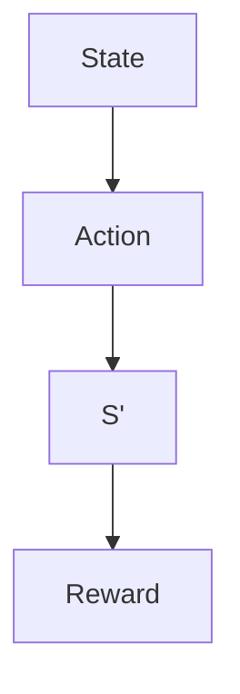
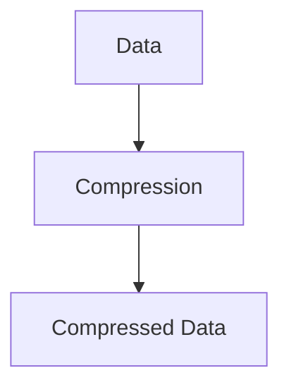
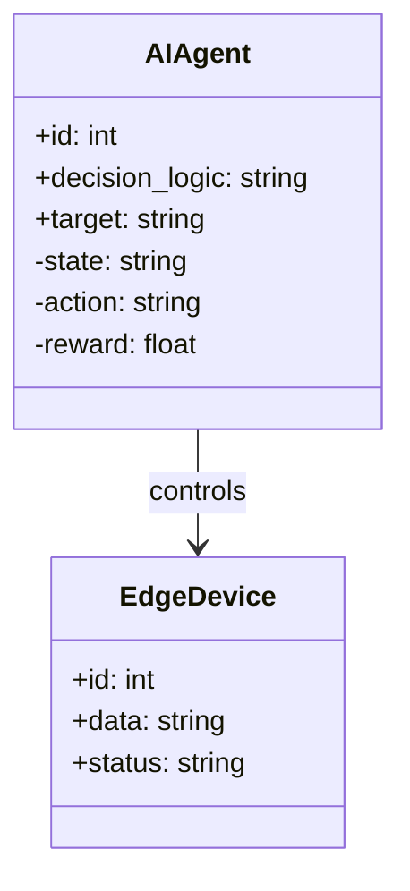
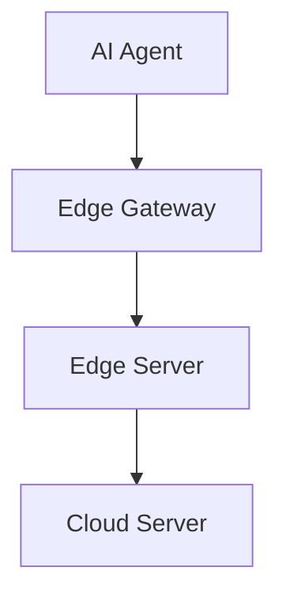
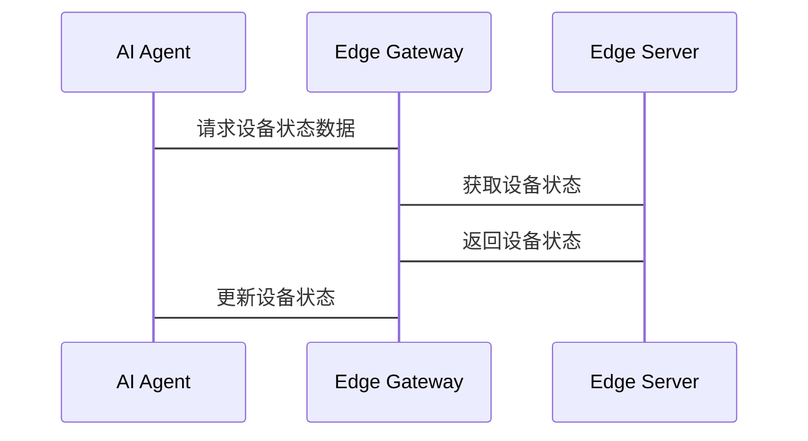

                 


# 企业AI Agent的5G边缘计算策略

> 关键词：AI Agent，5G边缘计算，企业应用，智能决策，分布式系统，边缘智能，实时计算

> 摘要：本文探讨了AI Agent在5G边缘计算环境中的应用策略，分析了其在企业数字化转型中的潜力，并通过具体案例展示了如何设计和实现高效的AI Agent系统，以优化企业的智能化运营。

---

# 第一部分: 企业AI Agent的5G边缘计算背景与基础

# 第1章: 企业AI Agent与5G边缘计算概述

## 1.1 企业AI Agent的概念与特点
### 1.1.1 AI Agent的基本定义
AI Agent（人工智能代理）是一种能够感知环境并采取行动以实现目标的智能实体。它通过感知、推理和行动三个核心环节，帮助企业在复杂环境中做出最优决策。

### 1.1.2 企业AI Agent的核心特点
- **自主性**：AI Agent能够在没有人工干预的情况下独立运行。
- **反应性**：能够实时感知环境变化并做出响应。
- **目标导向**：基于预设目标执行任务，优化决策路径。
- **分布式协作**：能够在分布式环境中与其他AI Agent或系统协同工作。

### 1.1.3 企业AI Agent的应用场景
- **智能制造**：优化生产流程，实时监控设备状态。
- **智慧物流**：动态调度资源，提高配送效率。
- **智慧金融**：实时风险评估，优化投资组合。

## 1.2 5G边缘计算的基本概念
### 1.2.1 5G边缘计算的定义
5G边缘计算是一种将计算能力从云端扩展到网络边缘的分布式计算模式，能够在靠近数据源的地方进行数据处理，减少延迟。

### 1.2.2 5G边缘计算的关键技术
- **边缘设备**：包括传感器、智能终端等。
- **边缘网关**：用于数据的汇聚、处理和转发。
- **边缘服务器**：提供计算和存储资源，支持边缘应用的运行。

### 1.2.3 5G边缘计算的架构特点
- **分布式架构**：计算资源分散在边缘节点，减少对中心服务器的依赖。
- **低延迟**：数据在边缘处理，减少传输延迟。
- **高带宽**：支持大带宽数据传输，满足实时性要求。

## 1.3 AI Agent与5G边缘计算的结合背景
### 1.3.1 5G边缘计算的发展趋势
随着5G网络的普及，边缘计算在企业中的应用越来越广泛，特别是在智能制造、智慧城市等领域。

### 1.3.2 AI Agent在边缘计算中的作用
AI Agent能够利用边缘计算的实时性和低延迟特点，快速响应环境变化，优化企业决策。

### 1.3.3 企业数字化转型中的AI Agent与边缘计算
企业数字化转型需要高效的数据处理和智能决策能力，AI Agent与5G边缘计算的结合为企业提供了强大的技术支撑。

## 1.4 企业AI Agent的5G边缘计算应用场景
### 1.4.1 智慧制造
AI Agent可以在边缘节点实时监控生产设备状态，预测故障，优化生产流程。

### 1.4.2 智慧物流
AI Agent能够动态调度物流资源，优化配送路径，提升效率。

### 1.4.3 智慧金融
AI Agent可以在边缘节点实时分析金融市场数据，帮助做出快速决策。

## 1.5 本章小结
本章介绍了AI Agent和5G边缘计算的基本概念，分析了它们在企业中的结合背景和应用场景，为后续内容奠定了基础。

---

# 第二部分: 企业AI Agent的5G边缘计算核心概念与联系

# 第2章: AI Agent与5G边缘计算的核心概念

## 2.1 AI Agent的原理与实现
### 2.1.1 AI Agent的决策机制
AI Agent通过感知环境、构建知识库、推理决策、执行动作的流程来实现目标。

### 2.1.2 AI Agent的学习与优化
基于强化学习和机器学习算法，AI Agent能够不断优化自身的决策策略。

### 2.1.3 AI Agent的通信协议
AI Agent需要遵循特定的通信协议，与边缘设备和其他系统进行交互。

## 2.2 5G边缘计算的体系结构
### 2.2.1 边缘计算的层次结构
边缘计算通常分为边缘设备、边缘网关和边缘服务器三个层次。

### 2.2.2 边缘计算的资源分配
资源分配需要考虑计算能力、存储资源和网络带宽等因素。

### 2.2.3 边缘计算的网络架构
边缘计算依赖5G网络的高带宽和低延迟特性，实现数据的高效传输。

## 2.3 AI Agent与5G边缘计算的协同关系
### 2.3.1 AI Agent在边缘计算中的角色
AI Agent作为智能决策单元，负责处理实时数据并做出决策。

### 2.3.2 边缘计算对AI Agent的支持
边缘计算提供实时数据处理和低延迟通信，为AI Agent的高效运行提供支持。

### 2.3.3 两者结合的优势与挑战
- **优势**：实时性、高效性、分布式协作。
- **挑战**：资源限制、数据隐私、协同复杂性。

## 2.4 核心概念对比与ER实体关系图

### 2.4.1 AI Agent与边缘计算的核心概念对比
| 属性 | AI Agent | 5G边缘计算 |
|------|-----------|------------|
| 目标 | 智能决策 | 分布式计算 |
| 关键技术 | 强化学习、推理引擎 | 边缘设备、边缘服务器 |
| 应用场景 | 智能决策、自动化控制 | 实时数据处理、分布式存储 |

### 2.4.2 ER实体关系图
```mermaid
erd
    entity AI Agent {
        id
       决策逻辑
        目标
    }
    entity Edge Computing {
        id
        资源
        服务
    }
    AI Agent -[1..n]-> Edge Computing
    Edge Computing -[1..n]-> AI Agent
```

---

# 第三部分: 企业AI Agent的5G边缘计算算法原理

# 第3章: AI Agent的算法原理

## 3.1 分布式计算中的负载均衡算法
### 3.1.1 负载均衡算法的实现
```mermaid
graph TD
    A[Load Balancer] -> B[Worker Node 1]
    A -> C[Worker Node 2]
    A -> D[Worker Node 3]
```

### 3.1.2 算法代码示例
```python
import random

class LoadBalancer:
    def __init__(self, workers):
        self.workers = workers

    def distribute_task(self, task):
        worker = random.choice(self.workers)
        return worker
```

## 3.2 强化学习中的Q-Learning算法
### 3.2.1 Q-Learning算法的实现


### 3.2.2 Q-Learning算法的数学模型
状态值函数更新公式：
$$ Q(s, a) = Q(s, a) + \alpha (r + \gamma \max Q(s', a') - Q(s, a)) $$

### 3.2.3 算法代码示例
```python
import numpy as np

class QLearning:
    def __init__(self, state_space, action_space, alpha=0.1, gamma=0.9):
        self.state_space = state_space
        self.action_space = action_space
        self.alpha = alpha
        self.gamma = gamma
        self.q_table = np.zeros((state_space, action_space))

    def choose_action(self, state):
        return np.argmax(self.q_table[state])

    def update_q_table(self, state, action, reward, next_state):
        self.q_table[state, action] += self.alpha * (reward + self.gamma * np.max(self.q_table[next_state, :]) - self.q_table[state, action])
```

## 3.3 边缘计算中的数据压缩算法
### 3.3.1 数据压缩算法的实现


### 3.3.2 数据压缩算法的代码示例
```python
import zlib

def compress(data):
    return zlib.compress(data)

def decompress(compressed_data):
    return zlib.decompress(compressed_data)
```

---

# 第四部分: 企业AI Agent的5G边缘计算系统架构设计

# 第4章: 企业AI Agent的系统架构设计

## 4.1 项目介绍与场景分析
### 4.1.1 项目背景
我们以一个智慧工厂为例，设计一个AI Agent系统，用于实时监控生产设备状态。

## 4.2 系统功能设计
### 4.2.1 功能模块划分
- 数据采集模块：负责采集设备状态数据。
- 智能分析模块：基于AI算法进行数据处理和决策。
- 决策执行模块：根据分析结果执行相应操作。

### 4.2.2 领域模型设计


## 4.3 系统架构设计
### 4.3.1 系统架构图


### 4.3.2 系统接口设计
- AI Agent与Edge Gateway之间的接口：用于数据传输和指令下达。
- Edge Gateway与Edge Server之间的接口：用于资源协调和状态汇报。

### 4.3.3 系统交互流程


## 4.4 系统实现与优化
### 4.4.1 系统实现
AI Agent通过边缘网关获取设备数据，运行强化学习算法，做出最优决策，并通过网关下发执行指令。

### 4.4.2 系统优化
- 数据压缩：减少数据传输量。
- 算法优化：提高决策效率。
- 系统容错：增强系统的健壮性。

---

# 第五部分: 企业AI Agent的5G边缘计算项目实战

# 第5章: 项目实战

## 5.1 环境安装与配置
### 5.1.1 安装Python
```bash
sudo apt-get install python3 python3-dev
```

### 5.1.2 安装Django框架
```bash
pip install django
```

### 5.1.3 安装Kubernetes
```bash
curl -s https://get.helm-3.io | bash -s -- --version v3.8.0
```

## 5.2 系统核心实现
### 5.2.1 AI Agent的核心代码
```python
class AIAGENT:
    def __init__(self):
        self.q_table = {}

    def learn(self, state, action, reward, next_state):
        if state not in self.q_table:
            self.q_table[state] = {}
        if action not in self.q_table[state]:
            self.q_table[state][action] = 0.0
        current_q = self.q_table[state][action]
        next_max_q = max(self.q_table.get(next_state, {}).values(), default=0.0)
        self.q_table[state][action] = current_q + 0.1 * (reward + 0.9 * next_max_q - current_q)
```

### 5.2.2 边缘计算实现
```python
from flask import Flask

app = Flask(__name__)

@app.route('/api/agent', methods=['POST'])
def handle_agent():
    data = request.json
    # 处理数据并返回结果
    return jsonify({'status': 'success'})
```

## 5.3 项目部署与测试
### 5.3.1 系统部署
使用Kubernetes部署AI Agent和边缘计算服务，确保服务的高可用性。

### 5.3.2 测试案例
- 测试AI Agent的决策准确性。
- 测试边缘计算的服务响应时间。

## 5.4 项目总结与优化
### 5.4.1 项目小结
通过本项目，我们验证了AI Agent与5G边缘计算结合的可行性，并展示了其在智慧制造中的实际应用。

### 5.4.2 优化方向
- 提高算法效率。
- 优化系统架构。
- 加强数据隐私保护。

---

# 第六部分: 总结与展望

# 第6章: 总结与展望

## 6.1 本章小结
本文详细探讨了AI Agent在5G边缘计算中的应用策略，从理论分析到实践实现，展示了其在企业中的巨大潜力。

## 6.2 展望
未来，随着5G网络的进一步发展和AI技术的不断进步，AI Agent与边缘计算的结合将更加紧密，为企业智能化转型提供更强大的技术支撑。

## 6.3 最佳实践 Tips
- **数据隐私**：确保数据在边缘计算和AI Agent之间的传输和存储符合隐私法规。
- **系统容错**：设计健壮的系统架构，能够应对各种突发情况。
- **持续优化**：定期更新AI Agent的决策算法，以适应环境的变化。

---

# 作者：AI天才研究院/AI Genius Institute & 禅与计算机程序设计艺术/Zen And The Art of Computer Programming

